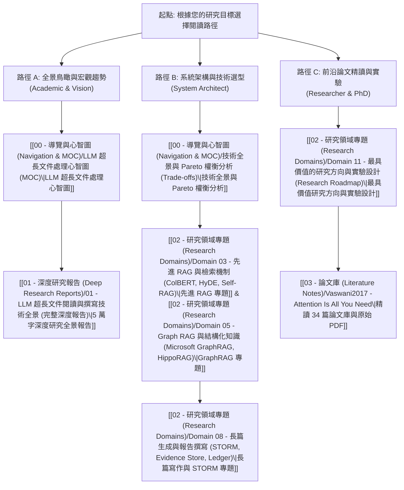

# 📚 LLM 超長文件閱讀、理解、推理與撰寫知識庫

> [!NOTE] 知識庫緣起與範疇
> 本知識庫係依據使用者分享之 [ChatGPT 深度研究會話 (長文處理研究方向)](https://chatgpt.com/share/6ab48c47-69b0-83e8-b415-014b1ca3180f) 所進行的系統化重構與落地擴充。
> 涵蓋從底層神經架構（Long Context / SSM）、多層次壓縮、先進 RAG、GraphRAG、階層記憶體、長篇循證生成（STORM）、到 2026 前沿評測與安全防禦的完整學術與工業技術全景。
>
> 💡 **本 Vault 已為您完整下載 34 篇頂級核心學術論文原始 PDF**，並在文獻筆記中無縫嵌入雙向連結，可直接在 Obsidian 內點擊閱讀！

---

## 🧭 知識庫四大核心目錄

```text
RAG (Obsidian Vault)
├── 00 - 導覽與心智圖 (Navigation & MOC)  <-- 您目前所在位置
├── 01 - 深度研究報告 (Deep Research Reports)  <-- 5 萬字完整技術全景與文獻評析
├── 02 - 研究領域專題 (Research Domains)       <-- 11 個細分技術領域專題剖析
├── 03 - 論文庫 (Literature Notes)             <-- 34 篇論文結構化筆記與雙向連結
└── Papers/                                  <-- 34 篇原始論文 PDF 文件
```

---

## 🚀 推薦閱讀路徑 (Reading Paths)



---

## 📑 目錄快速跳轉

### 一、深度研究報告 (Deep Research Reports)
1. [[01 - 深度研究報告 (Deep Research Reports)/01 - LLM 超長文件閱讀與撰寫技術全景 (完整深度報告)|01 - LLM 超長文件閱讀與撰寫技術全景 (完整深度報告)]] *(5 萬字完整綜述)*
2. [[01 - 深度研究報告 (Deep Research Reports)/02 - 補充資料與參考文獻評析 (Reference Audit)|02 - 補充資料與參考文獻評析 (Reference Audit)]] *(知識抽象階梯與反思)*
3. [[01 - 深度研究報告 (Deep Research Reports)/03 - ChatGPT 對話全文整理 (Shared Session Transcript)|03 - ChatGPT 對話全文整理 (Shared Session Transcript)]] *(對話原始記錄存檔)*

### 二、11 大研究領域專題 (Research Domains)
- **模型與架構層**：
  - [[02 - 研究領域專題 (Research Domains)/Domain 01 - Long Context 與序列架構 (Attention, SSM, Ring)|Domain 01: Long Context 與序列架構 (Attention, SSM, Ring)]]
  - [[02 - 研究領域專題 (Research Domains)/Domain 02 - 多層次壓縮技術 (Token, KV Cache, Context)|Domain 02: 多層次壓縮技術 (Token, KV Cache, Context)]]
- **資料、檢索與知識圖譜層**：
  - [[02 - 研究領域專題 (Research Domains)/Domain 03 - 先進 RAG 與檢索機制 (ColBERT, HyDE, Self-RAG)|Domain 03: 先進 RAG 與檢索機制 (ColBERT, HyDE, Self-RAG)]]
  - [[02 - 研究領域專題 (Research Domains)/Domain 04 - Chunking 策略與知識擷取 (Proposition, Cross-chunk)|Domain 04: Chunking 策略與知識擷取 (Proposition, Cross-chunk)]]
  - [[02 - 研究領域專題 (Research Domains)/Domain 05 - Graph RAG 與結構化知識 (Microsoft GraphRAG, HippoRAG)|Domain 05: Graph RAG 與結構化知識 (Microsoft GraphRAG, HippoRAG)]]
- **記憶與階層推理層**：
  - [[02 - 研究領域專題 (Research Domains)/Domain 06 - 外部記憶體架構 (MemGPT, A-MEM, Working Memory)|Domain 06: 外部記憶體架構 (MemGPT, A-MEM, Working Memory)]]
  - [[02 - 研究領域專題 (Research Domains)/Domain 07 - 分層推理與樹狀檢索 (RAPTOR, Hierarchical QA)|Domain 07: 分層推理與樹狀檢索 (RAPTOR, Hierarchical QA)]]
- **長篇生成與智能體層**：
  - [[02 - 研究領域專題 (Research Domains)/Domain 08 - 長篇生成與報告撰寫 (STORM, Evidence Store, Ledger)|Domain 08: 長篇生成與報告撰寫 (STORM, Evidence Store, Ledger)]]
  - [[02 - 研究領域專題 (Research Domains)/Domain 09 - Agentic 工作流與自主研究 (Planning, Multi-Agent)|Domain 09: Agentic 工作流與自主研究 (Planning, Multi-Agent)]]
- **評估、安全與前沿提案**：
  - [[02 - 研究領域專題 (Research Domains)/Domain 10 - 評估基準、系統工程與安全 (Benchmarks & Safety)|Domain 10: 評估基準、系統工程與安全 (Benchmarks & Safety)]]
  - [[02 - 研究領域專題 (Research Domains)/Domain 11 - 最具價值的研究方向與實驗設計 (Research Roadmap)|Domain 11: 最具價值的研究方向與實驗設計 (Research Roadmap)]]

### 三、核心論文庫 (34 篇文獻筆記與原始 PDF)
> 點擊進入任一論文筆記，均可直接點擊 `[[Papers/xxx.pdf]]` 開啟原始論文：

| 分類 | 核心論文筆記 | 原始 PDF 快速開啟 |
| :--- | :--- | :--- |
| **Long Context** | [[03 - 論文庫 (Literature Notes)/Vaswani2017 - Attention Is All You Need\|Vaswani et al. (2017) Transformer]] | [[Papers/01 - Long Context & Sequence/(NeurIPS 2017-12) Attention Is All You Need.pdf\|PDF]] |
| | [[03 - 論文庫 (Literature Notes)/Dao2022 - FlashAttention\|Dao et al. (2022) FlashAttention]] | [[Papers/01 - Long Context & Sequence/(NeurIPS 2022-12) FlashAttention - Fast and Memory-Efficient Exact Attention with IO-Awareness.pdf\|PDF]] |
| | [[03 - 論文庫 (Literature Notes)/Beltagy2020 - Longformer\|Beltagy et al. (2020) Longformer]] | [[Papers/01 - Long Context & Sequence/(ACL 2020-07) Longformer - The Long-Document Transformer.pdf\|PDF]] |
| | [[03 - 論文庫 (Literature Notes)/Zaheer2020 - BigBird\|Zaheer et al. (2020) BigBird]] | [[Papers/01 - Long Context & Sequence/(NeurIPS 2020-12) Big Bird - Transformers for Longer Sequences.pdf\|PDF]] |
| | [[03 - 論文庫 (Literature Notes)/Gu2023 - Mamba Linear-Time Sequence Modeling\|Gu & Dao (2023) Mamba]] | [[Papers/01 - Long Context & Sequence/(arXiv 2023-12) Mamba - Linear-Time Sequence Modeling with Selective State Spaces.pdf\|PDF]] |
| | [[03 - 論文庫 (Literature Notes)/Liu2023 - RingAttention\|Liu et al. (2023) RingAttention]] | [[Papers/01 - Long Context & Sequence/(ICLR 2024-05) RingAttention with Blockwise Transformers for Near-Infinite Context.pdf\|PDF]] |
| | [[03 - 論文庫 (Literature Notes)/Ding2024 - LongRoPE 2M Context\|Ding et al. (2024) LongRoPE 2M]] | [[Papers/01 - Long Context & Sequence/(ICML 2024-07) LongRoPE - Extending LLM Context Window Beyond 2 Million Tokens.pdf\|PDF]] |
| **Compression** | [[03 - 論文庫 (Literature Notes)/Jiang2023 - LLMLingua Prompt Compression\|Jiang et al. (2023) LLMLingua]] | [[Papers/02 - Compression & KV Cache/(EMNLP 2023-12) LLMLingua - Compressing Context for Accelerated Inference of Large Language Models.pdf\|PDF]] |
| | [[03 - 論文庫 (Literature Notes)/Jiang2023 - LongLLMLingua\|Jiang et al. (2024) LongLLMLingua]] | [[Papers/02 - Compression & KV Cache/(ACL 2024-08) LongLLMLingua - Accelerating and Enhancing LLMs in Long Context Scenarios via Prompt Compression.pdf\|PDF]] |
| | [[03 - 論文庫 (Literature Notes)/Xu2023 - RECOMP Context Compressor\|Xu et al. (2024) RECOMP]] | [[Papers/02 - Compression & KV Cache/(ICLR 2024-05) RECOMP - Improving Retrieval-Augmented LMs with Compression and Selective Augmentation.pdf\|PDF]] |
| | [[03 - 論文庫 (Literature Notes)/Mu2023 - Gist Tokens\|Mu et al. (2023) Gist Tokens]] | [[Papers/02 - Compression & KV Cache/(NeurIPS 2023-12) Learning to Compress Prompts with Gist Tokens.pdf\|PDF]] |
| | [[03 - 論文庫 (Literature Notes)/Liu2024 - KIVI 2-bit KV Cache\|Liu et al. (2024) KIVI 2-bit]] | [[Papers/02 - Compression & KV Cache/(ICML 2024-07) KIVI - A Tuning-Free Asymmetric 2-bit Quantization for KV Cache.pdf\|PDF]] |
| | [[03 - 論文庫 (Literature Notes)/Li2024 - SnapKV\|Li et al. (2024) SnapKV]] | [[Papers/02 - Compression & KV Cache/(arXiv 2024-04) SnapKV - LLM Knows What You are Looking for Before Generation.pdf\|PDF]] |
| | [[03 - 論文庫 (Literature Notes)/Cai2024 - PyramidKV\|Cai et al. (2024) PyramidKV]] | [[Papers/02 - Compression & KV Cache/(EMNLP 2024-11) PyramidKV - Dynamic KV Cache Compression based on Pyramidal Information Funneling.pdf\|PDF]] |
| | [[03 - 論文庫 (Literature Notes)/Pagnoni2024 - Byte Latent Transformer (BLT)\|Pagnoni et al. (2024) BLT]] | [[Papers/02 - Compression & KV Cache/(arXiv 2024-12) Byte Latent Transformer - Patches Scale Better Than Tokens.pdf\|PDF]] |
| **RAG & Retrieval** | [[03 - 論文庫 (Literature Notes)/Lewis2020 - Retrieval-Augmented Generation (RAG)\|Lewis et al. (2020) RAG]] | [[Papers/03 - RAG & Retrieval/(NeurIPS 2020-12) Retrieval-Augmented Generation for Knowledge-Intensive NLP Tasks.pdf\|PDF]] |
| | [[03 - 論文庫 (Literature Notes)/Karpukhin2020 - Dense Passage Retrieval (DPR)\|Karpukhin et al. (2020) DPR]] | [[Papers/03 - RAG & Retrieval/(EMNLP 2020-11) Dense Passage Retrieval for Open-Domain Question Answering.pdf\|PDF]] |
| | [[03 - 論文庫 (Literature Notes)/Khattab2020 - ColBERT Late Interaction\|Khattab & Zaharia (2020) ColBERT]] | [[Papers/03 - RAG & Retrieval/(SIGIR 2020-07) ColBERT - Efficient and Effective Passage Search via Contextualized Late Interaction over BERT.pdf\|PDF]] |
| | [[03 - 論文庫 (Literature Notes)/Gao2022 - HyDE Zero-Shot Dense Retrieval\|Gao et al. (2023) HyDE]] | [[Papers/03 - RAG & Retrieval/(ACL 2023-07) Precise Zero-Shot Dense Retrieval without Relevance Labels.pdf\|PDF]] |
| | [[03 - 論文庫 (Literature Notes)/Trivedi2022 - IRCoT Interleaving Retrieval and CoT\|Trivedi et al. (2023) IRCoT]] | [[Papers/03 - RAG & Retrieval/(ACL 2023-07) Interleaving Retrieval with Chain-of-Thought Reasoning for Knowledge-Intensive Multi-Step Questions.pdf\|PDF]] |
| | [[03 - 論文庫 (Literature Notes)/Asai2023 - Self-RAG\|Asai et al. (2024) Self-RAG]] | [[Papers/03 - RAG & Retrieval/(ICLR 2024-05) Self-RAG - Learning to Retrieve, Generate, and Critique through Self-Reflection.pdf\|PDF]] |
| **Knowledge & Graph**| [[03 - 論文庫 (Literature Notes)/Chen2023 - Dense X Proposition Retrieval\|Chen et al. (2024) Dense X]] | [[Papers/04 - Knowledge & Graph RAG/(EMNLP 2024-11) Dense X - Exploring the Limit of Proposition Retrieval for Open-Domain QA.pdf\|PDF]] |
| | [[03 - 論文庫 (Literature Notes)/Edge2024 - Microsoft GraphRAG\|Edge et al. (2024) GraphRAG]] | [[Papers/04 - Knowledge & Graph RAG/(arXiv 2024-04) From Local to Global - A Graph RAG Approach to Query-Focused Summarization.pdf\|PDF]] |
| | [[03 - 論文庫 (Literature Notes)/Gutierrez2024 - HippoRAG\|Gutiérrez et al. (2024) HippoRAG]] | [[Papers/04 - Knowledge & Graph RAG/(NeurIPS 2024-12) HippoRAG - Neurobiologically Inspired Long-Term Memory for Large Language Models.pdf\|PDF]] |
| | [[03 - 論文庫 (Literature Notes)/Sarthi2024 - RAPTOR Recursive Tree Retrieval\|Sarthi et al. (2024) RAPTOR]] | [[Papers/04 - Knowledge & Graph RAG/(ICLR 2024-05) RAPTOR - Recursive Abstractive Processing for Tree-Organized Retrieval.pdf\|PDF]] |
| **Memory & Agents** | [[03 - 論文庫 (Literature Notes)/Packer2023 - MemGPT LLM as Operating System\|Packer et al. (2023) MemGPT]] | [[Papers/05 - Memory & Agents/(arXiv 2023-10) MemGPT - Towards LLMs as Operating Systems.pdf\|PDF]] |
| | [[03 - 論文庫 (Literature Notes)/Chik2025 - A-MEM Agentic Memory System\|Chuang et al. (2025) A-MEM]] | [[Papers/05 - Memory & Agents/(arXiv 2025-02) A-MEM - Agentic Memory System with Hierarchical Structured Storage.pdf\|PDF]] |
| | [[03 - 論文庫 (Literature Notes)/Park2023 - Generative Agents\|Park et al. (2023) Generative Agents]] | [[Papers/05 - Memory & Agents/(UIST 2023-10) Generative Agents - Interactive Simulacra of Human Behavior.pdf\|PDF]] |
| | [[03 - 論文庫 (Literature Notes)/Shao2024 - STORM Writing Wikipedia From Scratch\|Shao et al. (2024) STORM]] | [[Papers/05 - Memory & Agents/(NAACL 2024-06) Assisting in Writing Wikipedia-like Articles From Scratch with Large Language Models.pdf\|PDF]] |
| **Benchmarks & Eval**| [[03 - 論文庫 (Literature Notes)/Liu2023 - Lost in the Middle\|Liu et al. (2024) Lost in Middle]] | [[Papers/06 - Benchmarks & Evaluation/(TACL 2024-01) Lost in the Middle - How Language Models Use Long Contexts.pdf\|PDF]] |
| | [[03 - 論文庫 (Literature Notes)/Bai2023 - LongBench Bilingual Multitask Benchmark\|Bai et al. (2024) LongBench]] | [[Papers/06 - Benchmarks & Evaluation/(ACL 2024-08) LongBench - A Bilingual, Multitask Benchmark for Long Context Understanding.pdf\|PDF]] |
| | [[03 - 論文庫 (Literature Notes)/An2023 - L-Eval Standardized Long Context Benchmark\|An et al. (2024) L-Eval]] | [[Papers/06 - Benchmarks & Evaluation/(ACL 2024-08) L-Eval - Instituting Standardized Evaluation for Long Context Language Models.pdf\|PDF]] |
| | [[03 - 論文庫 (Literature Notes)/Zhang2024 - InfiniteBench Beyond 100K\|Zhang et al. (2024) InfiniteBench]] | [[Papers/06 - Benchmarks & Evaluation/(ACL 2024-08) InfiniteBench - Extending Long Context Evaluation Beyond 100K Tokens.pdf\|PDF]] |
| | [[03 - 論文庫 (Literature Notes)/Hsieh2024 - RULER What is the Real Context Size\|Hsieh et al. (2024) RULER]] | [[Papers/06 - Benchmarks & Evaluation/(arXiv 2024-04) RULER - What is the Real Context Size of Your Long-Context Language Models.pdf\|PDF]] |

---

## 💡 在 Obsidian 中獲得最佳閱讀體驗的小技巧
1. **開啟 Graph View (關係圖譜)**：按下快速鍵 `Ctrl/Cmd + G`，您可以直觀看到 11 個領域專題如何透過雙向連結與 34 篇論文及核心報告交織成網。
2. **懸浮預覽 (Page Preview)**：按住 `Ctrl/Cmd` 並將滑鼠懸停在任一 `[[...]]` 內部連結上，即可在不跳轉的情況下即時預覽該章節或論文摘要。
3. **分頁並排閱讀 (Split Right)**：右鍵點擊任一論文 PDF 選擇「在右側開啟分頁」，即可左邊看筆記與專題剖析、右邊直接比對原始論文公式！
