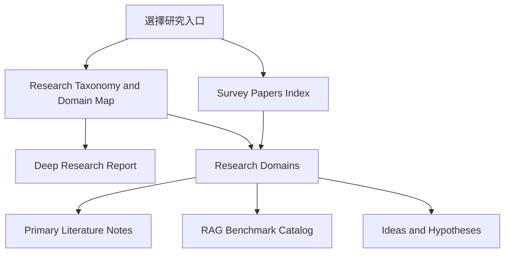

# 📚 LLM 超長文件閱讀、理解、推理與撰寫知識庫

> [!NOTE] 知識庫緣起與範疇
> 本知識庫係依據使用者分享之 ChatGPT 深度研究會話進行系統化重構與落地擴充：
> 1. [ChatGPT - 長文處理研究方向與技術全景](https://chatgpt.com/share/6ab48c47-69b0-83e8-b415-014b1ca3180f)
> 2. [ChatGPT - RAG 競品生態、知識抽取與證據治理定位](https://chatgpt.com/share/6ab49939-4750-83ee-b284-1823a1797146)
> 3. [ChatGPT - Chunking 設計理由與文獻依據 (GEC)](https://chatgpt.com/share/6ab49a65-6f94-83e8-bc61-1535175bca86)
> 4. [ChatGPT - F/R/D/A/P/C/T 分類法與 UIE 論文關係](https://chatgpt.com/share/6ab49925-47f8-83e8-bdd0-26b94f9528a4)
> 5. [ChatGPT - RAG-survey 完整修訂基準與研究架構](https://chatgpt.com/share/6ab4ec3e-d6fc-83e8-aa1a-9428d15af1db)
> 
> 涵蓋從底層神經架構（Long Context / SSM）、多層次壓縮、先進 RAG、GraphRAG、階層記憶體、長篇循證生成（STORM）、F/R/D/A/P/C/T 企業知識治理到 2026 前沿評測與安全防禦的完整學術與工業技術全景。
>
> 💡 **本 Vault 已為您完整建立 125 篇頂級核心學術論文筆記與 122 篇原始 PDF**，並在文獻筆記中無縫嵌入雙向連結，可直接在 Obsidian 內點擊閱讀！

---

## 🧭 知識庫核心目錄

```text
RAG (Obsidian Vault)
├── 00 - 導覽與心智圖 (Navigation & MOC)
├── 01 - 深度研究報告 (Deep Research Reports)
├── 02 - 研究領域專題 (Research Domains)
├── 03 - 論文庫 (Literature Notes)
├── 04 - 研究想法與待驗證提案 (Ideas & Hypotheses)
├── Papers/
├── AGENTS.md
└── GEMINI.md
```

> [!TIP] 🤖 AI Agent 協作注意事項
> 本專案已配置嚴格的 AI Agent 作業守則：[[AGENTS|AGENTS.md]] / [[GEMINI|GEMINI.md]]。
> 規範包含：**master 分支直接操作、作業前 fetch、作業後 commit & push、參考資料不缺漏、雙向核對正確性、存疑必主動問清**。

---

## 🚀 推薦閱讀路徑 (Reading Paths)



**入口對照**：[[00 - 導覽與心智圖 (Navigation & MOC)/RAG Research Taxonomy & Domain Map|Research Taxonomy]] · [[00 - 導覽與心智圖 (Navigation & MOC)/Survey Papers Index|Survey Papers Index]] · [[00 - 導覽與心智圖 (Navigation & MOC)/RAG Benchmark Catalog|Benchmark Catalog]] · [[04 - 研究想法與待驗證提案 (Ideas & Hypotheses)/README|Ideas & Hypotheses]]

---

## 📑 目錄快速跳轉

### 零、研究地圖、Survey 與 Benchmark
- [[00 - 導覽與心智圖 (Navigation & MOC)/RAG Research Taxonomy & Domain Map|RAG Research Taxonomy & Domain Map]]
- [[00 - 導覽與心智圖 (Navigation & MOC)/Survey Papers Index|Survey Papers Index]]
- [[00 - 導覽與心智圖 (Navigation & MOC)/RAG Benchmark Catalog|RAG Benchmark Catalog]]
- [[04 - 研究想法與待驗證提案 (Ideas & Hypotheses)/README|Ideas & Hypotheses]]

> [!IMPORTANT] Survey 與研究提案分流
> Research Domains 優先描述已有 survey / review 與 primary papers 可支持的研究版圖；尚未被文獻直接驗證的 taxonomy 延伸、controller、F/R/D/A/P/C/T 操作規則與 evidence-governance 組合設計，集中放在 Ideas & Hypotheses，避免把本專案構想誤寫成社群共識。

### 一、深度研究報告 (Deep Research Reports)
1. [[01 - 深度研究報告 (Deep Research Reports)/01 - LLM 超長文件閱讀與撰寫技術全景 (完整深度報告)|01 - LLM 超長文件閱讀與撰寫技術全景 (完整深度報告)]] *(5 萬字完整綜述)*
2. [[01 - 深度研究報告 (Deep Research Reports)/02 - 補充資料與參考文獻評析 (Reference Audit)|02 - 補充資料與參考文獻評析 (Reference Audit)]] *(知識抽象階梯與反思)*
3. [[01 - 深度研究報告 (Deep Research Reports)/03 - ChatGPT 對話全文整理 (Shared Session Transcript)|03 - ChatGPT 對話全文整理 (Shared Session Transcript)]] *(對話原始記錄存檔)*
4. [[01 - 深度研究報告 (Deep Research Reports)/04 - RAG Survey 完整修訂基準與研究架構 (Normative Revision Baseline)|04 - RAG Survey 完整修訂基準與研究架構 (Normative Revision Baseline)]] *(7.3 萬字規範性修訂基準與實施藍圖)*

### 二、17 大研究領域專題 (Research Domains)
- **模型與架構層**：
  - [[02 - 研究領域專題 (Research Domains)/Domain 01 - Long Context 與序列架構 (Attention, SSM, Ring)|Domain 01: Long Context 與序列架構 (Attention, SSM, Ring)]]
  - [[02 - 研究領域專題 (Research Domains)/Domain 02 - 多層次壓縮技術 (Token, KV Cache, Context)|Domain 02: 多層次壓縮技術 (Token, KV Cache, Context)]]
- **檢索、知識抽取與結構化層**：
  - [[02 - 研究領域專題 (Research Domains)/Domain 03 - 先進 RAG 與檢索機制 (ColBERT, HyDE, Self-RAG)|Domain 03: 先進 RAG 與檢索機制 (ColBERT, HyDE, Self-RAG)]]
  - [[02 - 研究領域專題 (Research Domains)/Domain 04 - Chunking 策略與知識擷取 (Proposition, Cross-chunk)|Domain 04: Chunking 策略與知識擷取 (Proposition, Cross-chunk)]]
  - [[02 - 研究領域專題 (Research Domains)/Domain 05 - Graph RAG 與結構化知識 (Microsoft GraphRAG, HippoRAG)|Domain 05: Graph RAG 與結構化知識 (Microsoft GraphRAG, HippoRAG)]]
  - [[02 - 研究領域專題 (Research Domains)/Domain 12 - Knowledge Extraction & Typed Knowledge|Domain 12: 知識擷取與類型化知識表示 (Knowledge Extraction & Typed Knowledge)]]
  - [[02 - 研究領域專題 (Research Domains)/Domain 13 - Information Preservation & Cross-chunk Consolidation|Domain 13: 資訊保真與跨塊關聯整合 (Information Preservation & Cross-chunk Consolidation)]]
- **記憶、推理與自適應控制層**：
  - [[02 - 研究領域專題 (Research Domains)/Domain 06 - 外部記憶體架構 (MemGPT, A-MEM, Working Memory)|Domain 06: 外部記憶體架構 (MemGPT, A-MEM, Working Memory)]]
  - [[02 - 研究領域專題 (Research Domains)/Domain 07 - 分層推理與樹狀檢索 (RAPTOR, Hierarchical QA)|Domain 07: 分層推理與樹狀檢索 (RAPTOR, Hierarchical QA)]]
  - [[02 - 研究領域專題 (Research Domains)/Domain 14 - Evidence Sufficiency & Adaptive Retrieval|Domain 14: 證據充分性與自適應檢索 (Evidence Sufficiency & Adaptive Retrieval)]]
  - [[02 - 研究領域專題 (Research Domains)/Domain 15 - Temporal Conflict & Provenance-aware RAG|Domain 15: 時序衝突與來源仲裁 RAG (Temporal Conflict & Provenance-aware RAG)]]
- **長篇生成、上下文利用與智能體層**：
  - [[02 - 研究領域專題 (Research Domains)/Domain 08 - 長篇生成與報告撰寫 (STORM, Evidence Store, Ledger)|Domain 08: 長篇生成與報告撰寫 (STORM, Evidence Store, Ledger)]]
  - [[02 - 研究領域專題 (Research Domains)/Domain 09 - Agentic 工作流與自主研究 (Planning, Multi-Agent)|Domain 09: Agentic 工作流與自主研究 (Planning, Multi-Agent)]]
  - [[02 - 研究領域專題 (Research Domains)/Domain 16 - Context Utilization & Faithfulness|Domain 16: 上下文利用率與生成忠實度 (Context Utilization & Faithfulness)]]
- **評估基準、系統工程與研究路線**：
  - [[02 - 研究領域專題 (Research Domains)/Domain 10 - 評估基準、系統工程與安全 (Benchmarks & Safety)|Domain 10: 評估基準、系統工程與安全 (Benchmarks & Safety)]]
  - [[02 - 研究領域專題 (Research Domains)/Domain 11 - 最具價值的研究方向與實驗設計 (Research Roadmap)|Domain 11: 最具價值的研究方向與實驗設計 (Research Roadmap)]]
  - [[02 - 研究領域專題 (Research Domains)/Domain 17 - RAG Benchmarks & Evaluation Protocols|Domain 17: RAG 評測基準與評估協議 (RAG Benchmarks & Evaluation Protocols)]]

### 三、研究想法與待驗證提案 (Ideas & Hypotheses)
- [[04 - 研究想法與待驗證提案 (Ideas & Hypotheses)/README|Ideas & Hypotheses Index]]
- [[04 - 研究想法與待驗證提案 (Ideas & Hypotheses)/Idea 05 - Evidence-Governed RAG 系統架構構想 (Delta Pipeline Design)|Idea 05: Evidence-Governed RAG 系統架構構想]]
- [[04 - 研究想法與待驗證提案 (Ideas & Hypotheses)/Idea 06 - 主流 RAG 框架生態與系統定位分析 (Framework Landscape & Positioning)|Idea 06: 主流 RAG 框架生態與系統定位分析]]

> [!NOTE]
> Idea 05/06 是研究與工程提案，不是 survey-established conclusion。其實驗資料與評測入口請搭配 [[00 - 導覽與心智圖 (Navigation & MOC)/RAG Benchmark Catalog|RAG Benchmark Catalog]] 與 [[02 - 研究領域專題 (Research Domains)/Domain 11 - 最具價值的研究方向與實驗設計 (Research Roadmap)|Domain 11 Research Roadmap]]。

### 四、核心論文庫 (115 篇文獻筆記與 112 篇原始 PDF)
> 點擊進入任一論文筆記，均可直接點擊 `[[Papers/xxx.pdf]]` 開啟原始論文；下一階段優先擴充規劃請參閱 [[03 - 論文庫 (Literature Notes)/00 - 論文擴充待補清單|00 - 論文擴充待補清單 (Prioritized Backlog)]]：

| 分類 | 核心論文筆記 | 原始 PDF 快速開啟 |
| :--- | :--- | :--- |
| **Long Context** | [[03 - 論文庫 (Literature Notes)/01 - Long Context & Sequence/(NeurIPS 2017-12) Attention Is All You Need|Vaswani et al. (2017) Transformer]] | [[Papers/01 - Long Context & Sequence/(NeurIPS 2017-12) Attention Is All You Need.pdf|PDF]] |
| | [[03 - 論文庫 (Literature Notes)/01 - Long Context & Sequence/(ACL 2019-07) Transformer-XL - Attentive Language Models Beyond a Fixed-Length Context|Dai et al. (2019) Transformer-XL]] | [[Papers/01 - Long Context & Sequence/(ACL 2019-07) Transformer-XL - Attentive Language Models Beyond a Fixed-Length Context.pdf|PDF]] |
| | [[03 - 論文庫 (Literature Notes)/01 - Long Context & Sequence/(ICLR 2020-04) Reformer - The Efficient Transformer|Kitaev et al. (2020) Reformer]] | [[Papers/01 - Long Context & Sequence/(ICLR 2020-04) Reformer - The Efficient Transformer.pdf|PDF]] |
| | [[03 - 論文庫 (Literature Notes)/01 - Long Context & Sequence/(ICLR 2021-05) Rethinking Attention with Performers|Choromanski et al. (2021) Performer]] | [[Papers/01 - Long Context & Sequence/(ICLR 2021-05) Rethinking Attention with Performers.pdf|PDF]] |
| | [[03 - 論文庫 (Literature Notes)/01 - Long Context & Sequence/(ACL 2020-07) Longformer - The Long-Document Transformer|Beltagy et al. (2020) Longformer]] | [[Papers/01 - Long Context & Sequence/(ACL 2020-07) Longformer - The Long-Document Transformer.pdf|PDF]] |
| | [[03 - 論文庫 (Literature Notes)/01 - Long Context & Sequence/(NeurIPS 2020-12) Big Bird - Transformers for Longer Sequences|Zaheer et al. (2020) BigBird]] | [[Papers/01 - Long Context & Sequence/(NeurIPS 2020-12) Big Bird - Transformers for Longer Sequences.pdf|PDF]] |
| | [[03 - 論文庫 (Literature Notes)/01 - Long Context & Sequence/(NeurIPS 2022-12) FlashAttention - Fast and Memory-Efficient Exact Attention with IO-Awareness|Dao et al. (2022) FlashAttention]] | [[Papers/01 - Long Context & Sequence/(NeurIPS 2022-12) FlashAttention - Fast and Memory-Efficient Exact Attention with IO-Awareness.pdf|PDF]] |
| | [[03 - 論文庫 (Literature Notes)/01 - Long Context & Sequence/(ICLR 2024-05) FlashAttention-2 - Faster Attention with Better Parallelism and Work Partitioning|Dao (2023) FlashAttention-2]] | [[Papers/01 - Long Context & Sequence/(ICLR 2024-05) FlashAttention-2 - Faster Attention with Better Parallelism and Work Partitioning.pdf|PDF]] |
| | [[03 - 論文庫 (Literature Notes)/01 - Long Context & Sequence/(ICLR 2024-05) Efficient Streaming Language Models with Attention Sinks|Xiao et al. (2023) StreamingLLM]] | [[Papers/01 - Long Context & Sequence/(ICLR 2024-05) Efficient Streaming Language Models with Attention Sinks.pdf|PDF]] |
| | [[03 - 論文庫 (Literature Notes)/01 - Long Context & Sequence/(ICLR 2024-05) RingAttention with Blockwise Transformers for Near-Infinite Context|Liu et al. (2023) RingAttention]] | [[Papers/01 - Long Context & Sequence/(ICLR 2024-05) RingAttention with Blockwise Transformers for Near-Infinite Context.pdf|PDF]] |
| | [[03 - 論文庫 (Literature Notes)/01 - Long Context & Sequence/(ICLR 2024-05) YaRN - Efficient Context Window Extension of Large Language Models|Peng et al. (2023) YaRN]] | [[Papers/01 - Long Context & Sequence/(ICLR 2024-05) YaRN - Efficient Context Window Extension of Large Language Models.pdf|PDF]] |
| | [[03 - 論文庫 (Literature Notes)/01 - Long Context & Sequence/(ICML 2024-07) LongRoPE - Extending LLM Context Window Beyond 2 Million Tokens|Ding et al. (2024) LongRoPE 2M]] | [[Papers/01 - Long Context & Sequence/(ICML 2024-07) LongRoPE - Extending LLM Context Window Beyond 2 Million Tokens.pdf|PDF]] |
| | [[03 - 論文庫 (Literature Notes)/01 - Long Context & Sequence/(ICLR 2024-05) LongLoRA - Efficient Fine-tuning of Long-Context Large Language Models|Chen et al. (2024) LongLoRA]] | [[Papers/01 - Long Context & Sequence/(ICLR 2024-05) LongLoRA - Efficient Fine-tuning of Long-Context Large Language Models.pdf|PDF]] |
| | [[03 - 論文庫 (Literature Notes)/01 - Long Context & Sequence/(arXiv 2023-12) Mamba - Linear-Time Sequence Modeling with Selective State Spaces|Gu & Dao (2023) Mamba]] | [[Papers/01 - Long Context & Sequence/(arXiv 2023-12) Mamba - Linear-Time Sequence Modeling with Selective State Spaces.pdf|PDF]] |
| | [[03 - 論文庫 (Literature Notes)/01 - Long Context & Sequence/(arXiv 2024-04) Leave No Context Behind - Efficient Infinite Context Transformers with Infini-attention\|Munkhdalai et al. (2024) Infini-attention]] | [[Papers/01 - Long Context & Sequence/(arXiv 2024-04) Leave No Context Behind - Efficient Infinite Context Transformers with Infini-attention.pdf\|PDF]] |
| | [[03 - 論文庫 (Literature Notes)/01 - Long Context & Sequence/(arXiv 2023-07) LongNet - Scaling Transformers to 1,000,000,000 Tokens\|Ding et al. (2023) LongNet]] | [[Papers/01 - Long Context & Sequence/(arXiv 2023-07) LongNet - Scaling Transformers to 1,000,000,000 Tokens.pdf\|PDF]] |
| | [[03 - 論文庫 (Literature Notes)/01 - Long Context & Sequence/(arXiv 2023-11) Advancing Transformer Architecture in Long-Context Large Language Models - A Survey\|Huang et al. (2023) Long-Context Survey]] | [[Papers/01 - Long Context & Sequence/(arXiv 2023-11) Advancing Transformer Architecture in Long-Context Large Language Models - A Survey.pdf\|PDF]] |
| **Compression** | [[03 - 論文庫 (Literature Notes)/02 - Compression & KV Cache/(EMNLP 2023-12) Compressing Context to Enhance Inference Efficiency of Large Language Models|Li et al. (2023) Selective Context]] | [[Papers/02 - Compression & KV Cache/(EMNLP 2023-12) Compressing Context to Enhance Inference Efficiency of Large Language Models.pdf|PDF]] |
| | [[03 - 論文庫 (Literature Notes)/02 - Compression & KV Cache/(NeurIPS 2023-12) H2O - Heavy-Hitter Oracle for Efficient Generative Inference of Large Language Models\|Zhang et al. (2023) H2O]] | [[Papers/02 - Compression & KV Cache/(NeurIPS 2023-12) H2O - Heavy-Hitter Oracle for Efficient Generative Inference of Large Language Models.pdf\|PDF]] |
| | [[03 - 論文庫 (Literature Notes)/02 - Compression & KV Cache/(NeurIPS 2023-12) Scissorhands - Exploiting the Persistence of Importance Hypothesis for LLM KV Cache Compression at Test Time\|Liu et al. (2023) Scissorhands]] | [[Papers/02 - Compression & KV Cache/(NeurIPS 2023-12) Scissorhands - Exploiting the Persistence of Importance Hypothesis for LLM KV Cache Compression at Test Time.pdf\|PDF]] |
| | [[03 - 論文庫 (Literature Notes)/02 - Compression & KV Cache/(EMNLP 2023-12) LLMLingua - Compressing Context for Accelerated Inference of Large Language Models\|Jiang et al. (2023) LLMLingua]] | [[Papers/02 - Compression & KV Cache/(EMNLP 2023-12) LLMLingua - Compressing Context for Accelerated Inference of Large Language Models.pdf\|PDF]] |
| | [[03 - 論文庫 (Literature Notes)/02 - Compression & KV Cache/(ACL 2024-08) LongLLMLingua - Accelerating and Enhancing LLMs in Long Context Scenarios via Prompt Compression\|Jiang et al. (2024) LongLLMLingua]] | [[Papers/02 - Compression & KV Cache/(ACL 2024-08) LongLLMLingua - Accelerating and Enhancing LLMs in Long Context Scenarios via Prompt Compression.pdf\|PDF]] |
| | [[03 - 論文庫 (Literature Notes)/02 - Compression & KV Cache/(ICLR 2024-05) RECOMP - Improving Retrieval-Augmented LMs with Compression and Selective Augmentation\|Xu et al. (2024) RECOMP]] | [[Papers/02 - Compression & KV Cache/(ICLR 2024-05) RECOMP - Improving Retrieval-Augmented LMs with Compression and Selective Augmentation.pdf\|PDF]] |
| | [[03 - 論文庫 (Literature Notes)/02 - Compression & KV Cache/(NeurIPS 2023-12) Learning to Compress Prompts with Gist Tokens\|Mu et al. (2023) Gist Tokens]] | [[Papers/02 - Compression & KV Cache/(NeurIPS 2023-12) Learning to Compress Prompts with Gist Tokens.pdf\|PDF]] |
| | [[03 - 論文庫 (Literature Notes)/02 - Compression & KV Cache/(ICML 2024-07) KIVI - A Tuning-Free Asymmetric 2-bit Quantization for KV Cache\|Liu et al. (2024) KIVI 2-bit]] | [[Papers/02 - Compression & KV Cache/(ICML 2024-07) KIVI - A Tuning-Free Asymmetric 2-bit Quantization for KV Cache.pdf\|PDF]] |
| | [[03 - 論文庫 (Literature Notes)/02 - Compression & KV Cache/(arXiv 2024-04) SnapKV - LLM Knows What You are Looking for Before Generation\|Li et al. (2024) SnapKV]] | [[Papers/02 - Compression & KV Cache/(arXiv 2024-04) SnapKV - LLM Knows What You are Looking for Before Generation.pdf\|PDF]] |
| | [[03 - 論文庫 (Literature Notes)/02 - Compression & KV Cache/(EMNLP 2024-11) PyramidKV - Dynamic KV Cache Compression based on Pyramidal Information Funneling\|Cai et al. (2024) PyramidKV]] | [[Papers/02 - Compression & KV Cache/(EMNLP 2024-11) PyramidKV - Dynamic KV Cache Compression based on Pyramidal Information Funneling.pdf\|PDF]] |
| | [[03 - 論文庫 (Literature Notes)/02 - Compression & KV Cache/(arXiv 2024-12) Byte Latent Transformer - Patches Scale Better Than Tokens\|Pagnoni et al. (2024) BLT]] | [[Papers/02 - Compression & KV Cache/(arXiv 2024-12) Byte Latent Transformer - Patches Scale Better Than Tokens.pdf\|PDF]] |
| | [[03 - 論文庫 (Literature Notes)/02 - Compression & KV Cache/(SIGCOMM 2024-08) CacheGen - KV Cache Compression and Streaming for Fast Large Language Model Serving\|Liu et al. (2024) CacheGen]] | [[Papers/02 - Compression & KV Cache/(SIGCOMM 2024-08) CacheGen - KV Cache Compression and Streaming for Fast Large Language Model Serving.pdf\|PDF]] |
| | [[03 - 論文庫 (Literature Notes)/02 - Compression & KV Cache/(NeurIPS 2024-12) MiniCache - KV Cache Compression in Depth Dimension for Large Language Models\|Liu et al. (2024) MiniCache]] | [[Papers/02 - Compression & KV Cache/(NeurIPS 2024-12) MiniCache - KV Cache Compression in Depth Dimension for Large Language Models.pdf\|PDF]] |
| **RAG & Retrieval** | [[03 - 論文庫 (Literature Notes)/03 - RAG & Retrieval/(ICML 2020-07) REALM - Retrieval-Augmented Language Model Pre-Training\|Guu et al. (2020) REALM]] | [[Papers/03 - RAG & Retrieval/(ICML 2020-07) REALM - Retrieval-Augmented Language Model Pre-Training.pdf\|PDF]] |
| | [[03 - 論文庫 (Literature Notes)/03 - RAG & Retrieval/(NeurIPS 2020-12) Retrieval-Augmented Generation for Knowledge-Intensive NLP Tasks\|Lewis et al. (2020) RAG]] | [[Papers/03 - RAG & Retrieval/(NeurIPS 2020-12) Retrieval-Augmented Generation for Knowledge-Intensive NLP Tasks.pdf\|PDF]] |
| | [[03 - 論文庫 (Literature Notes)/03 - RAG & Retrieval/(EMNLP 2020-11) Dense Passage Retrieval for Open-Domain Question Answering\|Karpukhin et al. (2020) DPR]] | [[Papers/03 - RAG & Retrieval/(EMNLP 2020-11) Dense Passage Retrieval for Open-Domain Question Answering.pdf\|PDF]] |
| | [[03 - 論文庫 (Literature Notes)/03 - RAG & Retrieval/(SIGIR 2020-07) ColBERT - Efficient and Effective Passage Search via Contextualized Late Interaction over BERT\|Khattab & Zaharia (2020) ColBERT]] | [[Papers/03 - RAG & Retrieval/(SIGIR 2020-07) ColBERT - Efficient and Effective Passage Search via Contextualized Late Interaction over BERT.pdf\|PDF]] |
| | [[03 - 論文庫 (Literature Notes)/03 - RAG & Retrieval/(ICML 2022-07) Improving Language Models by Retrieving from Trillions of Tokens\|Borgeaud et al. (2022) RETRO]] | [[Papers/03 - RAG & Retrieval/(ICML 2022-07) Improving Language Models by Retrieving from Trillions of Tokens.pdf\|PDF]] |
| | [[03 - 論文庫 (Literature Notes)/03 - RAG & Retrieval/(TMLR 2022-08) Unsupervised Dense Information Retrieval with Contrastive Learning\|Izacard et al. (2022) Contriever]] | [[Papers/03 - RAG & Retrieval/(TMLR 2022-08) Unsupervised Dense Information Retrieval with Contrastive Learning.pdf\|PDF]] |
| | [[03 - 論文庫 (Literature Notes)/03 - RAG & Retrieval/(SIGIR 2022-07) SPLADE v2 - Sparse Lexical and Expansion Model for Information Retrieval\|Formal et al. (2022) SPLADE v2]] | [[Papers/03 - RAG & Retrieval/(SIGIR 2022-07) SPLADE v2 - Sparse Lexical and Expansion Model for Information Retrieval.pdf\|PDF]] |
| | [[03 - 論文庫 (Literature Notes)/03 - RAG & Retrieval/(NAACL 2022-07) ColBERTv2 - Effective and Efficient Retrieval via Lightweight Late Interaction\|Santhanam et al. (2022) ColBERTv2]] | [[Papers/03 - RAG & Retrieval/(NAACL 2022-07) ColBERTv2 - Effective and Efficient Retrieval via Lightweight Late Interaction.pdf\|PDF]] |
| | [[03 - 論文庫 (Literature Notes)/03 - RAG & Retrieval/(JMLR 2023-01) Atlas - Few-shot Learning with Retrieval Augmented Language Models\|Izacard et al. (2023) Atlas]] | [[Papers/03 - RAG & Retrieval/(JMLR 2023-01) Atlas - Few-shot Learning with Retrieval Augmented Language Models.pdf\|PDF]] |
| | [[03 - 論文庫 (Literature Notes)/03 - RAG & Retrieval/(ACL 2023-07) Precise Zero-Shot Dense Retrieval without Relevance Labels\|Gao et al. (2023) HyDE]] | [[Papers/03 - RAG & Retrieval/(ACL 2023-07) Precise Zero-Shot Dense Retrieval without Relevance Labels.pdf\|PDF]] |
| | [[03 - 論文庫 (Literature Notes)/03 - RAG & Retrieval/(ACL 2023-07) Interleaving Retrieval with Chain-of-Thought Reasoning for Knowledge-Intensive Multi-Step Questions\|Trivedi et al. (2023) IRCoT]] | [[Papers/03 - RAG & Retrieval/(ACL 2023-07) Interleaving Retrieval with Chain-of-Thought Reasoning for Knowledge-Intensive Multi-Step Questions.pdf\|PDF]] |
| | [[03 - 論文庫 (Literature Notes)/03 - RAG & Retrieval/(EMNLP 2023-12) Active Retrieval Augmented Generation\|Jiang et al. (2023) FLARE]] | [[Papers/03 - RAG & Retrieval/(EMNLP 2023-12) Active Retrieval Augmented Generation.pdf\|PDF]] |
| | [[03 - 論文庫 (Literature Notes)/03 - RAG & Retrieval/(arXiv 2023-12) Retrieval-Augmented Generation for Large Language Models - A Survey\|Gao et al. (2023) RAG Survey]] | [[Papers/03 - RAG & Retrieval/(arXiv 2023-12) Retrieval-Augmented Generation for Large Language Models - A Survey.pdf\|PDF]] |
| | [[03 - 論文庫 (Literature Notes)/03 - RAG & Retrieval/(ICLR 2024-05) Self-RAG - Learning to Retrieve, Generate, and Critique through Self-Reflection\|Asai et al. (2024) Self-RAG]] | [[Papers/03 - RAG & Retrieval/(ICLR 2024-05) Self-RAG - Learning to Retrieve, Generate, and Critique through Self-Reflection.pdf\|PDF]] |
| | [[03 - 論文庫 (Literature Notes)/03 - RAG & Retrieval/(ICLR 2024-05) RA-DIT - Retrieval-Augmented Dual Instruction Tuning\|Lin et al. (2024) RA-DIT]] | [[Papers/03 - RAG & Retrieval/(ICLR 2024-05) RA-DIT - Retrieval-Augmented Dual Instruction Tuning.pdf\|PDF]] |
| | [[03 - 論文庫 (Literature Notes)/03 - RAG & Retrieval/(NAACL 2024-06) REPLUG - Retrieval-Augmented Black-Box Language Models\|Shi et al. (2024) REPLUG]] | [[Papers/03 - RAG & Retrieval/(NAACL 2024-06) REPLUG - Retrieval-Augmented Black-Box Language Models.pdf\|PDF]] |
| | [[03 - 論文庫 (Literature Notes)/03 - RAG & Retrieval/(NAACL 2024-06) Adaptive-RAG - Learning to Adapt Retrieval-Augmented Large Language Models through Question Complexity\|Jeong et al. (2024) Adaptive-RAG]] | [[Papers/03 - RAG & Retrieval/(NAACL 2024-06) Adaptive-RAG - Learning to Adapt Retrieval-Augmented Large Language Models through Question Complexity.pdf\|PDF]] |
| | [[03 - 論文庫 (Literature Notes)/03 - RAG & Retrieval/(arXiv 2024-06) LongRAG - Enhancing Retrieval-Augmented Generation with Long-context LLMs\|Jiang et al. (2024) LongRAG]] | [[Papers/03 - RAG & Retrieval/(arXiv 2024-06) LongRAG - Enhancing Retrieval-Augmented Generation with Long-context LLMs.pdf\|PDF]] |
| | [[03 - 論文庫 (Literature Notes)/03 - RAG & Retrieval/(EMNLP 2024-11) LumberChunker - Long-Context LLMs as Modular Chunkers for Long-Document RAG\|Duarte et al. (2024) LumberChunker]] | [[Papers/03 - RAG & Retrieval/(EMNLP 2024-11) LumberChunker - Long-Context LLMs as Modular Chunkers for Long-Document RAG.pdf\|PDF]] |
| | [[03 - 論文庫 (Literature Notes)/03 - RAG & Retrieval/(EMNLP 2024-11) Chain-of-Note - Enhancing Robustness in Retrieval-Augmented Language Models\|Yu et al. (2024) Chain-of-Note]] | [[Papers/03 - RAG & Retrieval/(EMNLP 2024-11) Chain-of-Note - Enhancing Robustness in Retrieval-Augmented Language Models.pdf\|PDF]] |
| | [[03 - 論文庫 (Literature Notes)/03 - RAG & Retrieval/(NeurIPS 2024-12) RankRAG - Unifying Context Ranking with Retrieval-Augmented Generation in LLMs\|Yu et al. (2024) RankRAG]] | [[Papers/03 - RAG & Retrieval/(NeurIPS 2024-12) RankRAG - Unifying Context Ranking with Retrieval-Augmented Generation in LLMs.pdf\|PDF]] |
| | [[03 - 論文庫 (Literature Notes)/03 - RAG & Retrieval/(arXiv 2024-01) Corrective Retrieval Augmented Generation\|Yan et al. (2024) CRAG]] | [[Papers/03 - RAG & Retrieval/(arXiv 2024-01) Corrective Retrieval Augmented Generation.pdf\|PDF]] |
| | [[03 - 論文庫 (Literature Notes)/03 - RAG & Retrieval/(arXiv 2024-09) Late Chunking - Contextual Chunk Embeddings for Retrieval\|Günther et al. (2024) Late Chunking]] | [[Papers/03 - RAG & Retrieval/(arXiv 2024-09) Late Chunking - Contextual Chunk Embeddings for Retrieval.pdf\|PDF]] |
| | [[03 - 論文庫 (Literature Notes)/03 - RAG & Retrieval/(arXiv 2024-05) Evaluation of Retrieval-Augmented Generation - A Survey\|Yu et al. (2024) RAG Eval Survey]] | [[Papers/03 - RAG & Retrieval/(arXiv 2024-05) Evaluation of Retrieval-Augmented Generation - A Survey.pdf\|PDF]] |
| **Knowledge & Graph**| [[03 - 論文庫 (Literature Notes)/04 - Knowledge & Graph RAG/(ACL 2019-07) DocRED - A Large-Scale Document-Level Relation Extraction Dataset\|Yao et al. (2019) DocRED]] | [[Papers/04 - Knowledge & Graph RAG/(ACL 2019-07) DocRED - A Large-Scale Document-Level Relation Extraction Dataset.pdf\|PDF]] |
| | [[03 - 論文庫 (Literature Notes)/04 - Knowledge & Graph RAG/(EMNLP 2019-11) Entity, Relation, and Event Extraction with Contextualized Span Representations\|Wadden et al. (2019) DyGIE++]] | [[Papers/04 - Knowledge & Graph RAG/(EMNLP 2019-11) Entity, Relation, and Event Extraction with Contextualized Span Representations.pdf\|PDF]] |
| | [[03 - 論文庫 (Literature Notes)/04 - Knowledge & Graph RAG/(ACL 2020-07) SciREX - A Challenge Dataset for Document-Level Information Extraction\|Jain et al. (2020) SciREX]] | [[Papers/04 - Knowledge & Graph RAG/(ACL 2020-07) SciREX - A Challenge Dataset for Document-Level Information Extraction.pdf\|PDF]] |
| | [[03 - 論文庫 (Literature Notes)/04 - Knowledge & Graph RAG/(ACL 2020-07) A Joint Neural Model for Information Extraction with Global Features\|Lin et al. (2020) OneIE]] | [[Papers/04 - Knowledge & Graph RAG/(ACL 2020-07) A Joint Neural Model for Information Extraction with Global Features.pdf\|PDF]] |
| | [[03 - 論文庫 (Literature Notes)/04 - Knowledge & Graph RAG/(EMNLP 2020-11) MAVEN - A Massive General Domain Event Detection Dataset\|Wang et al. (2020) MAVEN]] | [[Papers/04 - Knowledge & Graph RAG/(EMNLP 2020-11) MAVEN - A Massive General Domain Event Detection Dataset.pdf\|PDF]] |
| | [[03 - 論文庫 (Literature Notes)/04 - Knowledge & Graph RAG/(NAACL 2021-06) A Frustratingly Easy Approach for Entity and Relation Extraction\|Zhong & Chen (2021) PURE]] | [[Papers/04 - Knowledge & Graph RAG/(NAACL 2021-06) A Frustratingly Easy Approach for Entity and Relation Extraction.pdf\|PDF]] |
| | [[03 - 論文庫 (Literature Notes)/04 - Knowledge & Graph RAG/(EMNLP 2021-11) REBEL - Relation Extraction By End-to-end Language generation\|Huguet Cabot & Navigli (2021) REBEL]] | [[Papers/04 - Knowledge & Graph RAG/(EMNLP 2021-11) REBEL - Relation Extraction By End-to-end Language generation.pdf\|PDF]] |
| | [[03 - 論文庫 (Literature Notes)/04 - Knowledge & Graph RAG/(NAACL 2022-07) GenIE - Generative Information Extraction\|Josifoski et al. (2022) GenIE]] | [[Papers/04 - Knowledge & Graph RAG/(NAACL 2022-07) GenIE - Generative Information Extraction.pdf\|PDF]] |
| | [[03 - 論文庫 (Literature Notes)/04 - Knowledge & Graph RAG/(ACL 2022-05) Unified Structure Generation for Universal Information Extraction\|Lu et al. (2022) UIE]] | [[Papers/04 - Knowledge & Graph RAG/(ACL 2022-05) Unified Structure Generation for Universal Information Extraction.pdf\|PDF]] |
| | [[03 - 論文庫 (Literature Notes)/04 - Knowledge & Graph RAG/(ICLR 2024-05) RAPTOR - Recursive Abstractive Processing for Tree-Organized Retrieval\|Sarthi et al. (2024) RAPTOR]] | [[Papers/04 - Knowledge & Graph RAG/(ICLR 2024-05) RAPTOR - Recursive Abstractive Processing for Tree-Organized Retrieval.pdf\|PDF]] |
| | [[03 - 論文庫 (Literature Notes)/04 - Knowledge & Graph RAG/(arXiv 2024-04) From Local to Global - A Graph RAG Approach to Query-Focused Summarization\|Edge et al. (2024) GraphRAG]] | [[Papers/04 - Knowledge & Graph RAG/(arXiv 2024-04) From Local to Global - A Graph RAG Approach to Query-Focused Summarization.pdf\|PDF]] |
| | [[03 - 論文庫 (Literature Notes)/04 - Knowledge & Graph RAG/(NeurIPS 2024-12) HippoRAG - Neurobiologically Inspired Long-Term Memory for Large Language Models\|Gutiérrez et al. (2024) HippoRAG]] | [[Papers/04 - Knowledge & Graph RAG/(NeurIPS 2024-12) HippoRAG - Neurobiologically Inspired Long-Term Memory for Large Language Models.pdf\|PDF]] |
| | [[03 - 論文庫 (Literature Notes)/04 - Knowledge & Graph RAG/(arXiv 2024-08) Graph Retrieval-Augmented Generation - A Survey\|Peng et al. (2024) GraphRAG Survey]] | [[Papers/04 - Knowledge & Graph RAG/(arXiv 2024-08) Graph Retrieval-Augmented Generation - A Survey.pdf\|PDF]] |
| | [[03 - 論文庫 (Literature Notes)/04 - Knowledge & Graph RAG/(EMNLP 2024-11) Dense X - Exploring the Limit of Proposition Retrieval for Open-Domain QA\|Chen et al. (2024) Dense X]] | [[Papers/04 - Knowledge & Graph RAG/(EMNLP 2024-11) Dense X - Exploring the Limit of Proposition Retrieval for Open-Domain QA.pdf\|PDF]] |
| | [[03 - 論文庫 (Literature Notes)/04 - Knowledge & Graph RAG/(EMNLP 2024-11) GraphReader - Building Graph-based Agent to Enhance Long-Context Abilities of Large Language Models\|Li et al. (2024) GraphReader]] | [[Papers/04 - Knowledge & Graph RAG/(EMNLP 2024-11) GraphReader - Building Graph-based Agent to Enhance Long-Context Abilities of Large Language Models.pdf\|PDF]] |
| | [[03 - 論文庫 (Literature Notes)/04 - Knowledge & Graph RAG/(arXiv 2024-10) LightRAG - Simple and Fast Retrieval-Augmented Generation\|Guo et al. (2024) LightRAG]] | [[Papers/04 - Knowledge & Graph RAG/(arXiv 2024-10) LightRAG - Simple and Fast Retrieval-Augmented Generation.pdf\|PDF]] |
| | [[03 - 論文庫 (Literature Notes)/04 - Knowledge & Graph RAG/(ICML 2025-07) From RAG to Memory - Non-Parametric Continual Learning for Large Language Models\|Gutiérrez et al. (2025) HippoRAG 2]] | [[Papers/04 - Knowledge & Graph RAG/(ICML 2025-07) From RAG to Memory - Non-Parametric Continual Learning for Large Language Models.pdf\|PDF]] |
| | [[03 - 論文庫 (Literature Notes)/04 - Knowledge & Graph RAG/(NAACL 2025-05) Knowledge Graph-Guided Retrieval Augmented Generation\|Zhu et al. (2025) KG²RAG]] | [[Papers/04 - Knowledge & Graph RAG/(NAACL 2025-05) Knowledge Graph-Guided Retrieval Augmented Generation.pdf\|PDF]] |
| | [[03 - 論文庫 (Literature Notes)/04 - Knowledge & Graph RAG/(EMNLP 2025-11) PropRAG - Guiding Retrieval with Beam Search over Proposition Paths\|Wang & Han (2025) PropRAG]] | [[Papers/04 - Knowledge & Graph RAG/(EMNLP 2025-11) PropRAG - Guiding Retrieval with Beam Search over Proposition Paths.pdf\|PDF]] |
| | [[03 - 論文庫 (Literature Notes)/04 - Knowledge & Graph RAG/(arXiv 2026-05) Beyond Chunk-Local Extraction - Cross-Chunk Graph Augmentation for GraphRAG\|Zhang et al. (2026) CrossAug]] | [[Papers/04 - Knowledge & Graph RAG/(arXiv 2026-05) Beyond Chunk-Local Extraction - Cross-Chunk Graph Augmentation for GraphRAG.pdf\|PDF]] |
| | [[03 - 論文庫 (Literature Notes)/04 - Knowledge & Graph RAG/(EMNLP 2020-11) OpenIE6 - Iterative Grid Labeling and Coordination Analysis for Open Information Extraction\|Kolluru et al. (2020) OpenIE6]] | [[Papers/04 - Knowledge & Graph RAG/(EMNLP 2020-11) OpenIE6 - Iterative Grid Labeling and Coordination Analysis for Open Information Extraction.pdf\|PDF]] |
| | [[03 - 論文庫 (Literature Notes)/04 - Knowledge & Graph RAG/(NeurIPS 2024-12) G-Retriever - Retrieval-Augmented Generation for Textual Graph Understanding and Question Answering\|He et al. (2024) G-Retriever]] | [[Papers/04 - Knowledge & Graph RAG/(NeurIPS 2024-12) G-Retriever - Retrieval-Augmented Generation for Textual Graph Understanding and Question Answering.pdf\|PDF]] |
| | [[03 - 論文庫 (Literature Notes)/04 - Knowledge & Graph RAG/(arXiv 2023-04) InstructUIE - Multi-task Instruction Tuning for Unified Information Extraction\|Wang et al. (2023) InstructUIE]] | [[Papers/04 - Knowledge & Graph RAG/(arXiv 2023-04) InstructUIE - Multi-task Instruction Tuning for Unified Information Extraction.pdf\|PDF]] |
| **Memory & Agents** | [[03 - 論文庫 (Literature Notes)/05 - Memory & Agents/(arXiv 2021-12) WebGPT - Browser-assisted question-answering with human feedback\|Nakano et al. (2021) WebGPT]] | [[Papers/05 - Memory & Agents/(arXiv 2021-12) WebGPT - Browser-assisted question-answering with human feedback.pdf\|PDF]] |
| | [[03 - 論文庫 (Literature Notes)/05 - Memory & Agents/(arXiv 2022-03) Teaching language models to support answers with verified quotes\|Menick et al. (2022) GopherCite]] | [[Papers/05 - Memory & Agents/(arXiv 2022-03) Teaching language models to support answers with verified quotes.pdf\|PDF]] |
| | [[03 - 論文庫 (Literature Notes)/05 - Memory & Agents/(ICLR 2023-05) ReAct - Synergizing Reasoning and Acting in Language Models\|Yao et al. (2023) ReAct]] | [[Papers/05 - Memory & Agents/(ICLR 2023-05) ReAct - Synergizing Reasoning and Acting in Language Models.pdf\|PDF]] |
| | [[03 - 論文庫 (Literature Notes)/05 - Memory & Agents/(UIST 2023-10) Generative Agents - Interactive Simulacra of Human Behavior\|Park et al. (2023) Generative Agents]] | [[Papers/05 - Memory & Agents/(UIST 2023-10) Generative Agents - Interactive Simulacra of Human Behavior.pdf\|PDF]] |
| | [[03 - 論文庫 (Literature Notes)/05 - Memory & Agents/(arXiv 2023-10) MemGPT - Towards LLMs as Operating Systems\|Packer et al. (2023) MemGPT]] | [[Papers/05 - Memory & Agents/(arXiv 2023-10) MemGPT - Towards LLMs as Operating Systems.pdf\|PDF]] |
| | [[03 - 論文庫 (Literature Notes)/05 - Memory & Agents/(NeurIPS 2023-12) Reflexion - Language Agents with Verbal Reinforcement Learning\|Shinn et al. (2023) Reflexion]] | [[Papers/05 - Memory & Agents/(NeurIPS 2023-12) Reflexion - Language Agents with Verbal Reinforcement Learning.pdf\|PDF]] |
| | [[03 - 論文庫 (Literature Notes)/05 - Memory & Agents/(NeurIPS 2023-12) Toolformer - Language Models Can Teach Themselves to Use Tools\|Schick et al. (2023) Toolformer]] | [[Papers/05 - Memory & Agents/(NeurIPS 2023-12) Toolformer - Language Models Can Teach Themselves to Use Tools.pdf\|PDF]] |
| | [[03 - 論文庫 (Literature Notes)/05 - Memory & Agents/(NeurIPS 2023-12) LongMem - Augmenting Language Models with Long-Term Memory\|Wang et al. (2023) LongMem]] | [[Papers/05 - Memory & Agents/(NeurIPS 2023-12) LongMem - Augmenting Language Models with Long-Term Memory.pdf\|PDF]] |
| | [[03 - 論文庫 (Literature Notes)/05 - Memory & Agents/(AAAI 2024-03) MemoryBank - Enhancing Large Language Models with Long-Term Memory\|Zhong et al. (2024) MemoryBank]] | [[Papers/05 - Memory & Agents/(AAAI 2024-03) MemoryBank - Enhancing Large Language Models with Long-Term Memory.pdf\|PDF]] |
| | [[03 - 論文庫 (Literature Notes)/05 - Memory & Agents/(NAACL 2024-06) Assisting in Writing Wikipedia-like Articles From Scratch with Large Language Models\|Shao et al. (2024) STORM]] | [[Papers/05 - Memory & Agents/(NAACL 2024-06) Assisting in Writing Wikipedia-like Articles From Scratch with Large Language Models.pdf\|PDF]] |
| | [[03 - 論文庫 (Literature Notes)/05 - Memory & Agents/(arXiv 2025-02) A-MEM - Agentic Memory System with Hierarchical Structured Storage\|Chuang et al. (2025) A-MEM]] | [[Papers/05 - Memory & Agents/(arXiv 2025-02) A-MEM - Agentic Memory System with Hierarchical Structured Storage.pdf\|PDF]] |
| | [[03 - 論文庫 (Literature Notes)/05 - Memory & Agents/(arXiv 2024-11) OpenScholar - Synthesizing Scientific Literature with Retrieval-Augmented Language Models\|Asai et al. (2024) OpenScholar]] | [[Papers/05 - Memory & Agents/(arXiv 2024-11) OpenScholar - Synthesizing Scientific Literature with Retrieval-Augmented Language Models.pdf\|PDF]] |
| | [[03 - 論文庫 (Literature Notes)/05 - Memory & Agents/(ACL 2026-08) EviReport - From Reasoned Outlines to Evidence Tracked Long-Form Reports\|Liu et al. (2026) EviReport]] | [ACL Anthology](https://aclanthology.org/2026.findings-acl.1397/) |
| | [[03 - 論文庫 (Literature Notes)/05 - Memory & Agents/(ACL 2026-08) EFSG - Evidence-First Structured Generation for Multilingual RAG Report Generation\|Gupta & Bedi (2026) EFSG]] | [ACL Anthology](https://aclanthology.org/2026.rag4reports-1.14/) |
| | [[03 - 論文庫 (Literature Notes)/05 - Memory & Agents/(arXiv 2024-09) MemoRAG - Moving towards Next-Gen RAG Via Memory-Inspired Knowledge Discovery\|Qian et al. (2024) MemoRAG]] | [[Papers/05 - Memory & Agents/(arXiv 2024-09) MemoRAG - Moving towards Next-Gen RAG Via Memory-Inspired Knowledge Discovery.pdf\|PDF]] |
| | [[03 - 論文庫 (Literature Notes)/05 - Memory & Agents/(arXiv 2023-08) AutoGen - Enabling Next-Gen LLM Applications via Multi-Agent Conversation\|Wu et al. (2023) AutoGen]] | [[Papers/05 - Memory & Agents/(arXiv 2023-08) AutoGen - Enabling Next-Gen LLM Applications via Multi-Agent Conversation.pdf\|PDF]] |
| | [[03 - 論文庫 (Literature Notes)/05 - Memory & Agents/(arXiv 2025-01) Agentic Retrieval-Augmented Generation - A Survey on Agentic RAG\|Singh et al. (2025) Agentic RAG Survey]] | [[Papers/05 - Memory & Agents/(arXiv 2025-01) Agentic Retrieval-Augmented Generation - A Survey on Agentic RAG.pdf\|PDF]] |
| **Benchmarks & Eval**| [[03 - 論文庫 (Literature Notes)/06 - Benchmarks & Evaluation/(EMNLP 2018-10) HotpotQA - A Dataset for Diverse, Explainable Multi-hop Question Answering\|Yang et al. (2018) HotpotQA]] | [[Papers/06 - Benchmarks & Evaluation/(EMNLP 2018-10) HotpotQA - A Dataset for Diverse, Explainable Multi-hop Question Answering.pdf\|PDF]] |
| | [[03 - 論文庫 (Literature Notes)/06 - Benchmarks & Evaluation/(COLING 2020-12) 2WikiMultiHopQA - A Multi-hop QA Dataset with Explanation Paths\|Ho et al. (2020) 2WikiMultiHopQA]] | [[Papers/06 - Benchmarks & Evaluation/(COLING 2020-12) 2WikiMultiHopQA - A Multi-hop QA Dataset with Explanation Paths.pdf\|PDF]] |
| | [[03 - 論文庫 (Literature Notes)/06 - Benchmarks & Evaluation/(NAACL 2021-06) KILT - A Benchmark for Knowledge Intensive Language Tasks\|Petroni et al. (2021) KILT]] | [[Papers/06 - Benchmarks & Evaluation/(NAACL 2021-06) KILT - A Benchmark for Knowledge Intensive Language Tasks.pdf\|PDF]] |
| | [[03 - 論文庫 (Literature Notes)/06 - Benchmarks & Evaluation/(NeurIPS 2021-12) BEIR - A Heterogeneous Benchmark for Zero-shot Evaluation of Information Retrieval Models\|Thakur et al. (2021) BEIR]] | [[Papers/06 - Benchmarks & Evaluation/(NeurIPS 2021-12) BEIR - A Heterogeneous Benchmark for Zero-shot Evaluation of Information Retrieval Models.pdf\|PDF]] |
| | [[03 - 論文庫 (Literature Notes)/06 - Benchmarks & Evaluation/(TACL 2022-05) MuSiQue - Multihop Questions via Single-hop Question Composition\|Trivedi et al. (2022) MuSiQue]] | [[Papers/06 - Benchmarks & Evaluation/(TACL 2022-05) MuSiQue - Multihop Questions via Single-hop Question Composition.pdf\|PDF]] |
| | [[03 - 論文庫 (Literature Notes)/06 - Benchmarks & Evaluation/(EMNLP 2022-12) ASQA - Factoid Questions Meet Long-Form Answers\|Stelmakh et al. (2022) ASQA]] | [[Papers/06 - Benchmarks & Evaluation/(EMNLP 2022-12) ASQA - Factoid Questions Meet Long-Form Answers.pdf\|PDF]] |
| | [[03 - 論文庫 (Literature Notes)/06 - Benchmarks & Evaluation/(EMNLP 2023-12) FActScore - Fine-grained Atomic Evaluation of Factual Precision in Long Form Text Generation\|Min et al. (2023) FActScore]] | [[Papers/06 - Benchmarks & Evaluation/(EMNLP 2023-12) FActScore - Fine-grained Atomic Evaluation of Factual Precision in Long Form Text Generation.pdf\|PDF]] |
| | [[03 - 論文庫 (Literature Notes)/06 - Benchmarks & Evaluation/(EMNLP 2023-12) Enabling Large Language Models to Generate Text with Citations\|Gao et al. (2023) ALCE]] | [[Papers/06 - Benchmarks & Evaluation/(EMNLP 2023-12) Enabling Large Language Models to Generate Text with Citations.pdf\|PDF]] |
| | [[03 - 論文庫 (Literature Notes)/06 - Benchmarks & Evaluation/(TACL 2024-01) Lost in the Middle - How Language Models Use Long Contexts\|Liu et al. (2024) Lost in Middle]] | [[Papers/06 - Benchmarks & Evaluation/(TACL 2024-01) Lost in the Middle - How Language Models Use Long Contexts.pdf\|PDF]] |
| | [[03 - 論文庫 (Literature Notes)/06 - Benchmarks & Evaluation/(EACL 2024-03) RAGAS - Automated Evaluation of Retrieval Augmented Generation\|Es et al. (2024) RAGAS]] | [[Papers/06 - Benchmarks & Evaluation/(EACL 2024-03) RAGAS - Automated Evaluation of Retrieval Augmented Generation.pdf\|PDF]] |
| | [[03 - 論文庫 (Literature Notes)/06 - Benchmarks & Evaluation/(arXiv 2024-04) RULER - What is the Real Context Size of Your Long-Context Language Models\|Hsieh et al. (2024) RULER]] | [[Papers/06 - Benchmarks & Evaluation/(arXiv 2024-04) RULER - What is the Real Context Size of Your Long-Context Language Models.pdf\|PDF]] |
| | [[03 - 論文庫 (Literature Notes)/06 - Benchmarks & Evaluation/(ICLR 2024-05) AgentBench - Evaluating LLMs as Agents\|Liu et al. (2024) AgentBench]] | [[Papers/06 - Benchmarks & Evaluation/(ICLR 2024-05) AgentBench - Evaluating LLMs as Agents.pdf\|PDF]] |
| | [[03 - 論文庫 (Literature Notes)/06 - Benchmarks & Evaluation/(NAACL 2024-06) ARES - An Automated Evaluation Framework for Retrieval-Augmented Generation Systems\|Saad-Falcon et al. (2024) ARES]] | [[Papers/06 - Benchmarks & Evaluation/(NAACL 2024-06) ARES - An Automated Evaluation Framework for Retrieval-Augmented Generation Systems.pdf\|PDF]] |
| | [[03 - 論文庫 (Literature Notes)/06 - Benchmarks & Evaluation/(arXiv 2024-06) RAGBench - Explainable Benchmark for Retrieval-Augmented Generation Systems\|Truong et al. (2024) RAGBench]] | [[Papers/06 - Benchmarks & Evaluation/(arXiv 2024-06) RAGBench - Explainable Benchmark for Retrieval-Augmented Generation Systems.pdf\|PDF]] |
| | [[03 - 論文庫 (Literature Notes)/06 - Benchmarks & Evaluation/(NeurIPS 2024-12) CRAG - Comprehensive RAG Benchmark\|Yang et al. (2024) Meta CRAG]] | [[Papers/06 - Benchmarks & Evaluation/(NeurIPS 2024-12) CRAG - Comprehensive RAG Benchmark.pdf\|PDF]] |
| | [[03 - 論文庫 (Literature Notes)/06 - Benchmarks & Evaluation/(ACL 2024-08) L-Eval - Instituting Standardized Evaluation for Long Context Language Models\|An et al. (2024) L-Eval]] | [[Papers/06 - Benchmarks & Evaluation/(ACL 2024-08) L-Eval - Instituting Standardized Evaluation for Long Context Language Models.pdf\|PDF]] |
| | [[03 - 論文庫 (Literature Notes)/06 - Benchmarks & Evaluation/(ACL 2024-08) LongBench - A Bilingual, Multitask Benchmark for Long Context Understanding\|Bai et al. (2024) LongBench]] | [[Papers/06 - Benchmarks & Evaluation/(ACL 2024-08) LongBench - A Bilingual, Multitask Benchmark for Long Context Understanding.pdf\|PDF]] |
| | [[03 - 論文庫 (Literature Notes)/06 - Benchmarks & Evaluation/(ACL 2024-08) InfiniteBench - Extending Long Context Evaluation Beyond 100K Tokens\|Zhang et al. (2024) InfiniteBench]] | [[Papers/06 - Benchmarks & Evaluation/(ACL 2024-08) InfiniteBench - Extending Long Context Evaluation Beyond 100K Tokens.pdf\|PDF]] |
| | [[03 - 論文庫 (Literature Notes)/06 - Benchmarks & Evaluation/(ACL 2024-08) RAGTruth - A Hallucination Corpus for Developing Trustworthy Retrieval-Augmented Language Models\|Yuan et al. (2024) RAGTruth]] | [[Papers/06 - Benchmarks & Evaluation/(ACL 2024-08) RAGTruth - A Hallucination Corpus for Developing Trustworthy Retrieval-Augmented Language Models.pdf\|PDF]] |
| | [[03 - 論文庫 (Literature Notes)/06 - Benchmarks & Evaluation/(arXiv 2024-08) RAGChecker - A Fine-grained Framework for Diagnosing Retrieval-Augmented Generation\|Ru et al. (2024) RAGChecker]] | [[Papers/06 - Benchmarks & Evaluation/(arXiv 2024-08) RAGChecker - A Fine-grained Framework for Diagnosing Retrieval-Augmented Generation.pdf\|PDF]] |
| | [[03 - 論文庫 (Literature Notes)/06 - Benchmarks & Evaluation/(COLM 2024-10) MultiHop-RAG - Benchmarking Retrieval-Augmented Generation for Multi-Hop Queries\|Tang & Yang (2024) MultiHop-RAG]] | [[Papers/06 - Benchmarks & Evaluation/(COLM 2024-10) MultiHop-RAG - Benchmarking Retrieval-Augmented Generation for Multi-Hop Queries.pdf\|PDF]] |
| | [[03 - 論文庫 (Literature Notes)/06 - Benchmarks & Evaluation/(EACL 2026-03) T2-RAGBench - Benchmarking Text-and-Table Retrieval Augmented Generation\|Li et al. (2026) T²-RAGBench]] | [[Papers/06 - Benchmarks & Evaluation/(EACL 2026-03) T2-RAGBench - Benchmarking Text-and-Table Retrieval Augmented Generation.pdf\|PDF]] |
| | [[03 - 論文庫 (Literature Notes)/06 - Benchmarks & Evaluation/(CMC 2026-08) Do LLMs Know When Evidence is Insufficient - An Evidence Sufficiency Benchmark\|Zhang & Wu (2026) Evidence Sufficiency Benchmark]] | [[Papers/06 - Benchmarks & Evaluation/(CMC 2026-08) Do LLMs Know When Evidence is Insufficient - An Evidence Sufficiency Benchmark.pdf\|PDF]] |
| | [[03 - 論文庫 (Literature Notes)/06 - Benchmarks & Evaluation/(ACL 2026-08) AnalystBench - Benchmarking Professional Long-Form Report Generation with Web-Mined Multimodal Tasks\|Pham et al. (2026) AnalystBench]] | [[Papers/06 - Benchmarks & Evaluation/(ACL 2026-08) AnalystBench - Benchmarking Professional Long-Form Report Generation with Web-Mined Multimodal Tasks.pdf\|PDF]] |
| | [[03 - 論文庫 (Literature Notes)/06 - Benchmarks & Evaluation/(ACL 2026-08) Re3 - Relevance and Recency Retrieval for Mitigating Temporal Hallucination\|Cao et al. (2026) Re³]] | [[Papers/06 - Benchmarks & Evaluation/(ACL 2026-08) Re3 - Relevance and Recency Retrieval for Mitigating Temporal Hallucination.pdf\|PDF]] |
| | [[03 - 論文庫 (Literature Notes)/06 - Benchmarks & Evaluation/(ACL 2024-08) FreshLLMs - Refreshing Large Language Models with Search Engine Augmentation\|Vu et al. (2024) FreshLLMs]] | [[Papers/06 - Benchmarks & Evaluation/(ACL 2024-08) FreshLLMs - Refreshing Large Language Models with Search Engine Augmentation.pdf\|PDF]] |
| | [[03 - 論文庫 (Literature Notes)/06 - Benchmarks & Evaluation/(ICLR 2024-05) WebArena - A Realistic Web Environment for Building Autonomous Agents\|Zhou et al. (2024) WebArena]] | [[Papers/06 - Benchmarks & Evaluation/(ICLR 2024-05) WebArena - A Realistic Web Environment for Building Autonomous Agents.pdf\|PDF]] |
| | [[03 - 論文庫 (Literature Notes)/06 - Benchmarks & Evaluation/(KDD 2022-08) DocLayNet - A Large Human-Annotated Dataset for Document-Layout Analysis\|Pfitzmann et al. (2022) DocLayNet]] | [[Papers/06 - Benchmarks & Evaluation/(KDD 2022-08) DocLayNet - A Large Human-Annotated Dataset for Document-Layout Analysis.pdf\|PDF]] |
| | [[03 - 論文庫 (Literature Notes)/06 - Benchmarks & Evaluation/(PR 2023-12) Hierarchical Multimodal Transformers for Multi-Page DocVQA\|Tito et al. (2023) MP-DocVQA]] | [[Papers/06 - Benchmarks & Evaluation/(PR 2023-12) Hierarchical Multimodal Transformers for Multi-Page DocVQA.pdf\|PDF]] |
| | [[03 - 論文庫 (Literature Notes)/06 - Benchmarks & Evaluation/(NAACL 2021-06) QASPER - A Dataset of Information-Seeking Questions and Answers Anchored in Research Papers\|Dasigi et al. (2021) QASPER]] | [[Papers/06 - Benchmarks & Evaluation/(NAACL 2021-06) QASPER - A Dataset of Information-Seeking Questions and Answers Anchored in Research Papers.pdf\|PDF]] |
| | [[03 - 論文庫 (Literature Notes)/06 - Benchmarks & Evaluation/(ACL 2026-08) ReportLogic - Evaluating Logical Quality in Deep Research Reports\|Zhao et al. (2026) ReportLogic]] | [[Papers/06 - Benchmarks & Evaluation/(ACL 2026-08) ReportLogic - Evaluating Logical Quality in Deep Research Reports.pdf\|PDF]] |

---

## 💡 在 Obsidian 中獲得最佳閱讀體驗的小技巧
1. **開啟 Graph View (關係圖譜)**：按下快速鍵 `Ctrl/Cmd + G`，您可以直觀看到 17 個領域專題如何透過雙向連結與 125 篇論文及核心報告交織成網。
2. **懸浮預覽 (Page Preview)**：按住 `Ctrl/Cmd` 並將滑鼠懸停在任一 `[[...]]` 內部連結上，即可在不跳轉的情況下即時預覽該章節或論文摘要。
3. **分頁並排閱讀 (Split Right)**：右鍵點擊任一論文 PDF 選擇「在右側開啟分頁」，即可左邊看筆記與專題剖析、右邊直接比對原始論文公式！
