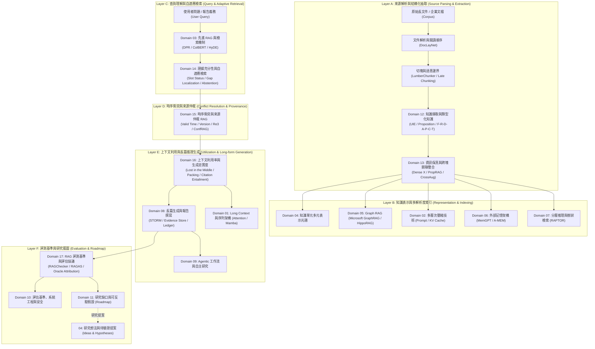

# 🧠 LLM 超長文件處理全景心智圖 (Map of Content)

> [!TIP] 互動心智圖導覽
> 本心智圖完整覆蓋超長文本從『理解/閱讀』到『推理/撰寫』的五大垂直層次與 11 大研究主軸。
> 點擊心智圖下方的專題與論文連結，即可直接跳轉至各專題的深度技術剖析。

---

## 一、全景系統拓撲架構圖

**圖中節點對照**：全景涵蓋 17 大研究領域專題與 6 大垂直研究層次；未經文獻直接證實的組合機制集中收錄於 [[04 - 研究想法與待驗證提案 (Ideas & Hypotheses)/README|Ideas & Hypotheses]]。

---

## 二、層級分類核心專題索引 (17 大研究領域)

### 1. 模型與運算層 (Model & Compute)
- **[[02 - 研究領域專題 (Research Domains)/Domain 01 - Long Context 與序列架構 (Attention, SSM, Ring)|Domain 01: Long Context 與序列架構]]**
  - 代表論文：[[03 - 論文庫 (Literature Notes)/Vaswani2017 - Attention Is All You Need|Attention (Vaswani 2017)]]、[[03 - 論文庫 (Literature Notes)/Dao2022 - FlashAttention|FlashAttention (Dao 2022)]]、[[03 - 論文庫 (Literature Notes)/Gu2023 - Mamba Linear-Time Sequence Modeling|Mamba (Gu 2023)]]、[[03 - 論文庫 (Literature Notes)/Liu2023 - RingAttention|RingAttention (Liu 2023)]]、[[03 - 論文庫 (Literature Notes)/Ding2024 - LongRoPE 2M Context|LongRoPE (Ding 2024)]]。
- **[[02 - 研究領域專題 (Research Domains)/Domain 02 - 多層次壓縮技術 (Token, KV Cache, Context)|Domain 02: 多層次壓縮技術]]**
  - 代表論文：[[03 - 論文庫 (Literature Notes)/Jiang2023 - LLMLingua Prompt Compression|LLMLingua (Jiang 2023)]]、[[03 - 論文庫 (Literature Notes)/Jiang2023 - LongLLMLingua|LongLLMLingua (Jiang 2024)]]、[[03 - 論文庫 (Literature Notes)/Liu2024 - KIVI 2-bit KV Cache|KIVI 2-bit (Liu 2024)]]、[[03 - 論文庫 (Literature Notes)/Li2024 - SnapKV|SnapKV (Li 2024)]]、[[03 - 論文庫 (Literature Notes)/Cai2024 - PyramidKV|PyramidKV (Cai 2024)]]。

### 2. 來源解析、知識抽取與保真層 (Parsing, Extraction & Preservation)
- **[[02 - 研究領域專題 (Research Domains)/Domain 04 - Chunking 策略與知識擷取 (Proposition, Cross-chunk)|Domain 04: Chunking 策略與知識擷取]]**
  - 代表論文：[[03 - 論文庫 (Literature Notes)/Chen2023 - Dense X Proposition Retrieval|Dense X (Chen 2024)]]、[[03 - 論文庫 (Literature Notes)/Duarte2024 - LumberChunker|LumberChunker (Duarte 2024)]]、[[03 - 論文庫 (Literature Notes)/Gunther2024 - Late Chunking|Late Chunking (Günther 2024)]]。
- **[[02 - 研究領域專題 (Research Domains)/Domain 12 - Knowledge Extraction & Typed Knowledge|Domain 12: 知識擷取與類型化知識表示]]**
  - 代表論文：[[03 - 論文庫 (Literature Notes)/Lu2022 - UIE Universal Information Extraction|UIE (Lu 2022)]]、DocRED (2019)、MAVEN (2020)。
- **[[02 - 研究領域專題 (Research Domains)/Domain 13 - Information Preservation & Cross-chunk Consolidation|Domain 13: 資訊保真與跨塊關聯整合]]**
  - 代表論文：[[03 - 論文庫 (Literature Notes)/Chen2023 - Dense X Proposition Retrieval|Dense X (Chen 2024)]]、PropRAG (EMNLP 2025)、CrossAug (2026)。

### 3. 檢索、圖結構與自適應控制層 (Retrieval, Graph & Adaptive Control)
- **[[02 - 研究領域專題 (Research Domains)/Domain 03 - 先進 RAG 與檢索機制 (ColBERT, HyDE, Self-RAG)|Domain 03: 先進 RAG 與檢索機制]]**
  - 代表論文：[[03 - 論文庫 (Literature Notes)/Lewis2020 - Retrieval-Augmented Generation (RAG)|RAG (Lewis 2020)]]、[[03 - 論文庫 (Literature Notes)/Karpukhin2020 - Dense Passage Retrieval (DPR)|DPR (Karpukhin 2020)]]、[[03 - 論文庫 (Literature Notes)/Khattab2020 - ColBERT Late Interaction|ColBERT (Khattab 2020)]]、[[03 - 論文庫 (Literature Notes)/Gao2022 - HyDE Zero-Shot Dense Retrieval|HyDE (Gao 2022)]]。
- **[[02 - 研究領域專題 (Research Domains)/Domain 05 - Graph RAG 與結構化知識 (Microsoft GraphRAG, HippoRAG)|Domain 05: Graph RAG 與結構化知識]]**
  - 代表論文：[[03 - 論文庫 (Literature Notes)/Edge2024 - Microsoft GraphRAG|Microsoft GraphRAG (Edge 2024)]]、[[03 - 論文庫 (Literature Notes)/Gutierrez2024 - HippoRAG|HippoRAG (Gutiérrez 2024)]]。
- **[[02 - 研究領域專題 (Research Domains)/Domain 14 - Evidence Sufficiency & Adaptive Retrieval|Domain 14: 證據充分性與自適應檢索]]**
  - 代表論文：[[03 - 論文庫 (Literature Notes)/Asai2023 - Self-RAG|Self-RAG (Asai 2023)]]、[[03 - 論文庫 (Literature Notes)/Trivedi2022 - IRCoT Interleaving Retrieval and CoT|IRCoT (Trivedi 2022)]]、Adaptive-RAG (2024)、Evidence Sufficiency Benchmark (2026)。
- **[[02 - 研究領域專題 (Research Domains)/Domain 15 - Temporal Conflict & Provenance-aware RAG|Domain 15: 時序衝突與來源仲裁 RAG]]**
  - 代表論文：Re³ (ACL 2026)、ConfRAG (2024)。

### 4. 記憶與階層推理層 (Memory & Hierarchical Reasoning)
- **[[02 - 研究領域專題 (Research Domains)/Domain 06 - 外部記憶體架構 (MemGPT, A-MEM, Working Memory)|Domain 06: 外部記憶體架構]]**
  - 代表論文：[[03 - 論文庫 (Literature Notes)/Packer2023 - MemGPT LLM as Operating System|MemGPT (Packer 2023)]]、[[03 - 論文庫 (Literature Notes)/Chik2025 - A-MEM Agentic Memory System|A-MEM (2025)]]、[[03 - 論文庫 (Literature Notes)/Park2023 - Generative Agents|Generative Agents (Park 2023)]]。
- **[[02 - 研究領域專題 (Research Domains)/Domain 07 - 分層推理與樹狀檢索 (RAPTOR, Hierarchical QA)|Domain 07: 分層推理與樹狀檢索]]**
  - 代表論文：[[03 - 論文庫 (Literature Notes)/Sarthi2024 - RAPTOR Recursive Tree Retrieval|RAPTOR (Sarthi 2024)]]。

### 5. 上下文利用、長篇撰寫與智能體層 (Utilization, Writing & Agents)
- **[[02 - 研究領域專題 (Research Domains)/Domain 16 - Context Utilization & Faithfulness|Domain 16: 上下文利用率與生成忠實度]]**
  - 代表論文：[[03 - 論文庫 (Literature Notes)/Liu2023 - Lost in the Middle|Lost in the Middle (Liu 2023)]]、[[03 - 論文庫 (Literature Notes)/Ru2024 - RAGChecker|RAGChecker (Ru 2024)]]、[[03 - 論文庫 (Literature Notes)/Es2024 - RAGAS|RAGAS (Es 2024)]]。
- **[[02 - 研究領域專題 (Research Domains)/Domain 08 - 長篇生成與報告撰寫 (STORM, Evidence Store, Ledger)|Domain 08: 長篇生成與報告撰寫]]**
  - 代表論文：[[03 - 論文庫 (Literature Notes)/Shao2024 - STORM Writing Wikipedia From Scratch|STORM (Shao 2024)]]、EviReport (ACL Findings 2026)、RAG4Reports (2026)、ReportLogic (ACL 2026)。
- **[[02 - 研究領域專題 (Research Domains)/Domain 09 - Agentic 工作流與自主研究 (Planning, Multi-Agent)|Domain 09: Agentic 工作流與自主研究]]**

### 6. 評測基準、系統安全與研究藍圖 (Evaluation, Safety & Roadmap)
- **[[02 - 研究領域專題 (Research Domains)/Domain 17 - RAG Benchmarks & Evaluation Protocols|Domain 17: RAG 評測基準與評估協議]]**
  - 核心索引：[[00 - 導覽與心智圖 (Navigation & MOC)/RAG Benchmark Catalog|RAG Benchmark Catalog (基準總索引)]]。
- **[[02 - 研究領域專題 (Research Domains)/Domain 10 - 評估基準、系統工程與安全 (Benchmarks & Safety)|Domain 10: 評估基準、系統工程與安全]]**
  - 代表論文：[[03 - 論文庫 (Literature Notes)/Hsieh2024 - RULER What is the Real Context Size|RULER (Hsieh 2024)]]、[[03 - 論文庫 (Literature Notes)/Bai2023 - LongBench Bilingual Multitask Benchmark|LongBench (Bai 2024)]]、[[03 - 論文庫 (Literature Notes)/An2023 - L-Eval Standardized Long Context Benchmark|L-Eval (An 2024)]]、[[03 - 論文庫 (Literature Notes)/Zhang2024 - InfiniteBench Beyond 100K|InfiniteBench (Zhang 2024)]]。
- **[[02 - 研究領域專題 (Research Domains)/Domain 11 - 最具價值的研究方向與實驗設計 (Research Roadmap)|Domain 11: 最具價值的研究方向與實驗設計]]**
  - 專題提案：[[04 - 研究想法與待驗證提案 (Ideas & Hypotheses)/README|Ideas & Hypotheses (研究想法與提案庫)]]。
