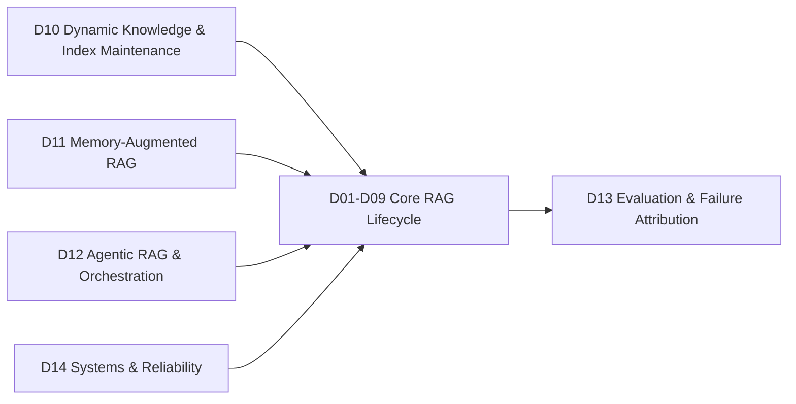
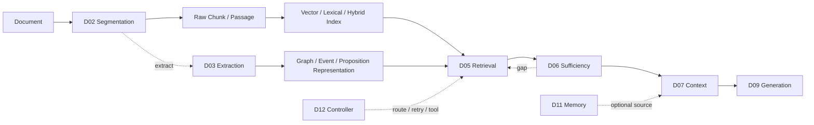
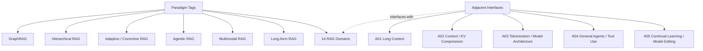

# RAG 系統與研究領域心智圖

> [!IMPORTANT]
> 這裡只呈現目前正式的 **14 個 Research Domains**。為避免一張 Mermaid 過大，拆成三張：核心資料流、控制/評估/系統平面、可選架構與相鄰技術。

## 1. Core RAG Data / Evidence Flow

```mermaid
flowchart LR
    SRC["Knowledge Sources"] --> D01["D01 Ingestion & Structure"]
    D01 --> D02["D02 Segmentation & Contextualization"]

    D02 --> RAW["Raw Retrieval Units"]
    D02 -. "optional" .-> D03["D03 Knowledge Extraction & Preservation"]
    D03 --> SEM["Structured / Semantic Units"]

    RAW --> D04["D04 Representation & Indexing"]
    SEM --> D04

    Q["User Query"] --> D05["D05 Query Understanding & Retrieval"]
    D04 --> D05
    D05 --> D06["D06 Evidence Sufficiency & Adaptive Retrieval"]
    D06 --> D07["D07 Context Construction & Utilization"]
    D07 --> D08["D08 Temporal / Conflict / Provenance"]
    D08 --> D09["D09 Grounded Generation & Long-form Synthesis"]
    D09 --> OUT["Answer / Report"]
```

### 節點對照
- [[02 - 研究領域專題 (Research Domains)/Canonical RAG Domains/Domain 01 - Document Ingestion & Structure|D01 Document Ingestion & Structure]]
- [[02 - 研究領域專題 (Research Domains)/Canonical RAG Domains/Domain 02 - Segmentation & Contextualization|D02 Segmentation & Contextualization]]
- [[02 - 研究領域專題 (Research Domains)/Canonical RAG Domains/Domain 03 - Knowledge Extraction & Information Preservation|D03 Knowledge Extraction & Information Preservation]]
- [[02 - 研究領域專題 (Research Domains)/Canonical RAG Domains/Domain 04 - Knowledge Representation & Indexing|D04 Knowledge Representation & Indexing]]
- [[02 - 研究領域專題 (Research Domains)/Canonical RAG Domains/Domain 05 - Query Understanding & Retrieval|D05 Query Understanding & Retrieval]]
- [[02 - 研究領域專題 (Research Domains)/Canonical RAG Domains/Domain 06 - Evidence Sufficiency & Adaptive Retrieval|D06 Evidence Sufficiency & Adaptive Retrieval]]
- [[02 - 研究領域專題 (Research Domains)/Canonical RAG Domains/Domain 07 - Context Construction & Evidence Utilization|D07 Context Construction & Evidence Utilization]]
- [[02 - 研究領域專題 (Research Domains)/Canonical RAG Domains/Domain 08 - Temporal Conflict & Provenance Resolution|D08 Temporal Conflict & Provenance Resolution]]
- [[02 - 研究領域專題 (Research Domains)/Canonical RAG Domains/Domain 09 - Grounded Generation Attribution & Long-form Synthesis|D09 Grounded Generation Attribution & Long-form Synthesis]]

## 2. Control, Memory, Evaluation & Systems

### 節點對照
- [[02 - 研究領域專題 (Research Domains)/Canonical RAG Domains/Domain 10 - Dynamic Knowledge & Index Maintenance|D10 Dynamic Knowledge & Index Maintenance]]
- [[02 - 研究領域專題 (Research Domains)/Canonical RAG Domains/Domain 11 - Memory-Augmented RAG|D11 Memory-Augmented RAG]]
- [[02 - 研究領域專題 (Research Domains)/Canonical RAG Domains/Domain 12 - Agentic RAG & Orchestration|D12 Agentic RAG & Orchestration]]
- [[02 - 研究領域專題 (Research Domains)/Canonical RAG Domains/Domain 13 - RAG Evaluation & Failure Attribution|D13 RAG Evaluation & Failure Attribution]]
- [[02 - 研究領域專題 (Research Domains)/Canonical RAG Domains/Domain 14 - RAG Systems & Reliability|D14 RAG Systems & Reliability]]

## 3. Optional Architecture Paths

這張圖刻意表達：
- **Extraction 是 optional**：raw chunk RAG 不需要 D03。
- GraphRAG / Hierarchical RAG 是 D03/D04/D05 上的 paradigm，不是獨立 Domain。
- D06 可以形成 retrieval retry loop。
- D11 是 optional persistent memory source。
- D12 是 control plane，不是固定 pipeline stage。

## 4. Paradigms & Adjacent Interfaces

- [[00 - 導覽與心智圖 (Navigation & MOC)/RAG Paradigm Tags|Paradigm Tags]]
- [[00 - 導覽與心智圖 (Navigation & MOC)/RAG Adjacent Interfaces|Adjacent Interfaces]]

## 5. Domain Index

| ID | Domain |
|---|---|
| D01 | [[02 - 研究領域專題 (Research Domains)/Canonical RAG Domains/Domain 01 - Document Ingestion & Structure|Document Ingestion & Structure]] |
| D02 | [[02 - 研究領域專題 (Research Domains)/Canonical RAG Domains/Domain 02 - Segmentation & Contextualization|Segmentation & Contextualization]] |
| D03 | [[02 - 研究領域專題 (Research Domains)/Canonical RAG Domains/Domain 03 - Knowledge Extraction & Information Preservation|Knowledge Extraction & Information Preservation]] |
| D04 | [[02 - 研究領域專題 (Research Domains)/Canonical RAG Domains/Domain 04 - Knowledge Representation & Indexing|Knowledge Representation & Indexing]] |
| D05 | [[02 - 研究領域專題 (Research Domains)/Canonical RAG Domains/Domain 05 - Query Understanding & Retrieval|Query Understanding & Retrieval]] |
| D06 | [[02 - 研究領域專題 (Research Domains)/Canonical RAG Domains/Domain 06 - Evidence Sufficiency & Adaptive Retrieval|Evidence Sufficiency & Adaptive Retrieval]] |
| D07 | [[02 - 研究領域專題 (Research Domains)/Canonical RAG Domains/Domain 07 - Context Construction & Evidence Utilization|Context Construction & Evidence Utilization]] |
| D08 | [[02 - 研究領域專題 (Research Domains)/Canonical RAG Domains/Domain 08 - Temporal Conflict & Provenance Resolution|Temporal Conflict & Provenance Resolution]] |
| D09 | [[02 - 研究領域專題 (Research Domains)/Canonical RAG Domains/Domain 09 - Grounded Generation Attribution & Long-form Synthesis|Grounded Generation Attribution & Long-form Synthesis]] |
| D10 | [[02 - 研究領域專題 (Research Domains)/Canonical RAG Domains/Domain 10 - Dynamic Knowledge & Index Maintenance|Dynamic Knowledge & Index Maintenance]] |
| D11 | [[02 - 研究領域專題 (Research Domains)/Canonical RAG Domains/Domain 11 - Memory-Augmented RAG|Memory-Augmented RAG]] |
| D12 | [[02 - 研究領域專題 (Research Domains)/Canonical RAG Domains/Domain 12 - Agentic RAG & Orchestration|Agentic RAG & Orchestration]] |
| D13 | [[02 - 研究領域專題 (Research Domains)/Canonical RAG Domains/Domain 13 - RAG Evaluation & Failure Attribution|RAG Evaluation & Failure Attribution]] |
| D14 | [[02 - 研究領域專題 (Research Domains)/Canonical RAG Domains/Domain 14 - RAG Systems & Reliability|RAG Systems & Reliability]] |

## Related

- [[00 - 導覽與心智圖 (Navigation & MOC)/RAG Research Taxonomy & Domain Map|RAG Research Taxonomy]]
- [[00 - 導覽與心智圖 (Navigation & MOC)/RAG Benchmark Catalog|RAG Benchmark Catalog]]
- [[00 - 導覽與心智圖 (Navigation & MOC)/Survey Papers Index|Survey Papers Index]]
- [[04 - 研究想法與待驗證提案 (Ideas & Hypotheses)/README|Ideas & Hypotheses]]
