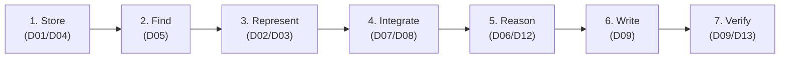
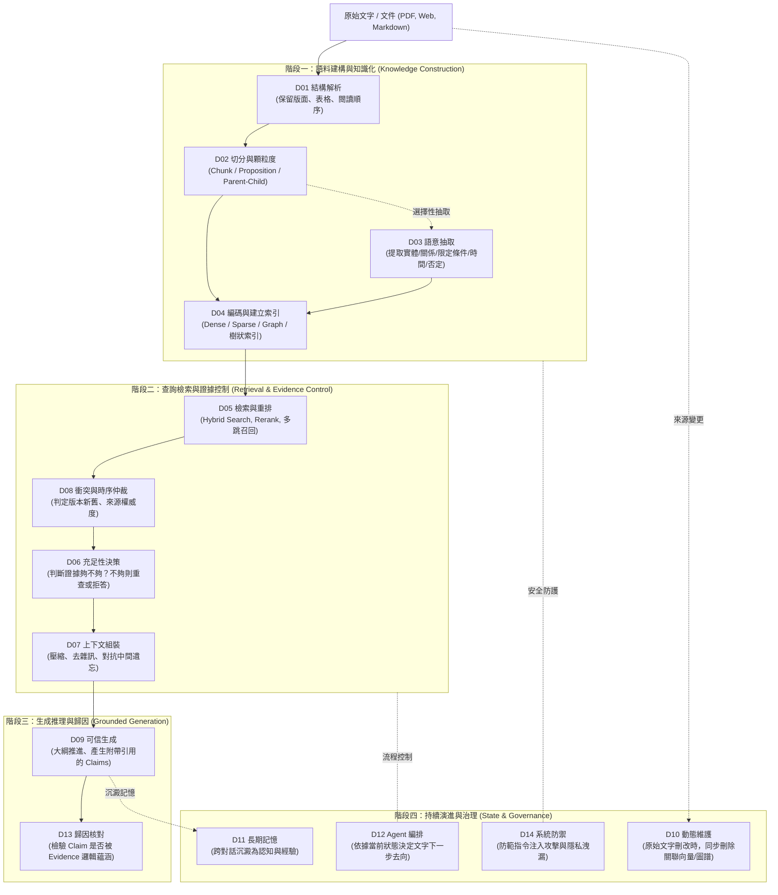
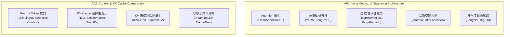

# LLM 超長文件閱讀與撰寫技術全景：從 Long Context、壓縮、RAG、記憶體到長篇生成

> [!ABSTRACT] 報告導讀
> 本報告為專案旗艦級正體中文技術全景綜述，旨在為研究者與系統架構師提供**「讓 LLM 真正讀懂 1,000 頁文件，並穩定撰寫數萬字長篇報告」**的端到端認知架構與技術決策全貌。
> 
> 本文全面對齊專案最新正式架構：
> - **核心生命週期**：[[02 - 研究領域專題 (Research Domains)/README|RAG 14 個核心研究領域 (D01–D14)]]
> - **相鄰技術介面**：[[00 - 導覽與心智圖 (Navigation & MOC)/RAG Adjacent Interfaces|長序列與壓縮技術介面 (A01–A05)]]
> - **方法範式標籤**：[[00 - 導覽與心智圖 (Navigation & MOC)/RAG Paradigm Tags|跨模組方法族 (Paradigm Tags)]]
> - **英文綜述主文**：[[SURVEY|RAG Survey — From Knowledge Construction to Evidence-Grounded Generation]]

---

## 一、執行摘要與核心命題

在超長文本智慧（Long-Document Intelligence）領域，2026 年商用模型已廣泛具備 1M 至 2M+ token 的 nominal context window。然而學術界與工業界的嚴格評測（如 [[03 - 論文庫 (Literature Notes)/06 - Benchmarks & Evaluation/(TACL 2024-01) Lost in the Middle - How Language Models Use Long Contexts|Lost in the Middle]]、[[03 - 論文庫 (Literature Notes)/06 - Benchmarks & Evaluation/(arXiv 2024-04) RULER - What is the Real Context Size of Your Long-Context Language Models|RULER]]、[[03 - 論文庫 (Literature Notes)/06 - Benchmarks & Evaluation/(ACL 2024-08) LongBench - A Bilingual, Multitask Benchmark for Long Context Understanding|LongBench]]）一致證實：**「能放進 Context」絕不等於「能等品質理解與推理」**。模型普遍存在位置偏置、雜訊敏感、跨跨度關聯衰減與 Multi-hop 推理崩潰等問題。

本報告提出貫穿全景的核心命題：

$$
\boxed{\text{Long Context 解決的是「能不能放進去」；而完整的超長文件系統解決的是「放什麼、怎麼表示、怎麼檢索、怎麼協同、怎麼推理、怎麼撰寫、怎麼驗證」。}}
$$

因此，純粹依賴單一模型暴力擴展上下文並非最優解，主流工程與學術範式已收斂為多模組動態協同的**證據生命週期系統（Evidence Lifecycle System）**：

$$
\boxed{\text{Long Context (A01)} + \text{Retrieval (D05)} + \text{Compression (A02/D07)} + \text{Structured Knowledge (D03/D04)} + \text{Memory (D11)} + \text{Planning (D12)} + \text{Verification (D09/D13)}}
$$

---

## 二、端到端認知流：1,000 頁閱讀到 50,000 字撰寫

處理超長文件本質上是資訊熵的壓縮、重組與生成過程。一個完整的端到端長文件系統必須經歷 7 階段認知流，任一階段失效均會導致終端任務失敗：



| 階段 | 認知目標 | 核心研究領域 | 典型失效模式 (Failure Modes) | 代表性技術路線 |
| :--- | :--- | :--- | :--- | :--- |
| **1. Store** | 原始文件結構解析與物理儲存 | D01, D04 | 版面丟失、表格串行、多模態圖表失真 | OmniDocBench, PDF-to-Tree |
| **2. Find** | 候選證據之高召回搜尋 | D05 | 關鍵字失配、跨段全域線索遺漏 | Hybrid Search, ColBERTv2, HyDE |
| **3. Represent** | 知識單元切分、語意 contextualization | D02, D03 | 語義碎片化、懸空指稱、修飾條件脫落 | Late Chunking, Dense X, UIE |
| **4. Integrate** | 上下文排序、壓縮與矛盾裁決 | D07, D08 | 位置偏置 (Lost in middle)、過期事實混淆 | RECOMP, FreshLLMs, When Facts Change |
| **5. Reason** | 證據充足性評估與決策跳轉 | D06, D12 | 證據不足卻強行回答 (幻覺)、多跳斷鏈 | Adaptive-RAG, FLARE, RAG-Critic |
| **6. Write** | 結構化長篇章節推進與生成 | D09 | 大綱漂移、章節前後矛盾、文風發散 | STORM, EFSG, EviReport |
| **7. Verify** | Claim 級證據溯源與歸因核對 | D09, D13 | 假引用 (Citation Hallucination)、弱蘊涵 | GopherCite, ALCE, RAGTruth |

### 一段文字的完整生命週期圖譜 (Core Lifecycle of Text)

一段文字從原始載體進入系統，歷經建構、檢索、生成到治理，其端到端核心狀態演進如下：



**圖中節點對照**：
- **階段一 (D01–D04)**：[[02 - 研究領域專題 (Research Domains)/Domain 01 - Document Ingestion & Structure|D01 結構解析]] · [[02 - 研究領域專題 (Research Domains)/Domain 02 - Segmentation & Contextualization|D02 切分顆粒度]] · [[02 - 研究領域專題 (Research Domains)/Domain 03 - Knowledge Extraction & Information Preservation|D03 語意抽取]] · [[02 - 研究領域專題 (Research Domains)/Domain 04 - Knowledge Representation & Indexing|D04 表示與索引]]
- **階段二 (D05–D08)**：[[02 - 研究領域專題 (Research Domains)/Domain 05 - Query Understanding & Retrieval|D05 檢索重排]] · [[02 - 研究領域專題 (Research Domains)/Domain 08 - Temporal Conflict & Provenance Resolution|D08 衝突時序仲裁]] · [[02 - 研究領域專題 (Research Domains)/Domain 06 - Evidence Sufficiency & Adaptive Retrieval|D06 充足性決策]] · [[02 - 研究領域專題 (Research Domains)/Domain 07 - Context Construction & Evidence Utilization|D07 上下文組裝]]
- **階段三 (D09, D13)**：[[02 - 研究領域專題 (Research Domains)/Domain 09 - Grounded Generation Attribution & Long-form Synthesis|D09 可信長篇生成]] · [[02 - 研究領域專題 (Research Domains)/Domain 13 - RAG Evaluation & Failure Attribution|D13 歸因核對與評測]]
- **階段四 (D10–D14)**：[[02 - 研究領域專題 (Research Domains)/Domain 10 - Dynamic Knowledge & Index Maintenance|D10 索引維護同步]] · [[02 - 研究領域專題 (Research Domains)/Domain 11 - Memory-Augmented RAG|D11 持久記憶管理]] · [[02 - 研究領域專題 (Research Domains)/Domain 12 - Agentic RAG & Orchestration|D12 Agent 行動編排]] · [[02 - 研究領域專題 (Research Domains)/Domain 14 - RAG Systems, Robustness & Security|D14 系統防禦與可靠性]]

---

## 三、模型底層支撐：長序列架構與壓縮技術 (A01, A02)

底層序列架構與推論效率屬於 RAG 的相鄰介面（Adjacent Interfaces），為外部檢索提供計算基底。



### 1. Long-Context 架構的六大流派權衡 (A01)
* **IO 感知精確注意力**：[[03 - 論文庫 (Literature Notes)/01 - Long Context & Sequence/(NeurIPS 2022-12) FlashAttention - Fast and Memory-Efficient Exact Attention with IO-Awareness|FlashAttention-1/2]] 透過 SRAM/HBM 分塊計算，在不改變數學輸出的前提下突破顯存頻寬瓶頸，是現代長文本基礎設施的標配。
* **分塊環形分散式計算**：[[03 - 論文庫 (Literature Notes)/01 - Long Context & Sequence/(ICLR 2024-05) RingAttention with Blockwise Transformers for Near-Infinite Context|RingAttention]] 將序列切分重疊於 GPU 環形通訊中，理論上將 context 延伸至多節點顯存上限。
* **狀態空間模型 (SSM)**：[[03 - 論文庫 (Literature Notes)/01 - Long Context & Sequence/(arXiv 2023-12) Mamba - Linear-Time Sequence Modeling with Selective State Spaces|Mamba]] 達成推論時間與序列長度的線性複雜度，但在高密度精確關聯 recall 任務上仍面臨固定容量隱狀態的壓縮極限。

### 2. Context 壓縮與 Token 壓縮之本質區分 (A02)
* **Token 壓縮 (Inference-Level)**：如 [[03 - 論文庫 (Literature Notes)/02 - Compression & KV Cache/(NeurIPS 2023-12) H2O - Heavy-Hitter Oracle for Efficient Generative Inference of Large Language Models|H2O]]、[[03 - 論文庫 (Literature Notes)/02 - Compression & KV Cache/(arXiv 2024-04) SnapKV - LLM Knows What You are Looking for Before Generation|SnapKV]]、[[03 - 論文庫 (Literature Notes)/02 - Compression & KV Cache/(ICML 2024-07) KIVI - A Tuning-Free Asymmetric 2-bit Quantization for KV Cache|KIVI]]，目標是降低解碼階段的 VRAM 佔用與吞吐瓶頸。
* **Context 壓縮 (Information-Level)**：如 [[03 - 論文庫 (Literature Notes)/02 - Compression & KV Cache/(EMNLP 2023-12) LLMLingua - Compressing Context for Accelerated Inference of Large Language Models|LLMLingua]]、[[03 - 論文庫 (Literature Notes)/02 - Compression & KV Cache/(ICLR 2024-05) RECOMP - Improving Retrieval-Augmented LMs with Compression and Selective Augmentation|RECOMP]]，目標是在輸入端剔除資訊冗餘，緩解生成器的注意力分散問題。

---

## 四、知識表示與檢索控制：從靜態 Chunk 到證據狀態 (D01–D08)

### 1. 知識單元的表示維度：Chunk、Proposition 與 Graph (D02, D04)
知識庫嚴禁將表示形式視為線性進化的「成熟度階梯」。不同表示形式解決不同的檢索邊界：

| 表示單元 | 核心工作 | 優勢場景 | 固有代價與風險 |
| :--- | :--- | :--- | :--- |
| **Raw Passage Chunk** | Recursive Chunking | 保留原始語境、建立成本極低 | 切割斷裂、檢索雜訊大 |
| **Contextual Chunk** | [[03 - 論文庫 (Literature Notes)/03 - RAG & Retrieval/(arXiv 2024-09) Late Chunking - Contextual Chunk Embeddings for Retrieval\|Late Chunking]] | 全文語意編碼後池化，消除代名詞歧義 | 依賴長序列 encoder 前向傳播 |
| **Atomic Proposition** | [[03 - 論文庫 (Literature Notes)/04 - Knowledge & Graph RAG/(EMNLP 2024-11) Dense X - Exploring the Limit of Proposition Retrieval for Open-Domain QA\|Dense X]] | 檢索顆粒度極高，精確匹配事實條件 | 索引膨脹數倍、失去局部脈絡 |
| **Hierarchical Tree** | [[03 - 論文庫 (Literature Notes)/04 - Knowledge & Graph RAG/(ICLR 2024-05) RAPTOR - Recursive Abstractive Processing for Tree-Organized Retrieval\|RAPTOR]] | 支援巨觀跨章節綜述與微觀細節切換 | 遞迴聚類摘要開銷大、摘要可能失真 |
| **Knowledge Graph** | [[03 - 論文庫 (Literature Notes)/04 - Knowledge & Graph RAG/(arXiv 2024-04) From Local to Global - A Graph RAG Approach to Query-Focused Summarization\|Microsoft GraphRAG]] | 跨實體關係推理、社群級巨觀查詢 (Global Search) | 抽取成本高昂，難以適應高頻更新語料 |

### 2. 檢索控制的核心躍遷：相關性 vs. 充足性 vs. 時序一致性
* **相關不等於充足 (Relevance $\neq$ Sufficiency)**：
  - D05 解決的是「哪些文件與問題相關」（Top-K 相似度）。
  - D06（如 [[03 - 論文庫 (Literature Notes)/03 - RAG & Retrieval/(NAACL 2024-06) Adaptive-RAG - Learning to Adapt Retrieval-Augmented Large Language Models through Question Complexity|Adaptive-RAG]]、[[03 - 論文庫 (Literature Notes)/03 - RAG & Retrieval/(EMNLP 2023-12) Active Retrieval Augmented Generation|FLARE]]）解決的是「已檢索到的證據是否足夠推導出答案」。當資訊缺失時，系統必須觸發 Secondary Retrieval 或選擇主動拒答（Abstention）。
* **時序與衝突仲裁 (D08)**：
  - 當多個檢索結果存在衝突時（如政策改版、股價更新），系統不能將矛盾資訊直接塞入 Context。必須透過 [[03 - 論文庫 (Literature Notes)/06 - Benchmarks & Evaluation/(ACL 2024-08) FreshLLMs - Refreshing Large Language Models with Search Engine Augmentation|FreshLLMs]]、[[03 - 論文庫 (Literature Notes)/06 - Benchmarks & Evaluation/(ACL 2026-08) Re3 - Relevance and Recency Retrieval for Mitigating Temporal Hallucination|Re³]] 或 [[03 - 論文庫 (Literature Notes)/06 - Benchmarks & Evaluation/(ACL 2026-07) When Facts Change - Temporal Knowledge Conflict Resolution in LLMs|When Facts Change]] 進行時間戳驗證與權威來源仲裁。

---

## 五、推理與長篇生成：撰寫數萬字可信報告 (D09, D12)

「撰寫深度研究報告」與「創作長篇小說」在技術上有本質區別：小說允許自由發散，而研究報告受到**客觀事實邊界、論證邏輯鏈、章節無矛盾性與引文精確歸因**的嚴格約束。

### 1. 長篇撰寫的三大編排範式 (Orchestration Patterns)
```text
(1) Outline-First (如 STORM):
    Query ──> 多視角訪談 ──> 產生大綱樹 ──> 逐章檢索寫作 ──> 綜合審閱

(2) Evidence-First (如 EFSG):
    Query ──> 全局檢索 ──> 凍結結構化證據池 ──> 受約束解碼生成 ──> 輸出報告

(3) Gap-Aware Iterative Writing (如 EviReport):
    Query ──> 初始大綱 ──> 章節草稿 ──> 發現證據空缺 ──> 補充電力檢索 ──> 迭代重構
```

### 2. 引用歸因的四層嚴格階梯
在 D09 與 D13 的評估中，一個合格的引用標記必須跨越以下檢驗：
1. **表面引用存在 (Citation Presence)**：句末是否標註引用序號。
2. **語意相關性 (Citation Relevance)**：所引來源是否與該句話題相符。
3. **邏輯蘊涵 (Entailment / Faithfulness)**：文獻內容在語意邏輯上是否充分推導出該 Claim（依賴 [[03 - 論文庫 (Literature Notes)/06 - Benchmarks & Evaluation/(EMNLP 2023-12) Enabling Large Language Models to Generate Text with Citations|ALCE]] 與 [[03 - 論文庫 (Literature Notes)/06 - Benchmarks & Evaluation/(ACL 2024-08) RAGTruth - A Hallucination Corpus for Developing Trustworthy Retrieval-Augmented Language Models|RAGTruth]] 協議）。
4. **論證充足性 (Sufficiency & Scope)**：引文是否完整支撐所有限定條件（如時間、樣本範圍、前置假設）。

---

## 六、評估、系統工程與安全 (D13, D14)

### 1. 故障歸因與 Oracle 金標準介入 (D13)
單一的 End-to-End 分數無法指導系統優化。現代 RAG 評估框架（[[03 - 論文庫 (Literature Notes)/06 - Benchmarks & Evaluation/(EACL 2024-03) RAGAS - Automated Evaluation of Retrieval Augmented Generation|Ragas]]、[[03 - 論文庫 (Literature Notes)/06 - Benchmarks & Evaluation/(NAACL 2024-06) ARES - An Automated Evaluation Framework for Retrieval-Augmented Generation Systems|ARES]]、[[03 - 論文庫 (Literature Notes)/06 - Benchmarks & Evaluation/(arXiv 2024-08) RAGChecker - A Fine-grained Framework for Diagnosing Retrieval-Augmented Generation|RAGChecker]]）強調層級診斷：
* **Oracle 介入測試**：直接將人工標註的黃金證據（Gold Evidence）輸入 Generator：
  $$\text{Generator}(\text{Gold Evidence})$$
  - 若此時回答依然錯誤，則問題根源在 **Generator 語言理解、Context Utilization (D07) 或推論能力**；
  - 若此時回答完全正確，則系統瓶頸確實在 **Retriever 召回或排序 (D05)**。

### 2. 系統工程與安全防線 (D14)
* **推論延遲模型**：
  $$T_{\text{total}} = T_{\text{embedding}} + T_{\text{search}} + T_{\text{rerank}} + T_{\text{prefill}} + T_{\text{decode}}$$
  系統選型（如 [[03 - 論文庫 (Literature Notes)/03 - RAG & Retrieval/(SOSP 2025-10) METIS - Fast Quality-Aware RAG Systems with Configuration Adaptation|METIS]]、[[03 - 論文庫 (Literature Notes)/03 - RAG & Retrieval/(KDD 2025-08) PipeRAG - Fast RAG via Algorithm-System Co-design|PipeRAG]]）必須在 TTFT（首字延遲）與生成品質間取得 Pareto 最優。
* **安全雙鐵律**：
  $$\boxed{\text{檢索文件 } \neq \text{ 可信指令 (防範 Indirect Prompt Injection)}}$$
  $$\boxed{\text{檢索文件 } \neq \text{ 可信事實 (防範 PoisonedRAG 語料投毒)}}$$

---

## 七、開放研究藍海與前沿課題

結合文獻審計與工業實踐，以下四大方向目前文獻支撐最薄弱，但具備極高學術突破空間與工程價值：

1. **D08 證據血緣與動態核准治理 (Provenance Lineage & Governance)**：
   目前文獻多聚焦於簡單的時間戳新鮮度（Recency），缺乏對企業級多版本文件、部分修訂、權限跨度與跨來源審批狀態的衝突裁決協議。
2. **D10 動態語料與依賴性刪除傳播 (Deletion Propagation in Changing Index)**：
   當原始文件被刪除或更正時，如何保證衍生出的 Chunk、向量、圖譜節點、快取摘要同步失效，防止已刪除隱私從 Derived State 中被重建。
3. **D11 長期記憶遺忘機制 (Memory Forgetting & Invalidation)**：
   如何避免記憶體在長時間運作後無限膨脹導致雜訊污染，建立受控的遺忘、合併與歸檔演算法。
4. **跨章節長篇邏輯一致性評測 (Report-Level Logical Consistency)**：
   超越單句 Factoid QA，針對數萬字報告的章節承接、論點一致性進行細粒度邏輯鏈評測（如 [[03 - 論文庫 (Literature Notes)/06 - Benchmarks & Evaluation/(ACL 2026-08) ReportLogic - Evaluating Logical Quality in Deep Research Reports|ReportLogic]]）。

---

## 八、結語與導覽

超長文件處理與 RAG 系統的本質，是一場關於**「計算邊界、知識表示、證據驗證與系統資源」的工程權衡藝術**。掌握本知識庫的核心心智模型，應從整體證據流動視角出發，切忌陷入單一工具或行銷名詞的迷思。

* **進一步查閱**：
  - 檢視領域專題：[[02 - 研究領域專題 (Research Domains)/README|14 個 Research Domains 專題頁面]]
  - 檢視前沿論文：[[03 - 論文庫 (Literature Notes)/README|169 篇核心論文標準筆記]]
  - 檢視評測基準：[[00 - 導覽與心智圖 (Navigation & MOC)/RAG Benchmark Catalog|RAG 評測基準型錄]]
  - 檢視原創提案：[[04 - 研究想法與待驗證提案 (Ideas & Hypotheses)/README|研究假設與待驗證架構設計]]
