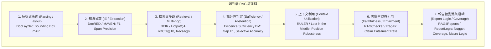

# RAG 評測基準與資料集總索引 (RAG Benchmark Catalog)

> [!INFO] 目錄定位與使用規範
> 本目錄是 `Cycl0n3-ga/RAG-survey` 的核心評測索引，系統性彙整並核對涵蓋長文本處理、RAG、知識圖譜、長篇生成與邏輯一致性的所有公開評測工件。
> 
> **嚴格四層工件分類原則（Artifact Type Separation）**：
> - `benchmark_paper`：定義評測任務、評估協議、合成管道或 Shared Task 競賽規範之文獻；
> - `dataset`：實際提供查詢、上下文與標準答案（Ground Truth）的資料集；
> - `metric`：用於量化評估的數學校驗指標或演算法（如 Faithfulness、nDCG、Nugget Coverage）；
> - `evaluation_framework`：執行自動化批次評測的開源代碼工具（如 RAGChecker、RAGAS）。
> 
> **邊界與引用準則**：
> 1. 方法論文引用 Benchmarks，Benchmarks 反向連至使用它們的方法；
> 2. 純文字研究（Text-only Setting）若使用了包含圖像的評測集，必須在實驗報告中明確交代視覺測項過濾機制；
> 3. 任何未經公開發布的專案自定義標註集（如 IPPS-Eval），一律標註為 `proposed_protocol`，嚴禁虛構為已獲社群驗證的公開 SOTA 基準。
> - **專題對應**：[[02 - 研究領域專題 (Research Domains)/Domain 17 - RAG Benchmarks & Evaluation Protocols|Domain 17: RAG 評測基準與評估協議]]
> - **主目錄**：[[00 - 導覽與心智圖 (Navigation & MOC)/Home (主目錄與知識庫導覽)|主目錄與知識庫導覽]]

---

## 一、全面評測矩陣總表 (Comprehensive Evaluation Matrix)

| 評測任務領域 | 資源名稱 | 工件類型 | 模態 (Modality) | Gold 標籤 / 核心評估重點 | 最適合測試之專題 | 局限性：不能單獨證明什麼？ | 官方來源與存取連結 | 驗證狀態 |
| :--- | :--- | :---: | :---: | :--- | :--- | :--- | :--- | :---: |
| **版面解析** | **[[03 - 論文庫 (Literature Notes)/06 - Benchmarks & Evaluation/(KDD 2022-08) DocLayNet - A Large Human-Annotated Dataset for Document-Layout Analysis|DocLayNet]]** | `dataset` | 多模態 (PDF 圖像 + 文字) | 11 類版面區域人工標註邊框 (Bounding Boxes, 80,863 頁) | 文件結構解析、多欄排版還原 | **不能**證明文字內容語意理解與生成能力 | [[03 - 論文庫 (Literature Notes)/06 - Benchmarks & Evaluation/(KDD 2022-08) DocLayNet - A Large Human-Annotated Dataset for Document-Layout Analysis|文獻筆記]] · [GitHub](https://github.com/DS4SD/DocLayNet) | `verified` |
| **多頁視覺問答** | **[[03 - 論文庫 (Literature Notes)/06 - Benchmarks & Evaluation/(PR 2023-12) Hierarchical Multimodal Transformers for Multi-Page DocVQA|MP-DocVQA]]** | `dataset` / `benchmark_paper` | 多模態 (多頁 PDF 影像) | 46,236 組多頁工業/商業文件視覺問答與答案頁碼定位 (至多 20 頁) | 多頁長篇文件問答、階層跨注意力推理 | **不能**證明純文字 RAG 系統之語意抽取能力 | [[03 - 論文庫 (Literature Notes)/06 - Benchmarks & Evaluation/(PR 2023-12) Hierarchical Multimodal Transformers for Multi-Page DocVQA|文獻筆記]] · [PR 2023](https://doi.org/10.1016/j.patcog.2023.109833) | `verified` |
| **長文論文問答** | **[[03 - 論文庫 (Literature Notes)/06 - Benchmarks & Evaluation/(NAACL 2021-06) QASPER - A Dataset of Information-Seeking Questions and Answers Anchored in Research Papers|QASPER]]** | `dataset` / `benchmark_paper` | 純文字 (Text) | 5,049 組學術長文資訊尋求問答 + 跨段落 Evidence Spans | 學術文獻長文問答、細粒度引文追蹤 | **不能**證明跨文件檢索與多跳合成能力 | [[03 - 論文庫 (Literature Notes)/06 - Benchmarks & Evaluation/(NAACL 2021-06) QASPER - A Dataset of Information-Seeking Questions and Answers Anchored in Research Papers|文獻筆記]] · [NAACL 2021](https://doi.org/10.18653/v1/2021.naacl-main.365) | `verified` |
| **實體與關係** | **DocRED** | `dataset` | 純文字 (Text) | 跨句子命名實體、關係與指代消解 Gold | [[02 - 研究領域專題 (Research Domains)/Domain 12 - Knowledge Extraction & Typed Knowledge\|Domain 12]], [[02 - 研究領域專題 (Research Domains)/Domain 13 - Information Preservation & Cross-chunk Consolidation\|Domain 13]] | **不能**證明企業特定操作語意 (無 F/R/D/A/P/C/T) | [GitHub DocRED](https://github.com/thunlp/DocRED) | `verified` |
| **科學圖譜關聯** | **SciREX** | `dataset` | 純文字 (Text) | 科學文獻 4 元組關聯 (Dataset, Metric, Task, Method) | 篇章級多元關聯抽取 | **不能**證明通用常識 RAG 問答表現 | [GitHub SciREX](https://github.com/allenai/SciREX) | `verified` |
| **事件論元** | **MAVEN** | `dataset` | 純文字 (Text) | 168 類事件觸發詞與論元標註 | [[02 - 研究領域專題 (Research Domains)/Domain 12 - Knowledge Extraction & Typed Knowledge\|Domain 12]] | **不能**證明深層商業時效狀態與合約約束 | [GitHub MAVEN](https://github.com/THU-KEG/MAVEN-dataset) | `verified` |
| **檢索跨域泛化** | **BEIR** | `dataset` / `benchmark_paper` | 純文字 (Text) | 18 個異質資料集查詢-文檔相關度，nDCG@10, Recall | [[02 - 研究領域專題 (Research Domains)/Domain 03 - 先進 RAG 與檢索機制 (ColBERT, HyDE, Self-RAG)\|Domain 03]] 檢索器泛化能力 | **不能**證明生成端忠實度與長篇報告質量 | [GitHub BEIR](https://github.com/beir-cellar/beir) | `verified` |
| **多跳關聯推理** | **HotpotQA** | `dataset` | 純文字 (Text) | 答案 + Supporting Facts (支撐事實句子) | 多跳檢索與推理鏈構建 | **不能**證明超長篇報告之篇章邏輯架構 | [HotpotQA 官網](https://hotpotqa.github.io/) | `verified` |
| **多跳 RAG** | **MultiHop-RAG** | `dataset` | 純文字 (Text) | 多跳長文檔檢索與 QA 答案 | 多文件關聯問答 | 各資料集證據鏈單位不同，分數不可直接相加 | [GitHub MultiHop-RAG](https://github.com/yixuantt/MultiHop-RAG) | `verified` |
| **RAG 細粒度診斷** | **RAGChecker** | `evaluation_framework` | 純文字 (Text) | Claim-level 雙向診斷 (Faithfulness, Recall, Precision) | [[02 - 研究領域專題 (Research Domains)/Domain 16 - Context Utilization & Faithfulness\|Domain 16]], [[02 - 研究領域專題 (Research Domains)/Domain 17 - RAG Benchmarks & Evaluation Protocols\|Domain 17]] | 是一個**診斷工具**，不可當作原始問答語料庫 | [GitHub RAGChecker](https://github.com/amazon-science/RAGChecker) | `verified` |
| **無參考自動評估** | **RAGAS** | `evaluation_framework` | 純文字 (Text) | Faithfulness, Answer Relevance, Context Precision | 快速自動化評估 | 依賴 LLM-as-a-Judge，存在自偏好偏置 | [GitHub Ragas](https://github.com/explodinggradients/ragas) | `verified` |
| **真實 RAG 系統** | **Meta CRAG** | `dataset` / `benchmark_paper` | 純文字 (Text) | 涵蓋靜態、動態事實與 Mock Search/KG API | 評估動態事實與網路檢索整合 | **不應**與 Corrective RAG (CRAG) 方法混淆 | [GitHub CRAG](https://github.com/facebookresearch/CRAG) | `verified` |
| **時效與干擾干擾** | **Re² Bench (Re³)** | `dataset` / `benchmark_paper` | 純文字 (Text) | 時效敏感事實問答，注入過期舊版本干擾項 | [[02 - 研究領域專題 (Research Domains)/Domain 15 - Temporal Conflict & Provenance-aware RAG\|Domain 15]] 時序干擾魯棒性 | **不能**證明「最新文檔永遠為正解」 | [ACL Anthology](https://aclanthology.org/2026.acl-long.1180/) | `verified` |
| **證據充分性** | **Evidence Sufficiency BM** | `dataset` / `benchmark_paper` | 純文字 (Text) | 5 種證據充分性狀態 (Full/Partial/Absent 等) | [[02 - 研究領域專題 (Research Domains)/Domain 14 - Evidence Sufficiency & Adaptive Retrieval\|Domain 14]] 拒答校準率 | **不包含**企業特定專案權威治理標籤 | [CMC 2026](https://doi.org/10.32604/cmc.2026.086343) | `verified` |
| **表格與數值推理** | **T²-RAGBench** | `dataset` / `benchmark_paper` | 純文字 + 表格 (Text+Table) | 文字與表格混合檢索，23,088 組問答與數值推理 | 表格檢索與數值運算推理 | 正式版記載 23,088 組；早期預印本版本須另記 | [EACL 2026](https://aclanthology.org/2026.eacl-long.8/) · [HF](https://huggingface.co/datasets/G4KMU/t2-ragbench) | `verified` |
| **長文本基礎力** | **RULER** | `benchmark_paper` | 純文字 (Text) | 檢索、聚合、變數追蹤等 4 類靈敏度探測 | [[02 - 研究領域專題 (Research Domains)/Domain 01 - Long Context 與序列架構 (Attention, SSM, Ring)\|Domain 01]], [[02 - 研究領域專題 (Research Domains)/Domain 10 - 評估基準、系統工程與安全 (Benchmarks & Safety)\|Domain 10]] | **不能**證明實際 RAG 系統端到端品質 | [GitHub RULER](https://github.com/NVIDIA/RULER) | `verified` |
| **長文多任務測試** | **LongBench / L-Eval**| `dataset` / `benchmark_paper` | 純文字 (Text) | 單篇多任務長文本問答與摘要 | 長文本 LLM 上下文承載能力 | **不能**證明 RAG 索引或證據充分性 | [LongBench](https://github.com/THUDM/LongBench) · [L-Eval](https://github.com/OpenLMLab/LEval) | `verified` |
| **長篇報告寫作** | **FreshWiki (STORM)** | `dataset` / `benchmark_paper` | 純文字 (Text) | 維基百科大綱組織、條理性與引文召回率 | [[02 - 研究領域專題 (Research Domains)/Domain 08 - 長篇生成與報告撰寫 (STORM, Evidence Store, Ledger)\|Domain 08]] Pre-writing 與大綱策劃 | **不代表**工業界嚴苛交付物規格書標準 | [ACL Anthology](https://aclanthology.org/2024.naacl-long.347/) | `verified` |
| **多語循證長篇報告**| **RAG4Reports 2026** | Shared Task / `benchmark_paper` | 純文字多語言 | Nugget Coverage (事實覆蓋) + Sentence Support | 循證長篇報告生成評測 | Shared Task 競賽協議，資料存取需個別確認 | [官方網站](https://rag4reports.github.io/) | `verified` |
| **事實密集型報告** | **EviReportBench** | `dataset` / `benchmark_paper` | 多模態 (Text + Image) | Factual Accuracy, Factual Coverage, Visual Integration | 事實優先報告生成與跨模態證據追溯 | 視覺測項不適於純文字系統完整重現 | [ACL Findings 2026](https://aclanthology.org/2026.findings-acl.1397/) | `verified` |
| **專業分析師報告** | **AnalystBench** | `dataset` / `benchmark_paper` | 多模態 (Text + Visual) | 專家審計核對清單 (Expert Checklist), Groundedness | 專業金融與商業長篇報告生成 | 正式任務資料釋出狀態需依官方公布確認 | [ACL Findings 2026](https://aclanthology.org/2026.findings-acl.1197/) | `verified` |
| **報告級宏觀邏輯** | **[[03 - 論文庫 (Literature Notes)/06 - Benchmarks & Evaluation/(ACL 2026-08) ReportLogic - Evaluating Logical Quality in Deep Research Reports|ReportLogic]]** | `dataset` / `benchmark_paper` | 純文字 (Text) | Macro / Expositional / Structural Logic (LogicJudge) | 篇章結構嚴密性與論證邏輯審計 | 官方 Repo 標註資料集尚待審核釋出 | [[03 - 論文庫 (Literature Notes)/06 - Benchmarks & Evaluation/(ACL 2026-08) ReportLogic - Evaluating Logical Quality in Deep Research Reports|文獻筆記]] · [ACL 2026](https://aclanthology.org/2026.acl-long.384/) · [Repo](https://github.com/Polaris-JZ/ReportLogic) | `verified` |
| **專案企業治理** | **IPPS-Eval (Proposed)**| `proposed_protocol` | 純文字 (Text) | F/R/D/A/P/C/T 操作約束、版本權威、充分性狀態 | 驗證專案提出之 Evidence Governance 機制 | **尚未發布之自建資料集**，非公開社群基準 | [[04 - 研究想法與待驗證提案 (Ideas & Hypotheses)/Idea 05 - Evidence-Governed RAG 系統架構構想 (Delta Pipeline Design)\|Idea 05]] | `proposed` |

---

## 二、端到端評測維度與流向圖 (Evaluation Workflow)

---

## 三、Oracle 消融與失效歸因原則 (Oracle Layer Attribution Principles)

要科學評估 RAG 系統，嚴禁僅以終端問答之單一分數斷言成敗，必須執行逐層替換的 Oracle 實驗：

1. **Oracle Parsing / Extraction**：直接向中游注入 100% 正確的黃金文字與結構化事實，評估檢索器與生成器的理論上限；
2. **Oracle Retrieval**：跳過檢索器，直接向 Prompt 注入 100% 黃金證據段落，專門量測生成器的上下文利用率（Context Utilization）與忠實度；
3. **Oracle Context (No-distractor)**：提供完全無噪音干擾項的精確證據，專門量測模型的複雜邏輯推理與長篇寫作能力；
4. **Oracle Claims / Plan**：固定黃金大綱與各章節標準主張，專門評估審計模組的引用對齊（Citation Attribution）靈敏度；
5. **Component Ablation**：一次僅移除單一模組（如關閉 Reranker、移除時間過濾器、移除反思標記），量測該模組的獨立因果增益。

---

## 四、文字研究（Text-Only Setting）的邊界聲明規範

若研究系統僅處理純文字長文，在使用包含圖像的多模態評測集時，必須在文獻筆記與論文報告中聲明：
- **T²-RAGBench**：若僅以 Markdown 表格進行測試，未渲染表格圖片，應標註為「Text-and-Table Linearized Setting」；
- **EviReportBench / AnalystBench**：若未處理視覺圖表（Visual Charts）與圖片截圖，僅能使用其文字主張部分，不得宣稱「完整重現基準表現」；
- **DocLayNet**：純文字系統不適用版面邊框分割測項，僅可借鑑其多欄文字提取後之閱讀順序。

---

## 五、相關專題快速跳轉
- **評測專題**：[[02 - 研究領域專題 (Research Domains)/Domain 17 - RAG Benchmarks & Evaluation Protocols|Domain 17: RAG 評測基準與評估協議]]
- **系統工程與安全**：[[02 - 研究領域專題 (Research Domains)/Domain 10 - 評估基準、系統工程與安全 (Benchmarks & Safety)|Domain 10: 評估基準、系統工程與安全]]
- **研究藍圖**：[[02 - 研究領域專題 (Research Domains)/Domain 11 - 最具價值的研究方向與實驗設計 (Research Roadmap)|Domain 11: 最具價值的研究方向與實驗設計]]
- **主目錄**：[[00 - 導覽與心智圖 (Navigation & MOC)/Home (主目錄與知識庫導覽)|主目錄與知識庫導覽]]
