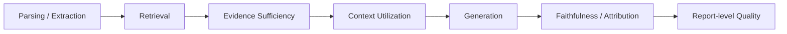

# RAG Benchmark Catalog

> [!NOTE]
> 本表先建立「任務與適用性」層級的 catalog。若 exact size、license、版本號尚未重新比對官方 dataset card / paper，標記為 `pending_verification`，不補猜數字。

| Benchmark / Dataset | Task | Modality | Gold / Evaluation focus | 適合測 | 不適合單獨測 | Status |
|---|---|---|---|---|---|---|
| DocRED | Document-level relation extraction | Text | entities / relations | Cross-sentence RE、document IE | RAG retrieval / generation | verified task |
| SciREX | Scientific IE | Text | entities / relations / document-level tuples | scientific IE、cross-sentence extraction | generic RAG | verified task |
| MAVEN | Event detection / extraction | Text | event types / triggers | event extraction | retrieval quality | verified task |
| HotpotQA | Multi-hop QA | Text | answers + supporting facts | multi-hop retrieval/reasoning | long-form report quality | verified task |
| MultiHop-RAG | Multi-hop RAG QA | Text | multi-hop evidence / answers | multi-document RAG | IE quality | pending exact version |
| BEIR | Heterogeneous IR benchmark | Text | relevance judgments | retriever generalization | generation faithfulness | verified task |
| RAGBench | RAG evaluation dataset | Text | retrieval / answer evaluation | end-to-end RAG evaluation | long-context architecture | pending exact version |
| RAGChecker | Fine-grained RAG evaluation framework | Text | diagnostic metrics | retriever/generator error analysis | dataset-only comparison | pending exact version |
| Comprehensive RAG Benchmark | RAG system benchmark | Text | system-level metrics | RAG configuration comparison | 不應與 Corrective RAG 混稱 CRAG | pending exact identity/version |
| T²-RAGBench | RAG benchmark | Text | retrieval/generation diagnostics | RAG evaluation | exact version count 未核實 | pending verification |
| LongBench | Long-context multitask | Text | task-specific labels | long-context understanding | RAG pipeline quality | verified task |
| L-Eval | Long-context evaluation | Text | task-specific | long-context LLM | retrieval attribution | verified task |
| InfiniteBench | >100K long-context evaluation | Text | task-specific | extreme long context | RAG indexing | verified task |
| RULER | Synthetic long-context diagnostics | Text | retrieval / tracking / aggregation | effective context length | real-world report quality | verified task |
| RAG4Reports 2026 | Multilingual report generation shared task | Text, multilingual | nugget coverage + sentence support / citations | grounded long-form RAG | multimodal professional reports | verified ACL workshop |
| EviReportBench | Evidence-intensive analytical reports | Text + visual evidence | factual accuracy、coverage、image recall | evidence-tracked report generation | pure retriever benchmark | verified Findings ACL 2026 |
| AnalystBench | Professional long-form report generation | Multimodal | professional report rubrics | multimodal analytical reports | text-only QA | verified Findings ACL 2026 |
| ReportLogic | Deep-research report logic | Text | macro / expositional / structural logic | report-level auditability | external factual accuracy alone | verified ACL 2026 |

## Evaluation dimensions

- **Retrieval**：Recall@k、MRR、nDCG 等。
- **Evidence Sufficiency**：gold evidence coverage、missing evidence、partial support。
- **Context Utilization**：gold evidence 已在 context 時，模型是否能正確使用。
- **Generation**：answer correctness / task score。
- **Faithfulness**：claim 是否被 evidence entail。
- **Attribution**：citation correctness、completeness、source traceability。
- **Report-level**：coverage、coherence、logic、professional quality、visual integration。

## Oracle / Ablation 原則

要定位 RAG 錯誤，不能只報 end-to-end accuracy：

1. **Oracle Parsing / Extraction**：人工 gold structure / facts，測後段。
2. **Oracle Retrieval**：直接提供 gold evidence，測 context utilization + generation。
3. **Oracle Evidence Set**：提供完整且無 distractor 的 evidence，測 reasoning / writing。
4. **Oracle Generator / Verifier**：固定 gold answer 或 gold claims，測 attribution / verification。
5. **Component ablation**：逐一移除 reranker、graph expansion、decomposition、verification，量測因果貢獻。

## Multimodal 注意事項

若 benchmark 含 image / PDF layout / table，僅跑 text extraction 後的 subset 必須標成 **text-only setting**，不得稱為完整 benchmark reproduction。
