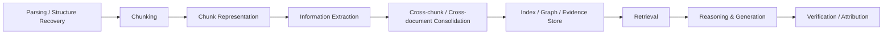

# RAG Research Taxonomy & Domain Map

> [!IMPORTANT] 使用原則
> 本頁是 **research map**，不是宣稱「32 個子題皆為社群公認 taxonomy」。  
> **Survey-backed** 表示已有 survey/review 可作為領域級依據；**Method-backed** 表示有原始方法論文，但尚未找到足夠 survey 來把它提升成獨立 survey domain；**Idea** 表示本專案提出的研究假設或工程化組合，必須放在 `04 - 研究想法與待驗證提案 (Ideas & Hypotheses)`，不得寫成既有共識。

## 一、兩層分類：保留 11 Domains，增加 32 個研究子題

| Stage | 子題 | 證據層級 | 目前歸屬 |
|---|---|---|---|
| Document / Knowledge Construction | 01 Parsing & Structure Recovery | Survey-backed / Method-backed | Domain 04、Domain 11 |
| | 02 Chunking | Survey-backed / Method-backed | Domain 04 |
| | 03 Contextual Chunk Representation | Method-backed | Domain 03 / 04 |
| | 04 Information Extraction | **Survey-backed** | Domain 04 |
| | 05 Information-Preserving Extraction | **Idea** | Ideas 01 |
| | 06 Cross-chunk Knowledge Consolidation | Method-backed / emerging | Domain 04、Ideas 01 |
| | 07 Extraction Quality & Repair | Survey-backed at IE level; RAG coupling emerging | Domain 04、Ideas 01 |
| | 08 Extraction-to-RAG Error Propagation | **Idea / evaluation hypothesis** | Ideas 04 |
| Representation / Indexing | 09 Knowledge Representation | Survey-backed across RAG/GraphRAG/IE | Domain 04 / 05 |
| | 10 Embedding & Representation Learning | Survey-backed | Domain 03 |
| | 11 KG Construction & GraphRAG | **Survey-backed** | Domain 05 |
| | 12 Multi-resolution & Hybrid Indexing | Survey-backed / Method-backed | Domain 05 / 07 |
| | 13 Dynamic Knowledge & Index Maintenance | Emerging | Domain 05 / 06 |
| Query / Retrieval | 14 Query Understanding & Decomposition | Survey-backed | Domain 03 / 09 |
| | 15 Query-Adaptive Retrieval Granularity | Emerging | Domain 03 / 07 |
| | 16 Retrieval Fusion & Evidence Selection | Survey-backed | Domain 03 |
| | 17 Multi-hop & Compositional Retrieval | Survey-backed / Method-backed | Domain 03 / 05 |
| | 18 Adaptive Retrieval & Routing | Survey-backed / Method-backed | Domain 03 |
| | 19 Evidence Sufficiency & Gap Localization | **Idea with adjacent literature** | Ideas 02 |
| Reasoning | 20 Context Utilization | Survey-backed by long-context/context-engineering literature | Domain 01 / 03 |
| | 21 Parametric vs Retrieved Knowledge | Survey-backed under trustworthiness/hallucination | Domain 03 / 10 |
| | 22 Temporal & Conflict-Aware RAG | Emerging | Ideas 03 |
| | 23 Provenance-aware Evidence Resolution | Attribution literature exists; proposed controller remains **Idea** | Ideas 03 |
| | 24 Structured & Tool-augmented Reasoning | Survey-backed / Method-backed | Domain 09 |
| Answer | 25 Grounded Generation & Abstention | Survey-backed | Domain 03 / 10 |
| | 26 Faithfulness & Claim-level Verification | **Survey-backed** | Domain 10 |
| | 27 Citation & Attribution | **Survey-backed** | Domain 10 |
| | 28 Long-form Report Generation | Method-backed; dedicated benchmark literature rapidly growing; evidence-governed delivery remains **Idea** | Domain 08、Idea 05 |
| | 29 Multimodal Document RAG | **Survey-backed** | Domain 11 / future domain |
| Systems | 30 Agentic RAG & Evidence Memory | **Survey-backed** | Domain 06 / 09 |
| | 31 RAG Systems & Cost Optimization | Survey-backed / systems literature | Domain 02 / 10 |
| | 32 RAG Evaluation, Robustness & Error Attribution | **Survey-backed** for evaluation/trustworthiness; end-to-end error attribution and deterministic evidence governance partly **Idea** | Domain 10 / Ideas 04、05 |

## 二、Knowledge Extraction：不得再與 Chunking 混為一談

### Pipeline 邊界

- **Chunking**：決定 retrieval unit 的邊界。
- **Representation**：決定 chunk 如何被編碼、補上下文、嵌入或連結。
- **Extraction**：從文字中產生 entity / relation / event / proposition / structured record。
- **Consolidation**：跨 chunk / document 做 entity resolution、coreference、temporal merge、conflict detection。
- **Retrieval granularity**：query time 決定取 document、chunk、sentence、proposition、graph node 或 evidence object。

### IE 子題

已有 Generative IE surveys 可支持：Entity/Relation Extraction、Event Extraction、Universal IE、LLM-based IE。以下更細的 RAG-specific 問題需分層標示：

| 子題 | 狀態 |
|---|---|
| Entity / Relation Extraction | Survey-backed |
| OpenIE | Established field;需另補 OpenIE survey |
| Universal / Schema-guided IE | Survey-backed |
| Atomic Fact / Proposition Extraction | Method-backed；RAG-specific survey 不足 |
| Event / Temporal Extraction | Survey-backed at IE level |
| Coreference / Entity Resolution | Established field；RAG coupling需額外證據 |
| Negation / Condition / Modality | Established NLP problem；RAG-specific survey不足 |
| Provenance-aware Extraction | Emerging |
| Cross-chunk / Cross-document Extraction | Emerging |
| Extraction Quality / Repair | Survey-backed at IE evaluation level |
| Information-Preserving Extraction | **Project Idea** |
| Extraction-to-RAG Error Propagation | **Project Idea / evaluation program** |

## 三、Knowledge Representation：不是單向演化鏈

Chunk、Sentence、Proposition、Atomic Fact、Qualified Triple、Event、Claim、Evidence Object、Entity Graph、Event Graph、Evidence Graph、Community/Hierarchical Graph 是**不同任務下的表示選擇**，不能寫成「Chunk 必然進化成 Triple，再進化成 Graph」的單一路線。

| Representation | 主要保留資訊 | 常見風險 |
|---|---|---|
| Chunk / Passage | 原文上下文 | retrieval unit 粗、噪音多 |
| Sentence | 局部語法完整性 | 跨句條件與指代可能遺失 |
| Proposition / Atomic Fact | 細粒度可檢索性 | 去脈絡化可能丟失 qualifier |
| Qualified Triple | 結構化關係 + qualifier | schema / extraction error |
| Event | 事件、參與者、時間 | event linking / temporal normalization |
| Claim | 可驗證主張 | claim boundary / decomposition |
| Evidence Object | claim-support + source/span/version | 建置成本高 |
| Entity / Event Graph | 關聯與多跳 | extraction error propagation |
| Community / Hierarchical Graph | global sensemaking | summarization/indexing cost |

## 四、Survey backbone

請先閱讀 [[00 - 導覽與心智圖 (Navigation & MOC)/Survey Papers Index|Survey Papers Index]]。本專案新增內容若沒有 survey/review 支撐，應降級為 Method-backed 或移入 Ideas，而不是直接寫成「survey 結論」。

## 五、與現有 11 Domains 的關係

現階段**不強迫新增 Domain 12–17**。11 個 Domain 保留為第一層導覽；32 個子題作第二層 research map。只有在同時滿足下列條件時才升格為新 Domain：

1. 至少 1 篇可靠 survey/review 或足夠多正式方法論文形成穩定文獻群；
2. 與現有 Domain 有清楚、可解釋的邊界；
3. 有獨立 benchmark / dataset / metrics；
4. 不是本專案單一工程假設。

## 相關
- [[00 - 導覽與心智圖 (Navigation & MOC)/Survey Papers Index|Survey Papers Index]]
- [[00 - 導覽與心智圖 (Navigation & MOC)/RAG Benchmark Catalog|RAG Benchmark Catalog]]
- [[04 - 研究想法與待驗證提案 (Ideas & Hypotheses)/README|Ideas & Hypotheses]]
- [[04 - 研究想法與待驗證提案 (Ideas & Hypotheses)/Idea 05 - Evidence-Governed RAG 系統架構構想 (Delta Pipeline Design)|Idea 05 - Evidence-Governed RAG]]
- [[04 - 研究想法與待驗證提案 (Ideas & Hypotheses)/Idea 06 - 主流 RAG 框架生態與系統定位分析 (Framework Landscape & Positioning)|Idea 06 - Framework Landscape & Positioning]]
