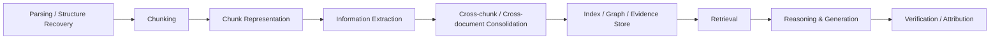

# RAG Research Taxonomy & Domain Map

> [!IMPORTANT] 使用原則
> 本頁是 **research map**，清晰梳理 RAG 全鏈路的 32 個前沿研究子題與知識庫專題之映射關係。  
> **Survey-backed** 表示已有 survey/review 可作為領域級依據；**Method-backed** 表示有原始方法論文，但尚未找到足夠 survey 來把它提升成獨立 survey domain；**Idea** 表示本專案提出的研究假設或工程化組合，必須放在 `04 - 研究想法與待驗證提案 (Ideas & Hypotheses)`，不得寫成既有共識。

## 一、兩層架構：11 個全景綜述領域 + 6 個深度研究專題 + 32 個研究子題

| Stage | 子題 | 證據層級 | 對應專題領域 (Domain / Idea) |
|---|---|---|---|
| Document / Knowledge Construction | 01 Parsing & Structure Recovery | Survey-backed / Method-backed | [[02 - 研究領域專題 (Research Domains)/Domain 04 - 文件切分、結構感知與語意邊界 (Chunking & Contextual Retrieval)\|Domain 04]]、[[02 - 研究領域專題 (Research Domains)/Domain 11 - 長文本處理的前沿研究課題與未解挑戰 (Open Challenges & Frontiers)\|Domain 11]] |
| | 02 Chunking | Survey-backed / Method-backed | [[02 - 研究領域專題 (Research Domains)/Domain 04 - 文件切分、結構感知與語意邊界 (Chunking & Contextual Retrieval)\|Domain 04]] |
| | 03 Contextual Chunk Representation | Method-backed | [[02 - 研究領域專題 (Research Domains)/Domain 03 - 傳統密集檢索、稀疏檢索與重排序 (Dense, Sparse, Reranking)\|Domain 03]]、[[02 - 研究領域專題 (Research Domains)/Domain 04 - 文件切分、結構感知與語意邊界 (Chunking & Contextual Retrieval)\|Domain 04]] |
| | 04 Information Extraction | **Survey-backed** | [[02 - 研究領域專題 (Research Domains)/Domain 12 - Knowledge Extraction & Typed Knowledge\|Domain 12]]、[[02 - 研究領域專題 (Research Domains)/Domain 04 - 文件切分、結構感知與語意邊界 (Chunking & Contextual Retrieval)\|Domain 04]] |
| | 05 Information-Preserving Extraction | Method-backed / **Project Idea** | [[02 - 研究領域專題 (Research Domains)/Domain 13 - Information Preservation & Cross-chunk Consolidation\|Domain 13]]、[[04 - 研究想法與待驗證提案 (Ideas & Hypotheses)/Idea 01 - 結構化資訊抽取與保真機制 (F-R-D-A-P-C-T)\|Idea 01]] |
| | 06 Cross-chunk Knowledge Consolidation | Method-backed / emerging | [[02 - 研究領域專題 (Research Domains)/Domain 13 - Information Preservation & Cross-chunk Consolidation\|Domain 13]]、[[04 - 研究想法與待驗證提案 (Ideas & Hypotheses)/Idea 01 - 結構化資訊抽取與保真機制 (F-R-D-A-P-C-T)\|Idea 01]] |
| | 07 Extraction Quality & Repair | Survey-backed at IE; RAG coupling emerging | [[02 - 研究領域專題 (Research Domains)/Domain 12 - Knowledge Extraction & Typed Knowledge\|Domain 12]]、[[02 - 研究領域專題 (Research Domains)/Domain 13 - Information Preservation & Cross-chunk Consolidation\|Domain 13]] |
| | 08 Extraction-to-RAG Error Propagation | Method-backed / **Evaluation hypothesis** | [[02 - 研究領域專題 (Research Domains)/Domain 13 - Information Preservation & Cross-chunk Consolidation\|Domain 13]]、[[02 - 研究領域專題 (Research Domains)/Domain 17 - RAG Benchmarks & Evaluation Protocols\|Domain 17]]、[[04 - 研究想法與待驗證提案 (Ideas & Hypotheses)/Idea 04 - RAG 錯誤傳遞與容錯架構 (Cascading Failures & Robustness)\|Idea 04]] |
| Representation / Indexing | 09 Knowledge Representation | Survey-backed across RAG/GraphRAG/IE | [[02 - 研究領域專題 (Research Domains)/Domain 04 - 文件切分、結構感知與語意邊界 (Chunking & Contextual Retrieval)\|Domain 04]]、[[02 - 研究領域專題 (Research Domains)/Domain 12 - Knowledge Extraction & Typed Knowledge\|Domain 12]] |
| | 10 Embedding & Representation Learning | Survey-backed | [[02 - 研究領域專題 (Research Domains)/Domain 03 - 傳統密集檢索、稀疏檢索與重排序 (Dense, Sparse, Reranking)\|Domain 03]] |
| | 11 KG Construction & GraphRAG | **Survey-backed** | [[02 - 研究領域專題 (Research Domains)/Domain 05 - 知識圖譜增強與結構化檢索 (GraphRAG, HippoRAG, RAPTOR)\|Domain 05]] |
| | 12 Multi-resolution & Hybrid Indexing | Survey-backed / Method-backed | [[02 - 研究領域專題 (Research Domains)/Domain 05 - 知識圖譜增強與結構化檢索 (GraphRAG, HippoRAG, RAPTOR)\|Domain 05]]、[[02 - 研究領域專題 (Research Domains)/Domain 07 - 向量資料庫與近似最近鄰檢索 (Vector DB, HNSW, IVF)\|Domain 07]] |
| | 13 Dynamic Knowledge & Index Maintenance | Emerging | [[02 - 研究領域專題 (Research Domains)/Domain 05 - 知識圖譜增強與結構化檢索 (GraphRAG, HippoRAG, RAPTOR)\|Domain 05]]、[[02 - 研究領域專題 (Research Domains)/Domain 15 - Temporal Conflict & Provenance-aware RAG\|Domain 15]] |
| Query / Retrieval | 14 Query Understanding & Decomposition | Survey-backed | [[02 - 研究領域專題 (Research Domains)/Domain 03 - 傳統密集檢索、稀疏檢索與重排序 (Dense, Sparse, Reranking)\|Domain 03]]、[[02 - 研究領域專題 (Research Domains)/Domain 09 - 推理增強與結構化思考 (Reasoning LLMs, o1, CoT, System 2)\|Domain 09]] |
| | 15 Query-Adaptive Retrieval Granularity | Emerging | [[02 - 研究領域專題 (Research Domains)/Domain 03 - 傳統密集檢索、稀疏檢索與重排序 (Dense, Sparse, Reranking)\|Domain 03]]、[[02 - 研究領域專題 (Research Domains)/Domain 07 - 向量資料庫與近似最近鄰檢索 (Vector DB, HNSW, IVF)\|Domain 07]]、[[02 - 研究領域專題 (Research Domains)/Domain 14 - Evidence Sufficiency & Adaptive Retrieval\|Domain 14]] |
| | 16 Retrieval Fusion & Evidence Selection | Survey-backed | [[02 - 研究領域專題 (Research Domains)/Domain 03 - 傳統密集檢索、稀疏檢索與重排序 (Dense, Sparse, Reranking)\|Domain 03]]、[[02 - 研究領域專題 (Research Domains)/Domain 14 - Evidence Sufficiency & Adaptive Retrieval\|Domain 14]] |
| | 17 Multi-hop & Compositional Retrieval | Survey-backed / Method-backed | [[02 - 研究領域專題 (Research Domains)/Domain 03 - 傳統密集檢索、稀疏檢索與重排序 (Dense, Sparse, Reranking)\|Domain 03]]、[[02 - 研究領域專題 (Research Domains)/Domain 05 - 知識圖譜增強與結構化檢索 (GraphRAG, HippoRAG, RAPTOR)\|Domain 05]]、[[02 - 研究領域專題 (Research Domains)/Domain 14 - Evidence Sufficiency & Adaptive Retrieval\|Domain 14]] |
| | 18 Adaptive Retrieval & Routing | Survey-backed / Method-backed | [[02 - 研究領域專題 (Research Domains)/Domain 03 - 傳統密集檢索、稀疏檢索與重排序 (Dense, Sparse, Reranking)\|Domain 03]]、[[02 - 研究領域專題 (Research Domains)/Domain 14 - Evidence Sufficiency & Adaptive Retrieval\|Domain 14]] |
| | 19 Evidence Sufficiency & Gap Localization | Method-backed / **Project Idea** | [[02 - 研究領域專題 (Research Domains)/Domain 14 - Evidence Sufficiency & Adaptive Retrieval\|Domain 14]]、[[04 - 研究想法與待驗證提案 (Ideas & Hypotheses)/Idea 02 - 證據充分性與空白控制 (Evidence Gap Controller)\|Idea 02]] |
| Reasoning | 20 Context Utilization | Survey-backed | [[02 - 研究領域專題 (Research Domains)/Domain 01 - Long Context 與序列架構 (Attention, SSM, Ring)\|Domain 01]]、[[02 - 研究領域專題 (Research Domains)/Domain 16 - Context Utilization & Faithfulness\|Domain 16]] |
| | 21 Parametric vs Retrieved Knowledge | Survey-backed under trustworthiness | [[02 - 研究領域專題 (Research Domains)/Domain 10 - 評估基準、幻覺度量與真實性保障 (TruthfulQA, Hallucination, Metrics)\|Domain 10]]、[[02 - 研究領域專題 (Research Domains)/Domain 16 - Context Utilization & Faithfulness\|Domain 16]] |
| | 22 Temporal & Conflict-Aware RAG | Emerging / Survey-backed | [[02 - 研究領域專題 (Research Domains)/Domain 15 - Temporal Conflict & Provenance-aware RAG\|Domain 15]]、[[04 - 研究想法與待驗證提案 (Ideas & Hypotheses)/Idea 03 - 時間衝突與版本演化消歧 (Temporal Conflict Resolver)\|Idea 03]] |
| | 23 Provenance-aware Evidence Resolution | Method-backed; governance remains **Idea** | [[02 - 研究領域專題 (Research Domains)/Domain 15 - Temporal Conflict & Provenance-aware RAG\|Domain 15]]、[[04 - 研究想法與待驗證提案 (Ideas & Hypotheses)/Idea 03 - 時間衝突與版本演化消歧 (Temporal Conflict Resolver)\|Idea 03]] |
| | 24 Structured & Tool-augmented Reasoning | Survey-backed / Method-backed | [[02 - 研究領域專題 (Research Domains)/Domain 09 - 推理增強與結構化思考 (Reasoning LLMs, o1, CoT, System 2)\|Domain 09]] |
| Answer | 25 Grounded Generation & Abstention | Survey-backed | [[02 - 研究領域專題 (Research Domains)/Domain 10 - 評估基準、幻覺度量與真實性保障 (TruthfulQA, Hallucination, Metrics)\|Domain 10]]、[[02 - 研究領域專題 (Research Domains)/Domain 14 - Evidence Sufficiency & Adaptive Retrieval\|Domain 14]]、[[02 - 研究領域專題 (Research Domains)/Domain 16 - Context Utilization & Faithfulness\|Domain 16]] |
| | 26 Faithfulness & Claim-level Verification | **Survey-backed** | [[02 - 研究領域專題 (Research Domains)/Domain 10 - 評估基準、幻覺度量與真實性保障 (TruthfulQA, Hallucination, Metrics)\|Domain 10]]、[[02 - 研究領域專題 (Research Domains)/Domain 16 - Context Utilization & Faithfulness\|Domain 16]] |
| | 27 Citation & Attribution | **Survey-backed** | [[02 - 研究領域專題 (Research Domains)/Domain 10 - 評估基準、幻覺度量與真實性保障 (TruthfulQA, Hallucination, Metrics)\|Domain 10]]、[[02 - 研究領域專題 (Research Domains)/Domain 16 - Context Utilization & Faithfulness\|Domain 16]] |
| | 28 Long-form Report Generation | Method-backed; evidence-governed remains **Idea** | [[02 - 研究領域專題 (Research Domains)/Domain 08 - 長篇生成、結構化寫作與報告合成 (STORM, Long-form Generation)\|Domain 08]]、[[04 - 研究想法與待驗證提案 (Ideas & Hypotheses)/Idea 05 - Evidence-Governed RAG 系統架構構想 (Delta Pipeline Design)\|Idea 05]] |
| | 29 Multimodal Document RAG | **Survey-backed** | [[02 - 研究領域專題 (Research Domains)/Domain 11 - 長文本處理的前沿研究課題與未解挑戰 (Open Challenges & Frontiers)\|Domain 11]] |
| Systems | 30 Agentic RAG & Evidence Memory | **Survey-backed** | [[02 - 研究領域專題 (Research Domains)/Domain 06 - 外部記憶體、層次檢索與狀態持久化 (MemGPT, Episodic Memory)\|Domain 06]]、[[02 - 研究領域專題 (Research Domains)/Domain 09 - 推理增強與結構化思考 (Reasoning LLMs, o1, CoT, System 2)\|Domain 09]] |
| | 31 RAG Systems & Cost Optimization | Survey-backed / systems literature | [[02 - 研究領域專題 (Research Domains)/Domain 02 - 長文本與 RAG 的推論成本與顯存最佳化 (vLLM, Speculative, Chunk-prefill)\|Domain 02]]、[[02 - 研究領域專題 (Research Domains)/Domain 10 - 評估基準、幻覺度量與真實性保障 (TruthfulQA, Hallucination, Metrics)\|Domain 10]] |
| | 32 RAG Evaluation, Robustness & Error Attribution | **Survey-backed**; end-to-end audit partly **Idea** | [[02 - 研究領域專題 (Research Domains)/Domain 10 - 評估基準、幻覺度量與真實性保障 (TruthfulQA, Hallucination, Metrics)\|Domain 10]]、[[02 - 研究領域專題 (Research Domains)/Domain 17 - RAG Benchmarks & Evaluation Protocols\|Domain 17]]、[[04 - 研究想法與待驗證提案 (Ideas & Hypotheses)/Idea 04 - RAG 錯誤傳遞與容錯架構 (Cascading Failures & Robustness)\|Idea 04]] |

## 二、Knowledge Extraction：不得再與 Chunking 混為一談

### Pipeline 邊界

- **Chunking**：決定 retrieval unit 的邊界。
- **Representation**：決定 chunk 如何被編碼、補上下文、嵌入或連結。
- **Extraction**：從文字中產生 entity / relation / event / proposition / structured record。
- **Consolidation**：跨 chunk / document 做 entity resolution、coreference、temporal merge、conflict detection。
- **Retrieval granularity**：query time 決定取 document、chunk、sentence、proposition、graph node 或 evidence object。

### IE 子題

已有 Generative IE surveys 可支持：Entity/Relation Extraction、Event Extraction、Universal IE、LLM-based IE。以下更細的 RAG-specific 問題需分層標示：

| 子題 | 狀態 | 專題對應 |
|---|---|---|
| Entity / Relation Extraction | Survey-backed | [[02 - 研究領域專題 (Research Domains)/Domain 12 - Knowledge Extraction & Typed Knowledge\|Domain 12]] |
| OpenIE | Established field; 需另補 OpenIE survey | [[02 - 研究領域專題 (Research Domains)/Domain 12 - Knowledge Extraction & Typed Knowledge\|Domain 12]] |
| Universal / Schema-guided IE | Survey-backed | [[02 - 研究領域專題 (Research Domains)/Domain 12 - Knowledge Extraction & Typed Knowledge\|Domain 12]] |
| Atomic Fact / Proposition Extraction | Method-backed；RAG-specific survey 不足 | [[02 - 研究領域專題 (Research Domains)/Domain 12 - Knowledge Extraction & Typed Knowledge\|Domain 12]]、[[02 - 研究領域專題 (Research Domains)/Domain 13 - Information Preservation & Cross-chunk Consolidation\|Domain 13]] |
| Event / Temporal Extraction | Survey-backed at IE level | [[02 - 研究領域專題 (Research Domains)/Domain 12 - Knowledge Extraction & Typed Knowledge\|Domain 12]]、[[02 - 研究領域專題 (Research Domains)/Domain 15 - Temporal Conflict & Provenance-aware RAG\|Domain 15]] |
| Coreference / Entity Resolution | Established field；RAG coupling 需額外證據 | [[02 - 研究領域專題 (Research Domains)/Domain 13 - Information Preservation & Cross-chunk Consolidation\|Domain 13]] |
| Negation / Condition / Modality | Established NLP problem；RAG-specific survey 不足 | [[02 - 研究領域專題 (Research Domains)/Domain 13 - Information Preservation & Cross-chunk Consolidation\|Domain 13]] |
| Provenance-aware Extraction | Emerging | [[02 - 研究領域專題 (Research Domains)/Domain 15 - Temporal Conflict & Provenance-aware RAG\|Domain 15]] |
| Cross-chunk / Cross-document Extraction | Emerging | [[02 - 研究領域專題 (Research Domains)/Domain 13 - Information Preservation & Cross-chunk Consolidation\|Domain 13]] |
| Extraction Quality / Repair | Survey-backed at IE evaluation level | [[02 - 研究領域專題 (Research Domains)/Domain 12 - Knowledge Extraction & Typed Knowledge\|Domain 12]]、[[02 - 研究領域專題 (Research Domains)/Domain 13 - Information Preservation & Cross-chunk Consolidation\|Domain 13]] |
| Information-Preserving Extraction | **Project Idea** | [[04 - 研究想法與待驗證提案 (Ideas & Hypotheses)/Idea 01 - 結構化資訊抽取與保真機制 (F-R-D-A-P-C-T)\|Idea 01]] |
| Extraction-to-RAG Error Propagation | **Project Idea / evaluation program** | [[04 - 研究想法與待驗證提案 (Ideas & Hypotheses)/Idea 04 - RAG 錯誤傳遞與容錯架構 (Cascading Failures & Robustness)\|Idea 04]] |

## 三、Knowledge Representation：不是單向演化鏈

Chunk、Sentence、Proposition、Atomic Fact、Qualified Triple、Event、Claim、Evidence Object、Entity Graph、Event Graph、Evidence Graph、Community/Hierarchical Graph 是**不同任務下的表示選擇**，不能寫成「Chunk 必然進化成 Triple，再進化成 Graph」的單一路線。

| Representation | 主要保留資訊 | 常見風險 | 建議對應領域 |
|---|---|---|---|
| Chunk / Passage | 原文上下文 | retrieval unit 粗、噪音多 | [[02 - 研究領域專題 (Research Domains)/Domain 04 - 文件切分、結構感知與語意邊界 (Chunking & Contextual Retrieval)\|Domain 04]] |
| Sentence | 局部語法完整性 | 跨句條件與指代可能遺失 | [[02 - 研究領域專題 (Research Domains)/Domain 04 - 文件切分、結構感知與語意邊界 (Chunking & Contextual Retrieval)\|Domain 04]] |
| Proposition / Atomic Fact | 細粒度可檢索性 | 去脈絡化可能丟失 qualifier | [[02 - 研究領域專題 (Research Domains)/Domain 12 - Knowledge Extraction & Typed Knowledge\|Domain 12]]、[[02 - 研究領域專題 (Research Domains)/Domain 13 - Information Preservation & Cross-chunk Consolidation\|Domain 13]] |
| Qualified Triple | 結構化關係 + qualifier | schema / extraction error | [[02 - 研究領域專題 (Research Domains)/Domain 12 - Knowledge Extraction & Typed Knowledge\|Domain 12]] |
| Event | 事件、參與者、時間 | event linking / temporal normalization | [[02 - 研究領域專題 (Research Domains)/Domain 12 - Knowledge Extraction & Typed Knowledge\|Domain 12]]、[[02 - 研究領域專題 (Research Domains)/Domain 15 - Temporal Conflict & Provenance-aware RAG\|Domain 15]] |
| Claim | 可驗證主張 | claim boundary / decomposition | [[02 - 研究領域專題 (Research Domains)/Domain 16 - Context Utilization & Faithfulness\|Domain 16]] |
| Evidence Object | claim-support + source/span/version | 建置成本高 | [[02 - 研究領域專題 (Research Domains)/Domain 14 - Evidence Sufficiency & Adaptive Retrieval\|Domain 14]]、[[04 - 研究想法與待驗證提案 (Ideas & Hypotheses)/Idea 05 - Evidence-Governed RAG 系統架構構想 (Delta Pipeline Design)\|Idea 05]] |
| Entity / Event Graph | 關聯與多跳 | extraction error propagation | [[02 - 研究領域專題 (Research Domains)/Domain 05 - 知識圖譜增強與結構化檢索 (GraphRAG, HippoRAG, RAPTOR)\|Domain 05]] |
| Community / Hierarchical Graph | global sensemaking | summarization/indexing cost | [[02 - 研究領域專題 (Research Domains)/Domain 05 - 知識圖譜增強與結構化檢索 (GraphRAG, HippoRAG, RAPTOR)\|Domain 05]] |

## 四、Survey Backbone 與引用規範

請先閱讀 [[00 - 導覽與心智圖 (Navigation & MOC)/Survey Papers Index|Survey Papers Index]]。本專案新增內容若沒有 survey/review 支撐，應降級為 Method-backed 或移入 Ideas，而不是直接寫成「survey 結論」。

## 五、雙層架構：11 個全景綜述領域 (Overview Domains) 與 6 個深度研究專題 (Deep Research Domains)

本知識庫現已完成標準雙層領域劃分：

1. **第一層：全景綜述領域 (Domains 01–11)**  
   提供學術歷史演進、主流範式與系統架構之全景脈絡：
   - [[02 - 研究領域專題 (Research Domains)/Domain 01 - Long Context 與序列架構 (Attention, SSM, Ring)|Domain 01 - Long Context 與序列架構]]
   - [[02 - 研究領域專題 (Research Domains)/Domain 02 - 長文本與 RAG 的推論成本與顯存最佳化 (vLLM, Speculative, Chunk-prefill)|Domain 02 - 推論成本與顯存最佳化]]
   - [[02 - 研究領域專題 (Research Domains)/Domain 03 - 傳統密集檢索、稀疏檢索與重排序 (Dense, Sparse, Reranking)|Domain 03 - 檢索與重排序]]
   - [[02 - 研究領域專題 (Research Domains)/Domain 04 - 文件切分、結構感知與語意邊界 (Chunking & Contextual Retrieval)|Domain 04 - 文件切分與語意邊界]]
   - [[02 - 研究領域專題 (Research Domains)/Domain 05 - 知識圖譜增強與結構化檢索 (GraphRAG, HippoRAG, RAPTOR)|Domain 05 - 知識圖譜與結構化檢索]]
   - [[02 - 研究領域專題 (Research Domains)/Domain 06 - 外部記憶體、層次檢索與狀態持久化 (MemGPT, Episodic Memory)|Domain 06 - 外部記憶體與層次檢索]]
   - [[02 - 研究領域專題 (Research Domains)/Domain 07 - 向量資料庫與近似最近鄰檢索 (Vector DB, HNSW, IVF)|Domain 07 - 向量資料庫與 ANN]]
   - [[02 - 研究領域專題 (Research Domains)/Domain 08 - 長篇生成、結構化寫作與報告合成 (STORM, Long-form Generation)|Domain 08 - 長篇生成與結構化寫作]]
   - [[02 - 研究領域專題 (Research Domains)/Domain 09 - 推理增強與結構化思考 (Reasoning LLMs, o1, CoT, System 2)|Domain 09 - 推理增強與結構化思考]]
   - [[02 - 研究領域專題 (Research Domains)/Domain 10 - 評估基準、幻覺度量與真實性保障 (TruthfulQA, Hallucination, Metrics)|Domain 10 - 評估基準與幻覺度量]]
   - [[02 - 研究領域專題 (Research Domains)/Domain 11 - 長文本處理的前沿研究課題與未解挑戰 (Open Challenges & Frontiers)|Domain 11 - 前沿課題與未解挑戰]]

2. **第二層：深度研究專題 (Domains 12–17)**  
   針對深水區關鍵技術瓶頸進行可反駁、具體實驗對比之深度剖析：
   - [[02 - 研究領域專題 (Research Domains)/Domain 12 - Knowledge Extraction & Typed Knowledge|Domain 12 - 知識抽取與形態化知識]]
   - [[02 - 研究領域專題 (Research Domains)/Domain 13 - Information Preservation & Cross-chunk Consolidation|Domain 13 - 跨區塊資訊保真與整合]]
   - [[02 - 研究領域專題 (Research Domains)/Domain 14 - Evidence Sufficiency & Adaptive Retrieval|Domain 14 - 證據充分性與自適應檢索]]
   - [[02 - 研究領域專題 (Research Domains)/Domain 15 - Temporal Conflict & Provenance-aware RAG|Domain 15 - 時間衝突與來源追溯]]
   - [[02 - 研究領域專題 (Research Domains)/Domain 16 - Context Utilization & Faithfulness|Domain 16 - 上下文利用與真實性]]
   - [[02 - 研究領域專題 (Research Domains)/Domain 17 - RAG Benchmarks & Evaluation Protocols|Domain 17 - 評測基準與評估協議]]

3. **研究假設與待驗證草案 (Ideas & Hypotheses)**  
   嚴格收納未形成文獻共識之專利級原創架構與評測假說，避免混入 Survey 結論。

## 相關導覽
- [[00 - 導覽與心智圖 (Navigation & MOC)/Home (主目錄與知識庫導覽)|Home - 主目錄與導覽]]
- [[00 - 導覽與心智圖 (Navigation & MOC)/LLM 超長文件處理心智圖 (MOC)|LLM 全景心智圖 (MOC)]]
- [[00 - 導覽與心智圖 (Navigation & MOC)/Survey Papers Index|Survey Papers Index]]
- [[00 - 導覽與心智圖 (Navigation & MOC)/RAG Benchmark Catalog|RAG Benchmark Catalog]]
- [[04 - 研究想法與待驗證提案 (Ideas & Hypotheses)/README|Ideas & Hypotheses]]
- [[04 - 研究想法與待驗證提案 (Ideas & Hypotheses)/Idea 05 - Evidence-Governed RAG 系統架構構想 (Delta Pipeline Design)|Idea 05 - Evidence-Governed RAG]]
- [[04 - 研究想法與待驗證提案 (Ideas & Hypotheses)/Idea 06 - 主流 RAG 框架生態與系統定位分析 (Framework Landscape & Positioning)|Idea 06 - Framework Landscape & Positioning]]
