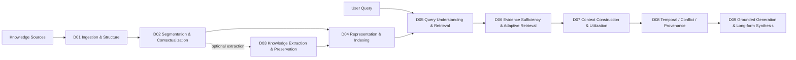
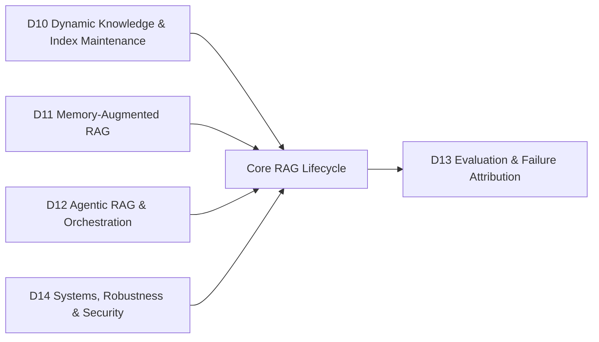

# RAG Research Taxonomy & Domain Map

> [!IMPORTANT]
> 本 repo 目前只有 **14 個正式 RAG Research Domains（D01–D14）**。
> 其他分類只作為 Topic、Paradigm Tag 或 Adjacent Interface，不再使用第二套 Domain 編號。

## 1. Core Lifecycle



D03 是可選支線：raw-chunk RAG 可由 D02 直接進 D04；需要 structured knowledge 時才走 D03。

## 2. Cross-Lifecycle Domains



## 3. The 14 Domains

| ID | Domain | Core question |
|---|---|---|
| D01 | [[02 - 研究領域專題 (Research Domains)/Domain 01 - Document Ingestion & Structure|Document Ingestion & Structure]] | 如何把來源轉成保留結構與 provenance 的 corpus？ |
| D02 | [[02 - 研究領域專題 (Research Domains)/Domain 02 - Segmentation & Contextualization|Segmentation & Contextualization]] | 應切成什麼 retrieval units，且如何保留必要上下文？ |
| D03 | [[02 - 研究領域專題 (Research Domains)/Domain 03 - Knowledge Extraction & Information Preservation|Knowledge Extraction & Information Preservation]] | 要抽哪些 semantic units，並如何避免資訊失真？ |
| D04 | [[02 - 研究領域專題 (Research Domains)/Domain 04 - Knowledge Representation & Indexing|Knowledge Representation & Indexing]] | 知識如何表示、編碼與建立 index？ |
| D05 | [[02 - 研究領域專題 (Research Domains)/Domain 05 - Query Understanding & Retrieval|Query Understanding & Retrieval]] | 如何理解 query，搜尋、融合與 rerank 候選 evidence？ |
| D06 | [[02 - 研究領域專題 (Research Domains)/Domain 06 - Evidence Sufficiency & Adaptive Retrieval|Evidence Sufficiency & Adaptive Retrieval]] | Evidence 是否足夠；若不足，下一步做什麼？ |
| D07 | [[02 - 研究領域專題 (Research Domains)/Domain 07 - Context Construction & Evidence Utilization|Context Construction & Evidence Utilization]] | 如何建構有限 context，並確保模型實際利用 evidence？ |
| D08 | [[02 - 研究領域專題 (Research Domains)/Domain 08 - Temporal Conflict & Provenance Resolution|Temporal Conflict & Provenance Resolution]] | 如何處理時間、版本、來源與 evidence conflict？ |
| D09 | [[02 - 研究領域專題 (Research Domains)/Domain 09 - Grounded Generation Attribution & Long-form Synthesis|Grounded Generation, Attribution & Long-form Synthesis]] | 如何產生可驗證、可歸因的答案或長篇報告？ |
| D10 | [[02 - 研究領域專題 (Research Domains)/Domain 10 - Dynamic Knowledge & Index Maintenance|Dynamic Knowledge & Index Maintenance]] | Knowledge base 變動時如何正確更新？ |
| D11 | [[02 - 研究領域專題 (Research Domains)/Domain 11 - Memory-Augmented RAG|Memory-Augmented RAG]] | 如何管理跨 interaction 的 persistent memory？ |
| D12 | [[02 - 研究領域專題 (Research Domains)/Domain 12 - Agentic RAG & Orchestration|Agentic RAG & Orchestration]] | 誰決定下一個 retrieve / tool / verify / generate action？ |
| D13 | [[02 - 研究領域專題 (Research Domains)/Domain 13 - RAG Evaluation & Failure Attribution|RAG Evaluation & Failure Attribution]] | 如何分離 retrieval、evidence、context、generation 的問題來源？ |
| D14 | [[02 - 研究領域專題 (Research Domains)/Domain 14 - RAG Systems, Robustness & Security|RAG Systems, Robustness & Security]] | 如何管理 latency、cost、observability 與 runtime reliability？ |

## 4. Other Axes

- **Level-2 Topics**：Domain 內的細分問題，例如 chunking、reranking、sufficiency、citation。
- **Paradigm Tags**：GraphRAG、Hierarchical RAG、Adaptive RAG、Agentic RAG、Multimodal RAG。
- **Adjacent Interfaces**：Long Context、KV Cache、General Agents、Continual Learning 等與 RAG 高度相關但不屬於 core lifecycle 的研究線。

## 5. Hard Boundaries

```text
Segmentation != Extraction != Representation
Relevance != Sufficiency != Utilization != Faithfulness
Dynamic Index != Persistent Memory
Domain != Paradigm Tag != Benchmark
```

## Navigation

- [[02 - 研究領域專題 (Research Domains)/README|Research Domains]]
- [[00 - 導覽與心智圖 (Navigation & MOC)/RAG Paradigm Tags|RAG Paradigm Tags]]
- [[00 - 導覽與心智圖 (Navigation & MOC)/RAG Adjacent Interfaces|RAG Adjacent Interfaces]]
- [[00 - 導覽與心智圖 (Navigation & MOC)/RAG Benchmark Catalog|RAG Benchmark Catalog]]
