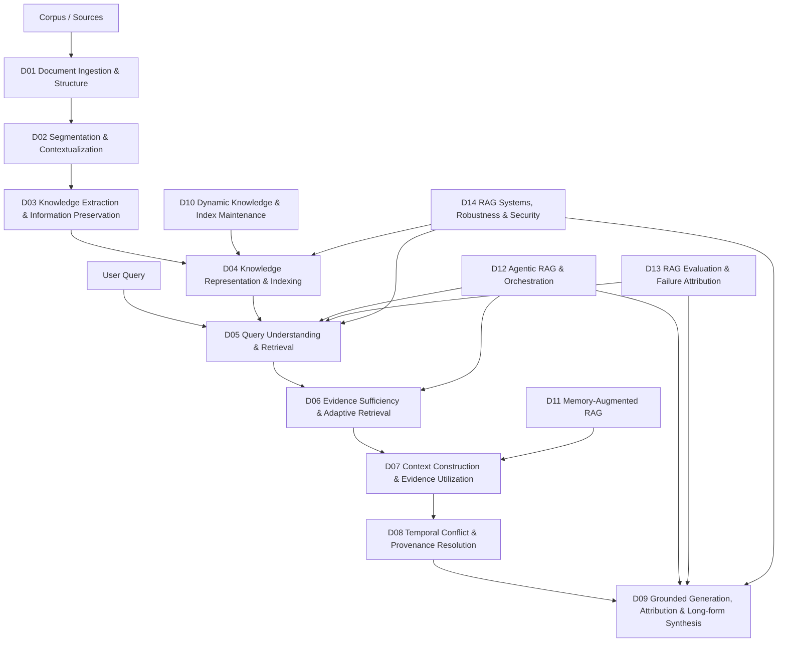

# RAG Research Taxonomy & Domain Map — Canonical Taxonomy v2

> [!IMPORTANT]
> 這是 **RAG-survey 的研究組織 taxonomy**，不是宣稱學界存在唯一標準分類。
> 主軸採 **lifecycle / research problem**；GraphRAG、Hierarchical RAG、Adaptive RAG、Agentic RAG、Multimodal RAG 等改為 orthogonal paradigms/tags。

## Canonical Lifecycle



## 14 Canonical Domains

| ID | Domain | Core Question |
|---|---|---|
| D01 | [[02 - 研究領域專題 (Research Domains)/Canonical RAG Domains/Domain 01 - Document Ingestion & Structure|Document Ingestion & Structure]] | 原始文件如何轉換成保留結構、版面、來源與 metadata 的可檢索 corpus？ |
| D02 | [[02 - 研究領域專題 (Research Domains)/Canonical RAG Domains/Domain 02 - Segmentation & Contextualization|Segmentation & Contextualization]] | 文件應被切成什麼 retrieval units，且切分後如何保留足夠上下文？ |
| D03 | [[02 - 研究領域專題 (Research Domains)/Canonical RAG Domains/Domain 03 - Knowledge Extraction & Information Preservation|Knowledge Extraction & Information Preservation]] | 從原始文字抽取哪些知識單位，以及如何避免抽取與跨 chunk 整合時遺失關鍵語義？ |
| D04 | [[02 - 研究領域專題 (Research Domains)/Canonical RAG Domains/Domain 04 - Knowledge Representation & Indexing|Knowledge Representation & Indexing]] | 知識應以何種表示與索引結構保存，才能支援不同 retrieval 與 reasoning 需求？ |
| D05 | [[02 - 研究領域專題 (Research Domains)/Canonical RAG Domains/Domain 05 - Query Understanding & Retrieval|Query Understanding & Retrieval]] | 如何理解 query，並從一個或多個 index 中找出、排序與組合最相關的候選 evidence？ |
| D06 | [[02 - 研究領域專題 (Research Domains)/Canonical RAG Domains/Domain 06 - Evidence Sufficiency & Adaptive Retrieval|Evidence Sufficiency & Adaptive Retrieval]] | 目前 evidence 是否足以回答問題；若不足，缺什麼、下一個 retrieval action 是什麼、何時停止？ |
| D07 | [[02 - 研究領域專題 (Research Domains)/Canonical RAG Domains/Domain 07 - Context Construction & Evidence Utilization|Context Construction & Evidence Utilization]] | 候選 evidence 找到後，如何建構有限 context，並確保模型實際使用關鍵證據？ |
| D08 | [[02 - 研究領域專題 (Research Domains)/Canonical RAG Domains/Domain 08 - Temporal Conflict & Provenance Resolution|Temporal Conflict & Provenance Resolution]] | 當來源、時間、版本或條件不同而造成 evidence 衝突時，如何判斷哪些證據適用於當前 query？ |
| D09 | [[02 - 研究領域專題 (Research Domains)/Canonical RAG Domains/Domain 09 - Grounded Generation Attribution & Long-form Synthesis|Grounded Generation Attribution & Long-form Synthesis]] | 如何由 evidence 產生可驗證答案或長篇報告，並讓重要 claim 可追溯、可引用、可驗證？ |
| D10 | [[02 - 研究領域專題 (Research Domains)/Canonical RAG Domains/Domain 10 - Dynamic Knowledge & Index Maintenance|Dynamic Knowledge & Index Maintenance]] | 外部知識新增、修改、刪除或失效時，RAG index 如何正確且低成本地維護？ |
| D11 | [[02 - 研究領域專題 (Research Domains)/Canonical RAG Domains/Domain 11 - Memory-Augmented RAG|Memory-Augmented RAG]] | 如何跨 interaction 保存、檢索、合併、更新與遺忘 persistent state，而不只是查詢 corpus？ |
| D12 | [[02 - 研究領域專題 (Research Domains)/Canonical RAG Domains/Domain 12 - Agentic RAG & Orchestration|Agentic RAG & Orchestration]] | 系統如何根據 state 自主選擇下一個 RAG action、工具、資料源或子任務？ |
| D13 | [[02 - 研究領域專題 (Research Domains)/Canonical RAG Domains/Domain 13 - RAG Evaluation & Failure Attribution|RAG Evaluation & Failure Attribution]] | 如何分離評估 retrieval、evidence、generation 與 end-to-end failure，並定位錯誤真正發生在哪一層？ |
| D14 | [[02 - 研究領域專題 (Research Domains)/Canonical RAG Domains/Domain 14 - RAG Systems Robustness & Security|RAG Systems Robustness & Security]] | 如何在真實部署下控制成本、延遲、可觀測性與攻擊面，並維持 RAG 可靠性？ |

## Domain vs Paradigm vs Task vs Interface

| 類型 | 例子 | 規則 |
|---|---|---|
| Canonical Domain | Retrieval、Evidence Sufficiency、Context Utilization | D01–D14 |
| Paradigm / Tag | GraphRAG、Hierarchical RAG、Adaptive RAG、Multimodal RAG | [[00 - 導覽與心智圖 (Navigation & MOC)/RAG Paradigm Tags|RAG Paradigm Tags]] |
| Output Task | QA、Long-form Report、Research Synthesis | 放到主要 lifecycle Domain + task tag |
| Adjacent Interface | Long Context、KV Cache、general inference optimization、model editing | 不再作 RAG core Domain |
| Project Idea | Evidence Gap Controller、F/R/D/A/P/C/T、Evidence-Governed RAG | `04 - 研究想法與待驗證提案` |

## Critical Boundaries

### Segmentation ≠ Extraction ≠ Representation
```text
Document -> Segmentation -> Retrieval Units
         -> Extraction   -> Entities / Relations / Events / Propositions / Claims
         -> Representation & Indexing -> Vector / Lexical / Graph / Hierarchical / Hybrid Index
```

### Relevance ≠ Sufficiency ≠ Utilization ≠ Faithfulness
```text
Relevant evidence retrieved
!= enough evidence collected
!= model actually used the evidence
!= generated claims are supported
```

### Dynamic Index ≠ Memory
D10 管理 external knowledge base / index state；D11 管理跨 interaction 的 persistent state。

## Legacy 17-domain Mapping

| Legacy | New home |
|---|---|
| 01 Long Context | Adjacent Interface + D07 |
| 02 Compression | D07 + D14 + Adjacent Interface |
| 03 Advanced RAG | D05 + D06 + D12 |
| 04 Chunking & KE | D02 + D03 |
| 05 GraphRAG | D03/D04/D05 + `graph_rag` |
| 06 Memory | D11 |
| 07 Hierarchical Reasoning | D04/D05 + `hierarchical_rag` |
| 08 Long-form Generation | D09 |
| 09 Agentic Workflow | D12 |
| 10 Evaluation/System/Safety | D13 + D14 |
| 11 Research Roadmap | Ideas & Hypotheses |
| 12 Knowledge Extraction | D03 |
| 13 Information Preservation | D03 + D13 |
| 14 Evidence Sufficiency | D06 |
| 15 Temporal/Conflict/Provenance | D08 |
| 16 Context Utilization/Faithfulness | D07 + D09 |
| 17 Benchmarks/Evaluation | D13 |

## Migration Policy
1. Canonical D01–D14 先建立。
2. Legacy Domain 01–17 暫不刪除。
3. 逐篇更新 literature note 的 `primary_domain`、`secondary_domains`、`paradigm_tags`。
4. Home / MOC / Benchmark Catalog / Survey Index 逐步改指 canonical pages。
5. backlinks 歸零後才 archive/delete legacy pages。

## Survey Design Choice
現有 RAG surveys 常用 component 或 pre-retrieval → retrieval → post-retrieval → generation 類 lifecycle 組織；本 repo 再細化 evidence sufficiency、provenance、memory、systems 與 failure attribution，目的在提高研究診斷性，而非宣稱此 14-domain 切法是 universal standard。

## Related
- [[00 - 導覽與心智圖 (Navigation & MOC)/RAG Paradigm Tags|RAG Paradigm Tags]]
- [[00 - 導覽與心智圖 (Navigation & MOC)/Canonical RAG Domain Migration Map|Migration Map]]
- [[00 - 導覽與心智圖 (Navigation & MOC)/RAG Benchmark Catalog|RAG Benchmark Catalog]]
- [[04 - 研究想法與待驗證提案 (Ideas & Hypotheses)/README|Ideas & Hypotheses]]
