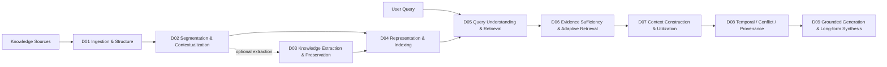
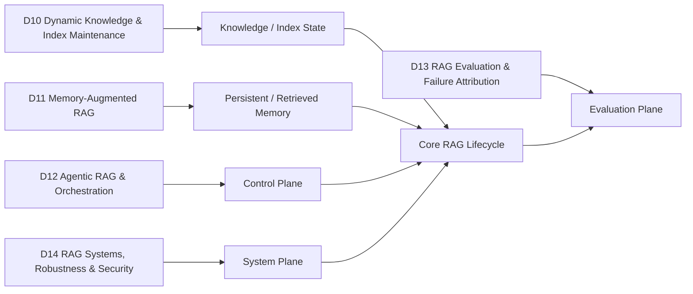

# RAG Research Taxonomy & Domain Map

> [!IMPORTANT]
> 本 repo 的正式分類只有 **14 個 RAG Research Domains（D01–D14）**。
> Domain 代表「研究問題發生在哪個 RAG lifecycle / system layer」；GraphRAG、Hierarchical RAG、Agentic RAG 等屬於跨 Domain 的 paradigm tags；Long Context、KV Cache、General Agents 等放在 Adjacent Interfaces。

## 1. Core Lifecycle

**重點**：D03 不是所有 RAG 的必經步驟。Raw-chunk RAG 可以直接由 D02 進 D04；需要 entity / relation / event / proposition / graph knowledge 時才走 D03。

## 2. Cross-Lifecycle Domains

## 3. 14 Research Domains

| ID | Domain | Core Question |
|---|---|---|
| D01 | [[02 - 研究領域專題 (Research Domains)/Canonical RAG Domains/Domain 01 - Document Ingestion & Structure|Document Ingestion & Structure]] | 如何把 PDF / Web / DB / Tables / Images 轉成保留結構與來源資訊的 corpus？ |
| D02 | [[02 - 研究領域專題 (Research Domains)/Canonical RAG Domains/Domain 02 - Segmentation & Contextualization|Segmentation & Contextualization]] | 應切成什麼 retrieval units，且如何保留必要上下文？ |
| D03 | [[02 - 研究領域專題 (Research Domains)/Canonical RAG Domains/Domain 03 - Knowledge Extraction & Information Preservation|Knowledge Extraction & Information Preservation]] | 要抽取哪些 semantic units，且如何避免 qualifier / cross-chunk information loss？ |
| D04 | [[02 - 研究領域專題 (Research Domains)/Canonical RAG Domains/Domain 04 - Knowledge Representation & Indexing|Knowledge Representation & Indexing]] | 知識如何表示、編碼與建立 vector / lexical / graph / hierarchical / hybrid index？ |
| D05 | [[02 - 研究領域專題 (Research Domains)/Canonical RAG Domains/Domain 05 - Query Understanding & Retrieval|Query Understanding & Retrieval]] | 如何理解 query，搜尋、融合與 rerank 候選 evidence？ |
| D06 | [[02 - 研究領域專題 (Research Domains)/Canonical RAG Domains/Domain 06 - Evidence Sufficiency & Adaptive Retrieval|Evidence Sufficiency & Adaptive Retrieval]] | Evidence 是否足夠；若不足，缺什麼、是否 retry / stop / abstain？ |
| D07 | [[02 - 研究領域專題 (Research Domains)/Canonical RAG Domains/Domain 07 - Context Construction & Evidence Utilization|Context Construction & Evidence Utilization]] | 如何把 evidence 組成有限 context，並確保模型實際利用？ |
| D08 | [[02 - 研究領域專題 (Research Domains)/Canonical RAG Domains/Domain 08 - Temporal Conflict & Provenance Resolution|Temporal Conflict & Provenance Resolution]] | 如何處理時間、版本、來源權威與 evidence conflict？ |
| D09 | [[02 - 研究領域專題 (Research Domains)/Canonical RAG Domains/Domain 09 - Grounded Generation Attribution & Long-form Synthesis|Grounded Generation, Attribution & Long-form Synthesis]] | 如何產生可驗證、可歸因、可引用的答案或長篇報告？ |
| D10 | [[02 - 研究領域專題 (Research Domains)/Canonical RAG Domains/Domain 10 - Dynamic Knowledge & Index Maintenance|Dynamic Knowledge & Index Maintenance]] | Knowledge base 變動時如何增量更新並避免 stale index？ |
| D11 | [[02 - 研究領域專題 (Research Domains)/Canonical RAG Domains/Domain 11 - Memory-Augmented RAG|Memory-Augmented RAG]] | 如何保存、檢索、整合與淘汰跨 interaction 的 persistent memory？ |
| D12 | [[02 - 研究領域專題 (Research Domains)/Canonical RAG Domains/Domain 12 - Agentic RAG & Orchestration|Agentic RAG & Orchestration]] | 誰決定下一個 retrieve / tool / verify / generate action？ |
| D13 | [[02 - 研究領域專題 (Research Domains)/Canonical RAG Domains/Domain 13 - RAG Evaluation & Failure Attribution|RAG Evaluation & Failure Attribution]] | 如何分離 retrieval、evidence、context、generation 的失敗來源？ |
| D14 | [[02 - 研究領域專題 (Research Domains)/Canonical RAG Domains/Domain 14 - RAG Systems Robustness & Security|RAG Systems, Robustness & Security]] | 如何處理 latency、cost、observability、privacy、poisoning、prompt injection 與 robustness？ |

## 4. Level-2 Topics

Level-2 topic 是 Domain 內部研究子題，**不另外編號成新的 Domain**。

| Domain | Representative Topics |
|---|---|
| D01 | parsing, OCR, layout, table/chart structure, source anchoring |
| D02 | fixed/semantic/structure-aware chunking, parent-child, proposition units, late/contextual chunking |
| D03 | entity/relation/event/proposition/claim extraction, coreference, qualifiers, consolidation, extraction repair |
| D04 | dense/sparse/late interaction, graph, hierarchy, multi-resolution, ANN, hybrid index |
| D05 | query rewrite, expansion, HyDE, decomposition, routing, dense/sparse/graph retrieval, fusion, reranking, multi-hop |
| D06 | retrieval necessity, evidence coverage, sufficiency, gap localization, retry/stop/abstention |
| D07 | filtering, dedup, context packing, compression, ordering, token budget, lost-in-the-middle, utilization |
| D08 | valid time, version, provenance, authority, conflict detection/resolution |
| D09 | grounded generation, claim verification, citation, attribution, long-form planning/synthesis, abstention |
| D10 | freshness, staleness, incremental indexing, graph/index refresh |
| D11 | episodic/semantic memory, write/read, consolidation, forgetting |
| D12 | planning, controller, tool use, routing, multi-agent orchestration |
| D13 | benchmark/dataset/metric separation, oracle evaluation, failure attribution, meta-evaluation |
| D14 | latency, throughput, cost, cache, observability, access control, poisoning, injection, adversarial robustness |

## 5. Orthogonal Paradigms

GraphRAG、Hierarchical RAG、Adaptive RAG、Corrective RAG、Agentic RAG、Multimodal RAG、Temporal RAG、Long-form RAG 等不是額外 Domain，而是跨 Domain 的方法族。

→ [[00 - 導覽與心智圖 (Navigation & MOC)/RAG Paradigm Tags|RAG Paradigm Tags]]

## 6. Adjacent Interfaces

Long Context、KV Cache / inference optimization、tokenization / general model architecture、general agents、continual learning / model editing 與 RAG 有重要交界，但不是 RAG core Domain。

→ [[00 - 導覽與心智圖 (Navigation & MOC)/RAG Adjacent Interfaces|RAG Adjacent Interfaces]]

## 7. Classification Rules

1. Paper 先判斷 **Primary Domain**，再列 Secondary Domains。
2. GraphRAG / Hierarchical RAG 等用 `paradigm_tags` 表示。
3. Adjacent work 使用 `taxonomy_home: Axx`，不要硬塞進 D01–D14。
4. Chunking ≠ Extraction ≠ Representation。
5. Relevance ≠ Sufficiency ≠ Utilization ≠ Faithfulness。
6. Dynamic Index ≠ Persistent Memory。
7. Benchmark ≠ Dataset ≠ Metric ≠ Evaluation Framework。
8. Project-specific proposal 放在 `04 - 研究想法與待驗證提案`，不可寫成 survey-established fact。

## Navigation

- [[00 - 導覽與心智圖 (Navigation & MOC)/LLM 超長文件處理心智圖 (MOC)|RAG System Maps]]
- [[00 - 導覽與心智圖 (Navigation & MOC)/RAG Paradigm Tags|Paradigm Tags]]
- [[00 - 導覽與心智圖 (Navigation & MOC)/RAG Adjacent Interfaces|Adjacent Interfaces]]
- [[00 - 導覽與心智圖 (Navigation & MOC)/RAG Benchmark Catalog|Benchmark Catalog]]
- [[00 - 導覽與心智圖 (Navigation & MOC)/Survey Papers Index|Survey Papers Index]]
