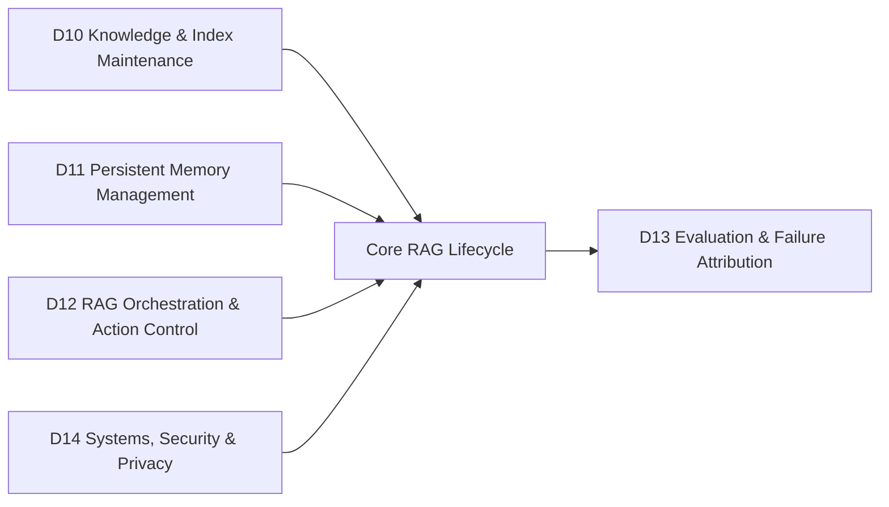

# RAG Research Taxonomy & Domain Map

> [!IMPORTANT]
> 本 repo 只使用 **14 個正式 RAG Research Domains（D01–D14）**。
> Topic、Paradigm Tag、Adjacent Interface 都不是額外 Domain。
>
> **D01–D14 是 operational taxonomy，不是宣稱為某篇 survey 的既有標準。** 主流 survey 通常使用更粗的 indexing / retrieval / post-retrieval / generation / evaluation 等軸；本 repo 為了可實驗、可歸因而再細分。

## 0. Survey-Aligned Simple View

對外只需要記住 6 個 supergroups；D01–D14 是其內部細分，不另建立第三套編號：

| Supergroup | Domains | 對應主流 survey 常見概念 |
|---|---|---|
| **Source & Knowledge Construction** | D01–D04 | parsing / chunking / extraction / representation / indexing |
| **Retrieval & Evidence Control** | D05–D08 | query / retrieval / reranking / adaptive retrieval / post-retrieval validation |
| **Grounded Generation** | D09 | evidence-grounded generation / attribution / long-form synthesis |
| **Stateful & Agentic RAG** | D10–D12 | dynamic knowledge / memory / iterative-agentic orchestration |
| **Evaluation** | D13 | retrieval + generation evaluation / diagnosis |
| **Deployment & Trust** | D14 | serving efficiency / security / privacy / access control |

這 6 組只是 navigation layer；正式 paper metadata 仍只使用 D01–D14。

Huang et al. 的流程視角為 **Pre-Retrieval → Retrieval → Post-Retrieval → Generation**（2024 v2, §2.2、Figure 3）。本 repo 依研究問題再分領域，因此同一階段可以跨多個 Domain；例如 query manipulation 位於 pre-retrieval，歸 D05；post-retrieval 的 reranking 仍歸 D05。這是本 repo 的映射，完整章節對照與 coverage 限制集中在 [[00 - 導覽與心智圖 (Navigation & MOC)/Survey Papers Index|Survey Papers Index]]。[Huang & Huang (2024/08), §2.2、Figure 3](https://arxiv.org/html/2404.10981v2)

## 1. Core Lifecycle


```mermaid
flowchart LR
    SRC["Knowledge Sources"] --> D01["D01 Document Parsing & Structure Recovery"]
    D01 --> D02["D02 Segmentation & Retrieval Granularity"]

    D02 --> D04["D04 Representation & Indexing"]
    D02 -. "optional extraction" .-> D03["D03 Knowledge Extraction & Consolidation"]
    D03 --> D04

    Q["User Query"] --> D05["D05 Query Understanding & Retrieval"]
    D04 --> D05

    D05 --> D06["D06 Evidence Sufficiency & Retrieval Control"]
    D05 -. "when time / source / version matters" .-> D08["D08 Evidence Reconciliation"]
    D08 --> D06

    D06 --> D07["D07 Context Construction & Utilization"]
    D07 --> D09["D09 Grounded Generation & Long-form Synthesis"]

    D06 -. "gap / retry" .-> D05
    D09 -. "unsupported / incomplete" .-> D06
```

D03 與 D08 都是條件式路徑：
- raw-chunk RAG 可由 D02 直接進 D04；
- 只有需要 structured knowledge 時才走 D03；
- 只有 time / version / source conflict 需要顯式處理時才走 D08；source authority / credibility arbitration 是較薄的可選子題。

## 2. Cross-Lifecycle Domains


```mermaid
flowchart LR
    D10["D10 Knowledge & Index Maintenance"] --> CORE["Core RAG Lifecycle"]
    D11["D11 Persistent Memory Management"] --> CORE
    D12["D12 RAG Orchestration & Action Control"] --> CORE
    CORE --> D13["D13 Evaluation & Failure Attribution"]
    D14["D14 Systems, Security & Privacy"] --> CORE
```

## 3. The 14 Domains

| ID | Domain | Core question |
|---|---|---|
| D01 | [[02 - 研究領域專題 (Research Domains)/Domain 01 - Document Ingestion & Structure|Document Parsing & Structure Recovery]] | 如何把來源轉成保留結構與 provenance 的 corpus？ |
| D02 | [[02 - 研究領域專題 (Research Domains)/Domain 02 - Segmentation & Contextualization|Segmentation & Retrieval Granularity]] | 應切成什麼 retrieval units，且如何保留必要上下文？ |
| D03 | [[02 - 研究領域專題 (Research Domains)/Domain 03 - Knowledge Extraction & Information Preservation|Knowledge Extraction & Consolidation]] | 要抽哪些 semantic units，並如何避免資訊失真？ |
| D04 | [[02 - 研究領域專題 (Research Domains)/Domain 04 - Knowledge Representation & Indexing|Representation & Indexing]] | 知識如何表示、編碼與建立 index？ |
| D05 | [[02 - 研究領域專題 (Research Domains)/Domain 05 - Query Understanding & Retrieval|Query Understanding & Retrieval]] | 如何理解 query，搜尋、融合與 rerank 候選 evidence？ |
| D06 | [[02 - 研究領域專題 (Research Domains)/Domain 06 - Evidence Sufficiency & Adaptive Retrieval|Evidence Sufficiency & Retrieval Control]] | 何時 retrieve/retry/stop；以及 evidence set 是否足夠？ |
| D07 | [[02 - 研究領域專題 (Research Domains)/Domain 07 - Context Construction & Evidence Utilization|Context Construction & Utilization]] | 如何建構有限 context，並確保模型實際利用 evidence？ |
| D08 | [[02 - 研究領域專題 (Research Domains)/Domain 08 - Temporal Conflict & Provenance Resolution|Evidence Reconciliation]] | 如何處理 freshness、時間/版本與互相衝突的 evidence？ |
| D09 | [[02 - 研究領域專題 (Research Domains)/Domain 09 - Grounded Generation Attribution & Long-form Synthesis|Grounded Generation & Long-form Synthesis]] | 如何產生可驗證、可歸因的答案或長篇報告？ |
| D10 | [[02 - 研究領域專題 (Research Domains)/Domain 10 - Dynamic Knowledge & Index Maintenance|Knowledge & Index Maintenance]] | Knowledge base 變動時如何正確更新？ |
| D11 | [[02 - 研究領域專題 (Research Domains)/Domain 11 - Memory-Augmented RAG|Persistent Memory Management]] | 如何管理可跨 interaction/task 持續演化的 derived memory？ |
| D12 | [[02 - 研究領域專題 (Research Domains)/Domain 12 - Agentic RAG & Orchestration|RAG Orchestration & Action Control]] | 誰決定下一個 retrieve / tool / verify / generate action？ |
| D13 | [[02 - 研究領域專題 (Research Domains)/Domain 13 - RAG Evaluation & Failure Attribution|Evaluation & Failure Attribution]] | 如何分離 retrieval、evidence、context、generation 的問題來源？ |
| D14 | [[02 - 研究領域專題 (Research Domains)/Domain 14 - RAG Systems, Robustness & Security|RAG Systems, Security & Privacy]] | 如何管理 latency、cost、observability、security、privacy 與 access control？ |

## 4. Other Axes

- **Level-2 Topics**：Domain 內的細分問題，例如 chunking、reranking、sufficiency、citation。
- **Paradigm Tags**：GraphRAG、Hierarchical RAG、Adaptive RAG、Agentic RAG、Multimodal RAG。
- **Adjacent Interfaces**：Long Context、KV Cache、General Agents、Continual Learning 等與 RAG 高度相關但不屬於 core lifecycle 的研究線。

### D01–D06 的操作性分類維度 — 2026-10-02

下表是本 repo 的整理規則；各研究線的來源與待核候選見對應 Domain，不能將這組整理規則當成任何單篇 survey 的原始 taxonomy。

| Domain | 內部分類維度 | 與相鄰 Domain 的分工 |
|---|---|---|
| D01 | layout／reading order／hierarchy；表格偵測、結構與功能角色；公式與視覺元素轉寫 | 恢復來源已有的結構；形成 retrieval units 是 D02，抽取語意關係／事件是 D03 |
| D02 | 邊界策略與可選粒度；indexed unit／retrieved unit／reader-context unit 的關係 | 可選單位的形成是 D02；編碼 D04；query-time 選擇 D05；最終 reader context 的配置 D07 |
| D03 | recognition／coreference／entity linking；event trigger／argument roles／inter-event relations；consolidation 與語意保真 | canonical identity／semantic records 屬 D03；將記錄組成 searchable index 是 D04，query-time 衝突仲裁是 D08 |
| D04 | **unit × encoding × index organization**；單向量／learned sparse／multi-vector；semantic graph／ANN neighbor graph | unit 形成 D02，語意抽取 D03；候選搜尋與 scoring D05；runtime／storage／serving 工程 D14 |
| D05 | query transformation；search／fusion／reranking；training signal × trained module 的 alignment | 搜尋代理文字不能自動當證據；必要性與再檢索控制 D06，有限 context 的建構 D07 |
| D06 | **trigger timing × observed signal × decision**；retrieval control／evidence-set sufficiency／answer-risk calibration | relevance D05；utilization D07；compatibility D08；評測協議與 risk/coverage 計分 D13 |

### Paper assignment rules

1. 以主要研究問題、提出的方法與評估對象選 `primary_domain`；儲存資料夾、論文標題或使用了某模組不足以決定歸類。
2. Method paper 的 `taxonomy_home` 與 `primary_domain` 一致；`secondary_domains` 只記實際重要的交叉貢獻，不能重複 primary。
3. Survey、跨 lifecycle 架構或 adjacent-only paper 可以使用 `taxonomy_home: CROSS`／A01–A05 與 `primary_domain: null`，避免為了統計硬塞某一 Domain。
4. Offline／online／pre-retrieval／post-retrieval 是流程位置，Domain 是研究問題；兩軸可並存，無須互相替代。
5. 摘要已核、全文待查的候選來源應與既有 paper notes 分開呈現；候選不計入 primary-note coverage。

## 5. Hard Boundaries

```text
Segmentation != Extraction != Representation
Relevance != Sufficiency != Utilization != Faithfulness
Dynamic Index != Persistent Memory
Domain != Paradigm Tag != Benchmark
```

補充分工：**ANN neighbor graph != semantic knowledge graph**；**query relevance != evidence-set sufficiency != statistical answer-set coverage**；**停止取證 != 已可回答**。這些是本 repo 分類規則，研究方法與保證條件仍需按各 primary paper 核實。

## Navigation

- [[00 - 導覽與心智圖 (Navigation & MOC)/RAG System Maps|RAG System Maps]]
- [[02 - 研究領域專題 (Research Domains)/README|Research Domains]]
- [[00 - 導覽與心智圖 (Navigation & MOC)/RAG Paradigm Tags|RAG Paradigm Tags]]
- [[00 - 導覽與心智圖 (Navigation & MOC)/RAG Adjacent Interfaces|RAG Adjacent Interfaces]]
- [[00 - 導覽與心智圖 (Navigation & MOC)/RAG Benchmark Catalog|RAG Benchmark Catalog]]

## Phase 1 Closure Status — 2026-09-27

All D01–D14 domains have completed boundary closure. Canonical display names are:

| ID | Canonical domain |
|---|---|
| D01 | Document Parsing & Structure Recovery |
| D02 | Segmentation & Retrieval Granularity |
| D03 | Knowledge Extraction & Consolidation |
| D04 | Representation & Indexing |
| D05 | Query Understanding & Retrieval |
| D06 | Evidence Sufficiency & Retrieval Control |
| D07 | Context Construction & Utilization |
| D08 | Evidence Reconciliation |
| D09 | Grounded Generation & Long-form Synthesis |
| D10 | Knowledge & Index Maintenance |
| D11 | Persistent Memory Management |
| D12 | RAG Orchestration & Action Control |
| D13 | Evaluation & Failure Attribution |
| D14 | RAG Systems, Security & Privacy |

> [!NOTE]
> Existing file paths are intentionally retained during Phase 1. Path/file renaming belongs to Phase 7 Repository Normalization so internal links can be migrated atomically.

### Closure hard boundaries

```text
D01 source structure
  != D02 retrieval-unit formation
  != D03 semantic extraction/consolidation
  != D04 representation/index organization
  != D05 query-time retrieval

Relevance (D05)
  != Sufficiency / retrieval control (D06)
  != Context utilization (D07)
  != Evidence reconciliation (D08)
  != Grounded output / citation (D09)

Source-of-truth synchronization (D10)
  != Derived persistent memory (D11)
  != Heterogeneous action orchestration (D12)

Evaluation / diagnosis (D13)
  != Serving / security / privacy engineering (D14)

Domain != Paradigm Tag != Benchmark/Dataset/Metric
```

## Audit Trail
- [[00 - 導覽與心智圖 (Navigation & MOC)/Phase 1 Taxonomy Closure Audit - 2026-09-27|Phase 1 Taxonomy Closure Audit]]
