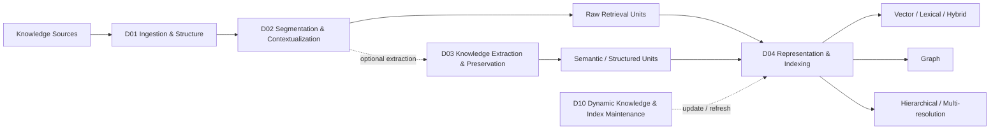
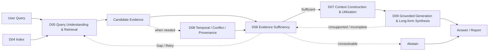
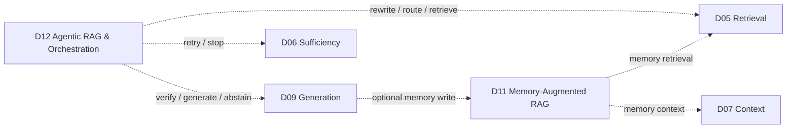
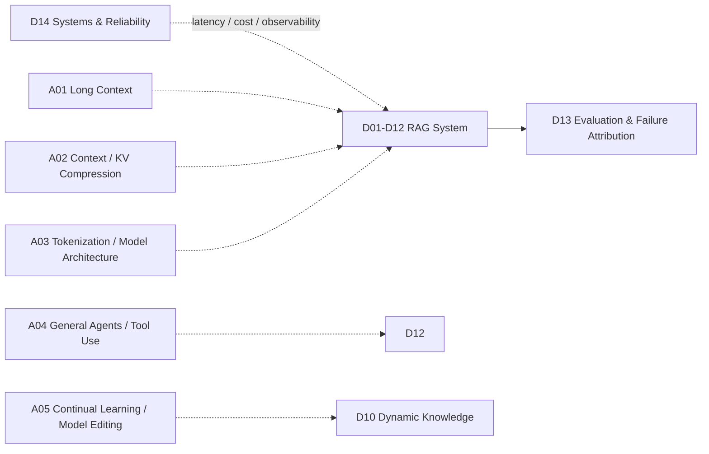
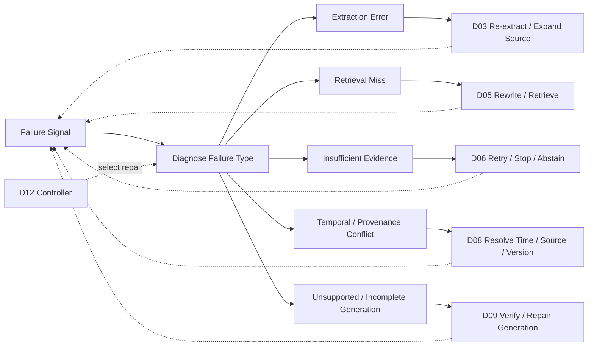

# RAG System Maps

> [!IMPORTANT]
> 本頁只畫目前有效的 **14 個 Domains（D01–D14）**。  
> 為保持可讀性，把完整 RAG 拆成四張小圖；虛線代表 optional / feedback / cross-cutting path。

## 1. Knowledge Preparation & Indexing

**可選路徑：**
- Raw-chunk RAG：D01 → D02 → D04。
- Structured / Graph RAG：D01 → D02 → D03 → D04。
- D03 不是所有 RAG 的必要步驟。
- Graph / Hierarchical / Proposition 是 representation / paradigm choices，不是額外 Domain。

## 2. Query → Evidence → Context → Generation

**可選路徑：**
- D08 只在 freshness、version、authority、source conflict 等問題出現時啟用。
- D06 不只是 retrieve/stop，也可把 gap 送回 D05。
- D09 verification 發現缺證據時可回到 D06，而不是只 regenerate。

## 3. Memory & Agentic Control

D11 管 persistent state；D12 管 action selection。兩者都不是固定 pipeline stage。

## 4. Evaluation, Systems & Adjacent Interfaces

- **D13**：觀察與歸因，不是最後一個 pipeline step。
- **D14**：deployment / reliability plane，不是 retrieval algorithm。
- **A01–A05**：Adjacent Interfaces，不計入 14 Domains。

## 5. Failure / Repair Paths

這張圖只表達 **repair action space**；不是所有系統都需要完整 controller。  
重點是不要把 extraction error、retrieval miss、insufficient evidence、temporal conflict 與 generation failure 全部當成「再檢索一次」。

## Domain Index

| ID | Domain |
|---|---|
| D01 | [[02 - 研究領域專題 (Research Domains)/Domain 01 - Document Ingestion & Structure|Document Ingestion & Structure]] |
| D02 | [[02 - 研究領域專題 (Research Domains)/Domain 02 - Segmentation & Contextualization|Segmentation & Contextualization]] |
| D03 | [[02 - 研究領域專題 (Research Domains)/Domain 03 - Knowledge Extraction & Information Preservation|Knowledge Extraction & Information Preservation]] |
| D04 | [[02 - 研究領域專題 (Research Domains)/Domain 04 - Knowledge Representation & Indexing|Knowledge Representation & Indexing]] |
| D05 | [[02 - 研究領域專題 (Research Domains)/Domain 05 - Query Understanding & Retrieval|Query Understanding & Retrieval]] |
| D06 | [[02 - 研究領域專題 (Research Domains)/Domain 06 - Evidence Sufficiency & Adaptive Retrieval|Evidence Sufficiency & Adaptive Retrieval]] |
| D07 | [[02 - 研究領域專題 (Research Domains)/Domain 07 - Context Construction & Evidence Utilization|Context Construction & Evidence Utilization]] |
| D08 | [[02 - 研究領域專題 (Research Domains)/Domain 08 - Temporal Conflict & Provenance Resolution|Temporal Conflict & Provenance Resolution]] |
| D09 | [[02 - 研究領域專題 (Research Domains)/Domain 09 - Grounded Generation Attribution & Long-form Synthesis|Grounded Generation, Attribution & Long-form Synthesis]] |
| D10 | [[02 - 研究領域專題 (Research Domains)/Domain 10 - Dynamic Knowledge & Index Maintenance|Dynamic Knowledge & Index Maintenance]] |
| D11 | [[02 - 研究領域專題 (Research Domains)/Domain 11 - Memory-Augmented RAG|Memory-Augmented RAG]] |
| D12 | [[02 - 研究領域專題 (Research Domains)/Domain 12 - Agentic RAG & Orchestration|Agentic RAG & Orchestration]] |
| D13 | [[02 - 研究領域專題 (Research Domains)/Domain 13 - RAG Evaluation & Failure Attribution|RAG Evaluation & Failure Attribution]] |
| D14 | [[02 - 研究領域專題 (Research Domains)/Domain 14 - RAG Systems & Reliability|RAG Systems & Reliability]] |

## Related

- [[00 - 導覽與心智圖 (Navigation & MOC)/RAG Research Taxonomy & Domain Map|RAG Research Taxonomy]]
- [[00 - 導覽與心智圖 (Navigation & MOC)/RAG Paradigm Tags|Paradigm Tags]]
- [[00 - 導覽與心智圖 (Navigation & MOC)/RAG Adjacent Interfaces|Adjacent Interfaces]]
- [[00 - 導覽與心智圖 (Navigation & MOC)/RAG Benchmark Catalog|Benchmark Catalog]]
