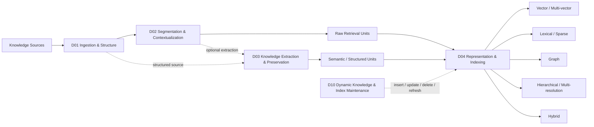
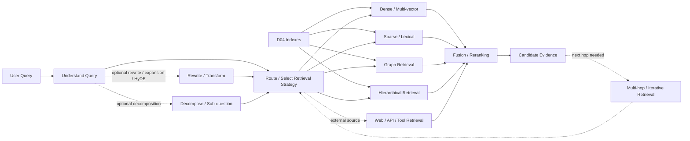
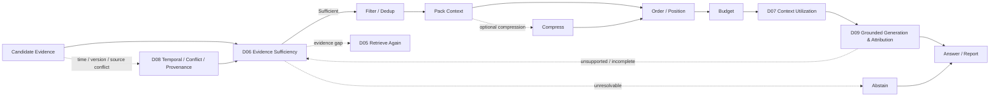
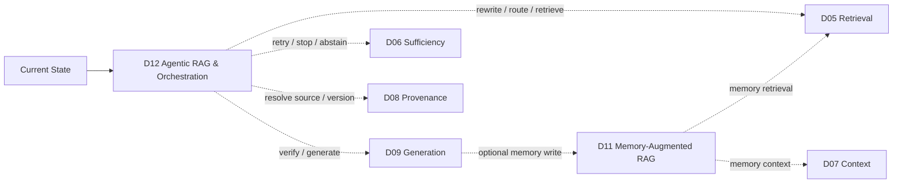
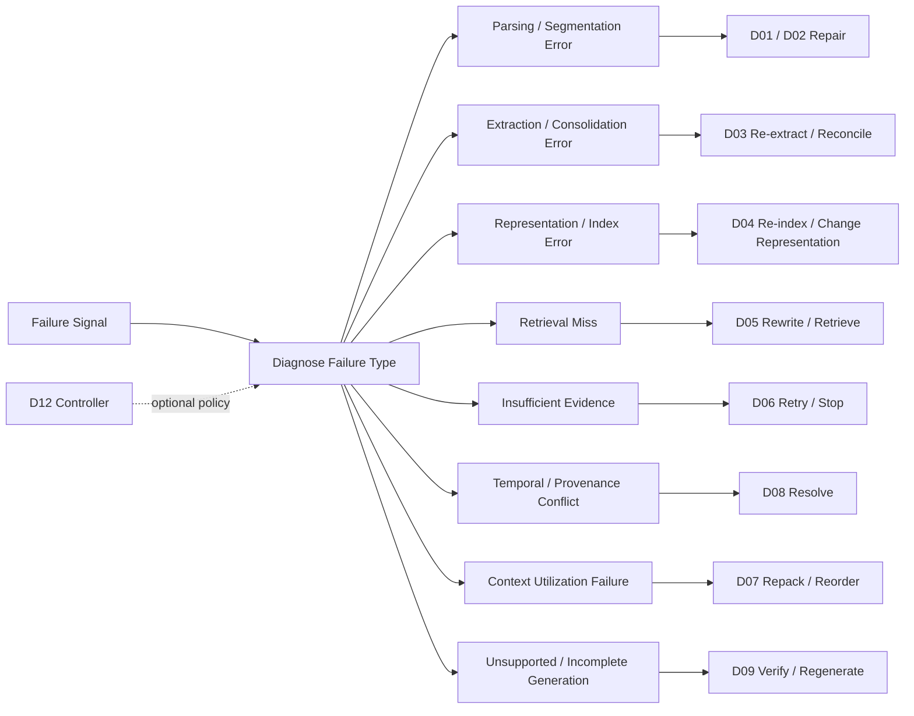
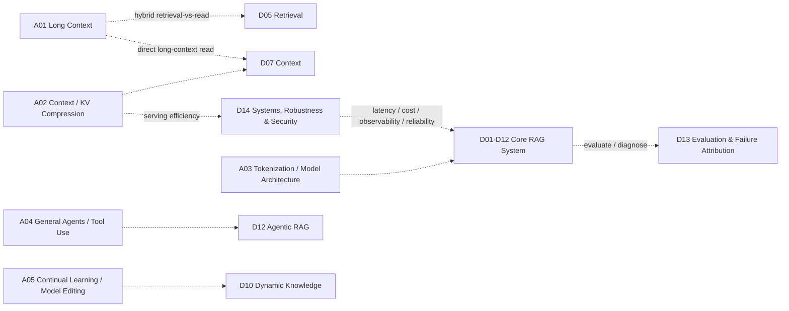

# RAG System Maps

> [!IMPORTANT]
> 本頁只使用目前正式的 **14 個 Domains（D01–D14）**。  
> 不畫一張超大圖；改用六張小圖。**實線 = 常見主流程，虛線 = optional / feedback / cross-cutting path。**

## 1. Knowledge Preparation → Index

主要變體：
- **Raw-chunk RAG**：D01 → D02 → D04。
- **Structured / Graph RAG**：D01 → D02 → D03 → D04。
- **Structured source** 可由 D01 直接進 D03，不必先做一般 chunking。
- D03 是可選步驟；Graph / Hierarchical / Proposition 是表示或方法選擇，不是額外 Domain。

## 2. Query Understanding & Retrieval Choices

這整張圖屬 **D05 Query Understanding & Retrieval**。不是每個系統都同時使用所有 retrieval channels。

## 3. Evidence → Context → Generation

關鍵邊界：
- **Relevant evidence ≠ sufficient evidence**。
- **Sufficient evidence ≠ model actually used it**。
- D08 是條件式 validation / resolution，不是每個 query 的固定 stage。
- Verification 發現缺證據時應回到 D06/D05，而不只是 regenerate。

## 4. Memory & Agentic Control

- **D11 = persistent state lifecycle**。
- **D12 = action selection / control plane**。
- 兩者都不是固定線性 pipeline stage。

## 5. Failure Diagnosis & Repair

重點不是「失敗就再檢索」，而是先判斷錯在哪一層，再選 repair action。

## 6. Evaluation, Systems & Adjacent Interfaces

- **D13** 是 evaluation plane，不是「最後一步」。
- **D14** 是 deployment / systems plane，不是 retrieval algorithm。
- **A01–A05** 是 Adjacent Interfaces，不計入 14 Domains。

## Domain Index

| ID | Domain |
|---|---|
| D01 | [[02 - 研究領域專題 (Research Domains)/Domain 01 - Document Ingestion & Structure|Document Ingestion & Structure]] |
| D02 | [[02 - 研究領域專題 (Research Domains)/Domain 02 - Segmentation & Contextualization|Segmentation & Contextualization]] |
| D03 | [[02 - 研究領域專題 (Research Domains)/Domain 03 - Knowledge Extraction & Information Preservation|Knowledge Extraction & Information Preservation]] |
| D04 | [[02 - 研究領域專題 (Research Domains)/Domain 04 - Knowledge Representation & Indexing|Knowledge Representation & Indexing]] |
| D05 | [[02 - 研究領域專題 (Research Domains)/Domain 05 - Query Understanding & Retrieval|Query Understanding & Retrieval]] |
| D06 | [[02 - 研究領域專題 (Research Domains)/Domain 06 - Evidence Sufficiency & Adaptive Retrieval|Evidence Sufficiency & Adaptive Retrieval]] |
| D07 | [[02 - 研究領域專題 (Research Domains)/Domain 07 - Context Construction & Evidence Utilization|Context Construction & Evidence Utilization]] |
| D08 | [[02 - 研究領域專題 (Research Domains)/Domain 08 - Temporal Conflict & Provenance Resolution|Temporal Conflict & Provenance Resolution]] |
| D09 | [[02 - 研究領域專題 (Research Domains)/Domain 09 - Grounded Generation Attribution & Long-form Synthesis|Grounded Generation, Attribution & Long-form Synthesis]] |
| D10 | [[02 - 研究領域專題 (Research Domains)/Domain 10 - Dynamic Knowledge & Index Maintenance|Dynamic Knowledge & Index Maintenance]] |
| D11 | [[02 - 研究領域專題 (Research Domains)/Domain 11 - Memory-Augmented RAG|Memory-Augmented RAG]] |
| D12 | [[02 - 研究領域專題 (Research Domains)/Domain 12 - Agentic RAG & Orchestration|Agentic RAG & Orchestration]] |
| D13 | [[02 - 研究領域專題 (Research Domains)/Domain 13 - RAG Evaluation & Failure Attribution|RAG Evaluation & Failure Attribution]] |
| D14 | [[02 - 研究領域專題 (Research Domains)/Domain 14 - RAG Systems, Robustness & Security|RAG Systems, Robustness & Security]] |

## Related

- [[00 - 導覽與心智圖 (Navigation & MOC)/RAG Research Taxonomy & Domain Map|RAG Research Taxonomy]]
- [[00 - 導覽與心智圖 (Navigation & MOC)/RAG Paradigm Tags|Paradigm Tags]]
- [[00 - 導覽與心智圖 (Navigation & MOC)/RAG Adjacent Interfaces|Adjacent Interfaces]]
- [[00 - 導覽與心智圖 (Navigation & MOC)/RAG Benchmark Catalog|Benchmark Catalog]]
