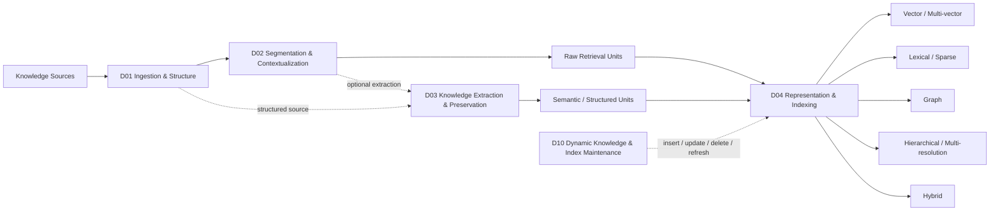
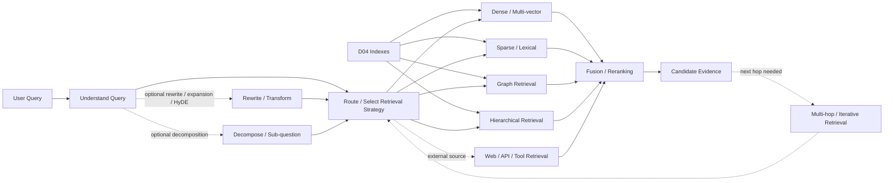
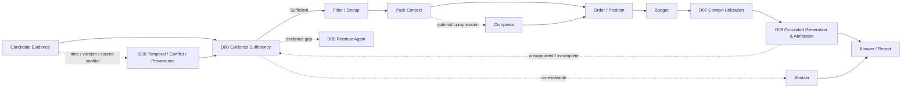
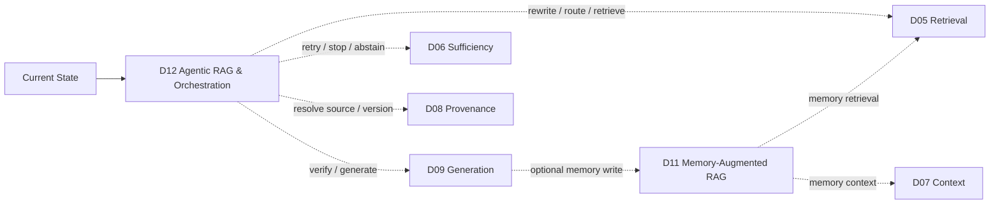
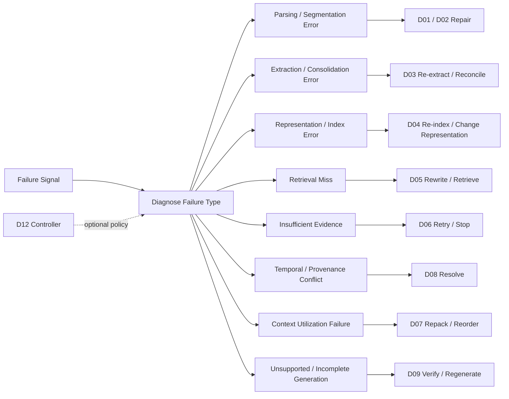
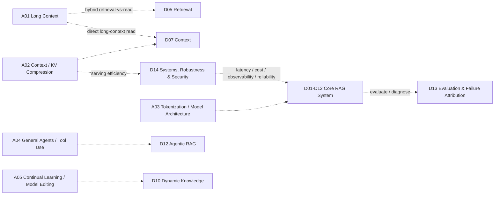
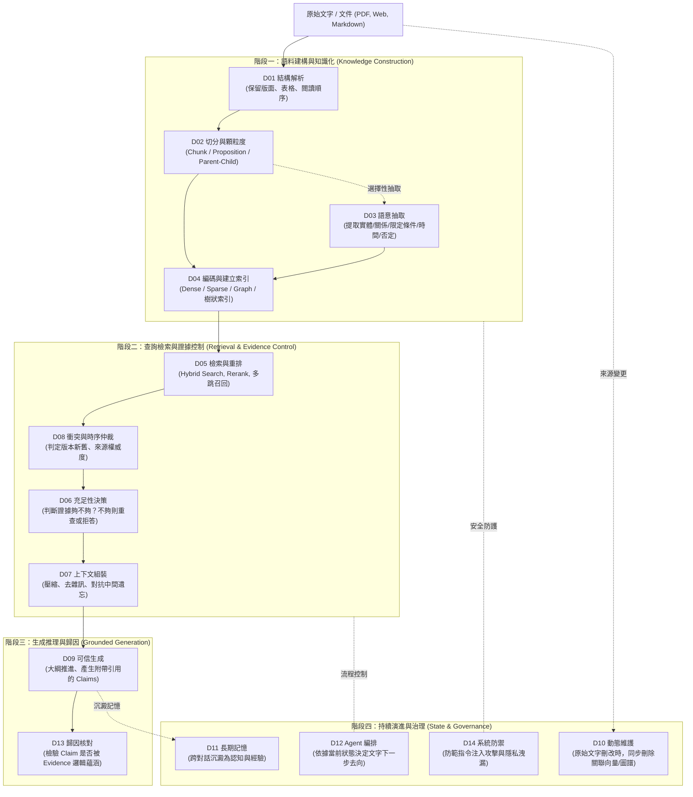

# RAG System Maps

> [!IMPORTANT]
> 本頁只使用目前正式的 **14 個 Domains（D01–D14）**。  
> 不畫一張超大圖；改用六張小圖。**實線 = 常見主流程，虛線 = optional / feedback / cross-cutting path。**

## 1. Knowledge Preparation → Index

```mermaid
flowchart LR
    SRC["Knowledge Sources"] --> D01["D01 Ingestion & Structure"]
    D01 --> D02["D02 Segmentation & Contextualization"]

    D02 --> RAW["Raw Retrieval Units"]
    RAW --> D04["D04 Representation & Indexing"]

    D02 -. "optional extraction" .-> D03["D03 Knowledge Extraction & Preservation"]
    D01 -. "structured source" .-> D03
    D03 --> SEM["Semantic / Structured Units"]
    SEM --> D04

    D04 --> V["Vector / Multi-vector"]
    D04 --> L["Lexical / Sparse"]
    D04 --> G["Graph"]
    D04 --> H["Hierarchical / Multi-resolution"]
    D04 --> HY["Hybrid"]

    D10["D10 Dynamic Knowledge & Index Maintenance"] -. "insert / update / delete / refresh" .-> D04
```

主要變體：
- **Raw-chunk RAG**：D01 → D02 → D04。
- **Structured / Graph RAG**：D01 → D02 → D03 → D04。
- **Structured source** 可由 D01 直接進 D03，不必先做一般 chunking。
- D03 是可選步驟；Graph / Hierarchical / Proposition 是表示或方法選擇，不是額外 Domain。

## 2. Query Understanding & Retrieval Choices

```mermaid
flowchart LR
    Q["User Query"] --> U["Understand Query"]
    U --> ROUTE["Route / Select Retrieval Strategy"]

    U -. "optional rewrite / expansion / HyDE" .-> RW["Rewrite / Transform"]
    RW --> ROUTE
    U -. "optional decomposition" .-> DEC["Decompose / Sub-question"]
    DEC --> ROUTE

    D04["D04 Indexes"] --> DENSE["Dense / Multi-vector"]
    D04 --> SPARSE["Sparse / Lexical"]
    D04 --> GRAPH["Graph Retrieval"]
    D04 --> HIER["Hierarchical Retrieval"]

    ROUTE --> DENSE
    ROUTE --> SPARSE
    ROUTE --> GRAPH
    ROUTE --> HIER
    ROUTE -. "external source" .-> EXT["Web / API / Tool Retrieval"]

    DENSE --> FUSE["Fusion / Reranking"]
    SPARSE --> FUSE
    GRAPH --> FUSE
    HIER --> FUSE
    EXT --> FUSE

    FUSE --> EV["Candidate Evidence"]
    EV -. "next hop needed" .-> MH["Multi-hop / Iterative Retrieval"]
    MH -.-> ROUTE
```

這整張圖屬 **D05 Query Understanding & Retrieval**。不是每個系統都同時使用所有 retrieval channels。

## 3. Evidence → Context → Generation

```mermaid
flowchart LR
    EV["Candidate Evidence"] --> D06["D06 Evidence Sufficiency"]

    EV -. "time / version / source conflict" .-> D08["D08 Temporal / Conflict / Provenance"]
    D08 --> D06

    D06 -->|Sufficient| FILTER["Filter / Dedup"]
    FILTER --> PACK["Pack Context"]
    PACK -. "optional compression" .-> COMP["Compress"]
    PACK --> ORDER["Order / Position"]
    COMP --> ORDER
    ORDER --> BUDGET["Budget"]
    BUDGET --> D07["D07 Context Utilization"]

    D07 --> D09["D09 Grounded Generation & Attribution"]
    D09 --> OUT["Answer / Report"]

    D06 -. "evidence gap" .-> D05["D05 Retrieve Again"]
    D06 -. "unresolvable" .-> ABS["Abstain"]
    ABS --> OUT

    D09 -. "unsupported / incomplete" .-> D06
```

關鍵邊界：
- **Relevant evidence ≠ sufficient evidence**。
- **Sufficient evidence ≠ model actually used it**。
- D08 是條件式 validation / resolution，不是每個 query 的固定 stage。
- Verification 發現缺證據時應回到 D06/D05，而不只是 regenerate。

## 4. Memory & Agentic Control

```mermaid
flowchart LR
    D11["D11 Memory-Augmented RAG"] -. "memory retrieval" .-> D05["D05 Retrieval"]
    D11 -. "memory context" .-> D07["D07 Context"]
    D09["D09 Generation"] -. "optional memory write" .-> D11

    STATE["Current State"] --> D12["D12 Agentic RAG & Orchestration"]
    D12 -. "rewrite / route / retrieve" .-> D05
    D12 -. "retry / stop / abstain" .-> D06["D06 Sufficiency"]
    D12 -. "resolve source / version" .-> D08["D08 Provenance"]
    D12 -. "verify / generate" .-> D09
```

- **D11 = persistent state lifecycle**。
- **D12 = action selection / control plane**。
- 兩者都不是固定線性 pipeline stage。

## 5. Failure Diagnosis & Repair

```mermaid
flowchart LR
    SIG["Failure Signal"] --> DIAG["Diagnose Failure Type"]

    DIAG --> E1["Parsing / Segmentation Error"]
    DIAG --> E2["Extraction / Consolidation Error"]
    DIAG --> E3["Representation / Index Error"]
    DIAG --> E4["Retrieval Miss"]
    DIAG --> E5["Insufficient Evidence"]
    DIAG --> E6["Temporal / Provenance Conflict"]
    DIAG --> E7["Context Utilization Failure"]
    DIAG --> E8["Unsupported / Incomplete Generation"]

    E1 --> D01["D01 / D02 Repair"]
    E2 --> D03["D03 Re-extract / Reconcile"]
    E3 --> D04["D04 Re-index / Change Representation"]
    E4 --> D05["D05 Rewrite / Retrieve"]
    E5 --> D06["D06 Retry / Stop"]
    E6 --> D08["D08 Resolve"]
    E7 --> D07["D07 Repack / Reorder"]
    E8 --> D09["D09 Verify / Regenerate"]

    D12["D12 Controller"] -. "optional policy" .-> DIAG
```

重點不是「失敗就再檢索」，而是先判斷錯在哪一層，再選 repair action。

## 6. Evaluation, Systems & Adjacent Interfaces

```mermaid
flowchart LR
    CORE["D01-D12 Core RAG System"]

    CORE -. "evaluate / diagnose" .-> D13["D13 Evaluation & Failure Attribution"]
    D14["D14 Systems, Robustness & Security"] -. "latency / cost / observability / reliability" .-> CORE

    A01["A01 Long Context"] -. "hybrid retrieval-vs-read" .-> D05["D05 Retrieval"]
    A01 -. "direct long-context read" .-> D07["D07 Context"]
    A02["A02 Context / KV Compression"] -.-> D07
    A02 -. "serving efficiency" .-> D14
    A03["A03 Tokenization / Model Architecture"] -.-> CORE
    A04["A04 General Agents / Tool Use"] -.-> D12["D12 Agentic RAG"]
    A05["A05 Continual Learning / Model Editing"] -.-> D10["D10 Dynamic Knowledge"]
```

- **D13** 是 evaluation plane，不是「最後一步」。
- **D14** 是 deployment / systems plane，不是 retrieval algorithm。
- **A01–A05** 是 Adjacent Interfaces，不計入 14 Domains。

## 7. Core Lifecycle of a Text Object (一段文字的完整生命週期圖譜)

一段文字（Text Object）從原始文件進入系統，歷經建構、檢索、生成到治理，其端到端核心狀態演進與 D01–D14 模組互動如下：

```mermaid
flowchart TD
    RAW["原始文字 / 文件 (PDF, Web, Markdown)"] 
    
    subgraph stage1["階段一：語料建構與知識化 (Knowledge Construction)"]
        D01["D01 結構解析<br/>(保留版面、表格、閱讀順序)"]
        D02["D02 切分與顆粒度<br/>(Chunk / Proposition / Parent-Child)"]
        D03["D03 語意抽取<br/>(提取實體/關係/限定條件/時間/否定)"]
        D04["D04 編碼與建立索引<br/>(Dense / Sparse / Graph / 樹狀索引)"]
    end

    subgraph stage2["階段二：查詢檢索與證據控制 (Retrieval & Evidence Control)"]
        D05["D05 檢索與重排<br/>(Hybrid Search, Rerank, 多跳召回)"]
        D08["D08 衝突與時序仲裁<br/>(判定版本新舊、來源權威度)"]
        D06["D06 充足性決策<br/>(判斷證據夠不夠？不夠則重查或拒答)"]
        D07["D07 上下文組裝<br/>(壓縮、去雜訊、對抗中間遺忘)"]
    end

    subgraph stage3["階段三：生成推理與歸因 (Grounded Generation)"]
        D09["D09 可信生成<br/>(大綱推進、產生附帶引用的 Claims)"]
        D13["D13 歸因核對<br/>(檢驗 Claim 是否被 Evidence 邏輯蘊涵)"]
    end

    subgraph stage4["階段四：持續演進與治理 (State & Governance)"]
        D10["D10 動態維護<br/>(原始文字刪改時，同步刪除關聯向量/圖譜)"]
        D11["D11 長期記憶<br/>(跨對話沉澱為認知與經驗)"]
        D12["D12 Agent 編排<br/>(依據當前狀態決定文字下一步去向)"]
        D14["D14 系統防禦<br/>(防範指令注入攻擊與隱私洩漏)"]
    end

    RAW --> D01
    D01 --> D02
    D02 --> D04
    D02 -. "選擇性抽取" .-> D03
    D03 --> D04

    D04 --> D05
    D05 --> D08
    D08 --> D06
    D06 --> D07
    D07 --> D09

    D09 --> D13
    D09 -. "沉澱記憶" .-> D11
    RAW -. "來源變更" .-> D10
    stage2 -. "流程控制" .- D12
    stage1 -. "安全防護" .- D14
```

**圖中節點對照**：
- **階段一 (D01–D04)**：[[02 - 研究領域專題 (Research Domains)/Domain 01 - Document Ingestion & Structure|D01 結構解析]] · [[02 - 研究領域專題 (Research Domains)/Domain 02 - Segmentation & Contextualization|D02 切分顆粒度]] · [[02 - 研究領域專題 (Research Domains)/Domain 03 - Knowledge Extraction & Information Preservation|D03 語意抽取]] · [[02 - 研究領域專題 (Research Domains)/Domain 04 - Knowledge Representation & Indexing|D04 表示與索引]]
- **階段二 (D05–D08)**：[[02 - 研究領域專題 (Research Domains)/Domain 05 - Query Understanding & Retrieval|D05 檢索重排]] · [[02 - 研究領域專題 (Research Domains)/Domain 08 - Temporal Conflict & Provenance Resolution|D08 衝突時序仲裁]] · [[02 - 研究領域專題 (Research Domains)/Domain 06 - Evidence Sufficiency & Adaptive Retrieval|D06 充足性決策]] · [[02 - 研究領域專題 (Research Domains)/Domain 07 - Context Construction & Evidence Utilization|D07 上下文組裝]]
- **階段三 (D09, D13)**：[[02 - 研究領域專題 (Research Domains)/Domain 09 - Grounded Generation Attribution & Long-form Synthesis|D09 可信長篇生成]] · [[02 - 研究領域專題 (Research Domains)/Domain 13 - RAG Evaluation & Failure Attribution|D13 歸因核對與評測]]
- **階段四 (D10–D14)**：[[02 - 研究領域專題 (Research Domains)/Domain 10 - Dynamic Knowledge & Index Maintenance|D10 索引維護同步]] · [[02 - 研究領域專題 (Research Domains)/Domain 11 - Memory-Augmented RAG|D11 持久記憶管理]] · [[02 - 研究領域專題 (Research Domains)/Domain 12 - Agentic RAG & Orchestration|D12 Agent 行動編排]] · [[02 - 研究領域專題 (Research Domains)/Domain 14 - RAG Systems, Robustness & Security|D14 系統防禦與可靠性]]

### 核心生命週期模組職能一覽 (D01–D14 究竟在幹嘛)

| 階段 | Domain | 模組名稱 | 核心在幹嘛 (Core Responsibility) | 關鍵邊界與防範問題 |
|---|---|---|---|---|
| **建構** | **D01** | [[02 - 研究領域專題 (Research Domains)/Domain 01 - Document Ingestion & Structure\|Document Ingestion & Structure]] | **文件解析與結構還原**：將 PDF/掃描件/網頁轉成保留版面、標題階層、表格行列與圖表的多模態結構化文字。 | 下游檢索無法修復上游被摧毀的結構；表格若被攤平成字串，行列關聯便永久遺失。 |
| **建構** | **D02** | [[02 - 研究領域專題 (Research Domains)/Domain 02 - Segmentation & Contextualization\|Segmentation & Contextualization]] | **切分與檢索顆粒度**：決定什麼樣的單元（Chunk、Proposition、父子塊）應被獨立檢索，並注入上下文消解代名詞。 | 顆粒度權衡：切太小遺失語境（Dangling Reference），切太大引入無關雜訊。 |
| **建構** | **D03** | [[02 - 研究領域專題 (Research Domains)/Domain 03 - Knowledge Extraction & Information Preservation\|Knowledge Extraction & Preservation]] | **語意抽取與資訊保全**：提煉實體、關係、事件或 Claim，且嚴格保留時序、條件、範圍、狀態與否定詞。 | 檢索單元 $\neq$ 語意單元；三元組若丟失限定條件（如「*Q4 批准後才支援*」）即成偽事實。 |
| **建構** | **D04** | [[02 - 研究領域專題 (Research Domains)/Domain 04 - Knowledge Representation & Indexing\|Representation & Indexing]] | **知識表示與索引構建**：將文字或物件編碼為 Dense/Sparse 向量、構建知識圖譜（Graph）或聚類層級樹（RAPTOR）。 | 語料庫靜態表示；「建圖/建樹」屬 D04，「查詢時怎麼查」屬 D05。 |
| **檢索** | **D05** | [[02 - 研究領域專題 (Research Domains)/Domain 05 - Query Understanding & Retrieval\|Query Understanding & Retrieval]] | **查詢理解與候選檢索**：查詢改寫、擴充（HyDE）、多跳分解，並自多通道（向量/關鍵字/圖譜）召回候選證據並重排。 | 核心解決「相關性（Relevance）」；確保最相關的前 K 篇候選排在最前面。 |
| **控制** | **D06** | [[02 - 研究領域專題 (Research Domains)/Domain 06 - Evidence Sufficiency & Adaptive Retrieval\|Evidence Sufficiency & Control]] | **充足性決策與檢索控制**：評估現有證據「到底夠不夠回答」；不足時決定再檢索、換策略或主動拒答（Abstain）。 | 相關不等於充足；防止「找到一堆相關廢話，卻因缺乏關鍵證據而強行幻覺」。 |
| **整合** | **D07** | [[02 - 研究領域專題 (Research Domains)/Domain 07 - Context Construction & Evidence Utilization\|Context Construction & Utilization]] | **上下文組裝與注意力利用**：在輸入 LLM 前進行證據去重、Prompt 壓縮（LLMLingua）與黃金位置排序（對抗 Lost-in-the-Middle）。 | 檢索到了 $\neq$ 模型真能用好；防止關鍵證據被無關干擾項（Distractors）淹沒。 |
| **仲裁** | **D08** | [[02 - 研究領域專題 (Research Domains)/Domain 08 - Temporal Conflict & Provenance Resolution\|Temporal Conflict & Reconciliation]] | **時序衝突與來源仲裁**：當多筆證據互相矛盾、版本不一時，依據時間戳（Recency）、版本號與權威度判定誰是真相。 | 互斥事實不能同時為真；新舊政策或衝突數據打架時，必須有仲裁機制。 |
| **生成** | **D09** | [[02 - 研究領域專題 (Research Domains)/Domain 09 - Grounded Generation Attribution & Long-form Synthesis\|Grounded Generation & Long-form Synthesis]] | **可信生成與長篇綜合**：依據大綱樹規劃與證據池逐章撰寫萬字報告，並為每個核心 Claim 嚴格標註句級引用。 | 確保每一個生成的 Claim 都有具體 Evidence 支撐，做到「言必有據」。 |
| **維護** | **D10** | [[02 - 研究領域專題 (Research Domains)/Domain 10 - Dynamic Knowledge & Index Maintenance\|Dynamic Knowledge Maintenance]] | **動態知識與索引同步**：真實語料刪改時，同步失效或更新衍生之 Chunk、向量、圖譜節點與快取，避免全量重構。 | 解決語料動態性與「依賴性刪除傳播」；防止已刪除檔案從向量殘留中洩漏。 |
| **狀態** | **D11** | [[02 - 研究領域專題 (Research Domains)/Domain 11 - Memory-Augmented RAG\|Memory-Augmented RAG]] | **持久記憶管理**：維護跨對話、跨任務存在的長期記憶（User Profile、歷史結論），支援整合與受控遺忘。 | D10 同步外部世界真實語料，D11 沉澱系統自身的長期運作經驗與認知。 |
| **編排** | **D12** | [[02 - 研究領域專題 (Research Domains)/Domain 12 - Agentic RAG & Orchestration\|Agentic RAG & Orchestration]] | **Agent 行動編排與控制**：作為中央大腦，依據目前狀態、證據缺口、反思評價與 Token 預算，動態決定下一步動作。 | 不是死板的固定流水線，而是依據反饋動態跳轉決策（State-dependent policy）。 |
| **評估** | **D13** | [[02 - 研究領域專題 (Research Domains)/Domain 13 - RAG Evaluation & Failure Attribution\|Evaluation & Failure Attribution]] | **評估基準與故障歸因**：建立各層級度量指標，透過 Oracle Gold Evidence 介入等手段精確定位故障發生在何處。 | 回答錯誤時，精確診斷到底是 Retriever 召回失敗、還是 Generator 推理失敗。 |
| **系統** | **D14** | [[02 - 研究領域專題 (Research Domains)/Domain 14 - RAG Systems, Robustness & Security\|RAG Systems, Robustness & Security]] | **系統工程與安全防禦**：突破真實硬體極限（首字延遲 TTFT、KV 快取服務），並防範 Prompt 注入、語料投毒與隱私洩漏。 | 檢索文件 $\neq$ 可信指令（防注入）；檢索文件 $\neq$ 可信事實（防投毒）。 |

## Canonical Domain Definitions

完整 D01–D14 名稱、定義與 coverage 不在本頁重複維護：
- [[00 - 導覽與心智圖 (Navigation & MOC)/RAG Research Taxonomy & Domain Map|RAG Research Taxonomy & Domain Map]]
- [[02 - 研究領域專題 (Research Domains)/README|Research Domains]]

## Related

- [[00 - 導覽與心智圖 (Navigation & MOC)/RAG Research Taxonomy & Domain Map|RAG Research Taxonomy]]
- [[00 - 導覽與心智圖 (Navigation & MOC)/RAG Paradigm Tags|Paradigm Tags]]
- [[00 - 導覽與心智圖 (Navigation & MOC)/RAG Adjacent Interfaces|Adjacent Interfaces]]
- [[00 - 導覽與心智圖 (Navigation & MOC)/RAG Benchmark Catalog|Benchmark Catalog]]
