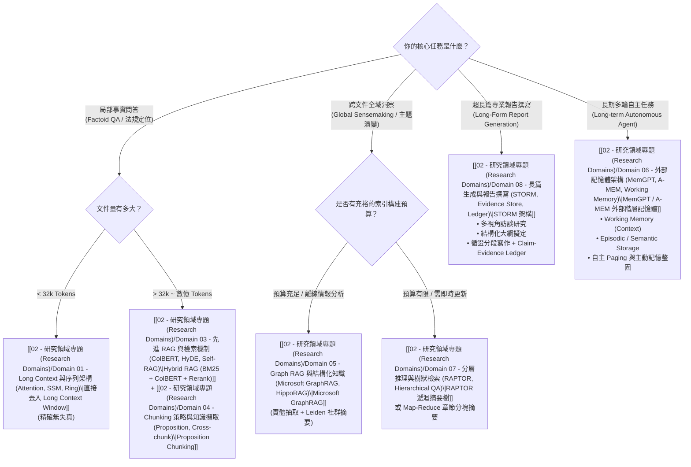

# ⚖️ 技術全景與 Pareto 權衡分析 (Trade-offs & Decision Matrix)

> [!IMPORTANT] 核心工程理念
> 在處理超長文件時，**沒有任何單一技術是萬靈丹（No Silver Bullet）**。
> 盲目追求 10M 原生上下文會讓您的 GPU 伺服器成本爆表；而盲目採用傳統 Vector RAG 則會讓全域總結任務完全失明。
> 優秀的系統架構師必須在 **準確率 (Accuracy)**、**延遲 (Latency)**、**顯存佔用 (VRAM)** 與 **營運成本 (Cost)** 之間找到最優的 **Pareto 前沿面 (Pareto Frontier)**。

---

## 一、四大主流長文本技術範式核心對比

| 評估指標 | 1. 原生 Long Context (Dense / FlashAttn) | 2. 密集向量 RAG (Hybrid Vector RAG) | 3. 圖結構檢索 (Microsoft GraphRAG) | 4. 階層樹狀檢索 (RAPTOR) |
| :--- | :--- | :--- | :--- | :--- |
| **代表技術** | [[03 - 論文庫 (Literature Notes)/Dao2022 - FlashAttention\|FlashAttention]], [[03 - 論文庫 (Literature Notes)/Liu2023 - RingAttention\|RingAttention]] | [[03 - 論文庫 (Literature Notes)/Karpukhin2020 - Dense Passage Retrieval (DPR)\|DPR]], [[03 - 論文庫 (Literature Notes)/Khattab2020 - ColBERT Late Interaction\|ColBERT]] | [[03 - 論文庫 (Literature Notes)/Edge2024 - Microsoft GraphRAG\|Microsoft GraphRAG]] | [[03 - 論文庫 (Literature Notes)/Sarthi2024 - RAPTOR Recursive Tree Retrieval\|RAPTOR]] |
| **輸入容量極限** | 128k ~ 2M Tokens (受顯存制約) | 無上限 (數億 Tokens) | 無上限 (全語料圖結構) | 書籍至百科級 (數百萬 Tokens) |
| **全域主題理解力** | ⭐⭐⭐⭐ (依賴模型長程注意力) | ⭐ (極差，斷章取義) | ⭐⭐⭐⭐⭐ (最強，社群摘要) | ⭐⭐⭐⭐ (遞迴抽象摘要) |
| **微觀事實檢索力** | ⭐⭐⭐⭐ (中間位置易遺忘) | ⭐⭐⭐⭐⭐ (細節關鍵字精準) | ⭐⭐⭐ (三元組可能遺失細節) | ⭐⭐⭐⭐ (底層 Chunk 精確) |
| **首字延遲 (TTFT)** | 慢 (秒至十秒級，隨長度暴增) | 快 (數十毫秒至百毫秒) | 慢 (需平行 Map 社群摘要) | 中等 (樹遍歷數百毫秒) |
| **索引構建成本** | 無 (即時 Prefill) | 低 (一次性向量計算) | 極高 (大量 LLM 實體與摘要呼叫) | 中高 (遞迴摘要 LLM 呼叫) |
| **推論 Token 成本** | 極高 (每次對話吃滿全文) | 極低 (僅傳輸 Top-K 段落) | 中高 (需彙整多個社群報告) | 中等 (傳輸樹枝節點摘要) |

---

## 二、架構決策流程圖 (Architectural Decision Flowchart)



---

## 三、Pareto 前沿最優化策略矩陣

```text
               ▲ 任務準確度 / 宏觀理解力 (Accuracy & Sensemaking)
               │
               │                   ● 理想目標: 動態路由混合系統 (Domain 11 提案)
               │                     (Hybrid Router + Proposition + Ledger)
               │
               │             ● GraphRAG (高準確、高成本)
               │
               │       ● RAPTOR (中高準確、中等成本)
               │
               │  ● Hybrid Vector RAG (高微觀細節、極低成本)
               │
               │● Pure Long Context (1M Tokens) (超高顯存與延遲)
               └──────────────────────────────────────────────►
                                          系統吞吐量與經濟性 (Throughput & Low Cost)
```

1. **極致成本敏感型系統**：
   - 採用 **[[03 - 論文庫 (Literature Notes)/Jiang2023 - LongLLMLingua|LongLLMLingua]]** 進行 Prompt 4x 壓縮 + **[[03 - 論文庫 (Literature Notes)/Liu2024 - KIVI 2-bit KV Cache|KIVI 2-bit]]** 快取量化，伺服器吞吐量可提升 4 倍以上，顯存直接縮減 75%。
2. **極致精度敏感型系統 (醫療/法律/國防情報)**：
   - 前端採用 **[[03 - 論文庫 (Literature Notes)/Chen2023 - Dense X Proposition Retrieval|Dense X 命題解構]]**；
   - 檢索端採用 **[[03 - 論文庫 (Literature Notes)/Khattab2020 - ColBERT Late Interaction|ColBERT]]** 延遲交互 + **[[03 - 論文庫 (Literature Notes)/Edge2024 - Microsoft GraphRAG|GraphRAG]]** 全局社群；
   - 生成端強制掛載 **[[02 - 研究領域專題 (Research Domains)/Domain 08 - 長篇生成與報告撰寫 (STORM, Evidence Store, Ledger)|Claim-Evidence Ledger]]** 進行逐句證據鏈校驗。
