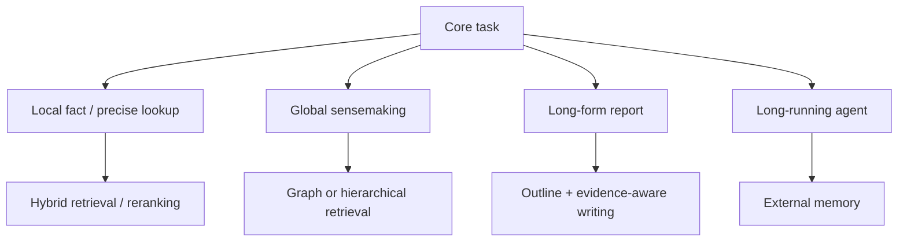

# ⚖️ 技術全景與 Pareto 權衡分析 (Trade-offs & Decision Matrix)

> [!IMPORTANT] 核心工程理念
> 在處理超長文件時，**沒有任何單一技術是萬靈丹（No Silver Bullet）**。
> Long Context、Vector RAG、GraphRAG 與 hierarchical retrieval 解決的問題不同；成本與品質也會隨模型、context、資料集、硬體與實作改變。
> 因此架構決策應在**同一任務、同一資料與可比的 compute / token budget**下，同時量測 Accuracy、Latency、VRAM、Indexing Cost 與營運成本，再討論 Pareto frontier。

---

## 一、四類長文本技術範式：比較邊界

| 維度 | 原生 Long Context | Hybrid / Vector RAG | Microsoft GraphRAG 類圖式檢索 | RAPTOR 類階層檢索 |
| :--- | :--- | :--- | :--- | :--- |
| **代表技術** | [[03 - 論文庫 (Literature Notes)/Dao2022 - FlashAttention|FlashAttention]], [[03 - 論文庫 (Literature Notes)/Liu2023 - RingAttention|RingAttention]] | [[03 - 論文庫 (Literature Notes)/Karpukhin2020 - Dense Passage Retrieval (DPR)|DPR]], [[03 - 論文庫 (Literature Notes)/Khattab2020 - ColBERT Late Interaction|ColBERT]] | [[03 - 論文庫 (Literature Notes)/Edge2024 - Microsoft GraphRAG|Microsoft GraphRAG]] | [[03 - 論文庫 (Literature Notes)/Sarthi2024 - RAPTOR Recursive Tree Retrieval|RAPTOR]] |
| **核心機制** | 將較多原文直接放入模型 context | 先從外部語料檢索候選，再交給生成模型 | 建立實體/關係與社群摘要等圖式索引，再依 query 做 local/global retrieval | 將語料遞迴聚類/摘要成多層樹狀表示並檢索不同層級 |
| **較自然的任務** | context 可容納且需要廣泛直接讀取原文的任務 | local fact、精確 evidence lookup、可擴展 corpus retrieval | global sensemaking、跨實體關係與社群層級問題 | multi-resolution retrieval、需要局部與摘要層級切換的任務 |
| **主要成本來源** | prefill / attention / KV cache；依模型與 context 而變 | ingestion embedding、索引、query retrieval / reranking | entity/relation extraction、graph construction、community summarization | clustering、recursive summarization、tree construction |
| **典型風險** | 有效 context utilization 不一定等於 nominal context length | Top-K 可能漏掉全域或跨段必要證據 | graph extraction / summarization error 可能傳播，索引成本較高 | 摘要可能丟失細節，tree quality 影響 retrieval |
| **Latency / VRAM / 上限** | **必須依模型與硬體實測** | **必須依 retriever / reranker / generator 實測** | **必須依索引與 query mode 實測** | **必須依 tree depth / retrieval strategy 實測** |

> [!WARNING] 不可直接排名
> 上表只描述機制與常見 trade-off，不提供星等或固定 TTFT / token 上限。不同論文、框架與部署條件下的數值不能直接拼成「最佳技術」排名。

---

## 二、架構決策流程圖 (Architectural Decision Flowchart)

**技術對照**：[[02 - 研究領域專題 (Research Domains)/Domain 03 - 先進 RAG 與檢索機制 (ColBERT, HyDE, Self-RAG)|Hybrid / Advanced RAG]] · [[02 - 研究領域專題 (Research Domains)/Domain 05 - Graph RAG 與結構化知識 (Microsoft GraphRAG, HippoRAG)|Graph RAG]] · [[02 - 研究領域專題 (Research Domains)/Domain 08 - 長篇生成與報告撰寫 (STORM, Evidence Store, Ledger)|Long-form Generation]] · [[02 - 研究領域專題 (Research Domains)/Domain 06 - 外部記憶體架構 (MemGPT, A-MEM, Working Memory)|External Memory]]

---

## 三、Pareto 分析：把「技術排名」改成「同條件實驗」

本頁不預先把 GraphRAG、RAPTOR、Vector RAG 或 Long Context 排成固定優劣。真正的 Pareto frontier 必須由同一實驗條件下的測量點形成。

建議至少同時記錄：

| 面向 | 建議指標 |
| :--- | :--- |
| Retrieval | Recall@K、nDCG、MRR、gold evidence coverage |
| Generation | answer / report task score、faithfulness、unsupported claim rate |
| Long-form | nugget / requirement coverage、citation support、report logic |
| Cost | input/output tokens、embedding / reranking / LLM calls、indexing time |
| Systems | end-to-end latency、TTFT（若為互動任務）、throughput、peak VRAM / RAM |
| Governance | provenance completeness、authority/type violation、evidence sufficiency failure |

### 組合技術時的注意事項

- [[03 - 論文庫 (Literature Notes)/Jiang2023 - LongLLMLingua|LongLLMLingua]] 與 [[03 - 論文庫 (Literature Notes)/Liu2024 - KIVI 2-bit KV Cache|KIVI]] 分別處理 prompt/context 與 KV-cache；不同論文、不同硬體與不同 context 下的改善**不可直接相乘**成整體吞吐或 VRAM 結論。
- [[03 - 論文庫 (Literature Notes)/Chen2023 - Dense X Proposition Retrieval|Dense X]]、[[03 - 論文庫 (Literature Notes)/Khattab2020 - ColBERT Late Interaction|ColBERT]]、[[03 - 論文庫 (Literature Notes)/Edge2024 - Microsoft GraphRAG|GraphRAG]] 與 long-form evidence ledger 可以形成候選組合，但是否優於較簡單 baseline 必須透過 ablation 與 budget parity 驗證。
- Benchmark / Dataset / Metric 的選擇見 [[00 - 導覽與心智圖 (Navigation & MOC)/RAG Benchmark Catalog|RAG Benchmark Catalog]]；研究假設與 oracle 設計見 [[02 - 研究領域專題 (Research Domains)/Domain 11 - 最具價值的研究方向與實驗設計 (Research Roadmap)|Domain 11]]。

---

## 四、主流 RAG 框架生態與 Evidence-Governed Harness 的定位

框架層比較屬於**快速變動的工程選型資訊**，不應在本 Pareto 頁重複維護固定的模型大小、VRAM、TTFT、解析延遲或「誰最強」等敘述。這些數字高度依賴版本、模型、硬體、資料與部署方式；若沒有同條件 benchmark，不可直接比較。

完整的框架定位、委託邊界與待核驗事項集中維護於：

- [[04 - 研究想法與待驗證提案 (Ideas & Hypotheses)/Idea 06 - 主流 RAG 框架生態與系統定位分析 (Framework Landscape & Positioning)|Idea 06: 主流 RAG 框架生態與系統定位分析]]
- [[04 - 研究想法與待驗證提案 (Ideas & Hypotheses)/Idea 05 - Evidence-Governed RAG 系統架構構想 (Delta Pipeline Design)|Idea 05: Evidence-Governed RAG 系統架構構想]]

> [!IMPORTANT] 比較原則
> LangChain / LangGraph、AutoRAG、Haystack、Dify、RAGFlow、MinerU、Docling 等工具的能力必須以**使用版本的官方文件 / 官方 repository**為準；Evidence-Governed Harness 則是本專案的 proposed architecture。框架比較用於回答「哪些通用能力應借力、哪些研究假設值得自研與 ablation」，不是產品排名。

### 建議的工程選型順序

1. 先定義任務與資料契約：QA、長篇報告、RFP、表格/PDF、multi-hop 或 multimodal。
2. 再定義不可妥協的 invariant：coverage、provenance、citation/entailment、authority、sufficiency。
3. 對 parsing、retrieval、pipeline runtime、UI、evaluation 分別建立可替換 adapter。
4. 以同一 dataset、同一模型與相同 compute / token budget 做 benchmark，再決定是否委託既有框架。
5. 將 F/R/D/A/P/C/T、Evidence Governance 與 deterministic repair 視為**待驗證研究假設**，而不是預設優於現有框架的既定事實。

## 相關導覽與文獻快速跳轉

- **回主目錄**：[[00 - 導覽與心智圖 (Navigation & MOC)/Home (主目錄與知識庫導覽)|主目錄與知識庫導覽]]
- **專題深入**：[[02 - 研究領域專題 (Research Domains)/Domain 04 - Chunking 策略與知識擷取 (Proposition, Cross-chunk)|Domain 04: 知識擷取與證據治理]]
- **長篇生成**：[[02 - 研究領域專題 (Research Domains)/Domain 08 - 長篇生成與報告撰寫 (STORM, Evidence Store, Ledger)|Domain 08: STORM 與 Claim-Evidence Ledger]]
- **研究藍圖**：[[02 - 研究領域專題 (Research Domains)/Domain 11 - 最具價值的研究方向與實驗設計 (Research Roadmap)|Domain 11: 研究提案與消融實驗設計]]
