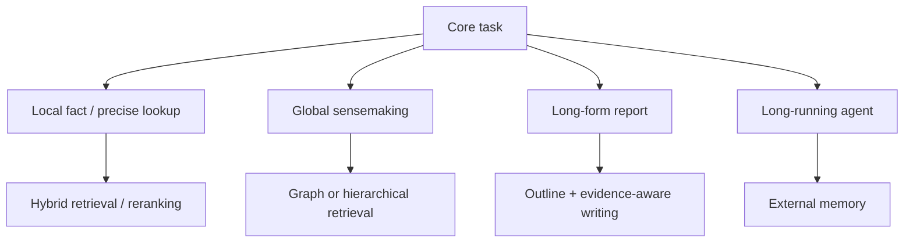
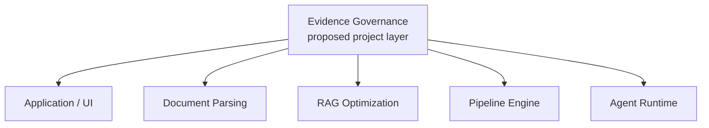

# ⚖️ 技術全景與 Pareto 權衡分析 (Trade-offs & Decision Matrix)

> [!IMPORTANT] 核心工程理念
> 在處理超長文件時，**沒有任何單一技術是萬靈丹（No Silver Bullet）**。
> 盲目追求 10M 原生上下文會讓您的 GPU 伺服器成本爆表；而盲目採用傳統 Vector RAG 則會讓全域總結任務完全失明。
> 優秀的系統架構師必須在 **準確率 (Accuracy)**、**延遲 (Latency)**、**顯存佔用 (VRAM)** 與 **營運成本 (Cost)** 之間找到最優的 **Pareto 前沿面 (Pareto Frontier)**。

---

## 一、四大主流長文本技術範式核心對比

| 評估指標 | 1. 原生 Long Context (Dense / FlashAttn) | 2. 密集向量 RAG (Hybrid Vector RAG) | 3. 圖結構檢索 (Microsoft GraphRAG) | 4. 階層樹狀檢索 (RAPTOR) |
| :--- | :--- | :--- | :--- | :--- |
| **代表技術** | [[03 - 論文庫 (Literature Notes)/Dao2022 - FlashAttention|FlashAttention]], [[03 - 論文庫 (Literature Notes)/Liu2023 - RingAttention|RingAttention]] | [[03 - 論文庫 (Literature Notes)/Karpukhin2020 - Dense Passage Retrieval (DPR)|DPR]], [[03 - 論文庫 (Literature Notes)/Khattab2020 - ColBERT Late Interaction|ColBERT]] | [[03 - 論文庫 (Literature Notes)/Edge2024 - Microsoft GraphRAG|Microsoft GraphRAG]] | [[03 - 論文庫 (Literature Notes)/Sarthi2024 - RAPTOR Recursive Tree Retrieval|RAPTOR]] |
| **輸入容量極限** | 128k ~ 2M Tokens (受顯存制約) | 無上限 (數億 Tokens) | 無上限 (全語料圖結構) | 書籍至百科級 (數百萬 Tokens) |
| **全域主題理解力** | ⭐⭐⭐⭐ (依賴模型長程注意力) | ⭐ (極差，斷章取義) | ⭐⭐⭐⭐⭐ (最強，社群摘要) | ⭐⭐⭐⭐ (遞迴抽象摘要) |
| **微觀事實檢索力** | ⭐⭐⭐⭐ (中間位置易遺忘) | ⭐⭐⭐⭐⭐ (細節關鍵字精準) | ⭐⭐⭐ (三元組可能遺失細節) | ⭐⭐⭐⭐ (底層 Chunk 精確) |
| **首字延遲 (TTFT)** | 慢 (秒至十秒級，隨長度暴增) | 快 (數十毫秒至百毫秒) | 慢 (需平行 Map 社群摘要) | 中等 (樹遍歷數百毫秒) |
| **索引構建成本** | 無 (即時 Prefill) | 低 (一次性向量計算) | 極高 (大量 LLM 實體與摘要呼叫) | 中高 (遞迴摘要 LLM 呼叫) |
| **推論 Token 成本** | 極高 (每次對話吃滿全文) | 極低 (僅傳輸 Top-K 段落) | 中高 (需彙整多個社群報告) | 中等 (傳輸樹枝節點摘要) |

---

## 二、架構決策流程圖 (Architectural Decision Flowchart)



**技術對照**：[[02 - 研究領域專題 (Research Domains)/Domain 03 - 先進 RAG 與檢索機制 (ColBERT, HyDE, Self-RAG)|Hybrid / Advanced RAG]] · [[02 - 研究領域專題 (Research Domains)/Domain 05 - Graph RAG 與結構化知識 (Microsoft GraphRAG, HippoRAG)|Graph RAG]] · [[02 - 研究領域專題 (Research Domains)/Domain 08 - 長篇生成與報告撰寫 (STORM, Evidence Store, Ledger)|Long-form Generation]] · [[02 - 研究領域專題 (Research Domains)/Domain 06 - 外部記憶體架構 (MemGPT, A-MEM, Working Memory)|External Memory]]

---

## 三、Pareto 前沿最優化策略矩陣

```text
               ▲ 任務準確度 / 宏觀理解力 (Accuracy & Sensemaking)
               │
               │                   ● 理想目標: 動態路由混合系統 (Domain 11 提案)
               │                     (Hybrid Router + Proposition + Ledger)
               │
               │             ● GraphRAG (高準確、高成本)
               │
               │       ● RAPTOR (中高準確、中等成本)
               │
               │  ● Hybrid Vector RAG (高微觀細節、極低成本)
               │
               │● Pure Long Context (1M Tokens) (超高顯存與延遲)
               └──────────────────────────────────────────────►
                                          系統吞吐量與經濟性 (Throughput & Low Cost)
```

1. **極致成本敏感型系統**：
   - 採用 **[[03 - 論文庫 (Literature Notes)/Jiang2023 - LongLLMLingua|LongLLMLingua]]** 進行 Prompt 4x 壓縮 + **[[03 - 論文庫 (Literature Notes)/Liu2024 - KIVI 2-bit KV Cache|KIVI 2-bit]]** 快取量化，兩種技術分別處理 prompt token 與 KV-cache；不可把不同論文、不同測試條件下的改善直接相乘或推成「整台伺服器吞吐量 4×、總 VRAM -75%」。應在相同模型、context、batch 與硬體下重新量測。
2. **極致精度敏感型系統 (醫療/法律/國防情報)**：
   - 前端採用 **[[03 - 論文庫 (Literature Notes)/Chen2023 - Dense X Proposition Retrieval|Dense X 命題解構]]**；
   - 檢索端採用 **[[03 - 論文庫 (Literature Notes)/Khattab2020 - ColBERT Late Interaction|ColBERT]]** 延遲交互 + **[[03 - 論文庫 (Literature Notes)/Edge2024 - Microsoft GraphRAG|GraphRAG]]** 全局社群；
   - 生成端強制掛載 **[[02 - 研究領域專題 (Research Domains)/Domain 08 - 長篇生成與報告撰寫 (STORM, Evidence Store, Ledger)|Claim-Evidence Ledger]]** 進行逐句證據鏈校驗。

---

## 四、主流 RAG 框架生態與證據治理系統深度對比

為釐清各類 RAG 開源系統、應用平台與研究系統的差異，以下針對 **LangChain / LangGraph**、**AutoRAG**、**Haystack**、**Dify**、**RAGFlow** 與本專案之 **Evidence-Governed Harness (證據治理型交付物生成管線)** 進行深度架構解構。

### 1. 核心定位速查表

| 系統 / 專案 | 它最強的核心定位 | 相對優勢 | 明顯弱項 / 不適用的場景 |
| :--- | :--- | :--- | :--- |
| **LangChain / LangGraph** | Agent 流程編排、工具整合、開源生態 | 生態系龐大、連接器多、開發社群活躍 | 缺乏資料語義約束、無確定性硬校驗、不治理 Claim 與證據生命週期 |
| **AutoRAG** | RAG 超參數與組件自動搜尋 (AutoML RAG) | 支援多種檢索/重排器網格搜尋與自動基準評測 | 僅解決「哪個 RAG 組合最佳」，不處理 Claim 生成、審計與長篇交付物生成 |
| **Haystack** | 生產級模組化 DAG Pipeline、高擴展性 | Pipeline 架構清晰、工程成熟度高、適合企業整合 | 僅管「下一個執行什麼 Component」，未定義資料的操作語意（Operational Semantics） |
| **Dify** | Low-Code AI 應用平台、可視化 Workflow、快速部署 | 產品化 UX 極佳、拖拽式工作流、插件市場完善 | 抽象過高、缺乏精確版本與 Hash 審計、難以進行嚴格學術實驗對照與因果消融 |
| **RAGFlow** | 深度文件解析 (DeepDoc, MinerU, Docling)、精確表格與版面還原 | PDF/複雜排版抽取能力極強、支援多模態與視覺定位 | 止步於「段落檢索附 Citation」，無 Claim-level 治理、無需求覆蓋校驗與修復 |
| **Evidence-Governed Harness (本專案)** | **可審計、具操作語意的證據治理與長篇提案生成** | **F/R/D/A/P/C/T 類型化知識、四層證據鏈校驗、硬約束修復迴圈** | 生態系尚在初期、無 GUI、PDF 基礎解析仍依賴外部開源模組 |

---

### 2. 嚴格對照：六大核心維度詳盡評析

> [!WARNING] 跨條件評估警示
> 以下系統在設計哲學與工程邊界上存在本質差異。**不同評估基準（如 SQuAD 問答 vs. 複雜企業提案生成）下的單項評分「不可直接比較」**。架構選型必須基於系統邊界與任務先決條件。

#### 維度 1：適用任務與資料集 (Task & Dataset 特性)
- **LangChain / LangGraph**：適合多輪對話、Tool-calling 任務、輕量 ReAct Agent（如 HotpotQA, GSM8K）。
- **AutoRAG**：適合標準 QA 資料集（如 MS MARCO, BEIR, TriviaQA）的參數調優。
- **Haystack**：適合企業搜尋、語意 FAQ 與微服務端點集成。
- **Dify**：適合內部知識庫問答、客服機器人、輕量辦公自動化應用。
- **RAGFlow**：適合財報、合約、手冊等包含大量複雜表格與雙欄版面之文件問答。
- **Evidence-Governed Harness**：專注於**企業 RFP 投標、工程規格書、可行性報告與跨章節交付物生成**（需精確覆蓋數百條 Requirement，容錯率極低）。

#### 維度 2：模型規模及上下文長度 (Model Scale & Context Length)
- **通用框架 (LangChain, Haystack, Dify)**：模型無關（Model-agnostic），通常依賴 4k~128k 商業 API（GPT-4o, Claude 3.5）。
- **AutoRAG**：多採用開源小型模型（7B~14B）或 Embedding/Reranker 模型進行密集批次計算以降低 Sweep 成本。
- **RAGFlow**：整合專門的 Document OCR/Layout 視覺模型（如 YOLOv8, LayoutLM）與 7B/14B 嵌入模型。
- **Evidence-Governed Harness**：採用多模型分級協同 —— 小型模型（如 Llama-3-8B / Qwen-2.5-7B）負責命題解構與 F/R/D/A/P/C/T 分類，前沿大模型（Claude 3.5 Sonnet / GPT-4o）負責長篇大綱擬定與章節撰寫，NLI 專用模型負責語意蘊涵檢驗。

#### 維度 3：硬體資源與推論成本 (Hardware & Inference Costs)
- **LangChain / Dify**：主要是 API 調用費用；伺服器本身僅需極小 CPU/記憶體即可運行。
- **AutoRAG**：需多次掃描評估資料集，若 sweep 81 種組合，推論與評測成本隨組合數線性爆炸（$O(N \cdot M)$）。
- **RAGFlow**：因包含視覺版面分析與 OCR，本機部署需要配備 GPU（建議 16GB~24GB VRAM）進行文檔 Ingestion。
- **Evidence-Governed Harness**：索引階段成本中高（需進行結構解析、命題抽取與分類標註）；但在生成階段透過類型化檢索與確定性驗證，大幅減少無效生成次數，總體 Token 浪費反而低於無約束的長 Context 盲目生成。

#### 維度 4：記憶體需求、延遲及吞吐量 (VRAM, Latency & Throughput)
- **即時問答系統 (LangChain, Haystack, Dify)**：重視首字延遲（TTFT < 500ms），吞吐量優先。
- **AutoRAG**：離線運行，不關注即時延遲。
- **RAGFlow**：文件上傳後解析需數十秒至數分鐘，但檢索時延遲極低（< 200ms）。
- **Evidence-Governed Harness**：屬於**批次交付物生成管線（Batch Document Harness）**，生成完整數萬字提案需 2~10 分鐘；透過非同步驗證與修復迴圈保證結果品質，不以即時交互為目標。

#### 維度 5：正確性、檢索品質及生成品質 (Accuracy & Evidence Quality)
- **傳統 RAG (LangChain / Dify)**：僅能提供「相關片段 + 答案」；常見幻覺包括斷章取義、無支撐宣稱（Ungrounded Claims）。
- **AutoRAG**：保證檢索層的 Recall@K 與 MRR 達到超參數最優。
- **RAGFlow**：透過版面還原提供精準的區塊座標（Bounding Box）定位，大幅改善表格與數字檢索。
- **Evidence-Governed Harness**：達成**四層證據治理**（$\text{Citation} \neq \text{Entailment} \neq \text{Authority} \neq \text{Sufficiency}$），強制要求：
  - 需求覆蓋率 $Coverage(R) = 1.0$；
  - 宣稱背書合法性 $type(E(c)) \in \{F, C, D\}$；
  - 具備完整因果審計追溯鏈。

#### 維度 6：方法的限制、失效情境與工程複雜度 (Failure Modes & Complexity)
- **LangChain**：失效情境多為 Prompt 漂移、Agent 無限迴圈；工程維護隨鏈條增長變得難以追蹤。
- **AutoRAG**：若測試集存在標註偏差，選出的「最佳組合」可能在新領域過擬合。
- **Haystack**：無開箱即用的業務層治理邏輯，企業需自行編寫大量的 Custom Component。
- **Dify**：客製化深度邏輯（如複雜的跨塊矛盾消解與修復）受限於 GUI 節點表達力。
- **RAGFlow**：當文檔為非排版純文字或跨十個章節的邏輯推理時，其優勢減弱。
- **Evidence-Governed Harness**：工程複雜度最高，若知識分類模組（F/R/D/A/P/C/T）分類錯誤，會導致下游操作規則連鎖失效（需依賴強健的少樣本/微調分類器）。

---

### 3. 多層次系統架構堆疊 (The Complete Abstraction Stack)

這六者並非零和對立，而是處於系統不同抽象層次：



> [!WARNING] 分層圖不是市場標準 taxonomy
> 上圖只用來說明不同工具可能位於不同抽象層；Evidence Governance 是本專案的 proposed layer，詳見 [[04 - 研究想法與待驗證提案 (Ideas & Hypotheses)/Idea 04 - End-to-End RAG Failure Attribution and Evidence Governance|Idea 04]]。

---

### 4. 工程資源配置邊界：委託 vs. 聚焦 (What to Delegate vs. What to Keep)

在系統工程與學術研究中，**不要重複造輪子**。明確的開發預算分配如下：

| 功能模組 | 建議策略 | 推薦借力之開源專案 | 決策依據 |
| :--- | :---: | :--- | :--- |
| **通用 Pipeline DAG 引擎** | **積極委託** | [[00 - 導覽與心智圖 (Navigation & MOC)/技術全景與 Pareto 權衡分析 (Trade-offs)#4. 主流 RAG 框架生態與證據治理系統深度對比\|Haystack]] | Haystack 的 Component 與 Pipeline 抽象極其成熟，無需自行手寫 DAG 排程。 |
| **PDF 複雜排版與表格 OCR** | **積極委託** | RAGFlow (DeepDoc) / MinerU / Docling | 排版解析屬於重工程、多模型任務，現成方案已非常出色。 |
| **RAG 參數網格搜尋 (Sweep)** | **積極委託** | AutoRAG | 暴力搜尋 Chunking、Embedding、Reranker 參數，AutoRAG 已具備完整標準。 |
| **Agent 狀態圖持久化** | **積極委託** | LangGraph | 狀態機轉移、中斷等待與 Checkpointing 機制成熟。 |
| **通用視覺化 Web UI** | **積極委託** | Dify | 嚴禁花費時間自己寫 React 前端做工作流畫布。 |
| **企業語意知識模型 (F/R/D/A/P/C/T)** | **⭐ 核心自研** | 本專案核心代碼 | 定義 Operational Semantics，屬於學術與系統核心貢獻。 |
| **四層證據階梯與溯源鏈** | **⭐ 核心自研** | 本專案核心代碼 | 實現細粒度跨文檔 Span 追溯、權威度評估與充分性檢驗。 |
| **確定性校驗與修復迴圈** | **⭐ 核心自研** | 本專案核心代碼 | 實現 $Coverage(R) = 1.0$ 的硬約束保證，取代主觀 LLM 判斷。 |
| **正式交付物生成政策** | **⭐ 核心自研** | 本專案核心代碼 | 控制章節大綱、逐句證據背書與審計報告導出。 |

---

## 相關導覽與文獻快速跳轉

- **回主目錄**：[[00 - 導覽與心智圖 (Navigation & MOC)/Home (主目錄與知識庫導覽)|主目錄與知識庫導覽]]
- **專題深入**：[[02 - 研究領域專題 (Research Domains)/Domain 04 - Chunking 策略與知識擷取 (Proposition, Cross-chunk)|Domain 04: 知識擷取與證據治理]]
- **長篇生成**：[[02 - 研究領域專題 (Research Domains)/Domain 08 - 長篇生成與報告撰寫 (STORM, Evidence Store, Ledger)|Domain 08: STORM 與 Claim-Evidence Ledger]]
- **研究藍圖**：[[02 - 研究領域專題 (Research Domains)/Domain 11 - 最具價值的研究方向與實驗設計 (Research Roadmap)|Domain 11: 研究提案與消融實驗設計]]
