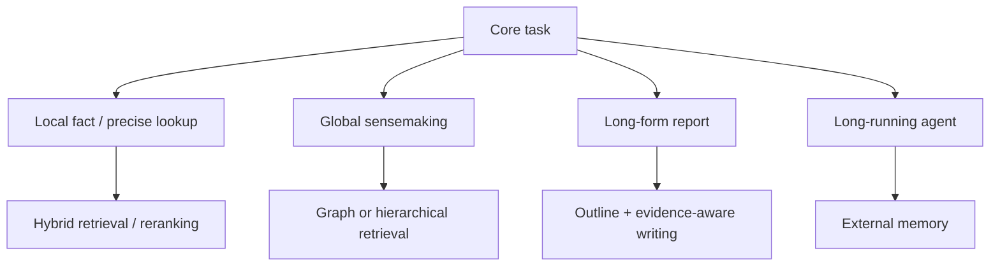

# ⚖️ 技術全景與 Pareto 權衡分析 (Trade-offs & Decision Matrix)

> [!IMPORTANT] 核心工程理念
> 在處理超長文件時，**沒有任何單一技術是萬靈丹（No Silver Bullet）**。
> 盲目追求 10M 原生上下文會讓您的 GPU 伺服器成本爆表；而盲目採用傳統 Vector RAG 則會讓全域總結任務完全失明。
> 優秀的系統架構師必須在 **準確率 (Accuracy)**、**延遲 (Latency)**、**顯存佔用 (VRAM)** 與 **營運成本 (Cost)** 之間找到最優的 **Pareto 前沿面 (Pareto Frontier)**。

---

## 一、四大主流長文本技術範式核心對比

| 評估指標 | 1. 原生 Long Context (Dense / FlashAttn) | 2. 密集向量 RAG (Hybrid Vector RAG) | 3. 圖結構檢索 (Microsoft GraphRAG) | 4. 階層樹狀檢索 (RAPTOR) |
| :--- | :--- | :--- | :--- | :--- |
| **代表技術** | [[03 - 論文庫 (Literature Notes)/Dao2022 - FlashAttention|FlashAttention]], [[03 - 論文庫 (Literature Notes)/Liu2023 - RingAttention|RingAttention]] | [[03 - 論文庫 (Literature Notes)/Karpukhin2020 - Dense Passage Retrieval (DPR)|DPR]], [[03 - 論文庫 (Literature Notes)/Khattab2020 - ColBERT Late Interaction|ColBERT]] | [[03 - 論文庫 (Literature Notes)/Edge2024 - Microsoft GraphRAG|Microsoft GraphRAG]] | [[03 - 論文庫 (Literature Notes)/Sarthi2024 - RAPTOR Recursive Tree Retrieval|RAPTOR]] |
| **輸入容量極限** | 128k ~ 2M Tokens (受顯存制約) | 無上限 (數億 Tokens) | 無上限 (全語料圖結構) | 書籍至百科級 (數百萬 Tokens) |
| **全域主題理解力** | ⭐⭐⭐⭐ (依賴模型長程注意力) | ⭐ (極差，斷章取義) | ⭐⭐⭐⭐⭐ (最強，社群摘要) | ⭐⭐⭐⭐ (遞迴抽象摘要) |
| **微觀事實檢索力** | ⭐⭐⭐⭐ (中間位置易遺忘) | ⭐⭐⭐⭐⭐ (細節關鍵字精準) | ⭐⭐⭐ (三元組可能遺失細節) | ⭐⭐⭐⭐ (底層 Chunk 精確) |
| **首字延遲 (TTFT)** | 慢 (秒至十秒級，隨長度暴增) | 快 (數十毫秒至百毫秒) | 慢 (需平行 Map 社群摘要) | 中等 (樹遍歷數百毫秒) |
| **索引構建成本** | 無 (即時 Prefill) | 低 (一次性向量計算) | 極高 (大量 LLM 實體與摘要呼叫) | 中高 (遞迴摘要 LLM 呼叫) |
| **推論 Token 成本** | 極高 (每次對話吃滿全文) | 極低 (僅傳輸 Top-K 段落) | 中高 (需彙整多個社群報告) | 中等 (傳輸樹枝節點摘要) |

---

## 二、架構決策流程圖 (Architectural Decision Flowchart)



**技術對照**：[[02 - 研究領域專題 (Research Domains)/Domain 03 - 先進 RAG 與檢索機制 (ColBERT, HyDE, Self-RAG)|Hybrid / Advanced RAG]] · [[02 - 研究領域專題 (Research Domains)/Domain 05 - Graph RAG 與結構化知識 (Microsoft GraphRAG, HippoRAG)|Graph RAG]] · [[02 - 研究領域專題 (Research Domains)/Domain 08 - 長篇生成與報告撰寫 (STORM, Evidence Store, Ledger)|Long-form Generation]] · [[02 - 研究領域專題 (Research Domains)/Domain 06 - 外部記憶體架構 (MemGPT, A-MEM, Working Memory)|External Memory]]

---

## 三、Pareto 前沿最優化策略矩陣

```text
               ▲ 任務準確度 / 宏觀理解力 (Accuracy & Sensemaking)
               │
               │                   ● 理想目標: 動態路由混合系統 (Domain 11 提案)
               │                     (Hybrid Router + Proposition + Ledger)
               │
               │             ● GraphRAG (高準確、高成本)
               │
               │       ● RAPTOR (中高準確、中等成本)
               │
               │  ● Hybrid Vector RAG (高微觀細節、極低成本)
               │
               │● Pure Long Context (1M Tokens) (超高顯存與延遲)
               └──────────────────────────────────────────────►
                                          系統吞吐量與經濟性 (Throughput & Low Cost)
```

1. **極致成本敏感型系統**：
   - 採用 **[[03 - 論文庫 (Literature Notes)/Jiang2023 - LongLLMLingua|LongLLMLingua]]** 進行 Prompt 4x 壓縮 + **[[03 - 論文庫 (Literature Notes)/Liu2024 - KIVI 2-bit KV Cache|KIVI 2-bit]]** 快取量化，兩種技術分別處理 prompt token 與 KV-cache；不可把不同論文、不同測試條件下的改善直接相乘或推成「整台伺服器吞吐量 4×、總 VRAM -75%」。應在相同模型、context、batch 與硬體下重新量測。
2. **極致精度敏感型系統 (醫療/法律/國防情報)**：
   - 前端採用 **[[03 - 論文庫 (Literature Notes)/Chen2023 - Dense X Proposition Retrieval|Dense X 命題解構]]**；
   - 檢索端採用 **[[03 - 論文庫 (Literature Notes)/Khattab2020 - ColBERT Late Interaction|ColBERT]]** 延遲交互 + **[[03 - 論文庫 (Literature Notes)/Edge2024 - Microsoft GraphRAG|GraphRAG]]** 全局社群；
   - 生成端強制掛載 **[[02 - 研究領域專題 (Research Domains)/Domain 08 - 長篇生成與報告撰寫 (STORM, Evidence Store, Ledger)|Claim-Evidence Ledger]]** 進行逐句證據鏈校驗。

---

## 四、主流 RAG 框架生態與 Evidence-Governed Harness 的定位

框架層比較屬於**快速變動的工程選型資訊**，不應在本 Pareto 頁重複維護固定的模型大小、VRAM、TTFT、解析延遲或「誰最強」等敘述。這些數字高度依賴版本、模型、硬體、資料與部署方式；若沒有同條件 benchmark，不可直接比較。

完整的框架定位、委託邊界與待核驗事項集中維護於：

- [[04 - 研究想法與待驗證提案 (Ideas & Hypotheses)/Idea 06 - 主流 RAG 框架生態與系統定位分析 (Framework Landscape & Positioning)|Idea 06: 主流 RAG 框架生態與系統定位分析]]
- [[04 - 研究想法與待驗證提案 (Ideas & Hypotheses)/Idea 05 - Evidence-Governed RAG 系統架構構想 (Delta Pipeline Design)|Idea 05: Evidence-Governed RAG 系統架構構想]]

> [!IMPORTANT] 比較原則
> LangChain / LangGraph、AutoRAG、Haystack、Dify、RAGFlow、MinerU、Docling 等工具的能力必須以**使用版本的官方文件 / 官方 repository**為準；Evidence-Governed Harness 則是本專案的 proposed architecture。框架比較用於回答「哪些通用能力應借力、哪些研究假設值得自研與 ablation」，不是產品排名。

### 建議的工程選型順序

1. 先定義任務與資料契約：QA、長篇報告、RFP、表格/PDF、multi-hop 或 multimodal。
2. 再定義不可妥協的 invariant：coverage、provenance、citation/entailment、authority、sufficiency。
3. 對 parsing、retrieval、pipeline runtime、UI、evaluation 分別建立可替換 adapter。
4. 以同一 dataset、同一模型與相同 compute / token budget 做 benchmark，再決定是否委託既有框架。
5. 將 F/R/D/A/P/C/T、Evidence Governance 與 deterministic repair 視為**待驗證研究假設**，而不是預設優於現有框架的既定事實。

## 相關導覽與文獻快速跳轉

- **回主目錄**：[[00 - 導覽與心智圖 (Navigation & MOC)/Home (主目錄與知識庫導覽)|主目錄與知識庫導覽]]
- **專題深入**：[[02 - 研究領域專題 (Research Domains)/Domain 04 - Chunking 策略與知識擷取 (Proposition, Cross-chunk)|Domain 04: 知識擷取與證據治理]]
- **長篇生成**：[[02 - 研究領域專題 (Research Domains)/Domain 08 - 長篇生成與報告撰寫 (STORM, Evidence Store, Ledger)|Domain 08: STORM 與 Claim-Evidence Ledger]]
- **研究藍圖**：[[02 - 研究領域專題 (Research Domains)/Domain 11 - 最具價值的研究方向與實驗設計 (Research Roadmap)|Domain 11: 研究提案與消融實驗設計]]
