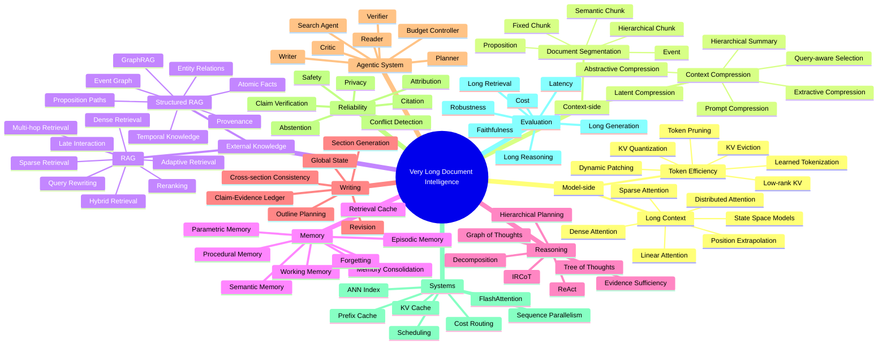
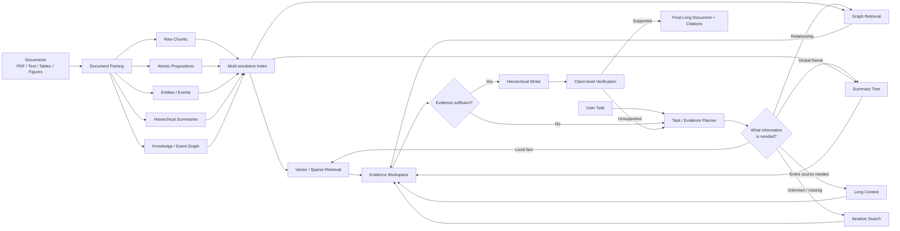
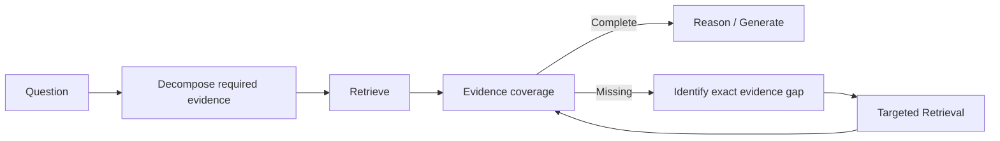
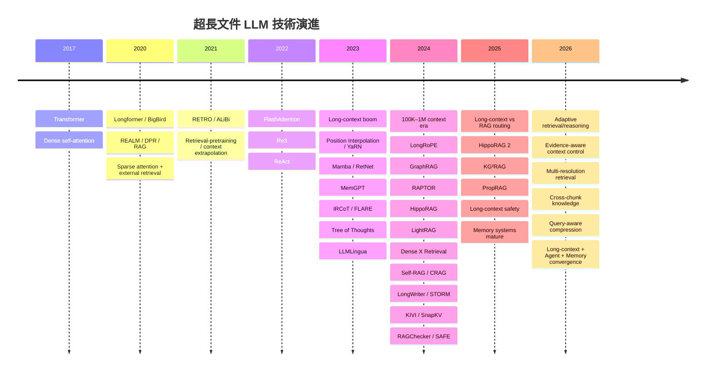
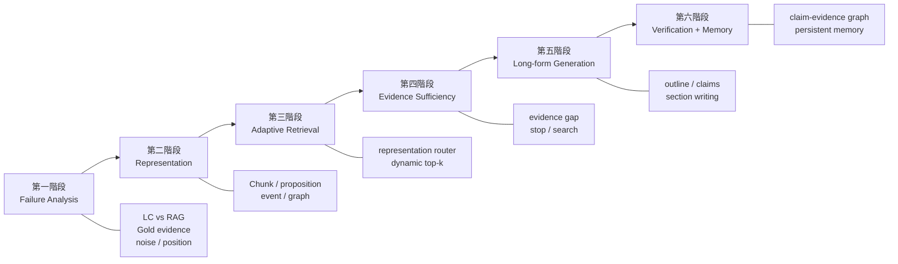

> [!ABSTRACT] 報告導覽
> 本文件為 ChatGPT Deep Research 生成之 **5 萬字超長文件閱讀與撰寫技術全景報告** 正體中文繁體修訂版。
> 全面貫穿：**模型層 (Long Context, Compression)** $\rightarrow$ **資料與檢索層 (RAG, GraphRAG, Memory)** $\rightarrow$ **推理與生成層 (Hierarchical Reasoning, STORM, Verification)** $\rightarrow$ **評估與安全 (Benchmarks, Safety)**。
> - **回主目錄**：[[00 - 導覽與心智圖 (Navigation & MOC)/Home (主目錄與知識庫導覽)|主目錄與知識庫導覽]]
> - **心智圖**：[[00 - 導覽與心智圖 (Navigation & MOC)/LLM 超長文件處理心智圖 (MOC)|超長文件處理研究方向心智圖]]
> - **領域專題**：[[00 - 導覽與心智圖 (Navigation & MOC)/RAG Adjacent Interfaces|A01 Long Context & Sequence Architecture]]

---

# 超長文件閱讀與撰寫的 LLM 技術全景：從 Long Context、Compression、RAG、Memory 到 Agentic Long-Form Generation

## 執行摘要

截至 **2026 年 9 月**，「讓 LLM 真正讀懂並撰寫非常長的文件」已經不是單一的 **Long Context** 問題，而是一個跨越模型架構、記憶體系統、資訊檢索、知識表示、推理控制、長文生成、驗證與系統工程的完整研究領域。

你先前提供的材料其實已經抓到其中一條非常重要的研究主線：**Knowledge Representation → Evidence Sufficiency → Adaptive RAG → Context Utilization → Multi-hop → GraphRAG → Faithfulness → Long-context/RAG Routing**，以及「Chunk → Knowledge Extraction → Representation → Retrieval」這條知識處理路徑。 *(參考資料)*  本報告把它擴展成更完整的研究地圖。

最核心的觀念是：

> **Long Context 解決的是「能不能放進去」；真正的 long-document intelligence 要解決的是「放什麼、怎麼表示、怎麼找到、怎麼連起來、怎麼記住、怎麼推理、怎麼寫、怎麼驗證」。**

2026 年商用模型已經進入 **百萬 token 級 context window**；例如 OpenAI 與 Anthropic 的公開模型資料已出現約 1M context 級模型，Google 也公開支援 1M+ context 的 Gemini API。 但「1M token 可以輸入」絕不等於「1M token 都能等品質理解」。Lost in the Middle、RULER、HELMET、NoLiMa、LongBench Pro 等工作都指出，隨 context 變長，模型仍有位置敏感、干擾、跨距關係、multi-hop 與有效 context 明顯低於 nominal context 等問題。

因此，目前真正有前景的架構不是：

\[
\boxed{\text{把整份文件全部塞進 LLM}}
\]

而逐漸變成：

\[
\boxed{
\text{Long Context}
+
\text{Retrieval}
+
\text{Compression}
+
\text{Memory}
+
\text{Structured Knowledge}
+
\text{Planning}
+
\text{Verification}
}
\]

而且這些元件必須由一個 **budget-aware / evidence-aware controller** 動態決定何時使用。

我會把整個領域分成下列十二條主研究線：

| 大方向 | 真正要解決的問題 | 2026 成熟度 | 我認為的研究空間 |
|---|---|---:|---:|
| Long-context Architecture | 模型如何計算超長 sequence | ★★★★☆ | ★★★☆☆ |
| Token / KV Compression | 如何降低每 token 的計算與記憶成本 | ★★★★☆ | ★★★★☆ |
| Context Compression | 如何只保留真正有資訊的 context | ★★★☆☆ | ★★★★★ |
| Retrieval / RAG | 外部知識怎麼找 | ★★★★☆ | ★★★★☆ |
| Knowledge Representation / GraphRAG | 文件要以什麼知識單位儲存 | ★★★☆☆ | ★★★★★ |
| Memory | 跨任務、跨 session 怎麼長期記憶 | ★★☆☆☆ | ★★★★★ |
| Hierarchical Reasoning | 怎麼跨數百頁做多步推理 | ★★★☆☆ | ★★★★★ |
| Long-form Generation | 怎麼穩定寫數萬字而不失控 | ★★★☆☆ | ★★★★★ |
| Agentic Orchestration | 怎麼動態控制搜尋、閱讀、寫作、驗證 | ★★★☆☆ | ★★★★★ |
| Verification / Faithfulness | 每一個 claim 是否真的有證據 | ★★★☆☆ | ★★★★★ |
| Evaluation / Systems | 怎麼知道改善是真的、且成本值得 | ★★★☆☆ | ★★★★★ |
| Safety / Privacy | 長 context、RAG、memory 的新攻擊面 | ★★☆☆☆ | ★★★★★ |

其中我最看好的下一階段研究，並不是再把 context 從 1M 延伸到 2M、4M、10M，而是：

\[
\boxed{
\text{Query-aware}
+
\text{Evidence-aware}
+
\text{Multi-resolution}
+
\text{Cost-aware}
+
\text{Verifiable}
}
\]

也就是：**不是永遠「讀更多」，而是知道現在究竟需要讀什麼。**

## 整體研究地圖與心智圖

先把問題重新定義。

一份 1000 頁文件的「閱讀與撰寫」其實至少包含七種完全不同的能力：

\[
\text{Store}
\rightarrow
\text{Find}
\rightarrow
\text{Represent}
\rightarrow
\text{Integrate}
\rightarrow
\text{Reason}
\rightarrow
\text{Write}
\rightarrow
\text{Verify}
\]

任何一層失敗，最後都可能表現成「LLM 回答錯了」。

例如：

> 找不到證據 ≠ 沒有證據  
> 找到證據 ≠ 能理解證據  
> 理解證據 ≠ 能做跨文件推理  
> 推理正確 ≠ 長文一定一致  
> 有 citation ≠ citation 真的支持 claim

這也是為什麼單純拿 Answer Accuracy 衡量 RAG 很容易把真正的問題藏掉。RAGChecker、ARES、ALCE 等工作都轉向拆開檢索、生成、faithfulness 與 citation quality 評估。

### 心智圖



另一種比較工程化的看法，是把未來 long-document system 看成一個 **多解析度知識處理器**：



我認為這張圖比「RAG pipeline」更接近接下來幾年的真正研究方向。

關鍵的架構變化是：

\[
\text{Query}\rightarrow\text{Retrieve}\rightarrow\text{Generate}
\]

正在逐漸變成：

\[
\begin{aligned}
\text{Task}
&\rightarrow \text{Decompose Evidence Requirements}\\
&\rightarrow \text{Choose Representation}\\
&\rightarrow \text{Retrieve / Read / Compress}\\
&\rightarrow \text{Check Evidence Gap}\\
&\rightarrow \text{Reason}\\
&\rightarrow \text{Draft}\\
&\rightarrow \text{Verify Claims}\\
&\rightarrow \text{Retrieve Again if Needed}\\
&\rightarrow \text{Finalize}
\end{aligned}
\]

這也是你的原始材料中「Evidence Sufficiency + Adaptive RAG + Knowledge Representation」其實可以進一步合成一個更大的研究題目的原因。 *(參考資料)* 

## 模型層：Long Context、Token Compression 與 Context Compression

### Long-context 模型不是一條技術，而是六條

**Dense exact attention。** 原始 Transformer 的 self-attention 讓所有 token 彼此互相注意；其 attention score 計算量隨 sequence length \(L\) 約呈 \(O(L^2)\)。 FlashAttention 並沒有把 dense attention 變成線性複雜度，而是透過 IO-aware tiling 避免反覆搬移與完整 materialize 巨大的 attention matrix，讓 exact attention 在 GPU 上實際可跑得更快、更省記憶體。

假設：

\[
L=128K=131072
\]

單一 attention head 的 pair 數：

\[
L^2
=
131072^2
=
17,179,869,184
\]

也就是一層、一個 head 就有約 **171.8 億個 query-key pair**。

所以 FlashAttention 解決的是：

> 不要把這 171.8 億個 score 全部寫到昂貴的 HBM 再讀回來。

它不是說：

> 這 171.8 億個 pair 從此不用算。

這個區別非常重要。

**Sparse attention。** Longformer 使用 sliding-window local attention 加少量 global token，使複雜度能接近 sequence length 線性增長；BigBird 則加入 local、global 與 random sparse connectivity，亦以降低長序列成本為目標。

研究問題仍包括：

- 哪些 token 應該彼此相連？
- sparse pattern 固定還是 query-adaptive？
- multi-hop reasoning 所需的遠距依賴是否剛好被 sparse mask 切掉？
- sparse attention 能不能與 retrieval 做成同一個 learned routing 問題？

**Approximate / linear attention。** Reformer 以 LSH 近似 attention，Performer 則以 FAVOR+ random features 近似 softmax attention，使 attention 計算更加接近線性。

此方向的本質代價是：

\[
\text{Exact content interaction}
\longleftrightarrow
\text{Efficiency}
\]

越 aggressive 的近似，越需要證明關鍵遠距訊息沒有被近似掉。

**Recurrent / State Space。** RWKV、RetNet、Mamba 則試圖從根本上避免完整 \(L\times L\) attention。RetNet 支援 parallel、recurrent 與 chunkwise recurrent 計算；Mamba 的 selective state-space mechanism 使 computation 隨 sequence length 線性增長，其論文亦展示到 million-length sequence 的實驗。

這條線最大的研究問題不是 throughput，而是：

> **有限維度 state 能不能保留需要任意回查的長距離資訊？**

對語言而言，「昨天的狀態」不是總能被壓成固定 state；有時你真的需要回去找到第 432,117 個 token 的某一句原文。

因此 SSM 很有效率，但 random access / exact recall 與 content-addressable memory 仍是 attention/retrieval 的重要優勢。Mamba 論文本身也是從傳統 SSM 在 content-based reasoning 上的弱點出發設計 selective mechanism。

**Position extension。** ALiBi、Position Interpolation、YaRN、LongRoPE 等研究的是「模型如何在比訓練時更長的位置範圍工作」。Position Interpolation 將 RoPE 位置縮放回訓練範圍；YaRN 改善這類 context extension 的訓練效率；LongRoPE 則報告將 context 擴展到 2.048M token。

但這些方法主要解決：

\[
\text{position representation / extrapolation}
\]

不自動解決：

\[
\text{long-range information utilization}
\]

這正是「nominal context ≠ effective context」。

**Distributed long attention。** Ring Attention 把 sequence blocks 沿多裝置環狀傳遞，使 sequence length 可以隨 device 數增加；DeepSpeed Ulysses 則以 sequence parallel all-to-all 分割長序列 attention。

這非常適合「我有很多 GPU，要真的做 full attention」，但問題只是從單 GPU memory 轉成：

\[
\text{compute}
+
\text{communication}
+
\text{synchronization}
\]

### Long Context 到底做到什麼程度？

最大的陷阱是拿 Needle-in-a-Haystack 當成「長文件理解」。

Lost in the Middle 顯示模型常對 context 中間位置的資訊使用能力下降。 RULER 特別加入 multi-hop tracing、aggregation 等比單一 needle 更難的任務；其研究指出，在當時測試的模型中，即使宣稱支援至少 32K context，只有一部分能在 32K 下維持令人滿意的效果。

HELMET 更重要：它發現 Needle-in-a-Haystack 能力和真實 downstream long-context task 不一定高度相關。

NoLiMa 刻意移除 query 與 target 的直接 lexical overlap，結果模型在 context 變長後顯著退化；LongBench Pro 在 2026 年進一步評估 8K–256K 的自然長文本，也指出模型的「effective length」通常低於 advertised length。

因此現在比較合理的定義是：

\[
\boxed{
L_\text{effective}
=
\max L:
Q(L)\geq \tau
}
\]

不是問：

\[
L_\text{max input}=?
\]

而是問：

> 在長度 \(L\) 下，specific task quality \(Q(L)\) 還能不能高於要求 \(\tau\)？

這會是比「最大 context window」更科學的衡量方式。

### Token compression 其實有四種不同問題

很多文章把「token compression」混在一起談，這容易出錯。

#### Tokenizer / representation compression

MEGABYTE 不使用傳統 subword token，而以 byte patches 和 global/local multiscale model 建模，論文展示 million-byte sequences。

Meta 的 **Byte Latent Transformer（BLT）** 更進一步使用動態大小 byte patches；patch boundary 依 next-byte entropy 決定，在容易預測的位置用較大 patch、困難位置使用更細的 computation。BLT 論文進行到 8B 參數、4T training bytes 的 FLOP-controlled scaling study。

這是很有意思的研究方向：

\[
\text{固定 tokenization}
\rightarrow
\text{information-adaptive computational unit}
\]

也就是：

> 為什麼「the」與一段高 entropy 數學式都必須佔同一個 attention step？

未來可以發展成：

\[
\text{semantic entropy}
\rightarrow
\text{adaptive token granularity}
\]

這比單純讓 BPE vocabulary 更大更值得研究。

#### Prompt token pruning

LLMLingua 用小模型評估 prompt 裡 token 的重要性，再進行 coarse-to-fine compression，論文報告在部分任務可達約 20× compression；LongLLMLingua 更加入 query relevance 與位置因素，針對長 context 壓縮。

Selective Context 則依 contextual information 衡量 redundancy，移除低資訊內容；論文報告約 50% context reduction 時仍能維持大部分品質。

這類研究真正的難點是：

\[
\text{Importance before knowing final answer}
\]

因為你必須在「還不知道答案」時先決定哪些 token 不重要。

錯刪一個 `not`，可能比保留 1000 個多餘形容詞嚴重。

#### KV-cache pruning / compression

這不是刪掉 input text，而是模型已經處理過 token 後，只保留較重要的 Key/Value state。

H2O 利用 heavy-hitter token 與最近 token；Scissorhands 利用重要性持續性；SnapKV 以 prompt 後端 observation window 判斷各 attention head 需要的 KV；PyramidKV 則依不同 layer 分配不同 cache budget。

Quest 則讓 sparse KV access 依目前 query 決定，而不是永久刪除某些 token。

這裡有一個非常好的研究分界：

\[
\boxed{
\text{Static compression}
\quad vs \quad
\text{Query-conditioned compression}
}
\]

後者理論上更合理，因為某個 token 對 Query A 沒用，不代表對 Query B 沒用。

#### KV quantization / low-rank compression

KIVI 發現 Key 與 Value 的 outlier pattern 不同，因此使用 asymmetric 2-bit KV quantization；其論文報告可顯著降低記憶體並提高 batch capacity。

2026 的 OjaKV 則研究 online low-rank KV compression，而且可與 token selection 疊加。

為什麼這很重要？

假設一個 GQA 模型：

\[
L=131072
\]

\[
N_\text{layer}=32
\]

\[
N_\text{KV-head}=8
\]

\[
d_\text{head}=128
\]

FP16，每 element = 2 bytes。

單 request KV cache 大約：

\[
M_\text{KV}
=
2
\times L
\times N_\text{layer}
\times N_\text{KV-head}
\times d_\text{head}
\times b
\]

前面的 \(2\) 是 K 和 V。

代入：

\[
M=
2\times131072\times32\times8\times128\times2
\]

\[
=17,179,869,184\text{ bytes}
\approx16\text{ GiB}
\]

也就是光 128K context 的 KV cache，這組假設下 **單一 request 約 16 GiB**。

如果理想地降成 2-bit：

\[
16\text{ GiB}\times \frac{2}{16}
=
2\text{ GiB}
\]

實際系統還會有 scale、metadata、packing、residual cache 等額外開銷，但你可以看到研究價值在哪裡。KIVI、SnapKV 等工作的核心動機正是這種 KV cache bottleneck。

### Context compression 與 Token compression 必須分開

Context compression 研究的是：

> 「語意上到底應該把什麼資訊給 LLM？」

這與「KV 用 2-bit 還 16-bit」完全不同。

目前可以分成：

| 類型 | 核心作法 | 代表方法 | 最大風險 |
|---|---|---|---|
| Extractive | 留下重要句子/段落 | Selective Context | 割裂語境 |
| Token-level | 刪低資訊 token | LLMLingua | 否定、條件被刪 |
| Abstractive | 重寫成更短摘要 | RECOMP | hallucination |
| Hierarchical | 多層摘要 | RAPTOR | 多層資訊流失 |
| Learned latent | 文字壓成 latent vectors | ICAE / Gisting | 不可解釋 |
| Retrieval embedding | retrieval result 壓成少量 embedding | COCOM / xRAG | detail loss |
| Query-conditioned | 根據 query 決定壓什麼 | LongLLMLingua / newer selectors | query dependency |

RECOMP 訓練 extractive/abstractive compressor 直接為 downstream task 選 context，甚至允許回傳 empty context。 Gisting 讓模型學習把 prompt 壓縮成少數「gist tokens」；ICAE 則把 context 壓入 learned memory slots。

COCOM 研究把 retrieved context 壓成 context embeddings；xRAG 更激進，試圖直接利用 dense retrieval embedding 經 adapter 接入 LLM，減少把整篇 retrieved text token 化後再處理的成本。

RAPTOR 則走不同路線：它遞迴進行 embedding、clustering、summarization，建立從 raw chunk 到高階摘要的 retrieval tree，使 query 可以取回不同 abstraction level 的資訊。RAPTOR 在 ICLR 2024 報告對 QuALITY 等長文件 QA 有顯著改善。

這裡還有一個非常漂亮的研究問題：

\[
\boxed{
\text{最佳 compression ratio 應該是 query-dependent，而不是 constant。}
}
\]

比如：

「這份 datasheet 的 VDD operating range 是多少？」

可能只需要 20 tokens。

但：

「分析這顆 IC 的 startup、soft-start、UVLO、OCP 和 thermal shutdown 之間的互動。」

可能需要完整 5–10 頁。

所以 compression ratio \(r\) 應該是：

\[
r=f(q,\text{document},\text{evidence uncertainty},B)
\]

而不是固定 \(r=0.2\)。

這一塊到 2026 仍有非常大的研究價值。

### 模型與 Compression 方法比較

| 方法 | Core idea | 優點 | 缺點 | 典型可處理尺度 | Compute / Cost | 代表論文 |
|---|---|---|---|---|---|---|
| Dense Attention | 全 token pair interaction | 表達力最直接 | \(O(L^2)\) | 取決於硬體/模型，現已到 1M 級產品 | 很高 | [[03 - 論文庫 (Literature Notes)/01 - Long Context & Sequence/(NeurIPS 2017-12) Attention Is All You Need|Vaswani et al., 2017]]  |
| FlashAttention | IO-aware exact attention | exact、不犧牲 attention 定義 | compute 仍近 quadratic | 長度由模型/記憶體決定 | 中高 | [[03 - 論文庫 (Literature Notes)/01 - Long Context & Sequence/(NeurIPS 2022-12) FlashAttention - Fast and Memory-Efficient Exact Attention with IO-Awareness|Dao et al., 2022]]  |
| Longformer | local + global sparse attention | 線性級 memory scaling | sparse topology 固定 | 數千～數萬級設計 | 中 | [[03 - 論文庫 (Literature Notes)/01 - Long Context & Sequence/(ACL 2020-07) Longformer - The Long-Document Transformer|Beltagy et al., 2020]]  |
| BigBird | local + random + global | sparse 且具理論分析 | implementation 複雜 | 長 document | 中 | [[03 - 論文庫 (Literature Notes)/01 - Long Context & Sequence/(NeurIPS 2020-12) Big Bird - Transformers for Longer Sequences|Zaheer et al., 2020]]  |
| Mamba | selective SSM | linear sequence scaling | random access 不如 attention 直接 | 論文測到 million-length | 低～中 | [[03 - 論文庫 (Literature Notes)/01 - Long Context & Sequence/(arXiv 2023-12) Mamba - Linear-Time Sequence Modeling with Selective State Spaces|Gu & Dao, 2023]]  |
| LongRoPE | positional extension | 可把既有 RoPE 模型拉長 | 不保證 long reasoning | 論文最高 2.048M | finetuning 成本 | [[03 - 論文庫 (Literature Notes)/01 - Long Context & Sequence/(ICML 2024-07) LongRoPE - Extending LLM Context Window Beyond 2 Million Tokens|Ding et al., 2024]]  |
| Ring Attention | sequence distributed over devices | 超長 exact attention | communication 高 | million 級可行 | 很高 | [[03 - 論文庫 (Literature Notes)/01 - Long Context & Sequence/(ICLR 2024-05) RingAttention with Blockwise Transformers for Near-Infinite Context|Liu et al., 2023]]  |
| LLMLingua | token importance compression | 不需模型吃完整 prompt | 可能刪重要細節 | 原文可為 context 的多倍 | 低～中 | [[03 - 論文庫 (Literature Notes)/02 - Compression & KV Cache/(EMNLP 2023-12) LLMLingua - Compressing Context for Accelerated Inference of Large Language Models|Jiang et al., 2023]]  |
| RECOMP | task-trained context compressor | query/task-aware | 要訓練 compressor | corpus 任意，LLM 吃 compressed result | 中 | [[03 - 論文庫 (Literature Notes)/02 - Compression & KV Cache/(ICLR 2024-05) RECOMP - Improving Retrieval-Augmented LMs with Compression and Selective Augmentation|Xu et al., 2023]]  |
| Gisting | learned gist tokens | 高 compression | 需 training；interpretability 低 | 依訓練設定 | 中 | [[03 - 論文庫 (Literature Notes)/02 - Compression & KV Cache/(NeurIPS 2023-12) Learning to Compress Prompts with Gist Tokens|Mu et al., 2023]]  |
| KIVI | 2-bit KV cache | 大幅降低 VRAM | quantization error | 原 context 不變 | 很低 runtime overhead | [[03 - 論文庫 (Literature Notes)/02 - Compression & KV Cache/(ICML 2024-07) KIVI - A Tuning-Free Asymmetric 2-bit Quantization for KV Cache|Liu et al., 2024]]  |
| SnapKV | important KV selection | 節省 memory 與 generation time | query/task robustness 仍要驗證 | paper 展示超長 cache | 低 | [[03 - 論文庫 (Literature Notes)/02 - Compression & KV Cache/(arXiv 2024-04) SnapKV - LLM Knows What You are Looking for Before Generation|Li et al., 2024]]  |
| BLT | entropy-based byte patches | 無固定 tokenizer、adaptive compute | 要重新預訓練模型 | byte-level large scale | pretraining 高 | [[03 - 論文庫 (Literature Notes)/02 - Compression & KV Cache/(arXiv 2024-12) Byte Latent Transformer - Patches Scale Better Than Tokens|Pagnoni et al., 2024]]  |

**目前代表性活躍團隊**包括 Stanford 的 long-context / FlashAttention 系統研究線、Microsoft Research 的 context extension / compression / GraphRAG 研究線、Google/DeepMind 的 long-context 與 retrieval-augmented modeling、Meta FAIR 的 retrieval/token-free modeling，以及 Berkeley 等系統團隊的 serving/cache 研究；這裡不把「leading」作正式排名，而應視為幾條高影響力的代表性研究脈絡。上述各方法的作者與發表來源可由原始論文確認。

## RAG、知識擷取、GraphRAG 與 Memory：如何決定「讀什麼」

Long Context 解決：

\[
\text{Can I read it?}
\]

RAG 解決：

\[
\text{What should I read?}
\]

Knowledge Representation 解決：

\[
\text{In what form should I remember it?}
\]

Memory 解決：

\[
\text{What should persist after this query?}
\]

這四個其實是不同問題。

### RAG 本身至少應再細分成九類

**Dense retrieval。** DPR 使用 dual encoder，把 query 與 passage 映射到同一 embedding space，奠定現代 dense retrieval 的重要基礎。

**Late-interaction retrieval。** ColBERT 不把整段文件只壓成一個 vector，而保留 token-level representations，在 query time 做 late interaction；它是在「single-vector 成本」與「cross-encoder 表達力」之間的折衷。

這點到今天仍重要。2025 的研究還發現 dense embedding 存在 **granularity dilemma**：單一 embedding 要同時代表整體語意與細粒度 entity/event 並不容易。

**Query transformation。** HyDE 先由 LLM 生成 hypothetical relevant document，再 embedding 這份「假想答案文件」來檢索。 RQ-RAG 則進一步學習 rewrite、decompose 與 disambiguate query。

**Retrieval-then-read / RAG。** Lewis 等人的原始 RAG 將 parametric seq2seq model 與 dense non-parametric corpus memory 結合。

**Retrieval-augmented pretraining。** REALM 在 pretraining 階段就學習 latent retrieval；RETRO 讓 language model 從大型 retrieval database 找鄰近 text chunk；Atlas 也把 retriever 與 generator 共同用於 knowledge-intensive few-shot learning。

這和 inference-only RAG 本質不同：

\[
\text{LLM learns with retrieval}
\neq
\text{LLM suddenly receives retrieved text at deployment}
\]

**Iterative / multi-hop retrieval。** IRCoT 將 Chain-of-Thought 和 retrieval 交錯：

\[
R_1\rightarrow Reason_1
\rightarrow R_2\rightarrow Reason_2
\rightarrow \cdots
\]

因為下一次該搜尋什麼，通常必須等前一步推理完成才知道。其原始 ACL 2023 工作在多個 multi-hop QA benchmark 上同時改善 retrieval 與 QA。

**Active / Adaptive RAG。** FLARE 根據生成過程中的低信心內容主動 retrieval；Self-RAG 讓模型產生 reflection tokens 判斷是否需要 retrieve、證據是否 relevant、答案是否 supported；CRAG 則加入 retrieval evaluator 與 corrective retrieval。

Adaptive-RAG 依問題複雜度在「不 retrieval / 單次 retrieval / iterative retrieval」間 routing。

到 2026，研究已進一步變成「把 retrieval decision 本身當成 reasoning policy」：DeepRAG 將每一步選擇 retrieval 或 parametric reasoning 形式化為 sequential decision problem；LDAR 則特別處理 irrelevant retrieved context 對 generator 的 distraction。

這是目前非常值得做的線。

### Long Context 和 RAG 到底誰贏？

答案不是「RAG 一定贏」，也不是「1M context 之後 RAG 死了」。

ICML 2025 的 LaRA 系統性比較多個 LLM、context length 與 task，結論是 Long Context 與 RAG 沒有 universal winner；結果取決於 model、task、input length、retrieval quality 等條件。

一個比較正確的 formulation 是：

\[
a^*
=
\arg\max_{a\in
\{\text{LC},\text{RAG},\text{Hybrid}\}}
\left[
Q(a)-\lambda C(a)
\right]
\]

其中：

- \(Q(a)\)：答案品質；
- \(C(a)\)：tokens、GPU time、retrieval latency、API cost；
- \(\lambda\)：你的成本敏感度。

也就是把「Long Context vs RAG」從架構宗教戰爭，轉成 **routing / optimization problem**。

### Chunking 其實是知識表示問題

這正好是你原本最感興趣的問題。

傳統：

\[
Document
\rightarrow
512\text{-token chunks}
\rightarrow
Embedding
\]

有個很大的隱含假設：

> 512 token 剛好是一個合理的知識單位。

通常不是。

Dense X Retrieval 將 passage 轉成 **propositions**：

> 可獨立理解、描述單一 factoid 的自然語言單位。

研究顯示 proposition-level indexing 在其實驗中可改善 retrieval 及 downstream QA under fixed budget。

所以現在 retrieval granularity 至少有：

\[
\boxed{
Document
\supset
Section
\supset
Passage
\supset
Sentence
\supset
Proposition
\supset
Entity/Event
}
\]

而「哪一層最好」並沒有固定答案。

AGRaME 甚至研究 **any-granularity ranking**，希望同一份 representation 能在 sentence / proposition 等不同粒度排名。

這裡我認為有非常大的未解問題：

\[
\boxed{
g^*=f(q)
}
\]

即：

> retrieval granularity 應該由 query 決定。

例如：

「這顆 regulator 的最大 VIN？」

適合 proposition。

「為什麼它在 light-load 會切換 PFM？」

需要 paragraph/section。

「整份 datasheet 的 power sequencing 架構？」

需要 hierarchy。

### Chunk → Knowledge Extraction → GraphRAG

你的先前材料特別關注這條線，這確實已形成一個成熟但仍未解完的研究群。 *(參考資料)* 

Microsoft **GraphRAG** 從 text units 擷取 entity / relation 等資訊、建立 graph，再進行 community detection 與 community summarization，使系統能回答不只「某一段寫了什麼」，還包含整個 corpus 的 global question。原始 GraphRAG 工作的核心就是改善 naive RAG 在 corpus-level query-focused summarization 上的能力。

HippoRAG 利用 OpenIE-like relational knowledge graph 與 Personalized PageRank 模擬 associative retrieval，針對跨文件 multi-hop knowledge retrieval。

LightRAG 將 graph structure 與 vector retrieval 結合，並特別處理 incremental update。

KG²RAG 的設計則非常值得注意：

\[
\text{semantic retrieval}
\rightarrow
\text{seed chunks}
\rightarrow
\text{KG expansion}
\rightarrow
\text{chunk organization}
\]

也就是「Graph 負責找關係，Raw Chunk 負責保留完整 evidence」。

這往往比直接讓 triple 取代原文更安全。

### 為什麼 Triple 不一定是最好知識表示？

假設原文：

> A 公司於 2026 年宣布計畫收購 B 公司，但交易仍待主管機關核准。

壓成：

```text
(A Company, acquire, B Company)
```

你已經失去：

- announced；
- planned；
- 尚未完成；
- regulatory approval pending；
- 有效時間；
- 原始來源。

於是所謂「knowledge extraction」反而製造 hallucination。

PropRAG 就明確指出簡單 triple 可能有 **context collapse** 問題，因此使用較富語境的 proposition 並在 proposition paths 上搜尋 multi-hop evidence。

2026 的 E²RAG 進一步區分 entity graph 與 event graph，意圖保留時間和因果結構。

因此我會把未來長文本與企業級交付物系統的 Knowledge Representation 寫成具備時空、模態與約束屬性的多元組：

\[
K=
(
\text{claim},
\text{entity},
\text{event},
\text{time},
\text{condition},
\text{modality},
\text{negation},
\text{source},
\text{confidence}
)
\]

而不是單純的：

\[
K=(subject,predicate,object)
\]

### 從被動檢索走向「端到端證據治理流水線」(Evidence-Governed Pipeline)

在嚴肅工程規格、招標提案（RFP）與審計報告等場景中，單純的 $Q \rightarrow \text{Retrieve} \rightarrow A$ 遠遠不足以保證交付品質。必須將知識抽取提升為完整的證據治理閉環：

\[
\boxed{D \longrightarrow K \longrightarrow E \longrightarrow C \longrightarrow V \longrightarrow O}
\]

- **$D$ (Documents)**：原始文件集合，透過 Source Manifest 嚴格記錄檔案雜湊（sha256）、版本時間戳與來源路徑。
- **$K$ (Knowledge Extraction & Typing)**：結構化解析（章節/段落/表格/單元格）並抽取為具備操作語意的類型化企業知識（F/R/D/A/P/C/T）。
- **$E$ (Evidence Objects)**：封裝帶有文檔絕對定位（Structural Path & Span）、時效性與權威度（Authority）的證據單元。
- **$C$ (Claims)**：基於大綱與特定章節需求生成的候選主張，顯式錨定候選證據。
- **$V$ (Deterministic Validation & Invariants)**：確定性硬約束校驗，若需求覆蓋不足或證據不充分，直接觸發自動化修復迴圈（Automated Repair Loop）。
- **$O$ (Output Artifact)**：導出逐句證據背書、完整審計日誌與風險宣告的正式交付物。

### 企業級知識分類體系 (F/R/D/A/P/C/T) 與操作語意

知識分類絕非被動的 Metadata 標籤，其核心價值在於定義**操作語意（Operational Semantics）**：

\[
\boxed{\text{type}(x) \Longrightarrow \text{allowed\_operations}(x)}
\]

1. **F = Fact (客觀事實)**：客觀已發生的數據與現狀；具最高權威度，可作為效能宣稱的有力證據。
2. **R = Requirement (需求條件)**：客戶規格與招標約束；**下游方案必須 100% 覆蓋**（$Coverage(R) = 1.0$），不可被當作能力或事實，違反則校驗失敗。
3. **D = Confirmed Design (確認設計)**：團隊已敲定的架構決策；作為系統骨幹。
4. **A = Assumption (假設條件)**：暫時設定之未證前提；必須顯式標註風險宣告，若推翻需重新計算。
5. **P = Proposal (建議方案)**：候選實施路徑；需對齊相關需求 R 並論證其合理性。
6. **C = Capability (現有能力)**：組織現有功能與實績；需引用歷史測試報告背書。
7. **T = Terms (術語規範)**：跨章節統一業務名詞定義，消除歧義。

### 四層證據階梯：超越表面引用 (Beyond Surface Citation)

傳統 RAG 以為生成內容加上 `[Doc A, p.3]` 即代表回答可信，但真實的審計存在四個嚴格層次：

\[
\boxed{\text{Citation} \neq \text{Entailment} \neq \text{Authority} \neq \text{Sufficiency}}
\]

1. **Citation（表面引用）**：僅輸出文檔指向標籤，極易被模型幻覺偽造。
2. **Entailment（語意蘊涵）**：透過 NLI 模型嚴格檢驗證據段落是否在邏輯上必然支持該 Claim。
3. **Authority（權威性與合法性）**：檢查文檔是否為最新有效版本，且證據類型與主張類型相容（如不能拿 Requirement 充當 Capability 證據）。
4. **Sufficiency（充分性）**：檢驗給定證據集合是否完整自足，無任何未言明的推論跳躍。


### Cross-chunk knowledge extraction 是很值得研究的一線

每個 chunk 獨立 extraction 有一個先天問題：

```text
Chunk A:
The TPSxxxx enters current-limit mode at 3.2 A.

Chunk B:
Under this condition, thermal shutdown may subsequently...
```

Chunk B 的 `this condition` 是跨 chunk reference。

如果 Chunk B 單獨 extraction：

> thermal shutdown occurs.

意思就可能改掉。

2026 的 CrossAug 預印本已直接把 **chunk-local extraction 遺漏 cross-chunk relation** 定義成研究問題，使用 GNN 找值得補關係的區域，再選擇性呼叫 LLM。因為目前它是預印本，應把它視為近期研究訊號，而不是已完全確立的方法。

非常值得深入的是：

\[
\text{cross-chunk coreference}
+
\text{event continuation}
+
\text{temporal continuity}
+
\text{condition inheritance}
\]

電子工程 datasheet、專利、標準文件尤其適合做這種研究。

### Memory 是 RAG 的下一步，但不是 RAG 的同義詞

RAG：

> 在 external corpus 裡找資料。

Memory：

> 決定過去發生什麼值得永久保存、如何更新與遺忘。

MemGPT 以 OS virtual memory 類比，在有限 context window 和 external memory tier 之間移動資訊，並展示 document analysis 與 multi-session chat。

Generative Agents 則明確維護 experience stream，依 recency、importance、relevance retrieval，再從 memories 形成 higher-level reflections。

MemoryBank 加入類似 forgetting curve 的長期 memory 更新。

Think-in-Memory 更進一步讓「thought」本身成為可 insert、merge、forget 的記憶單位。

MemoryLLM 研究 latent memory pool，即記憶不一定是可讀文字，而可以存在模型內部 continuous representation。

MemOS 則把 memory 提升成系統的一級資源，區分 parametric、activation 與 plaintext memory，提出統一管理框架。

所以可以畫成：

\[
\text{Memory}=
\begin{cases}
\text{Working} & \text{current context}\\
\text{Episodic} & \text{what happened}\\
\text{Semantic} & \text{what is known}\\
\text{Procedural} & \text{how to do}\\
\text{Parametric} & \text{weights}\\
\text{Latent} & \text{hidden memory vectors}
\end{cases}
\]

2026 真正沒解好的不是：

> 「怎麼存更多？」

而是：

> **什麼值得存？何時 consolidate？舊 knowledge 如何更新？矛盾 memory 如何 resolve？使用者要求刪除時怎麼真的 forget？**

這些問題甚至比 retrieval accuracy 更根本。

### RAG / Knowledge / Memory 方法比較

| Method | Core idea | Pros | Cons | 支援的「長度」 | Cost | 代表工作 |
|---|---|---|---|---|---|---|
| DPR | dual-encoder passage retrieval | 快、易建 ANN index | coarse semantic representation | corpus 幾乎不限 | 低 | [[03 - 論文庫 (Literature Notes)/03 - RAG & Retrieval/(EMNLP 2020-11) Dense Passage Retrieval for Open-Domain Question Answering|Karpukhin et al., 2020]]  |
| ColBERT | token-level late interaction | 細粒度 matching | index 較大 | corpus 幾乎不限 | 中 | [[03 - 論文庫 (Literature Notes)/03 - RAG & Retrieval/(SIGIR 2020-07) ColBERT - Efficient and Effective Passage Search via Contextualized Late Interaction over BERT|Khattab & Zaharia, 2020]]  |
| HyDE | hypothetical document query | zero-shot retrieval 強 | generator bias 可能污染 query | corpus unlimited | 中 | [[03 - 論文庫 (Literature Notes)/03 - RAG & Retrieval/(ACL 2023-07) Precise Zero-Shot Dense Retrieval without Relevance Labels|Gao et al., 2022]]  |
| Standard RAG | retrieve then generate | 簡單、可更新知識 | top-k 未必 sufficient | corpus unlimited；LLM 只吃 top-k | 低～中 | [[03 - 論文庫 (Literature Notes)/03 - RAG & Retrieval/(NeurIPS 2020-12) Retrieval-Augmented Generation for Knowledge-Intensive NLP Tasks|Lewis et al., 2020]]  |
| IRCoT | retrieval ↔ reasoning | multi-hop 強 | 多次 LLM/retrieval | corpus unlimited | 高 | [[03 - 論文庫 (Literature Notes)/03 - RAG & Retrieval/(ACL 2023-07) Interleaving Retrieval with Chain-of-Thought Reasoning for Knowledge-Intensive Multi-Step Questions|Trivedi et al., 2023]]  |
| Self-RAG | model learns retrieve/reflection | 動態、自我判斷 | 需要訓練；self-eval 可能錯 | unlimited corpus | 中高 | [[03 - 論文庫 (Literature Notes)/03 - RAG & Retrieval/(ICLR 2024-05) Self-RAG - Learning to Retrieve, Generate, and Critique through Self-Reflection|Asai et al., 2023]]  |
| RAPTOR | recursive summary tree | global + local abstraction | tree build、summary errors | book/corpus-level | 高 indexing | [[03 - 論文庫 (Literature Notes)/04 - Knowledge & Graph RAG/(ICLR 2024-05) RAPTOR - Recursive Abstractive Processing for Tree-Organized Retrieval|Sarthi et al., 2024]]  |
| Dense X | proposition retrieval | fine-grained evidence | extraction/index 爆量 | corpus unlimited | 中 | [[03 - 論文庫 (Literature Notes)/04 - Knowledge & Graph RAG/(EMNLP 2024-11) Dense X - Exploring the Limit of Proposition Retrieval for Open-Domain QA|Chen et al., 2024]]  |
| GraphRAG | entity graph + community summary | global corpus question、relationships | expensive indexing、extraction error | corpus-scale | 高 | [[03 - 論文庫 (Literature Notes)/04 - Knowledge & Graph RAG/(arXiv 2024-04) From Local to Global - A Graph RAG Approach to Query-Focused Summarization|Edge et al., 2024]]  |
| HippoRAG | KG + associative graph search | multi-hop relation | graph quality sensitive | corpus-scale | 中～高 | [[03 - 論文庫 (Literature Notes)/04 - Knowledge & Graph RAG/(NeurIPS 2024-12) HippoRAG - Neurobiologically Inspired Long-Term Memory for Large Language Models|Gutiérrez et al., 2024]]  |
| KG²RAG | vector seed + KG expansion | 保留 raw evidence | KG pipeline 複雜 | corpus-scale | 中～高 | [Zhu et al., 2025](https://aclanthology.org/2025.naacl-long.449/)  |
| PropRAG | proposition graph/path | 減少 triple context collapse | extraction cost | corpus-scale | 中～高 | [Wang & Han, 2025](https://aclanthology.org/2025.emnlp-main.1023/)  |
| MemGPT | hierarchical external memory | context 超過 model window | memory policy 難 | theoretically persistent | 中 | [[03 - 論文庫 (Literature Notes)/05 - Memory & Agents/(arXiv 2023-10) MemGPT - Towards LLMs as Operating Systems|Packer et al., 2023]]  |

## 推理、長文撰寫、Agent 與 Verification：如何從「找到資料」變成「完成文件」

真正的超長文件 writing，不應該視為一次 decoding：

\[
P(y_{1:N}|x)
\]

比較合理的是：

\[
P(
\text{plan},
\text{evidence map},
\text{sections},
\text{claims},
\text{revisions}
\mid x
)
\]

### Hierarchical Reasoning

ReAct 把 reasoning 與 action 交錯：

\[
Thought
\rightarrow Action
\rightarrow Observation
\rightarrow Thought
\]

使模型可以在推理途中搜尋資料，而不是先搜尋一次後就永遠只能使用那些資料。

Tree of Thoughts 不只走一條 reasoning chain，而是在「thought state」上進行 search、evaluation、backtracking；原始論文在 Game of 24 等 search-heavy tasks 上展示大幅改善。

Graph of Thoughts 更把 reasoning units 組成任意 graph，使思路可以 merge、branch、feedback，而不必是一棵 tree。

但對長文件而言，更重要的不是把 CoT 寫更長，而是建立三個階層：

\[
\boxed{
\text{Document Plan}
\rightarrow
\text{Section Plan}
\rightarrow
\text{Claim Plan}
}
\]

例如研究報告：

```text
Question
  ↓
Research Objectives
  ↓
Required Claims
  ↓
Evidence Requirements
  ↓
Source Retrieval
  ↓
Evidence Graph
  ↓
Section Outline
  ↓
Draft
```

這裡甚至可以反過來：

> 不要先 retrieve 再看看找到什麼；  
> 先列出「要完成答案，理論上需要哪些證據」。

這就是 **Evidence Planning**。

### Evidence Sufficiency 可能是下一個非常大的研究點

假設問題：

> 比較公司 A 在 2023、2024、2025 三年的 gross margin。

目前找到：

```text
Revenue 2023      ✓
COGS 2023         ✓

Revenue 2024      ✓
COGS 2024         ✓

Revenue 2025      ✓
COGS 2025         ?
```

相似度再高也沒用。

所需的是：

\[
E_\text{required}
=
\{
r_{23},c_{23},
r_{24},c_{24},
r_{25},c_{25}
\}
\]

retrieved evidence：

\[
E_\text{found}
\]

則：

\[
Coverage
=
\frac{|E_\text{required}\cap E_\text{found}|}
{|E_\text{required}|}
\]

這個例子：

\[
Coverage=\frac{5}{6}=83.3\%
\]

這比「Retriever similarity = 0.91」有意義得多。

真正的 controller 應該做：



這是你先前材料中 Evidence Sufficiency 方向最值得進一步發展的形式。 *(參考資料)* 

不要只讓模型回答：

> 目前 evidence sufficiency = 0.71。

那只是換了一個 hallucinated number。

比較好的研究是：

> **具體指出缺哪個 evidence slot。**

### Long-form Generation

長輸入與長輸出是兩回事。

LongWriter 的重要發現之一，是當時許多 long-context LLM 雖能讀 100K 級 context，實際仍不擅長生成數千字以上內容；作者認為其中關鍵原因是 alignment/SFT training data 中缺少真正長輸出的樣本。LongWriter 建立 LongWriter-6k 與 AgentWrite，讓 long generation 被拆解成多個子任務，並展示超過 10,000 字的生成能力。

早期的 Re3 已經採取：

\[
\text{Plan}
\rightarrow
\text{Generate}
\rightarrow
\text{Rerank}
\rightarrow
\text{Revise}
\]

處理 2000+ word story 的 long-range coherence。

RecurrentGPT 則把外部自然語言 memory 當成 LSTM-like recurrence，每次只產生一段並更新 long/short memory，以支援理論上任意長度文字。

### 長文研究報告比長故事更難

因為 research report 有三個額外 constraint：

\[
\boxed{
\text{Coherence}
+
\text{Coverage}
+
\text{Groundedness}
}
\]

而且往往彼此衝突。

寫越長：

\[
N_\text{claims}\uparrow
\]

則至少一個 claim 出錯的機率也會上升。

如果假設每個 claim 正確率為 \(p=0.99\)，100 個 claim 全正確的簡化獨立近似：

\[
P=0.99^{100}\approx36.6\%
\]

500 個：

\[
P=0.99^{500}\approx0.66\%
\]

當然真實 error 並不獨立，但這個簡化例子說明：

> 「每句都 99% 靠譜」仍不等於「一本 100 頁報告可靠」。

因此 long-form writing 必須變成 claim-level verification problem。

### STORM：Research → Outline → Writing

Stanford 的 STORM 特別針對「從零撰寫 Wikipedia-like long article」，先透過多角度提問蒐集資訊，再建立 outline，最後生成長文章。其 NAACL 2024 結果顯示，相較 outline-driven RAG baseline，人類評估認為 STORM 文章在 organization 與 coverage 上有改善；作者同時指出 source bias transfer 與 unrelated fact over-association 等新問題。

這其實預告了今天 Deep Research-style system 的基本結構：

\[
\text{Research}
\rightarrow
\text{Plan}
\rightarrow
\text{Collect Evidence}
\rightarrow
\text{Write}
\]

而不是：

\[
\text{Google}
\rightarrow
\text{LLM}
\]

### Agentic workflow

Agent 在 long-document system 裡比較有價值的角色不是「多弄幾個人格互相聊天」。

應該是 functional decomposition：

```text
Task Planner
     ↓
Evidence Planner
     ↓
Search / Retrieval Agent
     ↓
Reader / Extractor
     ↓
Evidence Memory
     ↓
Reasoning Agent
     ↓
Writer
     ↓
Citation / Claim Verifier
     ↓
Revision Controller
```

每個模組的 input/output 可驗證。

這比：

```text
Agent A talks to Agent B
Agent B talks to Agent C
```

學術價值高得多。

ReAct 是這條 reasoning/action 線的重要基礎。 IRCoT 將它具體帶進 retrieval-reasoning loop。 到 2026，DeepRAG、LDAR 等研究更進一步學習 retrieval decision，而不是永遠使用 fixed pipeline。

### Verification / Faithfulness

FActScore 將 long-form response 拆成 atomic facts，再判斷每個 fact 是否有外部知識支持，將 long-form factuality 從「這段好像合理」改成細粒度 factual precision。

ALCE 進一步直接評估 citation，包括 citation correctness 與 completeness；其實驗發現，即使當時最好的系統，在某些 long-form QA benchmark 上仍大量出現 citation support 不完整。

RAGChecker 則把 retrieval 與 generation failure 拆開診斷。

ARES 使用輕量 LM judges 評估：

- context relevance；
- answer faithfulness；
- answer relevance。

並利用少量 human labels 做 prediction-powered inference 校正。

Google DeepMind 的 SAFE 則把 long-form response 拆成 individual facts，為每個 fact 進行 search，再判定 support。

因此一個真正好的長文系統，最後應該建立：

\[
\text{Claim}
\leftrightarrow
\text{Evidence}
\]

而不是：

\[
\text{Paragraph}
\rightarrow
[\text{Citation 17}]
\]

### 我更推薦 Claim-Evidence Ledger

對每個 draft 建立：

| Claim ID | Claim | Evidence | Direct / inferred | Confidence | Conflict | Used in section |
|---|---|---|---|---|---|---|
| C17 | A acquired B in 2025 | Doc 5 p.17 | Direct | High | None | 3.2 |
| C18 | Acquisition improved margin | Docs 5, 8 | Inferred | Medium | Yes | 4.1 |

這樣 Writer 不應直接「憑 memory 寫」。

而是：

\[
\text{Writer}
=
f(
\text{outline},
\text{verified claims},
\text{evidence}
)
\]

這會把 long document generation 從 generative task 轉變成：

\[
\boxed{\text{evidence-constrained synthesis}}
\]

我認為這是非常強的研究方向。

## Evaluation、系統工程與安全：如何知道系統真的變好

### 長 context benchmark 必須分能力

LongBench 包含多類長 context 任務。

RULER 測 retrieval、multi-hop tracing、aggregation，而不只 needle retrieval。

HELMET 加入 retrieval-augmented generation、citation、summarization 等較貼近應用的 task，並指出單純 synthetic NIAH 並不足以預測 downstream performance。

NoLiMa 刻意讓 query 和 target 沒有直接 lexical match，測 semantic long-range retrieval。

LongBench Pro 在 2026 更擴展到英文/中文、8K–256K 的自然長文本。

CUB 在 ACL 2026 系統性測試 context-utilization techniques，發現許多在 synthetic context 上看似有效的方法，在 realistic noisy / contradictory context 下未必穩健。

因此「我的模型在 Needle 128K 100%」基本上已不能代表「它懂 128K」。

### Benchmark 應至少拆成這些軸

| 能力 | Metric / Dataset |
|---|---|
| Long retrieval | RULER / NoLiMa / Recall@k |
| Position robustness | evidence position sweep |
| Multi-hop | HotpotQA / MuSiQue / custom cross-doc |
| Long-document QA | LongBench / LongBench Pro / QASPER |
| Global understanding | NarrativeQA / corpus-level synthesis |
| RAG retrieval | Recall / MRR / nDCG |
| Evidence sufficiency | requirement coverage |
| Faithfulness | FActScore / RAGChecker |
| Citation | ALCE citation precision/completeness |
| Long writing | LongBench-Write |
| Open-domain factuality | LongFact / SAFE |
| Safety | LongSafety |
| Cost | input/output tokens, LLM calls |
| Latency | TTFT, retrieval latency, total wall time |
| Memory | peak VRAM, KV-cache size |
| Robustness | noise / conflict / missing evidence / poisoning |

LongWriter 對應的 LongBench-Write 專門針對 ultra-long generation。 LongFact/SAFE 則提供 long-form factuality 的不同測法。

### 不要只報 Accuracy，要報 Pareto frontier

假設：

| System | Accuracy | Tokens | Calls | Latency |
|---|---:|---:|---:|---:|
| Full LC | 86% | 200K | 1 | 20 s |
| RAG | 83% | 12K | 2 | 4 s |
| Agentic | 89% | 48K | 9 | 25 s |

不能單純說 Agentic 最好。

應評估：

\[
Utility
=
Q
-
\lambda_t C_\text{tokens}
-
\lambda_l C_\text{latency}
-
\lambda_r C_\text{retrieval}
\]

更好的研究圖是：

```text
Quality ↑

       ● Agentic
      /
     /
  ● Hybrid
 /
● RAG                    ● Full-LC
──────────────────────────────→ Cost
```

研究問題變成：

> 在相同 budget 下誰最好？

而不是：

> 我多呼叫 12 次 GPT，終於多 3% accuracy。

這一點對碩論尤其重要。

### System Engineering：一半研究問題其實在 GPU 與資料庫

**Vector index。** 當 corpus 擴展到百萬、十億 chunks，ANN index 本身就是研究問題。DiskANN 展示 SSD-based billion-point ANN；SPANN 使用 memory-disk hybrid indexing。

因此 retrieval system 的總延遲：

\[
T_\text{total}
=
T_\text{embed}
+
T_\text{ANN}
+
T_\text{rerank}
+
T_\text{prefill}
+
T_\text{decode}
\]

不能只看 generator。

**PagedAttention / vLLM。** vLLM 使用類似 OS virtual memory paging 的 PagedAttention 管理 KV blocks，降低 fragmentation 並允許 KV sharing；原始研究報告在其測試中可取得約 2–4× serving throughput 改善。

**Prefix caching / RadixAttention。** SGLang 以 radix tree 管理 shared prompt prefixes 的 KV cache，讓 multi-agent、few-shot、RAG 等重複前綴工作負載能重用計算；原始論文報告多種 workload 下最高達數倍 throughput improvement。

這對 long document 系統非常重要。

例如 10 個 verifier 都讀同一份：

```text
System prompt
+ document context
+ evidence
```

只有最後的 verification question 不同。

不用 prefix cache：

\[
10\times \text{prefill}
\]

有 prefix reuse：

\[
1\times\text{shared prefill}
+
10\times\text{small suffix}
\]

差距可能很大。

所以未來 Agentic RAG 的算法與 systems co-design 會越來越重要。

### Safety：Long Context 帶來新問題

LongSafety 在 ACL 2025 建立長 context safety benchmark，包含七類 safety issue 和六類長 context task；測試的多個代表性模型中，多數安全率低於 55%，而且 short-context safety 並不能可靠預測 long-context safety。

原因很好理解。

攻擊內容可能埋在：

```text
token 174,221
```

使用者根本看不到。

Retriever 還可能幫攻擊者「精準挑出惡意文件」。

### RAG poisoning

ICML 2025 的研究在 225 種 corpus/retriever/query/target configuration 上研究 retrieval poisoning，發現 RAG retriever 存在 universal poisoning vulnerability，並提出 detection defense。

此外，RAG 'n Roll、BadRAG 等研究也指出，公開 corpus 與 indirect prompt injection 形成新的 attack surface。

所以：

\[
\text{Retrieved Document}
\neq
\text{Trusted Instruction}
\]

這應該是 long-document agent 的硬性安全邊界。

### Privacy

Memory + RAG 會出現比 stateless LLM 更麻煩的問題：

\[
\text{Who can write memory?}
\]

\[
\text{Who can retrieve memory?}
\]

\[
\text{Can memory be deleted?}
\]

\[
\text{Does embedding leak sensitive content?}
\]

\[
\text{Can one user's retrieval retrieve another user's evidence?}
\]

未來 private RAG 不只要研究 encrypted / privacy-preserving retrieval，也必須研究 **document-level ACL、chunk-level ACL、provenance、tenant isolation、memory deletion 與 derived knowledge deletion**。這和單純「vector DB 上 ACL」不是同一件事，因為原始內容刪除後，derived summaries、atomic facts、KG edges 與 memories 也可能仍保留資訊。

### 評估設計：我建議直接這樣做

假設你現在研究超長 technical documents，我會固定同一個 base LLM，建立以下 baseline：

| Baseline | Representation | Retrieval | Context |
|---|---|---|---|
| A | Raw | None | Full long-context |
| B | Raw chunk | Dense | Top-k |
| C | Raw chunk | Dense + rerank | Top-k |
| D | Proposition | Dense | Top-k |
| E | Raw + proposition | Hybrid | budget-controlled |
| F | Graph | Graph retrieval | evidence path |
| G | RAPTOR | Hierarchical | multi-level |
| H | Proposed | adaptive multi-representation | dynamic |

然後建立不同 failure scenario：

```text
1. Relevant evidence at beginning
2. Relevant evidence in middle
3. Relevant evidence at end

4. Relevant + distractor
5. Old version + new version
6. Contradictory documents
7. Missing evidence
8. Cross-chunk coreference
9. Multi-hop across documents
10. Negation / condition
11. Numeric/table reasoning
12. Global synthesis
```

最後同時測：

\[
\begin{aligned}
&\text{Answer Accuracy}\\
&\text{Evidence Recall}\\
&\text{Evidence Precision}\\
&\text{Citation Precision}\\
&\text{Citation Recall}\\
&\text{Faithfulness}\\
&\text{Abstention Accuracy}\\
&\text{Input Tokens}\\
&\text{LLM Calls}\\
&\text{Latency}\\
&\text{Peak VRAM}
\end{aligned}
\]

這會比單一 HotpotQA score 有研究價值得多。

## 最值得做的研究機會、實驗與研究路線圖

把前面的領域全部攤開後，我認為 2026 之後最重要的 paradigm shift 是：

\[
\boxed{
\text{Maximum Context}
\rightarrow
\text{Minimum Sufficient Context}
}
\]

也就是：

> **在足以正確回答的前提下，找到最小但完整的 evidence set。**

這會把 Long Context、RAG、Compression、Knowledge Representation、Memory 和 Agentic Routing 統一起來。

### 我認為研究價值最高的方向

**第一梯隊：Evidence-gap-aware Adaptive RAG。**

核心問題：

\[
\boxed{\text{我現在到底還缺什麼證據？}}
\]

不是 query similarity，而是 requirement coverage。

可以把 controller state 定義成：

\[
S_t=
(
Q,
R,
E_t,
G_t,
B_t
)
\]

其中：

- \(Q\)：原始任務；
- \(R\)：evidence requirements；
- \(E_t\)：目前 evidence；
- \(G_t\)：evidence gaps；
- \(B_t\)：剩餘 budget。

action：

\[
A_t\in
\{
\text{retrieve},
\text{rewrite},
\text{graph-search},
\text{read-long-context},
\text{verify},
\text{answer},
\text{abstain}
\}
\]

objective：

\[
\max
Q_\text{answer}
-
\lambda C
\]

這比「做一個新的 retriever」有更大的研究空間，而且與 2026 adaptive retrieval / retrieval-reasoning policy 的研究趨勢一致。

**第二梯隊：Information-Preserving Knowledge Extraction。**

研究：

\[
Raw\ Text
\rightarrow
Structured\ Knowledge
\]

到底失去了什麼？

特別測：

\[
\begin{aligned}
&\text{Temporal Preservation}\\
&\text{Negation Preservation}\\
&\text{Condition Preservation}\\
&\text{Modality Preservation}\\
&\text{Coreference Preservation}\\
&\text{Provenance Preservation}\\
&\text{Uncertainty Preservation}
\end{aligned}
\]

這直接延伸你原本的 Chunk → Knowledge Extraction 構想，而且 Dense X、GraphRAG、PropRAG、CrossAug 已經提供很好的 baselines。

真正 novel 的部分不要是：

> 我把 chunks 轉成 JSON。

而要是：

> **我能辨識什麼資訊在 transformation 中最容易遺失，並設計 representation 防止它影響 downstream reasoning。**

**第三梯隊：Query-Adaptive Multi-Representation Retrieval。**

不要問：

> Chunk 還是 Graph 比較好？

研究：

\[
\boxed{
\text{Query}
\rightarrow
\text{representation router}
}
\]

候選：

```text
Atomic fact
Raw chunk
Section
Summary
Entity graph
Event graph
Table
Whole document
```

例如：

| Question | Preferred representation |
|---|---|
| VDD max? | proposition |
| OCP threshold? | proposition/table |
| Why can OCP trigger thermal shutdown? | event/relation graph + raw text |
| Describe protection architecture | hierarchical summary |
| Compare Rev A and Rev B | temporal/version representation |
| Explain full startup sequence | event sequence + raw sections |

Dense X 與 AGRaME 都已指出 retrieval granularity 的重要性，但「根據 task 動態 routing representation」仍有很大的研究空間。

**第四梯隊：Unified Context Budget Controller。**

把所有策略統一成：

\[
\min C
\]

subject to：

\[
Q\geq Q_\text{target}
\]

controller 可選：

```text
Full Context
RAG
Graph Search
Proposition Retrieval
Compression
Summary
Memory
Additional Search
```

換句話說：

> context window 不應該是一個固定 buffer，而應該是一個由 controller 分配的 scarce resource。

這是非常像 OS 的研究問題。

**第五梯隊：Claim-Evidence Graph for Long-Form Writing。**

建立兩種 node：

```text
Claim nodes
Evidence nodes
```

edge：

```text
direct-support
derived-from
contradicts
qualifies
depends-on
```

Writer 只能從 verified claim graph 生成。

Verifier 再反向檢查：

\[
Text
\rightarrow
Claims
\rightarrow
Evidence
\]

這會把 STORM、FActScore、ALCE、RAGChecker 等研究線真正整合起來。

**第六梯隊：Long-document Consistency Memory。**

長文生成目前很大的問題是：

Chapter 2：

> Efficiency increased 17%.

Chapter 8：

> Efficiency increased 19%.

並非一般 hallucination，而是 global document state 沒有被管理。

可以維護：

\[
M_\text{doc}=
\{
\text{entities},
\text{definitions},
\text{numbers},
\text{claims},
\text{terminology},
\text{assumptions}
\}
\]

每寫一節先 retrieve relevant state，寫完再 update。

這是 **episodic / semantic memory 與 long-form writing 的交叉研究**，目前相對還沒有完全成熟的標準答案。

**第七梯隊：Cross-chunk / Cross-document Event Knowledge。**

我尤其推薦技術文件。

不要只做：

```text
entity-relation
```

而做：

```text
Event:
  trigger
  condition
  state_before
  state_after
  time
  actor
  quantity
  exception
  source
```

像 datasheet：

```text
VIN < UVLO
     ↓
device disabled
     ↓
VIN rises
     ↓
soft-start begins
     ↓
current limit
     ↓
persistent overload
     ↓
thermal shutdown
```

這比平面 triple 更接近工程師實際 reasoning。

**第八梯隊：Memory Lifecycle。**

研究：

\[
\text{Write}
\rightarrow
\text{Retrieve}
\rightarrow
\text{Consolidate}
\rightarrow
\text{Update}
\rightarrow
\text{Forget}
\]

而不是永遠 append。

MemGPT、MemoryLLM、MemOS 等已經展示不同 memory architecture；真正還沒有漂亮解完的是 **memory governance**。

### 一套我認為很有論文價值的實驗

可以直接定義：

> **Query-Adaptive Multi-Resolution Evidence Retrieval for Long-Document Reasoning**

建立四套 index：

\[
I=
\{
I_\text{chunk},
I_\text{proposition},
I_\text{summary},
I_\text{event}
\}
\]

Controller 根據 query 選 representation：

\[
p(r|q)
\]

然後取得：

\[
E_r=Retrieve(q,I_r)
\]

再估計 evidence coverage：

\[
c=f(q,E_r)
\]

若：

\[
c<\tau
\]

則選另一 representation 或增加 retrieval。

比較：

```text
Fixed Chunk RAG
Proposition RAG
RAPTOR
GraphRAG
Full Long Context
Adaptive Multi-Representation
```

且固定：

```text
Same LLM
Same corpus
Same token budget
Same max number of model calls
```

這樣學術上才能知道 improvement 究竟從哪裡來。

### Gold-evidence 實驗一定要做

這是一個我非常推薦的 diagnostic matrix：

| Retrieval | Evidence | Generator result | 問題在哪 |
|---|---|---|---|
| fail | missing | fail | Retriever |
| success | sufficient | fail | Context utilization |
| success | sufficient | success | 正常 |
| success | conflicting | fail | Conflict resolution |
| partial | insufficient | confident answer | Sufficiency / calibration |

尤其要做：

\[
\text{Generator}(GoldEvidence)
\]

如果 gold evidence 都給它了，模型仍然錯：

> 就不要再怪 retriever。

這可以很乾淨地拆開：

\[
Error_\text{total}
=
E_\text{retrieve}
+
E_\text{representation}
+
E_\text{reason}
+
E_\text{generate}
\]

雖然實際 error 並非簡單線性可加，但這個 decomposition 對實驗設計非常有用。

### 建議 benchmark suite

研究長文件，不建議只跑一組資料。

我會組合：

**Long-context retrieval / reasoning：** LongBench、RULER、HELMET、NoLiMa、LongBench Pro。

**Multi-hop：** HotpotQA、MuSiQue 等，IRCoT 本身就是用這類資料驗證。

**Scientific long document：** QASPER；RAPTOR 亦在 QASPER、NarrativeQA、QuALITY 等長文件 QA 上評估。

**Long writing：** LongBench-Write。

**Factuality：** FActScore / LongFact-SAFE。

**Citation / attribution：** ALCE。

**RAG diagnostics：** RAGChecker / ARES。

**Long-context safety：** LongSafety。

除此之外，我非常推薦自己建立一個 **Engineering Document LongBench**，因為現有 general QA benchmark 很少測：

```text
Datasheet
Specification
Revision history
Timing diagrams
Tables
Application notes
Errata
Cross-references
```

而這些正好能製造研究上非常漂亮的 hard cases：

\[
\text{negation}
+
\text{condition}
+
\text{version}
+
\text{numeric}
+
\text{cross-reference}
\]

### 歷史技術路線



其中 2026 的趨勢尤其明顯：研究焦點已開始從「多給模型 context」轉向「**學習何時 retrieve、retrieve 多少、如何避免 distractor、如何選 context representation**」。LDAR、DeepRAG 與新一代 query-adaptive retrieval work 都反映這種轉變。

### 我建議的研究優先路線

如果你的目標是做 **有學術貢獻、又真的能用在超長工程文件的研究**，我會採這條 roadmap：



最先不要做 agent。

先做：

\[
\boxed{\text{Failure taxonomy}}
\]

把錯誤分成：

\[
\begin{aligned}
F_1 &: \text{knowledge absent}\\
F_2 &: \text{representation lost information}\\
F_3 &: \text{retrieval missed evidence}\\
F_4 &: \text{evidence incomplete}\\
F_5 &: \text{context distraction}\\
F_6 &: \text{reasoning failed}\\
F_7 &: \text{generation hallucinated}\\
F_8 &: \text{citation unsupported}\\
F_9 &: \text{global document inconsistency}
\end{aligned}
\]

接著研究：

\[
\boxed{
F_i
\rightarrow
\text{appropriate recovery action}
}
\]

例如：

| Failure | Recovery |
|---|---|
| Evidence missing | targeted retrieval |
| Granularity mismatch | switch representation |
| Context too noisy | compression/rerank |
| Cross-document relation missing | graph/event retrieval |
| Conflict | provenance/time resolution |
| Generator error | reasoning/verifier |
| Citation missing | proposition-level attribution |
| Global inconsistency | document memory |
| Cost exceeded | compression/stop |

這樣最後就能形成一個真正漂亮的：

\[
\boxed{\text{Failure-Aware Long-Document Intelligence System}}
\]

而不是再做一套：

> chunk → embedding → vector DB → LLM。

### 最後的研究判斷

如果把 2026 的整個 landscape 壓成一句話，我會這樣說：

> **「長文件問題」已經從 context-window scaling 問題，逐漸變成 information allocation 問題。**

第一代解法是：

\[
\text{Make the context window bigger.}
\]

第二代：

\[
\text{Retrieve the relevant chunks.}
\]

第三代：

\[
\text{Compress the chunks.}
\]

第四代：

\[
\text{Represent knowledge structurally.}
\]

正在形成的第五代則是：

\[
\boxed{
\text{Understand what information is required}
\rightarrow
\text{choose how to represent it}
\rightarrow
\text{acquire only missing evidence}
\rightarrow
\text{reason over evidence}
\rightarrow
\text{generate under evidence constraints}
\rightarrow
\text{verify every important claim}
}
\]

也就是從 **Context Management** 走向 **Evidence Management**。

這點也解釋了一個乍看反直覺的現象：即使模型已經有 1M token window，RAG、Knowledge Extraction、GraphRAG、Compression、Memory 不但沒有失去研究價值，反而更重要。商業模型確實已經公開進入約 1M context 級，但 RULER、HELMET、NoLiMa、LongBench Pro 與 Context Utilization 研究仍持續顯示「可輸入」與「可靠地使用所有資訊」之間存在明顯落差。

而對你原本特別有興趣的 **Chunk → Knowledge Extraction** 路線，我的判斷更明確：

\[
\boxed{
\text{不要研究「要不要做 Knowledge Extraction」；
研究「什麼資訊在 extraction 中會失真，以及何時哪種 representation 值得用」。}
}
\]

因為「把 chunk 轉成 proposition / entity / relation / KG」已經有 Dense X、GraphRAG、HippoRAG、LightRAG、KG²RAG、PropRAG 等大量先行研究。

但是：

\[
\boxed{
\text{Query}
\rightarrow
\text{Evidence Requirements}
\rightarrow
\text{Representation Choice}
\rightarrow
\text{Evidence Gap Detection}
\rightarrow
\text{Adaptive Acquisition}
}
\]

這整條線目前仍有大量真正可以做的研究。

從碩士論文的「新穎性 × 可實作性 × 可量化 × 不需要自己 pretrain 70B model」來看，我會把優先順序排成：

\[
\boxed{
\begin{array}{ll}
1.& \textbf{Evidence Gap-Aware Adaptive RAG}\\
2.& \textbf{Information-Preserving Knowledge Extraction}\\
3.& \textbf{Query-Adaptive Multi-Representation Retrieval}\\
4.& \textbf{Claim-Evidence Graph for Long-Form Generation}\\
5.& \textbf{Temporal / Conflict / Provenance-Aware RAG}\\
6.& \textbf{Cross-Chunk Event Knowledge Extraction}\\
7.& \textbf{Cost-Aware Long Context / RAG / Compression Routing}\\
8.& \textbf{Long-Document Memory Consolidation}\\
9.& \textbf{Multimodal Technical-Document RAG}\\
10.& \textbf{Safety- and Privacy-Aware Persistent RAG}
\end{array}
}
\]

這十項裡，前三項甚至可以組成一個更大的研究主題：

\[
\boxed{
\textbf{Adaptive Evidence Management for Long-Document LLMs}
}
\]

它問的不再是：

> 「LLM 最多能讀多少 token？」

而是更根本的：

> **「為了完成目前這個任務，系統究竟需要知道哪些資訊；目前知道了哪些；還缺哪些；應該到哪裡找；以什麼形式保存；什麼時候已經足夠，可以停止閱讀並開始寫？」**

我認為這才是超長文件閱讀與撰寫，從 2026 往後最核心、也最可能持續數年的研究問題。
