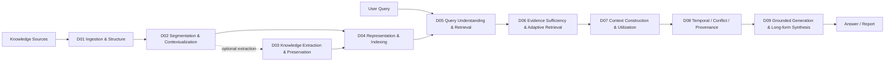
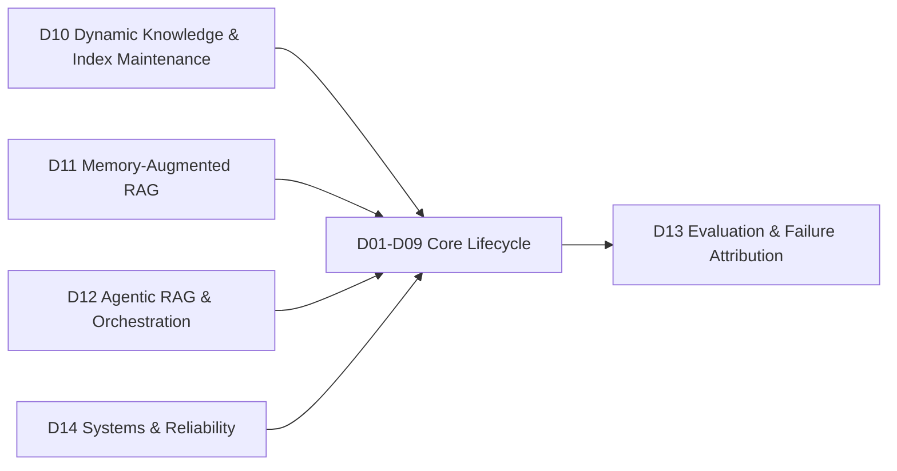

# RAG Taxonomy v2 Research Overview

> [!IMPORTANT]
> 本頁只描述目前有效的 Taxonomy v2。Repo 的正式研究分類只有 **D01–D14**。

## 1. Canonical Lifecycle



D03 是可選支線。Raw-chunk RAG 可直接由 D02 進入 D04；只有需要 structured semantic units 時才使用 D03。

## 2. Cross-Lifecycle Domains



## 3. Domain List

| ID | Domain |
|---|---|
| D01 | [[02 - 研究領域專題 (Research Domains)/Domain 01 - Document Ingestion & Structure|Document Ingestion & Structure]] |
| D02 | [[02 - 研究領域專題 (Research Domains)/Domain 02 - Segmentation & Contextualization|Segmentation & Contextualization]] |
| D03 | [[02 - 研究領域專題 (Research Domains)/Domain 03 - Knowledge Extraction & Information Preservation|Knowledge Extraction & Information Preservation]] |
| D04 | [[02 - 研究領域專題 (Research Domains)/Domain 04 - Knowledge Representation & Indexing|Knowledge Representation & Indexing]] |
| D05 | [[02 - 研究領域專題 (Research Domains)/Domain 05 - Query Understanding & Retrieval|Query Understanding & Retrieval]] |
| D06 | [[02 - 研究領域專題 (Research Domains)/Domain 06 - Evidence Sufficiency & Adaptive Retrieval|Evidence Sufficiency & Adaptive Retrieval]] |
| D07 | [[02 - 研究領域專題 (Research Domains)/Domain 07 - Context Construction & Evidence Utilization|Context Construction & Evidence Utilization]] |
| D08 | [[02 - 研究領域專題 (Research Domains)/Domain 08 - Temporal Conflict & Provenance Resolution|Temporal Conflict & Provenance Resolution]] |
| D09 | [[02 - 研究領域專題 (Research Domains)/Domain 09 - Grounded Generation Attribution & Long-form Synthesis|Grounded Generation, Attribution & Long-form Synthesis]] |
| D10 | [[02 - 研究領域專題 (Research Domains)/Domain 10 - Dynamic Knowledge & Index Maintenance|Dynamic Knowledge & Index Maintenance]] |
| D11 | [[02 - 研究領域專題 (Research Domains)/Domain 11 - Memory-Augmented RAG|Memory-Augmented RAG]] |
| D12 | [[02 - 研究領域專題 (Research Domains)/Domain 12 - Agentic RAG & Orchestration|Agentic RAG & Orchestration]] |
| D13 | [[02 - 研究領域專題 (Research Domains)/Domain 13 - RAG Evaluation & Failure Attribution|RAG Evaluation & Failure Attribution]] |
| D14 | [[02 - 研究領域專題 (Research Domains)/Domain 14 - RAG Systems & Reliability|RAG Systems & Reliability]] |

## 4. Orthogonal Axes

- **Level-2 Topics**：Domain 內的細分研究問題。
- **Paradigm Tags**：GraphRAG、Hierarchical RAG、Adaptive RAG、Agentic RAG、Multimodal RAG、Long-form RAG。
- **Adjacent Interfaces**：Long Context、KV Cache、General Agents、Continual Learning 等。

## 5. Hard Boundaries

```text
Segmentation != Knowledge Extraction != Representation
Relevance != Evidence Sufficiency != Context Utilization != Faithfulness
Dynamic Index != Persistent Memory
Domain != Paradigm Tag != Benchmark
```

## 6. Literature Corpus

目前 Literature Notes 共 **125 篇**；原始 PDF / 全文工件共 **122 篇**。

Storage folders 僅為文獻管理分類，不等於 Research Domains：

- Long Context & Sequence
- Compression & KV Cache
- RAG & Retrieval
- Knowledge & Graph RAG
- Memory & Agents
- Benchmarks & Evaluation

## 7. Current Navigation

- [[00 - 導覽與心智圖 (Navigation & MOC)/RAG Research Taxonomy & Domain Map|Taxonomy & Domain Map]]
- [[00 - 導覽與心智圖 (Navigation & MOC)/LLM 超長文件處理心智圖 (MOC)|System Maps]]
- [[00 - 導覽與心智圖 (Navigation & MOC)/RAG Paradigm Tags|Paradigm Tags]]
- [[00 - 導覽與心智圖 (Navigation & MOC)/RAG Adjacent Interfaces|Adjacent Interfaces]]
- [[00 - 導覽與心智圖 (Navigation & MOC)/RAG Benchmark Catalog|Benchmark Catalog]]
- [[03 - 論文庫 (Literature Notes)/00 - 論文擴充待補清單|Literature Coverage Status]]
