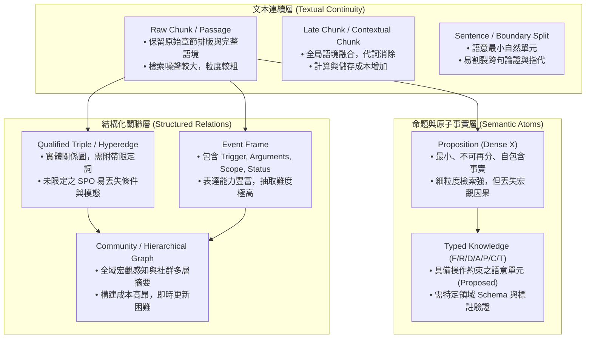

# 參考文獻審計與研究架構評析 (Reference Audit)

> [!INFO] 導言與審計範疇 (Audit Scope & Purpose)
> 本文件記錄針對長文本處理、RAG、知識圖譜與長篇生成技術之參考文獻所進行的系統性來源查核、版本核驗與架構評析。
> 核心任務包含：
> 1. 核查原始文獻身分（區分正式發表會議/期刊與預印本年份，避免 arXiv 初次上傳年份混淆）；
> 2. 釐清 **Raw Chunk、Sentence、Proposition、Qualified Triple、Event、Graph、Latent Memory** 之平行表示光譜，破除非學術性之單向「進化階梯」；
> 3. 審計知識擷取（Knowledge Extraction）之雙重視角（語義壓縮 vs. 結構擴增）及其下游誤差傳播（Error Propagation）；
> 4. 記錄已核實來源（Verified Literature）與待驗證佇列（Pending Verification Queue）。
> - **回主報告**：[[01 - 深度研究報告 (Deep Research Reports)/01 - LLM 超長文件閱讀與撰寫技術全景 (完整深度報告)|LLM 超長文件閱讀與撰寫技術全景報告]]
> - **規範性修訂基準**：[[01 - 深度研究報告 (Deep Research Reports)/04 - RAG Survey 完整修訂基準與研究架構 (Normative Revision Baseline)|RAG Survey 完整修訂基準與研究架構]]
> - **領域專題**：[[02 - 研究領域專題 (Research Domains)/Domain 04 - Chunking 策略與知識擷取 (Proposition, Cross-chunk)|Domain 04: Chunking 策略與知識擷取]] · [[02 - 研究領域專題 (Research Domains)/Domain 12 - Knowledge Extraction & Typed Knowledge|Domain 12: Knowledge Extraction]] · [[02 - 研究領域專題 (Research Domains)/Domain 13 - Information Preservation & Cross-chunk Consolidation|Domain 13: Information Preservation]]

---

## 一、文獻核實狀態總表 (Literature Verification Status & Audit Queue)

依據本專案《Agent 工作守則》（`AGENTS.md`）可驗證引用標準，所有文獻必須區分**預印年份（Preprint Year）**與**正式出版年份（Publication Year）**，明確標註 Venue 與驗證狀態。

| 論文 / 系統名稱 | 關鍵作者 | 預印年份 | 正式出版 | 正式發表 Venue / 狀態 | 核心研究定位 | 驗證狀態 |
| :--- | :--- | :---: | :---: | :--- | :--- | :---: |
| **UIE** | Yaojie Lu et al. | 2022 | 2022 | ACL 2022 (Long) | Schema-guided Text-to-Structure 統一抽取框架 | `verified` |
| **Dense X** | Tong Chen et al. | 2023 | 2024 | EMNLP 2024 (Oral) | 命題級檢索粒度 (Proposition Granularity) | `verified` |
| **LumberChunker** | Duarte et al. | 2024 | 2024 | Findings of EMNLP 2024 | 動態語義轉折切塊 (LLM-based Chunking) | `verified` |
| **Late Chunking** | Günther et al. | 2024 | 2024 | arXiv:2409.04701 | 全文雙向注意力編碼後延遲池化 | `verified` |
| **Microsoft GraphRAG** | Darren Edge et al. | 2024 | 2024 | arXiv:2404.16130 / MSR | 社群檢測 (Leiden) 與 Map-Reduce 全局摘要 | `verified` |
| **HippoRAG** | Gutiérrez et al. | 2024 | 2024 | NeurIPS 2024 | 仿生海馬迴索引與 Personalized PageRank | `verified` |
| **STORM** | Yijia Shao et al. | 2024 | 2024 | NAACL 2024 | 多視角訪談、大綱策劃與長篇長文生成 | `verified` |
| **RAGAS** | Shahul Es et al. | 2023 | 2024 | EACL 2024 | 無參考答案自動化 RAG 評估框架 | `verified` |
| **RAGChecker** | Ru et al. | 2024 | 2024 | NeurIPS 2024 | Claim-level 細粒度檢索與生成診斷框架 | `verified` |
| **PropRAG** | ReLink-Inc / Authors | 2024 | 2025 | EMNLP 2025 | 上下文豐富命題路徑 + 免 LLM 束搜尋 | `pending_verification` |
| **CrossAug** | Authors | 2026 | null | arXiv:2605.28004 (Preprint) | GNN 引導之跨 Chunk 圖擴增修復 | `pending_verification` |
| **Re³** | Authors | 2026 | 2026 | ACL 2026 | 時效敏感事實與版本干擾評測 | `pending_verification` |
| **T²-RAGBench** | Authors | 2025 | 2026 | EACL 2026 | 文字與表格混合檢索及數值推理 (23,088 QA) | `pending_verification` |
| **EviReport** | Authors | 2025 | 2026 | Findings of ACL 2026 | 事實優先長篇生成與 EviReportBench | `pending_verification` |
| **ReportLogic** | Polaris-JZ / Authors | 2026 | 2026 | ACL 2026 | 報告級邏輯評測與 LogicJudge (釋出待審) | `pending_verification` |

---

## 二、平行知識表示光譜：取代單向偽進化階梯

在傳統文獻討論中，常出現將知識表示粗暴排列為「Chunk $\rightarrow$ Sentence $\rightarrow$ Proposition $\rightarrow$ Triple $\rightarrow$ Graph」之線性階梯，並預設後者必然優於前者的認知誤區。

學術審計指出：**這並非單向進化的替代鏈條，而是不同維度的平行表示光譜（Parallel Knowledge Representation Spectrum）**。每種表示在「語意保真度」、「結構緊湊度」、「檢索精確度」與「工程維護成本」之間存在根本性 Pareto Trade-off：



### 關鍵表示特性對比

| 表示形式 (Representation) | 核心單位 (Unit) | 語意自足性 (Self-Containment) | 結構化程度 (Structure) | 典型適用任務 | 主要失效風險 (Failure Mode) |
| :--- | :--- | :---: | :---: | :--- | :--- |
| **Raw Chunk** | 200~1000 tokens | 依切分而定（中等） | 最低（純文字） | 通用文件檢索、粗粒度閱讀 | 語意割裂、代詞懸空、噪音注入 |
| **Late / Contextual Chunk** | 200~500 tokens + context | 高 | 低 | 長文本高精度檢索 | 離線預處理開銷高、重複冗餘 |
| **Proposition (Dense X)** | 獨立單句事實 | 極高 | 中等 | 開放領域 Factoid QA | 丟失跨句宏觀論證、超長文本數量膨脹 |
| **Qualified Triple** | `(S, P, O, Qualifiers)` | 高 | 高 | 關聯遍歷、多跳路徑搜尋 | 限定詞未抽全時語意嚴重損毀 |
| **Event Object** | 事件觸發詞與論元槽 | 高 | 極高 | 時序推理、流程法規追蹤 | 複雜事件抽取錯誤率累積 |
| **Community Report (GraphRAG)**| 社群層次摘要 | 全局完備 | 高層次結構 | 宏觀主題分析、情報綜述 | 微觀局部精確事實定位不足、成本極高 |

---

## 三、知識擷取的研究視角：語義壓縮 vs. 結構擴增

先前文獻整理中常將「Knowledge Extraction 視為一種語義壓縮（Semantic Compression）」。經嚴謹學術審計，應將其修正為**一種可探索的研究視角，而非絕對定義**：

### 1. 雙重視角剖析
- **視角 A：語義壓縮（Semantic Compression）**
  - 將非結構化冗餘文字濃縮為原子事實或結構化三元組，過濾修飾性詞彙，提升每單位 Token 的資訊密度。
  - 此視角著眼於減少 context 負擔與加速下游比對。
- **視角 B：語義結構擴增（Semantic Structuring & Expansion）**
  - 知識擷取並非單純「刪減」，在進行命題化或關係抽取時，系統必須**解析隱含代名詞、補全所屬主體、顯式標註時間範圍、引入關聯標籤與 Schema 類型**。
  - 在許多情境下，結構化抽取後的表示（包含 Source Span、Provenance Hash、Confidence、Temporal Qualifier）所佔用的中繼資料甚至大於原文。因此，抽取本質上是**將隱式上下文轉化為顯式可計算結構**。

### 2. 結構化失真與限定詞遺失案例
若將富含語態、時態與條件之複雜句強制降維為簡單三元組：
> *原文*：「A 公司宣布擬以 5 億美元收購 B 公司；截至 2025 年 12 月 31 日，因尚待監管核准，交易尚未完成。」

- **失真抽取 (Naïve Triple)**：
  ```text
  (A公司, 收購, B公司)
  ```
  *失真代價*：宣布收購 $\neq$ 完成收購。遺失了模態（Modality / 意向 vs. 現實）、時間狀態（Temporal Scope）、先決條件（Condition：待監管核准）。
- **保真抽取 (Qualified Representation / Event)**：
  ```json
  {
    "event_type": "Proposed_Acquisition",
    "acquirer": "A公司",
    "target": "B公司",
    "amount": "500M USD",
    "status": "Pending_Regulatory_Approval",
    "completed": false,
    "as_of_date": "2025-12-31",
    "source_span": "DocX, Section 2, para 4"
  }
  ```

---

## 四、下游誤差傳播模型 (Error Propagation in Extraction Pipelines)

將長文本拆解並結構化抽取後再回填至 RAG 系統，會面臨顯著的管線誤差累積效應。
若端到端檢索推論依賴一條長度為 $k$ 的結構化鏈條，即使每個模組的單點準確率看似良好：
- 實體辨識（Entity Recognition）準確率：$P_{\text{NER}} \approx 0.95$
- 實體對齊（Entity Linking）準確率：$P_{\text{Link}} \approx 0.95$
- 關係抽取（Relation Extraction）準確率：$P_{\text{RE}} \approx 0.90$
- 限定詞與時效抽取（Temporal/Qualifier Extraction）準確率：$P_{\text{Qual}} \approx 0.90$

在各誤差相互獨立的簡化假設下，完整結構鏈條的保真機率為：
\[
P_{\text{chain}} = 0.95 \times 0.95 \times 0.90 \times 0.90 \approx 73.1\%
\]
**學術啟發**：
結構化抽取並非免費的語義整理，而是**以抽取階段的潛在誤差風險換取檢索階段的結構便利性**。
因此，現代進階架構（如 Microsoft GraphRAG、KG²RAG、HippoRAG 2）均堅持**保留 Raw Text Chunk 作為終極驗證背書**，嚴禁以可能失真抽取的孤立三元組直接取代權威原文。

---

## 五、證據治理與操作語意審計 (Evidence Governance Audit)

在專業技術報告、工程投標與合規審計等高風險長文本任務中，表面腳標不代表事實可信：
\[
\boxed{\text{Citation} \neq \text{Entailment} \neq \text{Authority} \neq \text{Sufficiency}}
\]

### 1. 類型化知識的操作約束（Proposed Operational Semantics）
將知識標註為 `F/R/D/A/P/C/T`（事實、需求、確認設計、假設、建議、能力、術語）並非靜態分類標籤，其價值在於**定義下游合法操作約束**：
\[
\text{type}(x) \Longrightarrow \text{allowed\_operations}(x)
\]
- **Requirement (R)**：具備確定性硬約束，必須 100% 被方案覆蓋（Coverage Check），絕不可被誤當作已實現之事實（Fact）。
- **Assumption (A)**：必須顯式標註風險邊界，在推論置信度中賦予折減係數。
- **Capability (C) vs. Proposal (P)**：能力宣稱必須由客觀測試或歷史事實（F/C）背書，嚴禁引用團隊建議方案（P）作為能力證據。

---

## 六、待驗證研究主題與實驗路線 (Research Roadmap & Audit Log)

本 Repo 嚴禁將未經充分文獻證實的假設標註為學術共識。下列項目已分流至專題與待驗證提案：

1. **資訊保真抽取與跨塊修復**：
   - 深入分析否定、條件、時間範圍在切塊中的遺失率，對比 Dense X（命題）、PropRAG（命題路徑）與 CrossAug（跨塊圖擴增）。
   - 對應專題：[[02 - 研究領域專題 (Research Domains)/Domain 12 - Knowledge Extraction & Typed Knowledge|Domain 12]]、[[02 - 研究領域專題 (Research Domains)/Domain 13 - Information Preservation & Cross-chunk Consolidation|Domain 13]]。
2. **證據充分性與自適應檢索**：
   - 區分「相關（Relevance）」與「充分（Sufficiency）」，研究 Evidence Gap 定位與拒答機制（Abstention）。
   - 對應專題：[[02 - 研究領域專題 (Research Domains)/Domain 14 - Evidence Sufficiency & Adaptive Retrieval|Domain 14]]。
3. **時序衝突與來源仲裁**：
   - 區分 valid time、record time、source version，避免「較新文檔永遠覆蓋舊文檔」的武斷假設。
   - 對應專題：[[02 - 研究領域專題 (Research Domains)/Domain 15 - Temporal Conflict & Provenance-aware RAG|Domain 15]]。
4. **評測基準目錄與規範**：
   - 建立涵蓋 BEIR、HotpotQA、RAGBench、RAGChecker、T²-RAGBench、RAG4Reports 等官方元數據的評測目錄。
   - 對應目錄：[[00 - 導覽與心智圖 (Navigation & MOC)/RAG Benchmark Catalog|RAG Benchmark Catalog]]、[[02 - 研究領域專題 (Research Domains)/Domain 17 - RAG Benchmarks & Evaluation Protocols|Domain 17]]。
