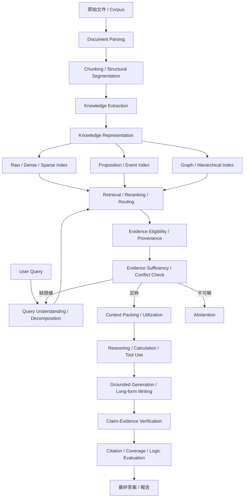
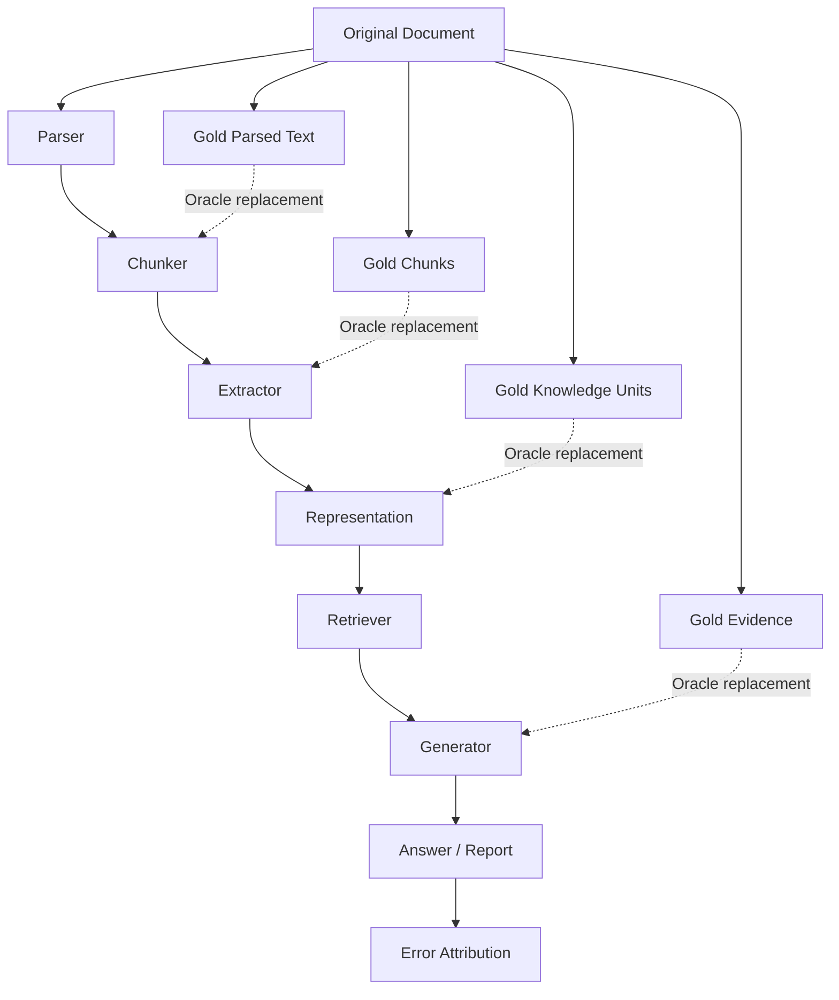
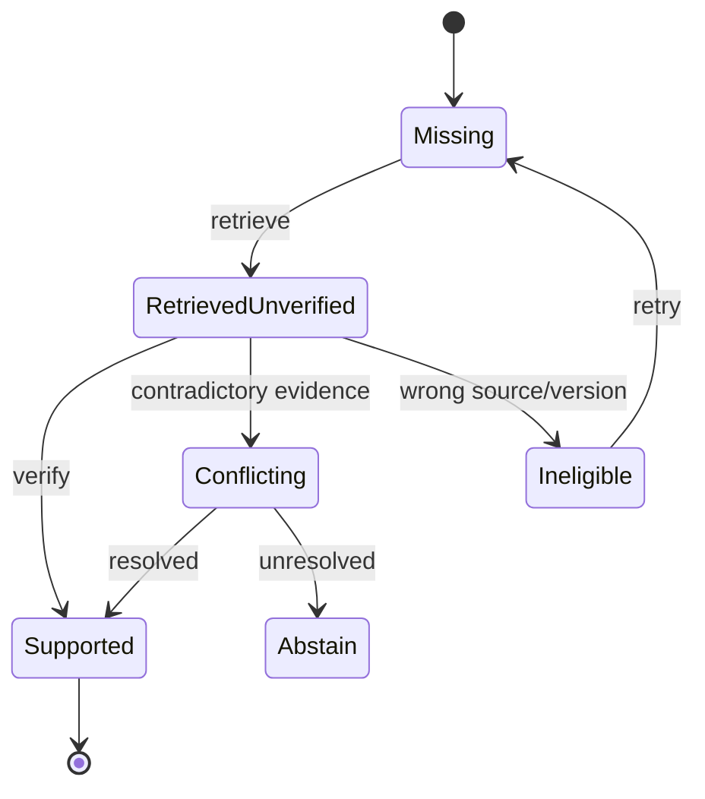
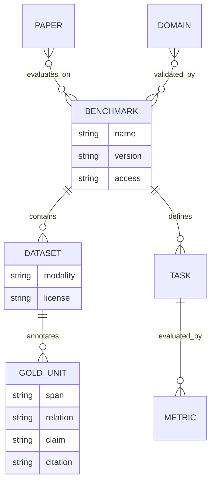

# RAG-survey 完整修訂基準與研究架構

> **定位**：本文件是 `Cycl0n3-ga/RAG-survey` 後續修改的「規範性基準文件（normative revision baseline）」。  
> **基準日期**：2026-09-24，Asia/Taipei。  
> **適用範圍**：Home / MOC、Deep Research Reports、Research Domains、Literature Notes、Benchmark / Dataset Notes、Reference Audit、Trade-offs、AGENTS.md。  
> **證據原則**：原始論文、正式會議／期刊頁面、作者／官方專案與官方 Dataset 頁面優先；無法由原始來源確認的內容一律標為 `pending_verification`，原論文未交代的硬體等條件標為 `unspecified`。

## Executive Summary

目前 `Cycl0n3-ga/RAG-survey` 已經具備長上下文、壓縮、RAG、Chunking、GraphRAG、Memory、Hierarchical Retrieval、Long-form Generation、Agentic Workflow、Evaluation 與 Research Roadmap 等十一個 Domain，並有主報告、Reference Audit、論文筆記與 `AGENTS.md`；但目前真正限制這個知識庫作為「研究選題基準」的，不是缺少更多技術名詞，而是**研究問題的邊界仍不夠細、方法與 Benchmark 尚未完整對齊、Knowledge Extraction 與 Chunking 混在同一層、Evidence Sufficiency／Provenance／Context Utilization 尚未被視為獨立研究問題，以及部分舊結論仍把特定實驗結果推廣成一般法則**。目前 `master` 仍可看到 Domain 01–11，尚未看到規劃中的 Domain 12–17 與獨立 Benchmark Catalog；同時還存在兩份 Home 檔案，表示導覽層也需要收斂。fileciteturn4file0L1-L2 現有 `AGENTS.md` 已正確要求原始來源核對、區分預印本與正式出版、記錄實驗條件與表格位置、誠實標示 `abstract_only`／`pending_verification` 等，這次修訂應在這個基礎上**增加 artifact type、Benchmark schema、claim-level evidence status 與 Oracle evaluation 規範，而不是推翻既有規則**。fileciteturn5file0L1-L2 本基準因此把整體 Survey 重構為「文件理解 → 知識擷取與表示 → 索引與檢索 → 證據充分性與衝突處理 → Context 使用 → 推理與長篇生成 → Claim/Citation Verification → Benchmark / Failure Attribution」的研究鏈，並新增 Knowledge Extraction、Information Preservation、Evidence Sufficiency、Temporal/Conflict/Provenance、Context Utilization、Benchmark Protocol 六個獨立 Domain；同時吸收本對話前面對 Benchmark、Evidence-first report generation、框架與工程評測的補充內容。fileciteturn0file0

### 修訂總覽

- **最高優先：Correctness。** 先修 DPR embedding 維度、GraphRAG Claim Extraction、Dense X 年份、Self-RAG 訓練描述、RAPTOR/Tree-of-Thought 混淆、無條件 latency/VRAM/Pareto 比較，以及沒有來源的「百分比／唯一方案／徹底解決」敘述。
- **第二優先：Research Coverage。** 保留既有十一個 Domain，但把 Chunking、Knowledge Extraction、Representation、Evidence Sufficiency、Temporal/Conflict/Provenance、Context Utilization 分清楚；新增 Domain 12–17。
- **第三優先：Evaluation。** 建立獨立 Benchmark Catalog，讓每個研究主張都回答：「要用什麼 Gold？哪個 Metric？哪個 Oracle？這個 Benchmark 不能證明什麼？」
- **第四優先：Failure Attribution。** 所有新研究都應能做 `Gold Parser → Gold Extraction → Gold Retrieval → Gold Evidence → Generator` 的逐層替換，避免把最終 QA 分數的改變錯誤歸因給某一個模組。
- **第五優先：Repo Governance。** 將論文、Benchmark、Dataset、Framework、Survey、Proposed Method 分類；建立 Claim Audit；Home/MOC/Reference Audit/Trade-offs 與 Domain 必須同步更新。

整體研究架構應改成：



核心原則是：

> **Chunking ≠ Knowledge Extraction ≠ Knowledge Representation ≠ Indexing ≠ Retrieval；Relevance ≠ Coverage ≠ Sufficiency ≠ Faithfulness；Citation ≠ Entailment ≠ Authority。**

這三組區分應成為整個 Repo 的共同語言。

## Repo 修訂總覽與架構原則

目前 Repo 的實際 `master` 包含兩份 Home、完整 Deep Research Report、Reference Audit、Shared Session Transcript、Domain 01–11、Literature Notes 與 Papers。fileciteturn4file0L1-L2 因此**不要直接刪掉現有十一個 Domain**；應將它們視為第一層導航，再用 Domain 12–17 補上原分類沒有獨立處理的研究問題。

建議最終研究地圖如下：

| 現有／新增 Domain | 正式定位 | 最核心問題 |
|---|---|---|
| Domain 01 | Long Context & Sequence Architecture | 模型名義上能接收多長，實際能可靠使用多長？ |
| Domain 02 | Compression | 如何降低 Prompt／Context／KV 成本而不破壞必要資訊？ |
| Domain 03 | Retrieval & Advanced RAG | Query 到 Evidence 的搜尋與排名如何改善？ |
| Domain 04 | Chunking & Structural Segmentation | 文件如何分割才不破壞下游檢索與擷取？ |
| Domain 05 | GraphRAG & Structured Retrieval | 圖結構何時比平面檢索提供額外價值？ |
| Domain 06 | Memory | RAG 如何變成持續更新、選擇性保留的外部記憶？ |
| Domain 07 | Hierarchical & Multi-hop Retrieval | 多層與多步證據如何找到並組合？ |
| Domain 08 | Long-form Generation | 如何從證據規劃並生成完整、可驗證的長篇內容？ |
| Domain 09 | Agentic Workflow | Controller／Agent 應決定什麼，何時值得多 Agent？ |
| Domain 10 | Evaluation, Systems & Safety | 效果、成本、安全與系統層如何共同評估？ |
| Domain 11 | Research Roadmap | 哪些研究假設可被實驗證偽，而非主觀「藍海」判斷？ |
| Domain 12 | Knowledge Extraction & Typed Knowledge | 文件中的知識到底應擷取成什麼？ |
| Domain 13 | Information Preservation & Cross-chunk Consolidation | 擷取／切分時究竟遺失、扭曲了哪些資訊？ |
| Domain 14 | Evidence Sufficiency & Adaptive Retrieval | 證據是否已足夠？缺什麼？何時停止？ |
| Domain 15 | Temporal, Conflict & Provenance-aware RAG | 時間、版本、來源、權威與衝突如何處理？ |
| Domain 16 | Context Utilization & Faithfulness | 正確證據已找到後，模型為何仍然用錯？ |
| Domain 17 | RAG Benchmarks & Evaluation Protocols | 每一個研究主張究竟該怎麼被測量？ |

這套分類不是「技術成熟度階梯」。例如 Proposition、Triple、Event 與 Graph 是**並列的 Representation 選項**；GraphRAG 也不是「比普通 RAG 更進階所以必然更好」。Dense X 證明不同 retrieval granularity 在其實驗中會影響 retrieval 與 QA，而 KG²RAG、PropRAG、HippoRAG 等研究則展示不同結構如何支援多跳或關係式檢索；這些結果支持的是**問題相依的 representation/retrieval design**，而不是單向技術進化論。[17][25][26] citeturn0search3turn8search0turn0search1

## Domain 修訂基準

### Long Context 與序列架構

**對應既有檔案：** `Domain 01 - Long Context 與序列架構 (Attention, SSM, Ring).md`

#### Problem Definition

本 Domain 應回答三個不同問題：

**Nominal Context Length**：模型/API 宣稱能輸入多少 Token。

**Effective Context Utilization**：在特定任務上，模型在不同位置、不同干擾量與不同 Context 長度下是否仍能可靠使用資訊。

**Sequence-system Scalability**：Attention、SSM、Ring/Distributed Attention 等架構如何改變 FLOPs、IO、VRAM 與多 GPU 通訊。

不要再將「支援 128K」直接寫成「能理解 128K」。RULER 對十九世代長上下文模型進行壓力測試時指出，在 32K 的測試長度下，只有約一半模型仍維持作者設定的滿意門檻；LongBench 與 InfiniteBench 也分別從真實長文本、多任務與平均超過 100K 的輸入揭示長上下文仍存在明顯性能問題。[5][6][7] citeturn2academia24turn2search1turn2search0

#### Taxonomy

應分為 Dense Attention、Sparse Attention、IO-aware Exact Attention、Distributed Attention、State Space Models、Position/Length Extrapolation，以及 Effective-context Evaluation。不要把「模型架構」和「Benchmark」列在同一演算法分類。

#### Prior Work

| 代表工作 | 核心貢獻 | 在本 Domain 的角色 |
|---|---|---|
| Longformer — Beltagy et al., 2020 [2] | Sliding-window/global sparse attention | Sparse long-sequence baseline。citeturn1academia24 |
| FlashAttention — Dao et al., NeurIPS 2022 [1] | IO-aware exact attention | 說明「Exact Attention」與「高效 Attention」不是二選一。citeturn1search0 |
| Ring Attention — Liu et al., 2023 [3] | Blockwise computation distributed over devices | 多裝置超長序列。citeturn1academia25 |
| Mamba — Gu & Dao, 2023/2024 [4] | Selective state-space sequence model | 非 Attention 長序列 Baseline。citeturn2academia23 |
| LongBench — Bai et al., ACL 2024 [6] | 中英雙語長文本、多任務評估 | 真實長文本能力 Benchmark。citeturn2search1 |
| RULER — Hsieh et al., 2024 [5] | 多類型 synthetic long-context stress test | Nominal vs effective context。citeturn2academia24 |
| InfiniteBench — Zhang et al., ACL 2024 [7] | 平均超過 100K Token 的長上下文評測 | 超長輸入實測。citeturn2search0 |

#### Evidence & Results

| Work | Dataset / Setup | Metric / 主要結果 | Hardware | 限制 |
|---|---|---|---|---|
| FlashAttention [1] | GPT-2 / Long Range Arena 等 | GPT-2 序列 1K 可約 3× 加速；LRA 1K–4K 約 2.4×；並展示 Path-X 16K、Path-256 64K。citeturn1search0 | 論文指定 GPU；Repo 筆記應回原表核對 | Kernel/硬體改善不等於理解能力改善 |
| Mamba [4] | Language modeling 與不同 modality | 作者報告約 5× generation throughput；Mamba-3B 在其設定中匹配或超越更大的 Transformer。citeturn2academia23 | 依論文設定 | 不應直接推廣成所有 RAG 都更快 |
| RULER [5] | 17 個長上下文模型、13 類任務 | 作者發現 32K 時僅約一半模型維持其滿意門檻。citeturn2academia24 | unspecified | Synthetic stress test ≠ 所有真實任務 |

#### Failure Modes 與 Open Problems

主要問題是 positional degradation、distractor sensitivity、retrieve-but-not-use、超過 training length 後的能力退化，以及模型雖有巨大 nominal context 但有效資訊密度低時成本極高。Lost in the Middle 在多文件 QA 中呈現明顯的序位效應；GPT-3.5-Turbo 在某些設定下將相關文件放在中間時，表現甚至會比 closed-book 56.1% 更低，且從 20 篇增加到 50 篇 retrieved documents 對 reader accuracy 的提升只有約 1–1.5 個百分點。[46] citeturn22search1

#### Suggested Experiments

| 實驗 | Baseline | Oracle | Ablation | Metric | Expected Cost |
|---|---|---|---|---|---|
| Nominal vs Effective Context | 同模型不同 Context 長度 | Gold relevant span | 位置、distractor 數、長度 | Accuracy、position sensitivity、tokens | 中 |
| Long-context vs RAG | Full-context、Dense RAG、Hybrid RAG | Gold passage-only context | 固定 Token Budget | QA F1、Recall、latency、cost | 中 |
| Architecture/system benchmark | Dense Attention、FlashAttention、SSM | 無 | batch、sequence length | TTFT、throughput、peak VRAM | 高；GPU 需求 |

### 多層次壓縮

**對應既有檔案：** `Domain 02 - 多層次壓縮技術 (Token, KV Cache, Context).md`

#### Problem Definition

必須區分三種完全不同的 Compression：

**Input/Prompt Compression** 刪除或改寫輸入 Token；**Context Selection/Compression** 在 RAG Evidence 中選擇內容；**KV Cache Compression/Quantization/Eviction** 保留輸入語義但壓縮推論狀態。

它們不能用同一個「壓縮率」比較。

#### Taxonomy

Token pruning、semantic compression、learned extractive compression、KV eviction、KV quantization、paged memory management，以及 retrieval-time context reduction。

#### Prior Work

| 代表工作 | 核心貢獻 | Survey 定位 |
|---|---|---|
| LLMLingua — Jiang et al., EMNLP 2023 [8] | Prompt compression | Token-level compression。citeturn4search1 |
| LLMLingua-2 — Pan et al., Findings ACL 2024 [9] | Task-agnostic token classification compression | Faster learned compression。citeturn3search0 |
| H2O — Zhang et al., NeurIPS 2023 [10] | Heavy-hitter KV eviction | KV cache eviction。citeturn3search10 |
| KIVI — Liu et al., ICML 2024 [11] | 2-bit asymmetric KV quantization | KV quantization。citeturn4academia37 |
| PagedAttention / vLLM — Kwon et al., 2023 [55] | Paged KV memory management | Serving/system memory baseline。citeturn10academia51 |
| KVzip — 2025 [56] | Query-aware KV compression | 近期 KV compression 工作。citeturn1search8 |

#### Evidence & Results

| Work | Setup | Result | Hardware | Limitation |
|---|---|---|---|---|
| LLMLingua [8] | GSM8K、BBH、ShareGPT、Arxiv 等 | 作者報告最高約 20× prompt compression，同時維持任務品質。citeturn4search1 | unspecified | 任務／模型相依 |
| LLMLingua-2 [9] | MeetingBank、LongBench、ZeroScrolls 等 | compression 本身約 3–6× faster；2–5× 壓縮時 end-to-end latency 約 1.6–2.9× improvement。citeturn3search0 | unspecified | 不代表所有輸入都無語義損失 |
| KIVI [11] | Llama/Falcon/Mistral 類負載 | 約 2.6× lower total peak memory，最多 4× batch、2.35–3.47× throughput。citeturn4academia37 | 依論文 | **不可把 16-bit→2-bit 理論比例寫成總 VRAM 8×** |

#### Failure Modes 與 Open Problems

壓縮率不等於資訊保存率。應特別測試否定、數值單位、條件、來源識別與低頻關鍵事實是否被刪除。Prompt compression 與 KV compression 也不能用同一品質損失模型處理。

#### Suggested Experiments

| 實驗 | Baseline | Oracle | Ablation | Metric | Expected Cost |
|---|---|---|---|---|---|
| Information-aware prompt compression | Full context、LLMLingua | Gold critical tokens/spans | 移除 temporal/negation protection | QA、critical fact recall、tokens | 中 |
| KV vs Prompt compression | No compression | Full-context answer | 分別只壓 Prompt/KV | latency、VRAM、accuracy | 高 |
| RAG evidence compression | Top-k raw chunks | Gold evidence compact set | compressor off/on | Evidence Recall/token、faithfulness | 中 |

### 先進 RAG 與檢索

**對應既有檔案：** `Domain 03 - 先進 RAG 與檢索機制 (ColBERT, HyDE, Self-RAG).md`

#### Problem Definition

本 Domain 應集中在 Query → Candidate → Ranking → Evidence 的檢索問題，而不是同時承擔 Chunking、Evidence Sufficiency 與 Agent planning。

#### Taxonomy

Sparse retrieval、dense bi-encoder、late interaction、query expansion／HyDE、hybrid retrieval、reranking、retrieval-aware generation、adaptive retrieval。

#### Prior Work

| 工作 | 核心機制 | Source |
|---|---|---|
| DPR — Karpukhin et al., EMNLP 2020 [12] | Dual-encoder dense passage retrieval | citeturn5search1 |
| ColBERT — Khattab & Zaharia, SIGIR 2020 [57] | Token-level late interaction | citeturn6academia33 |
| HyDE — Gao et al., ACL 2023 [13] | Hypothetical document embedding | citeturn5search0 |
| Self-RAG — Asai et al., ICLR 2024 [14] | Reflection tokens + adaptive retrieval/generation | citeturn7search0 |
| Adaptive-RAG — Jeong et al., NAACL 2024 [15] | Query-complexity routing | citeturn6search0 |
| LongRAG — Jiang et al., 2024 [51] | Long retrieval units | citeturn12academia48 |
| RankRAG — Yu et al., NeurIPS 2024 [58] | Joint ranking + generation | citeturn15search5 |

#### Evidence & Results

| Work | Dataset / Setup | Result | Limitation |
|---|---|---|---|
| DPR [12] | 多個 Open-domain QA | Top-20 passage retrieval accuracy 相對 Lucene-BM25 提升約 9–19 absolute points。citeturn5search1 | 舊世代模型／語料條件 |
| LongRAG [51] | Natural Questions、HotpotQA、Qasper 等 | NQ EM 62.7、HotpotQA 64.3；使用較長 retrieval units。citeturn12academia48 | 與 chunk RAG 成本不可脫離 context budget 比 |
| Self-RAG [14] | 多種 knowledge-intensive tasks | 官方專案指出 PopQA 降低 retrieval frequency 造成約 40% relative drop，但 PubHealth 差異較小，說明 adaptive retrieval 具 task dependence。citeturn7search3 | 不等於「所有問題都應更多檢索」 |

**修正重點：** DPR 不是「固定 1536 維」方法。DPR 的核心是 question encoder/passsage encoder 與內積檢索；representation 維度由所選 encoder 決定，不應把單一實作維度寫成 DPR 的定義。[12] citeturn5search1

#### Failure Modes 與 Open Problems

語意相似度高不等於證據足夠；Dense retrieval 可能 miss exact identifiers；late interaction 成本較高；HyDE 生成的 hypothetical document 可能導入 query drift；Adaptive Retrieval 的 controller 可能本身判錯。

#### Suggested Experiments

| 實驗 | Baselines | Oracle | Ablation | Metric | Expected Cost |
|---|---|---|---|---|---|
| Sparse/Dense/Hybrid/Rerank | BM25, DPR, Hybrid | Gold evidence IDs | reranker/fusion off | Recall@k, nDCG, latency | 低～中 |
| Adaptive retrieval | Fixed Top-k / Adaptive-RAG | Gold complexity/action | classifier off | Accuracy, rounds, tokens | 中 |
| Retriever→Generator error decomposition | Best retriever | Gold evidence | same generator | retrieval recall vs QA F1 | 中 |

### Chunking 與結構分割

**對應既有檔案：** `Domain 04 - Chunking 策略與知識擷取 (Proposition, Cross-chunk).md`

#### Problem Definition

本檔應**縮回 Chunking 本身**。Knowledge Extraction 移到 Domain 12；Cross-chunk information loss 移到 Domain 13。

研究問題是：

> 哪種 segmentation 能讓後續 extraction/retrieval 最大化「可找性」而又保留必要上下文？

#### Taxonomy

Fixed token、sentence、paragraph、semantic boundary、document-structure-aware、late chunking、hierarchical chunking、multi-resolution chunking。

#### Prior Work

| 工作 | 關係 |
|---|---|
| Dense X Retrieval — EMNLP 2024 [17] | Passage/Sentence/Proposition granularity。citeturn0search3 |
| Late Chunking — Günther et al., 2024 [27] | 在長文 contextual encoding 後才 pooling。citeturn9academia12 |
| RAPTOR — Sarthi et al., ICLR 2024 [54] | Recursive clustering/summarization 的 hierarchical retrieval。citeturn687657search3 |
| LongRAG [51] | 長 retrieval unit。citeturn12academia48 |
| KG²RAG [25] | 檢索 Chunk 後以 KG 擴展、組織。citeturn8search0 |
| DocRED [19] | 可用來測 chunk boundary 對跨句 relation 的破壞。citeturn19search1 |

#### Evidence & Results

Dense X 的正式出版是 **EMNLP 2024**，不是把 arXiv 首發年份 2023 當正式出版年份。它把 Proposition 定義成可獨立理解的 atomic factoid，並報告 proposition-level retrieval 在實驗中優於 passage-level retrieval。[17] citeturn0search3

Late Chunking 的主要觀念不是「切得更長」，而是**先讓 token representation 看過較長上下文，再按 chunk boundary pooling**；其官方預印本報告多個 retrieval task 的改善，但本 Repo 若要寫精確 nDCG 數字，應回原論文表格逐項核對，否則標為 `pending_verification`。[27] citeturn9academia12

#### Failure Modes 與 Open Problems

Repo 原有「超過一半長文本失敗起源於切塊」若無具體 error-attribution study 支持，應刪除。更好的研究設計是以 Gold Parser／Gold Chunking 替換實驗估計 Chunking 的 causal contribution。

#### Suggested Experiments

| 實驗 | Baselines | Oracle | Ablation | Metric | Expected Cost |
|---|---|---|---|---|---|
| Chunk strategy benchmark | Fixed 256/512/1024, semantic, late | Human structural chunks | overlap on/off | Evidence Recall, Boundary Loss | 低 |
| Cross-boundary QA | 固定 chunk | Gold expanded context | ± neighbor context | Answer F1, evidence recall | 中 |
| Chunk→Extraction coupling | 多 chunkers | Gold document-level facts | same extractor | Extraction recall by relation distance | 中 |

### GraphRAG 與結構化知識

**對應既有檔案：** `Domain 05 - Graph RAG 與結構化知識 (Microsoft GraphRAG, HippoRAG).md`

#### Problem Definition

GraphRAG 必須被定義為**一個方法家族**，不是單一演算法。Microsoft GraphRAG 的 Community Reports/global sensemaking、HippoRAG 的 OpenIE + Personalized PageRank、KG²RAG 的 KG-guided chunk expansion、PropRAG 的 proposition paths，解的是不同問題。[22][23][25][26] citeturn0search0turn8search8turn8search0turn0search1

#### Taxonomy

Graph construction、entity-centric graph retrieval、event graph、chunk graph、proposition graph、community/global summarization、graph + raw-text hybrid retrieval。

#### Prior Work

| 工作 | 核心機制 |
|---|---|
| Microsoft GraphRAG — Edge et al., 2024 [22] | Entity/relationship graph + Leiden communities + community reports。citeturn0search0 |
| HippoRAG — NeurIPS 2024 [23] | OpenIE graph + Personalized PageRank。citeturn8search8 |
| HippoRAG 2 — ICML 2025 [24] | Graph memory + passages。citeturn8search7 |
| KG²RAG — NAACL 2025 [25] | KG-guided chunk expansion/organization。citeturn8search0 |
| PropRAG — EMNLP 2025 [26] | Proposition path + beam search。citeturn0search1 |
| G-Retriever — NeurIPS 2024 [52] | Graph QA + graph retrieval。citeturn15search4 |
| TagRAG — Findings ACL 2026 [53] | Tag/graph-like retrieval，降低 graph construction cost。citeturn8search2 |

#### Evidence & Results

| Work | Dataset / Setup | Result | Limitation |
|---|---|---|---|
| HippoRAG [23] | Multi-hop QA | 作者報告最高約 20% improvement over prior methods；單步 retrieval 相較 IRCoT 約 10–20× cheaper、6–13× faster。citeturn8search8 | 特定 implementation/model setting |
| HippoRAG 2 [24] | Factual/associative/sense-making | associative memory 相較強 embedding baseline 約 +7%。citeturn8search7 | 不代表每類 QA 都 +7% |
| TagRAG [53] | UltraDomain 等 | 作者報告 average win rate 78.36%，建構與檢索效率分別約 14.6×、1.9× 相對其 GraphRAG baseline。citeturn8search2 | 比較條件不能直接外推到所有 GraphRAG |

**必要更正：** Microsoft GraphRAG 的 Claim Extraction 不應寫成每次 standard indexing 必經步驟；官方流程將 claim/covariate extraction 視為可選能力，不能把它和 Entity/Relationship Extraction 混成同一個 mandatory stage。citeturn687657search1turn687657search2

#### Failure Modes 與 Open Problems

Extraction hallucination、entity merging error、edge polarity/state loss、跨版本 entity collapse、建圖成本、更新成本、graph completeness，以及「圖沒有邊」不等於「現實沒有關係」。

#### Suggested Experiments

| 實驗 | Baseline | Oracle | Ablation | Metric | Expected Cost |
|---|---|---|---|---|---|
| Vector vs Graph | Hybrid RAG, GraphRAG | Gold relation/evidence graph | graph off | QA F1, chain recall, cost | 高 |
| Graph construction quality | LLM graph | Gold graph | entity/relation oracle separately | edge F1, QA Δ | 高；人工標註 |
| Global vs Local task routing | Local/global/basic | Gold query type | router off | accuracy, index/query cost | 中～高 |

### 外部記憶體與長期記憶

#### Problem Definition

Memory 與 RAG 不應只用「是否有 vector database」區分。Memory 研究的是**什麼需要被保存、如何更新、何時提取、何時遺忘，以及記憶如何演化**。

#### Taxonomy

Episodic memory、semantic memory、working memory、graph memory、memory consolidation、memory evolution、continual non-parametric learning。

#### Prior Work

| 工作 | 定位 |
|---|---|
| MemGPT — Packer et al., 2023 [59] | OS/virtual-memory inspired context management。citeturn10academia48 |
| HippoRAG [23] | Associative non-parametric memory。citeturn8search8 |
| HippoRAG 2 [24] | From RAG to continual memory。citeturn8search7 |
| A-MEM — 2025 [60] | Zettelkasten-style dynamic memory links/evolution。citeturn11academia14 |
| MemOS — 2025 [61] | Unified memory operating-system abstraction。citeturn10academia50 |
| JEV-Mem — 2026 preprint [62] | Recent evidence on efficient long-term agent memory；需標預印本。citeturn11academia15 |

#### Evidence & Results

HippoRAG 2 在作者設定中的 associative memory 相較強 embedding systems 約提升 7%，其價值在於說明「graph knowledge + raw passage memory」可以比單純把所有內容壓成 triples 更有彈性。[24] citeturn8search7

A-MEM 研究 dynamic memory organization，而不是單純加大 vector DB；精確 benchmark 數據在 Repo 中若無原文 table/page verification，應標 `pending_verification`。[60] citeturn11academia14

#### Failure Modes 與 Open Problems

Memory pollution、stale memory、duplication、incorrect consolidation、forgetting policy、provenance loss，以及 memory update 將舊事實與新事實錯誤融合。

#### Suggested Experiments

| 實驗 | Baseline | Oracle | Ablation | Metric | Cost |
|---|---|---|---|---|---|
| Static RAG vs evolving memory | Vector RAG | Gold timeline memory | update/forget off | temporal QA, memory precision | 中 |
| Raw vs summarized memory | Raw passages | Gold facts | consolidation off | fact retention, tokens | 中 |
| Memory invalidation | no invalidation | Gold active version | timestamp/source off | stale answer rate | 中 |

### 分層推理與多步檢索

#### Problem Definition

需要將三件事分開：

Hierarchical Retrieval、Multi-hop Retrieval、Reasoning Search。

RAPTOR 建立的是遞迴 clustering/summarization retrieval tree，不是 Tree of Thoughts；IRCoT 是 reasoning step 與 retrieval 交錯；PropRAG 是 proposition path search。[16][26][54] citeturn23search3turn0search1turn687657search3

#### Prior Work

| 工作 | 類型 |
|---|---|
| RAPTOR — ICLR 2024 [54] | Hierarchical tree retrieval。citeturn687657search3 |
| IRCoT — ACL 2023 [16] | Interleaved retrieve/reason。citeturn23search3 |
| PropRAG — EMNLP 2025 [26] | Proposition path search。citeturn0search1 |
| HippoRAG — NeurIPS 2024 [23] | Graph associative retrieval。citeturn8search8 |
| MultiHop-RAG — COLM 2024 [43] | Multi-document RAG benchmark。citeturn18academia25 |
| HotpotQA — Yang et al., EMNLP 2018 [42] | Supporting-fact multi-hop QA。citeturn17search2 |
| LongRAG [51] | Long retrieval units for complex QA。citeturn12academia48 |

#### Evidence & Results

IRCoT 使用 GPT-3，在 HotpotQA、2WikiMultihopQA、MuSiQue、IIRC 上相較其 baseline 最高提升約 **21 points retrieval** 與 **15 points downstream QA**。[16] citeturn23search3

這支持「一次 retrieve-and-read 對多步問題可能不足」，但**不能改寫成 IRCoT 已經解決 multi-hop reasoning**。

#### Failure Modes 與 Open Problems

hop drift、missing intermediate entity、wrong bridge relation、search explosion、early wrong reasoning contaminating later retrieval。

#### Suggested Experiments

| Experiment | Baseline | Oracle | Ablation | Metric | Cost |
|---|---|---|---|---|---|
| One-shot vs multi-hop | Top-k RAG, IRCoT | Gold evidence chain | hop planner off | chain recall, answer F1 | 中 |
| Hierarchy vs flat | Flat chunk RAG | Gold abstraction level | summary levels | recall/cost | 中 |
| Path sufficiency | Graph/proposition path | Gold path | stop rule | path completion, extra hops | 中 |

### 長篇生成與報告撰寫

#### Problem Definition

Long-form RAG 不是「把更多 retrieved chunks 塞給模型」。它至少包含 Evidence Collection、Coverage Planning、Outline、Fact Binding、Section Writing、Citation、Cross-section Consistency 與 Revision。

#### Prior Work

| 工作 | 角色 |
|---|---|
| STORM — Shao et al., NAACL 2024 [28] | 多視角 research + outline + grounded article generation。citeturn12search1 |
| LongWriter — Bai et al., 2024 [29] | Long-output capability / AgentWrite。citeturn12academia46 |
| ALCE — Gao et al., EMNLP 2023 [45] | Citation-grounded long-form answers。citeturn23search0 |
| EviReport — Findings ACL 2026 [30] | Evidence-tracked report writing。citeturn20search5 |
| EFSG — RAG4Reports 2026 [31] | Evidence-first sealed fact pool。citeturn20search0 |
| AnalystBench — Findings ACL 2026 [32] | Professional long-form report benchmark。citeturn20search8 |
| ReportLogic — ACL 2026 [33] | Report-level logic evaluation。 |

#### Evidence & Results

STORM 使用 FreshWiki 等評估資料；作者報告相較 outline-driven RAG baseline，組織性人工評估提高約 **25 absolute points**、內容 breadth 約 **10 points**。[28] citeturn12search1

EviReport 在八個主題上相較強 baseline 報告 **2.16× factual coverage、+8.9 points factual accuracy、+34 points visual evidence integration**。[30] citeturn20search5

AnalystBench 含二十項真實專業報告任務。最佳模型在較簡單 executive summarization 的 expert checklist 超過 90%，但 long-horizon synthesis 降至約 25–40%；agent-based workflow 對 GPT-5.1 可改善 20.24 checklist points，但對 DeepSeek-R1 則為 -3.02，清楚顯示 Agent 並非普遍改善。[32] citeturn20search8

#### Failure Modes 與 Open Problems

coverage loss、citation post-rationalization、numeric drift、section duplication、cross-section contradiction、outline lock-in、late-discovered evidence 無法回填。

Repo 原本「寫作時永遠不要搜尋」應改成：

> Evidence-first 是重要 baseline；是否允許 generation 期間 gap-triggered retrieval，應作為可實驗比較的 design choice。

EviReport 本身就使用 gap-aware append queries，因此把「封存證據後絕不再搜尋」寫成普遍原則會與近期研究相衝突。[30][31] citeturn20search5turn20search0

#### Suggested Experiments

| Experiment | Baselines | Oracle | Ablation | Metric | Cost |
|---|---|---|---|---|---|
| Evidence-first vs gap-aware | One-shot, EFSG, EviReport-style | Gold fact set | append retrieval off | factual coverage/support | 高 |
| Outline coverage | STORM-like | Gold required nuggets | planner off | nugget coverage | 高 |
| Claim ledger | plain generation | Gold claim-evidence links | verifier off | unsupported claim rate | 高 |

### Agentic Workflow 與自主研究

#### Problem Definition

Agentic RAG 的研究問題不是「多 Agent 是否比較聰明」，而是**哪些 decision benefits from explicit state, tool use, feedback loops or role separation**。

#### Prior Work

| 工作 | 角色 |
|---|---|
| ReAct — Yao et al., ICLR 2023 [34] | Reason + action interleaving。citeturn14search6 |
| AutoGen — Wu et al., 2023 [35] | Multi-agent conversation framework。citeturn14academia48 |
| MetaGPT — Hong et al., ICLR 2024 [36] | SOP-like multi-agent software workflow。citeturn14search14 |
| STORM [28] | Multi-perspective research agents。citeturn12search1 |
| Adaptive-RAG [15] | Controller baseline，不需多 Agent。citeturn6search0 |
| SEMA-RAG — Findings ACL 2026 [64] | Interpreter/Explorer/Arbiter multi-agent RAG。citeturn21search9 |
| MemGPT [59] | Stateful agent memory。citeturn10academia48 |

#### Evidence & Results

ReAct 在 ALFWorld 與 WebShop interactive tasks 中相較部分 imitation/RL baselines 分別報告約 +34 與 +10 absolute success points；同時在 HotpotQA／FEVER 結合 reasoning/action。[34] citeturn14search6

SEMA-RAG 在五個 medical benchmarks 與五個 backbone 上，相較每個 backbone 最強 baseline 平均約 **+6.46 accuracy points**。[64] citeturn21search9

這些結果**不能被概括成「Multi-Agent 自動降低 hallucination/bias」**。Agent 數量本身不是 causal variable。

#### Failure Modes 與 Open Problems

Agent echo chamber、shared hallucination、cost explosion、unbounded loop、role redundancy、hard-to-attribute gains。

#### Suggested Experiments

| Experiment | Baseline | Oracle | Ablation | Metric | Cost |
|---|---|---|---|---|---|
| Single vs multi-agent | single agent same model | Gold actions | equal token/tool budget | accuracy/cost | 高 |
| Controller only | fixed workflow | Gold route | planner/reflection off | route accuracy | 中 |
| Verifier marginal value | writer only | Gold verification | agent count controlled | corrected errors/token | 中～高 |

### 評估、系統工程與安全

#### Problem Definition

此 Domain 不應再把 Long-context Benchmark 當成 RAG Evaluation 全部。建議分成：

Retrieval Evaluation、Generation/Faithfulness Evaluation、End-to-End RAG Evaluation、Systems Evaluation、Robustness/Security。

#### Prior Work

| 工作 | 角色 |
|---|---|
| LongBench [6] | Long-context tasks。citeturn2search1 |
| RULER [5] | Effective-context stress test。citeturn2academia24 |
| BEIR [39] | Heterogeneous IR benchmark。citeturn15academia48 |
| RAGBench [38] | RAG evaluation dataset + TRACe。citeturn16academia24 |
| RAGChecker [37] | Fine-grained retriever/generator diagnosis。citeturn15search1 |
| CRAG [40] | Dynamic RAG benchmark。citeturn15search7 |
| LeakDojo — Findings ACL 2026 [49] | RAG database leakage evaluation。citeturn21search8 |

#### Evidence & Results

RAGBench 包含約 **100,000** RAG examples，涵蓋五個應用領域，並用 TRACe 將 groundedness／relevance 等能力拆開。[38] citeturn16academia24

RAGChecker 用 fine-grained metrics 分離 retriever 與 generator failure，並對八種 RAG 系統作 meta-evaluation。[37] citeturn15search1

LeakDojo 在 **14 個 LLM、4 個 datasets、6 種 attacks** 上系統性研究 RAG leakage，並指出更強 instruction-following 與 faithfulness 可能伴隨更高 leakage risk，因此安全不能只以 answer quality 代表。[49] citeturn21search8

#### Failure Modes 與 Open Problems

benchmark leakage、judge-model bias、不同模型／硬體直接比較、只報平均分數掩蓋高風險 failure、security-quality trade-off。

#### Suggested Experiments

| Experiment | Baseline | Oracle | Ablation | Metric | Cost |
|---|---|---|---|---|---|
| Layered RAG diagnosis | end-to-end score | Gold stage outputs | each stage oracle | error attribution | 中 |
| Pareto evaluation | all methods same HW/model | N/A | cost caps | quality/latency/VRAM/$ | 中～高 |
| Security benchmark | clean RAG | known attack cases | filters | leakage/utility | 高 |

**Pareto 修正：** 所有 Accuracy/Latency/VRAM/Cost 資料點的集合不是 Pareto Frontier；只有「不存在另一方案在所有目標上不差且至少一項更好」的非支配解才屬於 Frontier。

### Research Roadmap

#### Problem Definition

Roadmap 不應宣稱某研究「紅海／藍海／最高價值」而沒有 novelty audit。它的工作是產生：

`Research Question → Prior Art → Missing Evidence → Hypothesis → Baseline → Dataset → Metric → Falsification Condition`

#### Prior Work Anchors

| Anchor | Roadmap 意義 |
|---|---|
| DPR [12] | Retrieval baseline。citeturn5search1 |
| Self-RAG [14] | Adaptive retrieval/generation。citeturn7search0 |
| GraphRAG [22] | Global graph-based sensemaking。citeturn0search0 |
| Dense X [17] | Representation granularity。citeturn0search3 |
| STORM [28] | Long-form research/writing。citeturn12search1 |
| RAGChecker [37] | Stage-level diagnosis。citeturn15search1 |
| EviReport [30] | Evidence-tracked report generation。citeturn20search5 |

#### Evidence & Results

Roadmap 本身沒有「模型成績」。應引用其他 Domain 的實驗證據，不自行生產沒有實驗的優先級百分比。

最有研究辨識力的問題之一是：

> 最終 RAG 失敗究竟來自 Parser、Representation、Retriever、Evidence Sufficiency、Context Utilization，還是 Generator？

這個問題能透過 Oracle replacement 實驗被直接驗證，而不是依直覺推斷。

#### Suggested Experiments

| Research Program | Baseline | Oracle | Ablation | Metric | Cost |
|---|---|---|---|---|---|
| Failure Attribution | current pipeline | Gold every stage | one oracle at a time | marginal Δ | 高 |
| Representation × Query Type | raw chunk | Gold representation | router off | recall/QA/cost | 高 |
| Sufficiency × Adaptive Retrieval | fixed top-k | Gold evidence slots | stopping/gap off | false-sufficient/cost | 中～高 |

### Knowledge Extraction 與 Typed Knowledge

**對應新增檔案：**

`Domain 12 - Knowledge Extraction 與 Typed Knowledge.md`

這是整個修訂中最重要的新 Domain，詳細規格另見下一大節。

#### Prior Work

| 工作 | 貢獻 |
|---|---|
| UIE — Lu et al., ACL 2022 [18] | Unified text-to-structure IE。citeturn19search6 |
| Dense X [17] | Proposition extraction for retrieval。citeturn0search3 |
| DocRED [19] | Document-level entity/relation extraction。citeturn19search1 |
| SciREX [20] | Full-document scientific IE / N-ary relations。citeturn19search2 |
| MAVEN [21] | Large event-detection dataset。citeturn19search4 |
| Microsoft GraphRAG [22] | Entity/relation extraction into graph。citeturn0search0 |
| PropRAG [26] | Propositions as richer retrieval units。citeturn0search1 |

#### Evidence & Results

UIE 在四種 IE tasks、十三個 datasets 的 supervised、low-resource、few-shot 設定上由作者報告當時 SOTA，說明 entity/relation/event 等 extraction 可以被統一建模，但這不代表其 schema 適合 RAG 的 provenance/temporal requirements。[18] citeturn19search6

MAVEN 含 **4,480 Wikipedia documents、118,732 event mentions、168 event types**，適合 Event Detection，但不能單獨測完整的 event state／source／temporal validity。[21] citeturn19search4

#### Suggested Experiments

後文提供完整設計。

### Information Preservation 與 Cross-chunk Consolidation

**新增檔案：**

`Domain 13 - Information Preservation 與 Cross-chunk Consolidation.md`

#### Problem Definition

核心不是「extract 更多 facts」，而是：

> 將原始文件轉換成另一種表示後，哪些對下游回答必要的語義被刪除、錯置、合併或幻覺化？

#### Taxonomy

Loss types：negation、modality、condition、temporal scope、coreference、numeric unit、source scope、event state、unsupported cross-chunk edge。

#### Prior Work

| 工作 | 關係 |
|---|---|
| Dense X [17] | Proposition granularity。citeturn0search3 |
| Late Chunking [27] | 上下文化後再切片 pooling。citeturn9academia12 |
| DocRED [19] | 跨句 relations。citeturn19search1 |
| SciREX [20] | 跨 section document IE。citeturn19search2 |
| KG²RAG [25] | Graph-guided chunk relations。citeturn8search0 |
| PropRAG [26] | Proposition path preserving richer context。citeturn0search1 |
| E²RAG / ChronoQA [47] | Event representation preserves temporal/causal context。citeturn21search0 |

#### Evidence & Results

DocRED 的設計即要求跨句整合實體與關係，原論文指出現有 sentence-level RE 對文件級關係仍存在顯著缺口。[19] citeturn19search1

SciREX 明確包含 salient entity 與 document-level N-ary relation extraction，並報告 human vs baseline 有顯著 gap。[20] citeturn19search2

#### Failure Modes

最危險的錯誤不是少一個 relation，而是語意極性改變，例如：

`planned` → `completed`  
`must not` → `must`  
`up to 5 MPa` → `5 MPa`  
`draft proposal` → `approved design`

#### Suggested Experiments

| Experiment | Baseline | Oracle | Ablation | Metric | Cost |
|---|---|---|---|---|---|
| Loss taxonomy annotation | LLM propositions/triples | Gold semantic attributes | attribute classes | preservation F1 | 高 |
| Chunk-local vs cross-chunk | independent extraction | full-document gold | consolidation off | relation/coref recall | 高 |
| Selective repair | extract once | oracle high-risk chunks | repair off | quality/LLM calls | 中 |

### Evidence Sufficiency 與 Adaptive Retrieval

**新增檔案：**

`Domain 14 - Evidence Sufficiency 與 Adaptive Retrieval.md`

詳細操作定義見下一節。

#### Prior Work

| 工作 | 關係 |
|---|---|
| Self-RAG [14] | Decide when/how to retrieve。citeturn7search0 |
| Adaptive-RAG [15] | Complexity-based strategy selection。citeturn6search0 |
| RAGChecker [37] | Retrieval/generation diagnosis。citeturn15search1 |
| RAGBench [38] | Relevance/groundedness evaluation。citeturn16academia24 |
| CRAG [40] | Dynamic/unknown knowledge RAG。citeturn15search7 |
| T²-RAGBench [41] | Text/table retrieval + reasoning。citeturn17search0 |
| RAG4Reports [50] | Sentence support + nugget coverage。citeturn20search1 |
| EviReport [30] | Gap-aware evidence append retrieval。citeturn20search5 |

### Temporal、Conflict 與 Provenance-aware RAG

**新增檔案：**

`Domain 15 - Temporal Conflict 與 Provenance-aware RAG.md`

#### Problem Definition

三種情況不得混成「conflict」：

`CEO=甲 @2024` vs `CEO=乙 @2026` 是 temporal evolution；

同一時間不同可靠來源不同數值是 source conflict；

模型 parametric memory 與最新 retrieved evidence 不同是 parametric-context conflict。

#### Prior Work

| 工作 | 角色 |
|---|---|
| E²RAG / ChronoQA — EACL 2026 [47] | Entity-event temporal/causal graph。citeturn21search0 |
| M-TRACE / TimeConfQA — ACL Findings 2026 [48] | Step-wise temporal conflict checking。citeturn21search4 |
| When Facts Change / WIKIRECENTCHANGES — ACL Findings 2026 [65] | Parametric-context temporal conflict。citeturn21search13 |
| CRAG [40] | Dynamic/time-sensitive knowledge。citeturn15search7 |
| ALCE [45] | Source attribution/citation。citeturn23search0 |
| GraphRAG [22] | Entity/relation/source structures。citeturn0search0 |

#### Evidence & Results

E²RAG 建立 ChronoQA，明確測 temporal、causal、character consistency，並以 entity-event dual graph 避免把所有同名 entity mentions 壓成單一沒有時態的 node。[47] citeturn21search0

M-TRACE 則透過 State Timeline 與 Conflict Report 做逐步 temporal alignment；作者在 TimeConfQA 報告穩定改善。[48] citeturn21search4

#### Suggested Experiments

| Experiment | Baseline | Oracle | Ablation | Metric | Cost |
|---|---|---|---|---|---|
| Version conflict | latest-vector RAG | Gold valid time/version | temporal metadata off | temporal accuracy | 中 |
| Authority conflict | similarity-only | Gold source authority | authority off | conflict resolution F1 | 高 |
| Parametric vs retrieved | normal prompting | Gold current answer | source date hidden | evidence override rate | 中 |

### Context Utilization 與 Faithfulness

**新增檔案：**

`Domain 16 - Context Utilization 與 Faithfulness.md`

#### Problem Definition

Retriever 成功不代表 Generator 成功。

此 Domain 專門研究：

> 在 Gold Evidence 已經被放進 Context 時，模型是否真正使用它、是否受 distractor / position / parametric prior / conflict 影響？

#### Prior Work

| 工作 | 角色 |
|---|---|
| Lost in the Middle — TACL 2024 [46] | Position-dependent context use。citeturn22search0 |
| Self-RAG [14] | Self-reflection / grounded generation。citeturn7search0 |
| FActScore — EMNLP 2023 [44] | Atomic factual precision。citeturn21search2 |
| ALCE — EMNLP 2023 [45] | Citation correctness/completeness。citeturn23search0 |
| RAGChecker [37] | Generator diagnostic metrics。citeturn15search1 |
| EviReport [30] | Fact-first evidence tracked generation。citeturn20search5 |
| DnDScore — EMNLP 2025 [66] | Factuality via decontextualization/decomposition。citeturn21search7 |

#### Evidence & Results

Lost in the Middle 在 multi-document QA 顯示正確 evidence 位於 Context 中間時可造成超過 20% 的性能下降；這直接證明「Evidence Recall=100%」仍可能出現 Generator utilization failure。[46] citeturn22search1

ALCE 發現在 ELI5 上，即使最佳模型也約有 **50%** 情況沒有完整 citation support。[45] citeturn23search0

#### Suggested Experiments

| Experiment | Baseline | Oracle | Ablation | Metric | Cost |
|---|---|---|---|---|---|
| Gold evidence utilization | retrieved context | Gold context | position/noise | answer accuracy | 低 |
| Parametric conflict | normal evidence | known gold evidence | evidence order/source | context-follow rate | 中 |
| Claim faithfulness | normal writer | Gold claim evidence | verifier off | claim support F1 | 高 |

### RAG Benchmarks 與 Evaluation Protocols

**新增檔案：**

`Domain 17 - RAG Benchmarks 與 Evaluation Protocols.md`

#### Problem Definition

Benchmark 不是附錄，而是研究主張的定義。

同一個方法不能因為在 BEIR 提升 Retrieval nDCG，就宣稱改善 long-form report completeness；也不能因為 citation support 高，就宣稱 coverage 高。RAG4Reports 的 AMU 系統正好示範：`sentence_support=0.8280`，但 `nugget_coverage=0.3403`，兩者量測不同能力。[50] citeturn20search2

#### Prior Work

| Benchmark | 主要能力 |
|---|---|
| BEIR [39] | Zero-shot heterogeneous retrieval。citeturn15academia48 |
| LongBench [6] | Long-context understanding。citeturn2search1 |
| RULER [5] | Effective context stress。citeturn2academia24 |
| RAGBench [38] | RAG retrieval/generation evaluation。citeturn16academia24 |
| RAGChecker [37] | Fine-grained RAG diagnosis。citeturn15search1 |
| CRAG [40] | Dynamic knowledge RAG。citeturn15search7 |
| T²-RAGBench [41] | Text-table retrieval/reasoning。citeturn17search0 |
| RAG4Reports [50] | Report coverage + support。citeturn20search1 |

#### Evidence & Results

T²-RAGBench 正式 EACL 2026 版本包含 **23,088** 組 question-context-answer，而不是先前對話中曾引用的 32,908；其 Dataset Card／正式論文還報告約 **91.3%** questions 為 context-independent，並研究 hybrid/BM25 等 retrieval settings。[41] citeturn17search0

#### Suggested Experiments

| Protocol | Oracle | Metric family | Goal | Cost |
|---|---|---|---|---|
| Retrieval-only | Gold evidence | Recall/nDCG/MRR | 檢索能力 | 低 |
| Gold-context generation | Gold context | answer/faithfulness | Generator isolation | 中 |
| End-to-end | all predicted | all metrics | 系統性能 | 中～高 |
| Stage oracle | stage-specific gold | Δ from oracle | Failure attribution | 高 |

## 深入專題：Knowledge Extraction 與 Evidence Sufficiency

### Knowledge Extraction 的正式研究定義

這裡應成為新增 Domain 12 的正文核心。

Knowledge Extraction 的研究對象不是單一資料格式，而是映射：

\[
f: D \rightarrow K
\]

其中 \(D\) 是原始 document evidence，\(K\) 是供 retrieval/reasoning 使用的知識表示。

關鍵問題不是 \(K\) 是否「更結構化」，而是：

\[
I(K;Y) \stackrel{?}{\approx} I(D;Y)
\]

也就是針對下游問題 \(Y\)，轉換後的表示是否仍保留回答所需資訊。

#### 表示單位的正式區分

| Unit | 定義 | 優點 | 最容易失去的資訊 |
|---|---|---|---|
| **Span** | 原文中的連續字元／Token 範圍 | Provenance 最強 | 跨 Span 關係 |
| **Sentence** | 原文句界 | 易處理、保留文法 | 跨句指代、前置條件 |
| **Proposition** | 可相對獨立判讀的 atomic statement | 易檢索、自然語言語意較完整 | 原子化時的 discourse、scope |
| **Triple** | `(subject, predicate, object)` | 圖／關係搜尋容易 | 時間、條件、否定、modality、source |
| **Event** | trigger + participants + roles + time/state | 時態與狀態表達較自然 | discourse、隱含條件 |
| **Graph** | nodes + typed edges + attributes | 關係與多跳能力 | extraction/merging error 可擴散 |

Dense X 證明 Proposition 可以成為實際 retrieval granularity；UIE 提供 entity/relation/event 的統一 extraction framework；DocRED、SciREX 與 MAVEN 分別提供跨句 relation、document-level scientific IE 與 event detection 資料。[17][18][19][20][21] citeturn0search3turn19search6turn19search1turn19search2turn19search4

#### Information Preservation 標註 Schema

建議 Domain 12/13 共用：

```yaml
knowledge_unit_id: "K001"
source_document_id: "D001"
source_span:
  start: 1024
  end: 1128

representation_type: "proposition"

semantic_attributes:
  entity_coreference_preserved: true
  temporal_scope_preserved: true
  condition_preserved: true
  negation_preserved: true
  modality_preserved: true
  source_scope_preserved: true
  numeric_value_preserved: true
  numeric_unit_preserved: true
  event_state_preserved: true

errors:
  unsupported_inference: false
  hallucinated_relation: false
  entity_merge_error: false
```

#### 示例標註表

原文：

> 「A 公司計畫於 2027 年收購 B 公司，交易金額上限為 5 億美元，但交易仍須經主管機關核准。」

| Representation | 表示 | Temporal | Condition | Modality | Numeric unit/scope | 判定 |
|---|---|---:|---:|---:|---:|---|
| Span | 完整原文 | ✓ | ✓ | ✓ | ✓ | Gold raw evidence |
| Proposition | A 公司計畫於 2027 年收購 B 公司。 | ✓ | 部分 | ✓ | N/A | 合理 |
| Proposition | 收購交易金額上限為 5 億美元。 | 需連結事件 | 部分 | ✓ | ✓ | 合理但需 event link |
| Triple | `(A, acquire, B)` | ✗ | ✗ | **✗** | N/A | 高風險，將 planned 壓成 fact |
| Event | `Acquisition(status=planned,time=2027,approval=required)` | ✓ | ✓ | ✓ | 可擴充 | 最完整 structured candidate |

**這裡不能寫「Triple 必然遺失資訊」**。正確表述是：

> Bare SPO triples 無法直接表達上述 qualifiers；加入 reification、edge attributes、temporal qualifiers 或 provenance 後可保存更多資訊，但同時增加 extraction/schema complexity。

#### Gold Oracle 流程



Oracle 實驗應依序回答：

\[
\Delta_{\text{parser}} =
Score(GoldParser)-Score(PredParser)
\]

\[
\Delta_{\text{extraction}} =
Score(GoldExtraction)-Score(PredExtraction)
\]

\[
\Delta_{\text{retrieval}} =
Score(GoldEvidence)-Score(PredEvidence)
\]

若 Gold Evidence 後仍回答錯，才能合理歸因於 Generator/Context Utilization。

#### Chunking 比較實驗

固定同一 Extractor，測：

| Strategy | Chunk Size | Context | Expected question |
|---|---:|---|---|
| Fixed-small | 256 | none | 原子關係容易找，但跨句 loss 是否上升？ |
| Fixed-medium | 512 | none | Standard baseline |
| Fixed-large | 1024–2048 | none | Extraction recall 是否上升但 precision 降？ |
| Overlap | 512 | 64/128 | Boundary loss 是否減少？ |
| Semantic | variable | local | 結構 boundary 是否改善？ |
| Contextual/Late | variable | document-aware | 上下文補全是否降低 coreference loss？ |

#### 可用 Dataset

DocRED 要求跨句 reasoning 才能建立 document-level entity relations。[19] citeturn19search1

SciREX 涵蓋 full scientific document 的 salient entities 與 N-ary relations。[20] citeturn19search2

MAVEN 有 4,480 文件、118,732 event mentions、168 event types，適合 event trigger/type，但不提供完整的 RAG sufficiency gold。[21] citeturn19search4

因此應另外建立 `Custom Gold`，至少標：

```yaml
required_claims:
required_evidence_spans:
cross_chunk_relations:
coreference_links:
temporal_qualifiers:
conditions:
negations:
modalities:
numeric_values:
units:
source_ids:
provenance:
criticality:
```

#### 建議 Metrics

\[
Fact\ Recall =
\frac{|GoldFacts \cap ExtractedFacts|}
{|GoldFacts|}
\]

\[
Fact\ Precision =
\frac{|GoldFacts \cap ExtractedFacts|}
{|ExtractedFacts|}
\]

另外增加：

`Negation Preservation Rate`

`Condition Preservation Rate`

`Temporal Scope Accuracy`

`Coreference Resolution Accuracy`

`Numeric Value Exact Match`

`Unit Exact Match`

`Source Grounding Accuracy`

`Unsupported Edge Rate`

`Critical Information Recall`

其中 `Critical Information Recall` 比普通 micro-average 更重要，因為漏掉一個 `not` 可能比漏掉十個背景 description 更嚴重。

### Evidence Sufficiency 與 Adaptive Retrieval 的可操作定義

Evidence Sufficiency 不應是一個由 LLM 隨意輸出的 0–1 分數。

先定義 query 的 Evidence Requirements：

\[
R(q)=\{r_1,r_2,\ldots,r_m\}
\]

每個 requirement \(r_i\) 有權重 \(w_i\)，例如：

```yaml
requirement_id: R2025_PROFIT
critical: true
weight: 2.0
required_fields:
  - revenue_2025
  - operating_income_2025
```

令：

\[
s_i=
\begin{cases}
1 & \text{若 eligible evidence 完整支持 }r_i\\
0 & \text{否則}
\end{cases}
\]

則提出一個**本專案研究定義，而非既有標準 metric**：

\[
Coverage(q,E)=
\frac{\sum_i w_i s_i}
{\sum_i w_i}
\]

應標記：

```yaml
evidence_status: proposed_method
```

若存在 conflict，可另外定義：

\[
ConflictRate=
\frac{\sum_iw_i\mathbb{1}[\text{unresolved conflict}]}
{\sum_iw_i}
\]

不要把「找到 conflicting evidence」直接當失敗；真正要測的是**是否正確辨識並解決／拒答**。

#### Evidence Slot 狀態機



#### Stopping Criteria

建議停止檢索必須同時滿足：

\[
Coverage \ge \tau_{cov}
\]

且：

\[
CriticalMissing = 0
\]

且：

\[
HighSeverityConflict = 0
\]

再加一個成本條件：

\[
EstimatedMarginalGain(next\ retrieval) < \tau_{gain}
\]

或 budget exhausted。

這些都是 `proposed_method`，必須透過實驗驗證，不能在 Survey 中寫成既有結論。

#### Abstention Policy

必須拒答／降級回答的條件：

| 條件 | Policy |
|---|---|
| Critical evidence slot missing | Abstain / partial answer |
| 只有 stale evidence | 明確標示時效不足 |
| 只有 ineligible source | Abstain |
| 高權威來源互相衝突 | Report conflict，不自行猜 |
| Coverage < threshold | 補檢索；budget exhausted 後 abstain |
| Gold-like evidence存在但 verifier 無法支持 claim | 不生成該 claim |

#### 評估指標

Retrieval：

\[
Precision=\frac{RelevantRetrieved}{Retrieved}
\]

\[
Recall=\frac{RelevantRetrieved}{RelevantGold}
\]

Evidence：

`Evidence Slot Recall`

`Critical Evidence Recall`

`Counter-evidence Recall`

`Coverage`

Decision：

`Sufficiency Macro-F1`

`False Sufficient Rate`

`False Insufficient Rate`

`Early-stop Error Rate`

`Abstention Accuracy`

Efficiency：

`Retrieval Rounds`

`Documents Read`

`Input Tokens`

`LLM Calls`

Report：

`sentence_support`

`nugget_coverage`

RAG4Reports 的實際結果證明 support 與 coverage 必須分開：AMU 的最佳 run 為 `sentence_support=0.8280`、`nugget_coverage=0.3403`；EFSG 則為 `0.612` 與 `0.126`。高 support 不等於完整 coverage。[31][50] citeturn20search2turn20search0

#### Sufficiency 可用 Benchmark

| Benchmark | Sufficiency 適用性 |
|---|---|
| **RAG4Reports** | 最適合測 Evidence support vs report coverage；可把 missing nuggets 視為 gap。citeturn20search1 |
| **EviReportBench** | factual accuracy + factual coverage + visual evidence；適合 gap-driven retrieval。citeturn20search5 |
| **RAGBench** | 適合 relevance／groundedness 與 Retriever/Generator 分析。citeturn16academia24 |
| **T²-RAGBench** | 適合「文字＋表格資料是否找齊才可運算」。citeturn17search0 |
| **CRAG** | 適合 dynamic、unknown、temporally changing knowledge 與 abstention。citeturn15search7 |
| **HotpotQA** | Supporting Facts 可轉成 required evidence slots。citeturn17search2 |
| **MultiHop-RAG** | 適合跨文件 evidence-chain completeness。citeturn18academia25 |

## Benchmark Catalog

### Catalog 使用規範

每個 Dataset / Benchmark 必須建立獨立 note，不能只出現在 Domain 文字中。

推薦資料模型：

```yaml
artifact_type: benchmark

name:
version:
task:
size:
gold_unit:
modalities:
languages:

license:
access:
gated:
official_url:

gold_schema:
metrics:
splits:
evaluation_code:

suitable_for:
not_suitable_for:

download_verified_on:
verification_status:
```

Benchmark、Dataset、Metric 之間的關係建議：



### 統一 Benchmark Catalog

> 「可直接使用」只表示目前有公開取得途徑；各原始 Dataset 的商業／再散布授權仍應在正式實驗前逐項核對。

| Name | Type | Task | Size | Gold Unit | Modalities | License / Access | Official Link | Use Cases | Limitations |
|---|---|---|---|---|---|---|---|---|---|
| BEIR [39] | Benchmark suite | Zero-shot IR | 18 public datasets | query-document relevance | text | Mixed by constituent dataset；公開 | [Official](https://arxiv.org/abs/2104.08663) | Retriever generalization | 不測 Generator。citeturn15academia48 |
| LongBench [6] | Benchmark | Long-context understanding | 21 datasets / 6 categories | task dependent | text, bilingual | 公開 | [ACL](https://aclanthology.org/2024.acl-long.172/) | Long-context | 不是專用 RAG benchmark。citeturn2search1 |
| InfiniteBench [7] | Benchmark | >100K context | Avg >100K tokens | task dependent | text | 公開 | [ACL](https://aclanthology.org/2024.acl-long.814/) | Very long context | Retrieval/Generator 不易拆開。citeturn2search0 |
| RULER [5] | Benchmark | Effective context | 13 task types | synthetic task answer | text | 公開 | [arXiv](https://arxiv.org/abs/2404.06654) | Context stress | Synthetic。citeturn2academia24 |
| RAGBench [38] | RAG benchmark | Retrieval + generation | ~100K examples | context/response labels | text | Public HF / constituent terms需核 | [arXiv](https://arxiv.org/abs/2407.11005) | RAG evaluator | 不能取代 extraction gold。citeturn16academia24 |
| RAGChecker [37] | Evaluation framework | Fine-grained RAG diagnosis | evaluates multiple benchmarks; exact aggregate size varies | claims/context | text | 公開 | [NeurIPS](https://proceedings.neurips.cc/) | Retriever vs Generator | 主要是 evaluator，不是 IE dataset。citeturn15search1 |
| CRAG [40] | Benchmark | Dynamic factual RAG | 4,409 QA | answer + mock API knowledge | text/API | 公開；license 再核 | [Official](https://github.com/facebookresearch/CRAG) | Dynamic/unknown knowledge | 不測 long-form。citeturn15search7 |
| T²-RAGBench [41] | Benchmark | Text + table RAG | 23,088 QA triples | relevant context + answer | text/table | 公開 | [EACL](https://aclanthology.org/2026.eacl-long.8/) | Numerical/table RAG | 金融 domain 偏重。citeturn17search0 |
| HotpotQA [42] | Dataset | Multi-hop QA | ~113K QA | answer + supporting facts | text | 公開研究用途 | [Official](https://hotpotqa.github.io/) | Evidence chain | Wikipedia domain。citeturn17search2 |
| MultiHop-RAG [43] | Benchmark | Multi-document retrieval QA | 約 2.5K queries；精確版本建議再核 | relevant documents + answer | text | ODC-BY repo | [GitHub](https://github.com/yixuantt/MultiHop-RAG) | Multi-hop RAG | Corpus/domain limited。citeturn18search6turn18academia25 |
| DocRED [19] | Dataset | Document relation extraction | document-level human + distant labels | entity/relation | text | 公開 | [ACL](https://aclanthology.org/P19-1074/) | Cross-sentence KE | 不是完整 RAG benchmark。citeturn19search1 |
| SciREX [20] | Dataset | Scientific document IE | full scientific articles；精確 doc count應由 dataset card 再核 | entity / N-ary relation | text/scientific docs | 公開 | [ACL](https://aclanthology.org/2020.acl-main.670/) | Document KE | Scientific-domain bias。citeturn19search2 |
| MAVEN [21] | Dataset | Event detection | 4,480 docs / 118,732 mentions / 168 types | event trigger/type | text | 公開 | [ACL](https://aclanthology.org/2020.emnlp-main.129/) | Event extraction | 不含完整 provenance/sufficiency。citeturn19search4 |
| ALCE [45] | Benchmark | Citation-grounded generation | multiple QA / corpora | answer + citation support | text | 公開 | [ACL](https://aclanthology.org/2023.emnlp-main.398/) | Citation correctness | Citation ≠ authority。citeturn23search0 |
| FActScore [44] | Evaluation benchmark | Long-form factual precision | biography-generation evaluation resources | atomic factual claims | text | 公開 | [ACL](https://aclanthology.org/2023.emnlp-main.741/) | Claim factuality | 主要測 precision，不直接測 completeness。citeturn21search2 |
| RAG4Reports [50] | Shared task / dataset | Multilingual evidence-grounded report generation | multi-million-doc corpus；task-specific topics | nuggets + sentence citations | multilingual text | **受 Shared Task／Dataset 條款限制；可能 gated** | [ACL volume](https://aclanthology.org/volumes/2026.rag4reports-1/) | Coverage/support/report RAG | 使用前需確認 access terms。citeturn20search1 |
| EviReportBench [30] | Benchmark | Evidence-intensive reports | 8 topics | claims, quiz coverage, visual evidence | text + visual | 官方專案公開資產；來源資料條款需核 | [ACL](https://aclanthology.org/2026.findings-acl.1397/) | Report accuracy/coverage | 小量高密度 topic。citeturn20search5 |
| AnalystBench [32] | Benchmark | Professional report generation | 20 tasks | expert checklist + groundedness | multimodal documents | 完整可下載性：`pending_verification` | [ACL](https://aclanthology.org/2026.findings-acl.1197/) | Real-world long report | 高成本、多模態。citeturn20search8 |
| ReportLogic [33] | Benchmark / rubric | Report logic | exact annotation count `pending_verification` | Macro/Expositional/Structural logic | text | 標註釋出狀態需核 | ACL 2026 official paper | Report-level logic | 不直接測 retrieval |
| ChronoQA [47] | Benchmark | Temporal/causal narrative RAG | exact size `pending_verification` | temporal/causal QA | text | 由 E²RAG paper 提出 | [EACL](https://aclanthology.org/2026.eacl-long.90/) | Temporal RAG | Narrative focus。citeturn21search0 |
| TimeConfQA [48] | Benchmark | Temporal knowledge conflicts | exact size `pending_verification` | conflict-aware QA | text | Code public according to paper | [ACL](https://aclanthology.org/2026.findings-acl.1204/) | Parametric/context conflict | 2026 新 benchmark。citeturn21search4 |
| WIKIRECENTCHANGES [65] | Benchmark | Changed vs stable facts | exact size `pending_verification` | temporal facts | text/KG-derived | 論文公開；dataset access再核 | [ACL](https://aclanthology.org/2026.findings-acl.103/) | Temporal factuality | Wikipedia/Wikidata bias。citeturn21search13 |
| GranuVistaVQA [67] | Benchmark | Fine-grained multimodal evidence | exact size `pending_verification` | visual elements/evidence | image + text | paper/project terms需核 | [ACL](https://aclanthology.org/2026.findings-acl.509/) | Multimodal evidence | 不適用純文字實驗。citeturn21search5 |
| LongBench-Write [29] | Benchmark | Long output generation | exact current version `pending_verification` | long-form response | text | project release | [arXiv](https://arxiv.org/abs/2408.07055) | Output-length ability | 不等於 factual report evaluation。citeturn12academia46 |
| FreshWiki [28] | Evaluation data | Wikipedia-style article generation | version-dependent | article dimensions | text/web | project release terms | STORM project/paper | Research + long writing | Wikipedia-style bias。citeturn12search1 |
| LeakDojo [49] | Security benchmark/framework | RAG leakage | 14 LLMs × 4 datasets × 6 attacks in study | leaked knowledge / attack success | text | Code public | [ACL](https://aclanthology.org/2026.findings-acl.287/) | RAG security | Security—not answer quality。citeturn21search8 |

對任何 Catalog row，若下載連結、license 或 version 沒有在本次原始來源摘要中明示，都應保留 `pending_verification`，不要自行猜授權。

## 實施計畫、Claim Audit 與寫作規範

### 實際三次 Commit

#### Correctness commit

建議 commit message：

```text
fix(survey): audit unsupported claims and correct paper metadata
```

修改：

```text
02 - 研究領域專題 (Research Domains)/
  Domain 03 - ...
  Domain 04 - ...
  Domain 05 - ...
  Domain 07 - ...
  Domain 08 - ...
  Domain 10 - ...
  Domain 11 - ...

01 - 深度研究報告 (Deep Research Reports)/
  02 - 補充資料與參考文獻評析 (Reference Audit).md

00 - 導覽與心智圖 (Navigation & MOC)/
  技術全景與 Pareto 權衡分析 (Trade-offs).md

03 - 論文庫 (Literature Notes)/
  Dense X
  STORM
  Self-RAG
  DPR
  RAPTOR
  HippoRAG
  KIVI
  PropRAG
```

驗收標準：

`grep` 搜尋不到沒有來源的「徹底解決」「唯一」「必然」「超過一半」「指數成長」等強斷言；所有 performance numbers 有 Dataset/Metric/conditions；不同論文的 latency 不再直接放同一欄作因果比較；預印本年份與正式 publication year 分開。

可直接加入 `Reference Audit`：

```markdown
### Claim verification status

| Claim ID | Claim | Evidence Status | Original Source | Verified Result | Action |
|---|---|---|---|---|---|
| C-XXX | ... | verified_from_paper | ... | ... | keep / revise / remove |
```

#### Domain coverage commit

建議 commit message：

```text
docs(domains): add extraction preservation sufficiency provenance and faithfulness surveys
```

新增：

```text
02 - 研究領域專題 (Research Domains)/
  Domain 12 - Knowledge Extraction 與 Typed Knowledge.md
  Domain 13 - Information Preservation 與 Cross-chunk Consolidation.md
  Domain 14 - Evidence Sufficiency 與 Adaptive Retrieval.md
  Domain 15 - Temporal Conflict 與 Provenance-aware RAG.md
  Domain 16 - Context Utilization 與 Faithfulness.md
  Domain 17 - RAG Benchmarks 與 Evaluation Protocols.md
```

同時更新 Domain 04，把 Knowledge Extraction 的主體搬到 Domain 12，Domain 04 保留 Chunking。

每個新 Domain 直接採：

```markdown
## Problem Definition

## Taxonomy

## Prior Work

| Work | Year | Method | Dataset | Main Finding | Source |
|---|---:|---|---|---|---|

## Evidence & Results

| Work | Experimental Setup | Dataset | Metric | Result | Hardware | Limitation |
|---|---|---|---|---|---|---|

## Failure Modes

## Open Problems

## Suggested Experiments

| Experiment | Baseline | Oracle | Ablation | Metric | Expected Cost |
|---|---|---|---|---|---|

## Related Domains

## Original Sources
```

驗收：

每個 Domain 都必須至少有六篇代表工作，不得只是 paper list；至少有一個明確可被證偽的研究假設；至少一項 Oracle test；至少一個不能由該 Domain 解決的 boundary statement。

#### Benchmark/navigation commit

建議：

```text
docs(eval): add benchmark catalog protocols and navigation
```

新增：

```text
04 - 評測資料集與實驗設計/
  Benchmark Catalog.md
  Retrieval Evaluation.md
  Knowledge Extraction Evaluation.md
  Evidence Sufficiency Evaluation.md
  Long-form Report Evaluation.md
  Oracle and Failure Attribution Protocol.md
```

修改：

```text
00 - 導覽與心智圖 (Navigation & MOC)/
  Home (主目錄與知識庫導覽).md
  Home (主目錄與知識庫導覽) 1.md
  LLM 超長文件處理心智圖 (MOC).md

01 - 深度研究報告/
  01 - LLM 超長文件閱讀與撰寫技術全景 (完整深度報告).md

AGENTS.md
GEMINI.md
```

目前 Repo 確實同時存在兩份 Home，應先做 diff 與 backlink audit，再指定其中一份為唯一 canonical Home；不要直接刪除第二份造成 Wikilink 斷裂。fileciteturn4file0L1-L2

Home 可直接加入：

```markdown
## RAG Research Map

### Source and Knowledge
- [[Domain 04 - Chunking ...]]
- [[Domain 12 - Knowledge Extraction 與 Typed Knowledge]]
- [[Domain 13 - Information Preservation 與 Cross-chunk Consolidation]]

### Retrieval and Evidence
- [[Domain 03 - 先進 RAG 與檢索機制 ...]]
- [[Domain 05 - Graph RAG ...]]
- [[Domain 07 - 分層推理與樹狀檢索 ...]]
- [[Domain 14 - Evidence Sufficiency 與 Adaptive Retrieval]]
- [[Domain 15 - Temporal Conflict 與 Provenance-aware RAG]]

### Generation and Verification
- [[Domain 08 - 長篇生成與報告撰寫 ...]]
- [[Domain 09 - Agentic 工作流與自主研究 ...]]
- [[Domain 16 - Context Utilization 與 Faithfulness]]

### Evaluation
- [[Domain 17 - RAG Benchmarks 與 Evaluation Protocols]]
- [[04 - 評測資料集與實驗設計/Benchmark Catalog]]
```

### Claim Audit Table

建議建立：

`01 - 深度研究報告/04 - Claim Audit Ledger.md`

模板：

```markdown
| Claim ID | Claim | Claim Type | File | Original Source | Evidence Status | Review Result | Required Change | Last Verified |
|---|---|---|---|---|---|---|---|---|
```

目前至少應加入：

| Claim ID | 原 Claim | Source | 審查結果 | 應修改檔案 |
|---|---|---|---|---|
| C-DPR-001 | DPR passage 是固定 1536 維 | DPR [12] | **Incorrect generalization**：維度依 encoder，不是 DPR 方法定義。citeturn5search1 | Domain 03、DPR note |
| C-CHUNK-001 | 超過一半長文本失敗起源於 Chunking | 無可核原始研究 | **Unsupported**；刪除百分比 | Domain 04、主報告 |
| C-REP-001 | Raw→Chunk→Proposition→Triple→Graph 是技術演化順序 | 多種 representation papers | **Conceptually wrong**；應改為並列 taxonomy | Domain 04、Reference Audit |
| C-GRAPH-001 | GraphRAG Standard indexing 必然做 Claim Extraction | Microsoft GraphRAG docs | **Incorrect**；Claim/Covariate extraction 是 optional。citeturn687657search1turn687657search2 | Domain 05 |
| C-GRAPH-002 | GraphRAG 是唯一有效的 global retrieval 方法 | GraphRAG paper | **Overclaim**；作者展示特定方法的 global sensemaking，不是唯一性證明。citeturn0search0 | Domain 05、Trade-offs |
| C-RAPTOR-001 | RAPTOR 等於 Tree-of-Thought search | RAPTOR [54] | **Incorrect category**；RAPTOR 為 recursive clustering/summarization retrieval tree。citeturn687657search3 | Domain 07 |
| C-SELF-001 | Self-RAG 主要以 RL 訓練 | Self-RAG [14] | **Incorrect/oversimplified**；應按論文 reflection-token training 描述。citeturn7search0 | Self-RAG note、Domain 03 |
| C-DENSEX-001 | Dense X 正式論文年份 2023 | Dense X [17] | **Metadata error**；arXiv 首發可記 2023，正式 EMNLP 為 2024。citeturn0search3 | Dense X note、Domain 04 |
| C-KIVI-001 | 2-bit KV = 總 VRAM 直接省 8× | KIVI [11] | **Incorrect inference**；原文報 total peak memory 約 2.6×。citeturn4academia37 | Domain 02、KIVI note |
| C-STORM-001 | STORM 作者／評測資料記載不完整 | STORM [28] | 第一作者應為 Yijia Shao；補 FreshWiki 與正式 NAACL 2024 metadata。citeturn12search1 | STORM note、Domain 08 |
| C-T2-001 | T²-RAGBench 正式版本有 32,908 QA | T²-RAGBench [41] | **Version mismatch**；EACL 2026 正式版為 23,088。citeturn17search0 | Benchmark Catalog、Domain 17 |
| C-AGENT-001 | Multi-agent 可以保證減少 hallucination | AnalystBench/ReAct/SEMA-RAG | **Unsupported generalization**；效益高度依模型／任務。citeturn20search8turn21search9 | Domain 09 |
| C-REPORT-001 | 寫作開始後不應再 retrieval | EFSG vs EviReport | **Method choice, not law**；兩種設計都已有研究。citeturn20search0turn20search5 | Domain 08 |
| C-PARETO-001 | 所有 Accuracy/Latency/VRAM 點就是 Pareto Frontier | Optimization definition | **Conceptual error** | Trade-offs |
| C-EVID-001 | 高 citation support 即代表報告完整 | RAG4Reports | **Incorrect**；support 與 nugget coverage 可明顯分離。citeturn20search2 | Domain 08、14、17 |

### 論文 Metadata 規範

現有 `AGENTS.md` 已經包含 `paper_id/title/authors/year/publication_year/venue/doi/arxiv/url/pdf_file/domains/tags/verification_status/last_verified` 等欄位，以及原始來源、版本、實驗數值核對規範。fileciteturn5file0L1-L2

建議**增加而不是替換**：

```yaml
---
paper_id: "Asai2023_SelfRAG"
artifact_type: "method_paper"

title:
authors:

year:
publication_year:
venue:

doi:
arxiv:
url:
pdf_file:

domains:
research_questions:

method_inputs:
method_outputs:

benchmark_ids:
dataset_ids:
metrics:

original_results_scope:
limitations:

verification_status: "verified_from_paper"
last_verified: 2026-09-24
---
```

`artifact_type` 建議值：

```text
method_paper
benchmark_paper
dataset
evaluation_framework
survey
software_framework
technical_report
preprint
```

### Benchmark Note 專屬模板

```yaml
---
artifact_type: "benchmark"

benchmark_id:
name:
version:

task_definition:
corpus:
query_type:

size:
splits:

gold_schema:
gold_unit:

metrics:
data_modality:
languages:

license:
access:
gated:

official_url:
download_url:

download_verified_on:
reproducibility_status:

appropriate_research_questions:
what_it_cannot_test:

verification_status:
last_verified:
---
```

正文：

```markdown
## Task Definition

## Dataset and Corpus

## Gold Annotation

## Evaluation Metrics

## Baselines and Reported Results

## Data Splits and Leakage Risks

## Modalities

## License and Access

## Reproducibility

## Appropriate Uses

## What This Benchmark Cannot Measure

## Related Methods

## Original Sources
```

### Evidence Status 標籤

統一改成：

| Tag | 意義 | 可否當成事實寫入主報告 |
|---|---|---|
| `verified_from_paper` | 已直接核對正式原論文／官方資料 | 是 |
| `abstract_only` | 只核到摘要 | 可以，但只能寫摘要支持的資訊 |
| `pending_verification` | 尚未取得足夠原始證據 | 否；只能標待核 |
| `proposed_method` | 本 Repo 提出的研究方法／指標 | 否；必須寫成提案 |
| `illustrative_only` | 示意數字／流程／假設 | **絕不能**當實驗結果 |

另外建議保留更細的：

```text
verified_from_official_docs
verified_from_dataset_card
reproduced_locally
```

但不要讓狀態體系太複雜。

### 引用與結果撰寫規範

所有「X 比 Y 好」必須至少附：

```yaml
dataset:
split:
model:
retriever:
generator:
context_length:
top_k:
metric:
result:
baseline:
hardware:
source_table:
```

原論文沒說 hardware：

```text
hardware: unspecified
```

只知道摘要說「outperforms」：

```text
numeric_result: pending_verification
```

絕對不要自行從圖形目測一個精確數字。

實驗結果句型建議：

> 在 **[Dataset]**、使用 **[Model/Setting]** 的條件下，作者報告 **[Method]** 在 **[Metric]** 上由 **X → Y**；此結果只支持該設定，不應直接推廣到其他 corpus/model/hardware。[ref]

而不是：

> X 技術可以提升 40%。

## 主要參考來源

以下來源優先順序為：

**正式論文／正式 Anthology/PMLR/NeurIPS/OpenReview → 作者／官方專案 → arXiv 原始預印本 → 官方 Dataset Card。**

對 2026 年新工作若僅有預印本，必須在筆記中明示 `preprint`。

[1] Dao et al. *FlashAttention: Fast and Memory-Efficient Exact Attention with IO-Awareness*. NeurIPS 2022. citeturn1search0

[2] Beltagy et al. *Longformer: The Long-Document Transformer*. 2020. citeturn1academia24

[3] Liu et al. *Ring Attention with Blockwise Transformers for Near-Infinite Context*. 2023. citeturn1academia25

[4] Gu & Dao. *Mamba: Linear-Time Sequence Modeling with Selective State Spaces*. 2023/2024. citeturn2academia23

[5] Hsieh et al. *RULER: What’s the Real Context Size of Your Long-Context Language Models?* 2024. citeturn2academia24

[6] Bai et al. *LongBench: A Bilingual, Multitask Benchmark for Long Context Understanding*. ACL 2024. citeturn2search1

[7] Zhang et al. *InfiniteBench: Extending Long Context Evaluation Beyond 100K Tokens*. ACL 2024. citeturn2search0

[8] Jiang et al. *LLMLingua: Compressing Prompts for Accelerated Inference of Large Language Models*. EMNLP 2023. citeturn4search1

[9] Pan et al. *LLMLingua-2: Data Distillation for Efficient and Faithful Task-Agnostic Prompt Compression*. Findings ACL 2024. citeturn3search0

[10] Zhang et al. *H₂O: Heavy-Hitter Oracle for Efficient Generative Inference of Large Language Models*. NeurIPS 2023. citeturn3search10

[11] Liu et al. *KIVI: A Tuning-Free Asymmetric 2bit Quantization for KV Cache*. ICML 2024. citeturn4academia37

[12] Karpukhin et al. *Dense Passage Retrieval for Open-Domain Question Answering*. EMNLP 2020. citeturn5search1

[13] Gao et al. *Precise Zero-Shot Dense Retrieval without Relevance Labels / HyDE*. ACL 2023. citeturn5search0

[14] Asai et al. *Self-RAG: Learning to Retrieve, Generate, and Critique through Self-Reflection*. ICLR 2024. citeturn7search0

[15] Jeong et al. *Adaptive-RAG: Learning to Adapt Retrieval-Augmented Large Language Models through Question Complexity*. NAACL 2024. citeturn6search0

[16] Trivedi et al. *Interleaving Retrieval with Chain-of-Thought Reasoning for Knowledge-Intensive Multi-Step Questions*. ACL 2023. [Official](https://aclanthology.org/2023.acl-long.557/) citeturn23search3

[17] Chen et al. *Dense X Retrieval: What Retrieval Granularity Should We Use?* EMNLP 2024. citeturn0search3

[18] Lu et al. *Unified Structure Generation for Universal Information Extraction*. ACL 2022. [Official](https://aclanthology.org/2022.acl-long.395/) citeturn19search6

[19] Yao et al. *DocRED: A Large-Scale Document-Level Relation Extraction Dataset*. ACL 2019. [Official](https://aclanthology.org/P19-1074/) citeturn19search1

[20] Jain et al. *SciREX: A Challenge Dataset for Document-Level Information Extraction*. ACL 2020. [Official](https://aclanthology.org/2020.acl-main.670/) citeturn19search2

[21] Wang et al. *MAVEN: A Massive General Domain Event Detection Dataset*. EMNLP 2020. [Official](https://aclanthology.org/2020.emnlp-main.129/) citeturn19search4

[22] Edge et al. *From Local to Global: A Graph RAG Approach to Query-Focused Summarization*. Microsoft Research, 2024. citeturn0search0

[23] Gutiérrez et al. *HippoRAG: Neurobiologically Inspired Long-Term Memory for Large Language Models*. NeurIPS 2024. citeturn8search8

[24] Gutiérrez et al. *From RAG to Memory: Non-Parametric Continual Learning for Large Language Models*. ICML 2025. citeturn8search7

[25] Zhu et al. *Knowledge Graph-Guided Retrieval Augmented Generation*. NAACL 2025. citeturn8search0

[26] Wang & Han. *PropRAG: Guiding Retrieval with Beam Search over Proposition Paths*. EMNLP 2025. citeturn0search1

[27] Günther et al. *Late Chunking: Contextual Chunk Embeddings Using Long-Context Embedding Models*. 2024. citeturn9academia12

[28] Shao et al. *Assisting in Writing Wikipedia-like Articles From Scratch with Large Language Models / STORM*. NAACL 2024. citeturn12search1

[29] Bai et al. *LongWriter: Unleashing 10,000+ Word Generation from Long Context LLMs*. 2024. citeturn12academia46

[30] Liu et al. *EviReport: From Reasoned Outlines to Evidence Tracked Long-Form Reports*. Findings ACL 2026. [Official](https://aclanthology.org/2026.findings-acl.1397/) citeturn20search5

[31] Gupta & Bedi. *EFSG: Evidence-First Structured Generation for Multilingual RAG Report Generation*. RAG4Reports 2026. [Official](https://aclanthology.org/2026.rag4reports-1.14/) citeturn20search0

[32] Pham et al. *AnalystBench: Benchmarking Professional Long-form Report Generation with Web-mined Multimodal Tasks*. Findings ACL 2026. [Official](https://aclanthology.org/2026.findings-acl.1197/) citeturn20search8

[33] *ReportLogic*. ACL 2026. Dataset release status should remain `pending_verification` until the repository is rechecked.

[34] Yao et al. *ReAct: Synergizing Reasoning and Acting in Language Models*. ICLR 2023. citeturn14search6

[35] Wu et al. *AutoGen: Enabling Next-Gen LLM Applications via Multi-Agent Conversation*. 2023. citeturn14academia48

[36] Hong et al. *MetaGPT: Meta Programming for Multi-Agent Collaborative Framework*. ICLR 2024. citeturn14search14

[37] Ru et al. *RAGChecker: A Fine-grained Framework for Diagnosing Retrieval-Augmented Generation*. NeurIPS 2024. citeturn15search1

[38] Friel et al. *RAGBench: Explainable Benchmark for Retrieval-Augmented Generation Systems*. 2024. citeturn16academia24

[39] Thakur et al. *BEIR: A Heterogeneous Benchmark for Zero-shot Evaluation of Information Retrieval Models*. 2021. citeturn15academia48

[40] Yang et al. *CRAG — Comprehensive RAG Benchmark*. NeurIPS 2024. citeturn15search7

[41] *T²-RAGBench: Benchmarking Text-and-Table Retrieval Augmented Generation*. EACL 2026. [Official](https://aclanthology.org/2026.eacl-long.8/) citeturn17search0

[42] Yang et al. *HotpotQA: A Dataset for Diverse, Explainable Multi-hop Question Answering*. EMNLP 2018. citeturn17search2

[43] Tang & Yang. *MultiHop-RAG: Benchmarking Retrieval-Augmented Generation for Multi-Hop Queries*. COLM 2024. citeturn18academia25

[44] Min et al. *FActScore: Fine-grained Atomic Evaluation of Factual Precision in Long Form Text Generation*. EMNLP 2023. [Official](https://aclanthology.org/2023.emnlp-main.741/) citeturn21search2

[45] Gao et al. *Enabling Large Language Models to Generate Text with Citations*. EMNLP 2023. [Official](https://aclanthology.org/2023.emnlp-main.398/) citeturn23search0

[46] Liu et al. *Lost in the Middle: How Language Models Use Long Contexts*. TACL 2024. [Official](https://aclanthology.org/2024.tacl-1.9/) citeturn22search4turn22search1

[47] Zhang et al. *Respecting Temporal-Causal Consistency: Entity-Event Knowledge Graph for Retrieval-Augmented Generation*. EACL 2026. [Official](https://aclanthology.org/2026.eacl-long.90/) citeturn21search0

[48] *M-TRACE: Detecting and Mitigating Time-Anchor Drift via Step-wise Conflict Checking in Temporal Reasoning*. Findings ACL 2026. [Official](https://aclanthology.org/2026.findings-acl.1204/) citeturn21search4

[49] Zhang et al. *LeakDojo: Decoding the Leakage Threats of RAG Systems*. Findings ACL 2026. [Official](https://aclanthology.org/2026.findings-acl.287/) citeturn21search8

[50] *Proceedings of the Workshop on Multilingual Report Generation via Retrieval Augmented Generation — RAG4Reports 2026*. [Official](https://aclanthology.org/volumes/2026.rag4reports-1/) citeturn20search1

[51] Jiang et al. *LongRAG: Enhancing Retrieval-Augmented Generation with Long-context LLMs*. 2024. citeturn12academia48

[52] He et al. *G-Retriever: Retrieval-Augmented Generation for Textual Graph Understanding and Question Answering*. NeurIPS 2024. citeturn15search4

[53] *TagRAG*. Findings ACL 2026. citeturn8search2

[54] Sarthi et al. *RAPTOR: Recursive Abstractive Processing for Tree-Organized Retrieval*. ICLR 2024. citeturn687657search3

[55] Kwon et al. *Efficient Memory Management for Large Language Model Serving with PagedAttention / vLLM*. 2023. citeturn10academia51

[56] *KVzip*. NeurIPS 2025. citeturn1search8

[57] Khattab & Zaharia. *ColBERT: Efficient and Effective Passage Search via Contextualized Late Interaction over BERT*. SIGIR 2020. citeturn6academia33

[58] Yu et al. *RankRAG*. NeurIPS 2024. citeturn15search5

[59] Packer et al. *MemGPT: Towards LLMs as Operating Systems*. 2023. citeturn10academia48

[60] *A-MEM: Agentic Memory for LLM Agents*. 2025. citeturn11academia14

[61] *MemOS*. 2025. citeturn10academia50

[62] *JEV-Mem*. 2026 preprint; formal publication status `pending_verification`. citeturn11academia15

[64] Huang et al. *SEMA-RAG: A Self-Evolving Multi-Agent Retrieval-Augmented Generation Framework for Medical Reasoning*. Findings ACL 2026. [Official](https://aclanthology.org/2026.findings-acl.917/) citeturn21search9

[65] Wallat et al. *When Facts Change: Temporal Knowledge Conflict Resolution in LLMs*. Findings ACL 2026. [Official](https://aclanthology.org/2026.findings-acl.103/) citeturn21search13

[66] Wanner et al. *DnDScore: Decontextualization and Decomposition for Factuality Verification in Long-Form Text Generation*. EMNLP 2025. [Official](https://aclanthology.org/2025.emnlp-main.1205/) citeturn21search7

[67] Chen et al. *From Scenes to Elements: Multi-Granularity Evidence Retrieval for Verifiable Multimodal RAG*. Findings ACL 2026. [Official](https://aclanthology.org/2026.findings-acl.509/) citeturn21search5

**後續整個 `RAG-survey` 應以這份結構作為共同基準：每一個研究 Domain 必須同時回答「問題是什麼、前人具體做了什麼、在哪些 Dataset 上證明到什麼程度、什麼沒有被證明、如何以 Oracle/Ablation 判斷失敗來源、還有哪些可被證偽的研究問題」；每一個 Benchmark 則必須反向說明「它有什麼 Gold、能驗證什麼、不能驗證什麼」。只有做到這兩個方向的雙向連結，Repo 才真正從技術筆記集合轉變為可用於選題、Novelty Audit、實驗設計與論文撰寫的研究 Survey。**
