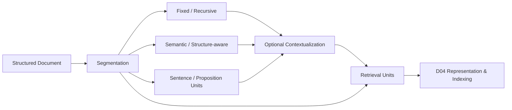

# Domain 02 - Segmentation & Contextualization

> [!IMPORTANT] Canonical Domain v2
> 本 Domain 只回答：**文件應切成什麼 retrieval units，以及切分後如何保留足夠上下文？**
> 它不負責 entity/relation/event extraction（D03），也不負責 index schema（D04）。

## Core Question

如何在 **retrieval granularity、語意完整性、檢索效率、上下文保留** 之間取得可測量的平衡？



圖中的 Contextualization 是可選步驟；raw chunk RAG 不必先做 knowledge extraction。

## Scope

### Includes
- fixed-size / recursive chunking
- semantic chunking
- structure-aware segmentation
- sentence / passage / proposition retrieval units
- parent-child segmentation
- contextual chunk representation
- retrieval granularity selection
- segmentation-induced information loss analysis

### Excludes
- entity / relation / event / claim extraction → [[02 - 研究領域專題 (Research Domains)/Canonical RAG Domains/Domain 03 - Knowledge Extraction & Information Preservation|D03]]
- vector / graph / hierarchical index construction → [[02 - 研究領域專題 (Research Domains)/Canonical RAG Domains/Domain 04 - Knowledge Representation & Indexing|D04]]
- query-time retrieval policy → [[02 - 研究領域專題 (Research Domains)/Canonical RAG Domains/Domain 05 - Query Understanding & Retrieval|D05]]
- evidence sufficiency / retry / stopping → [[02 - 研究領域專題 (Research Domains)/Canonical RAG Domains/Domain 06 - Evidence Sufficiency & Adaptive Retrieval|D06]]

## 1. Segmentation Strategies

| Family | Unit | Main trade-off |
|---|---|---|
| Fixed / token window | fixed token span | simple and cheap, but may cut semantic boundaries |
| Recursive | paragraph → sentence → token fallback | preserves some document hierarchy |
| Semantic | topic / semantic shift | better local coherence, higher preprocessing cost |
| Structure-aware | heading / section / table / list | uses document structure recovered by D01 |
| Proposition-level | atomic/self-contained statements | fine retrieval granularity but requires transformation/extraction |
| Parent-child | small retrieval unit + larger parent context | retrieval precision vs generation context |

## 2. Proposition Retrieval：Dense X

- Representative work: [[03 - 論文庫 (Literature Notes)/04 - Knowledge & Graph RAG/(EMNLP 2024-11) Dense X - Exploring the Limit of Proposition Retrieval for Open-Domain QA|Dense X]].
- 在本 taxonomy 中，Dense X 的 **Primary Domain = D02**，因為主要研究問題是 retrieval granularity。
- Proposition 的產生會碰到 D03，embedding/indexing 會碰到 D04，實際 ranking 會碰到 D05；因此它不是「Chunk → Proposition → Triple → Graph」的成熟度階梯。
- Proposition retrieval 的價值應以 benchmark 與 task 條件驗證，不應寫成已普遍取代 passage retrieval。

## 3. Semantic Chunking：LumberChunker

Representative work: [[03 - 論文庫 (Literature Notes)/03 - RAG & Retrieval/(EMNLP 2024-11) LumberChunker - Long-Context LLMs as Modular Chunkers for Long-Document RAG|LumberChunker]].

核心研究問題是：是否可用 long-context model 找出較符合語意轉折的 chunk boundaries，而不是固定 token window。其效益應在相同 retriever、相同 corpus 與相同 evaluation protocol 下比較。

## 4. Contextual Chunk Representation：Late Chunking

Representative work: [[03 - 論文庫 (Literature Notes)/03 - RAG & Retrieval/(arXiv 2024-09) Late Chunking - Contextual Chunk Embeddings for Retrieval|Late Chunking]].

Late Chunking 的重點不是「重新做 IE」，而是：

```text
whole-document encoding
        ↓
context-aware token representations
        ↓
chunk-level pooling
        ↓
contextualized chunk embeddings
```

因此它位於 D02 與 D04 的交界：**chunk boundary / contextualization 屬 D02；embedding representation 屬 D04**。

## 5. Segmentation Failure Modes

- Semantic fragmentation：一個條件或推論被切到不同 units。
- Dangling reference：this system / the company / above requirement 失去 antecedent。
- Qualifier separation：數值與其 time / condition / modality 被切開。
- Over-large units：retrieval precision 下降、context noise 增加。
- Over-small units：跨句關係、條件與 discourse context 遺失。

> [!NOTE]
> 上述 failure modes 是研究問題分類，不代表存在一個跨所有資料集的固定失敗比例。

## 6. Evaluation

D02 至少應同時觀察：
- retrieval Recall@k / Precision@k / nDCG
- downstream QA / task accuracy
- average unit length / number of units
- index size and preprocessing cost
- evidence boundary preservation
- cross-boundary failure rate
- parent-context expansion cost

只比較最終 answer accuracy 無法知道改善究竟來自 segmentation、retrieval 還是 generator。

## 7. Connections

```text
D01 Parsing / Structure
        ↓
D02 Segmentation / Contextualization
        ├──── raw retrieval units ───→ D04
        └──── semantic units ────────→ D03 (optional extraction)
                                         ↓
                                        D04
```

**Extraction is optional.** 傳統 chunk-based RAG 可直接由 D02 進 D04；只有需要 structured knowledge / graph / typed evidence 時才進 D03。

## Migrated Literature

- [[03 - 論文庫 (Literature Notes)/04 - Knowledge & Graph RAG/(EMNLP 2024-11) Dense X - Exploring the Limit of Proposition Retrieval for Open-Domain QA|Dense X]]
- [[03 - 論文庫 (Literature Notes)/03 - RAG & Retrieval/(EMNLP 2024-11) LumberChunker - Long-Context LLMs as Modular Chunkers for Long-Document RAG|LumberChunker]]
- [[03 - 論文庫 (Literature Notes)/03 - RAG & Retrieval/(arXiv 2024-09) Late Chunking - Contextual Chunk Embeddings for Retrieval|Late Chunking]]

## Navigation

- [[00 - 導覽與心智圖 (Navigation & MOC)/RAG Research Taxonomy & Domain Map|Canonical Taxonomy v2]]
- [[00 - 導覽與心智圖 (Navigation & MOC)/RAG Paradigm Tags|RAG Paradigm Tags]]
- [[00 - 導覽與心智圖 (Navigation & MOC)/Paper Domain Migration Manifest|Paper Domain Migration Manifest]]
