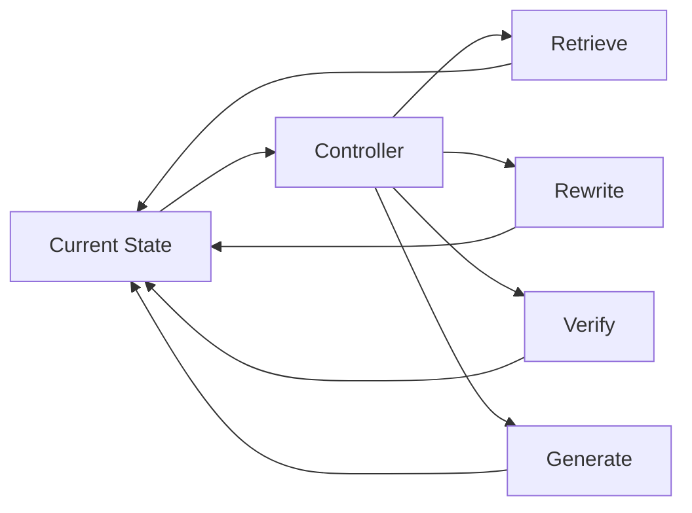

# Domain 12 - Agentic RAG & Orchestration

> [!IMPORTANT]
> 本頁是目前正式 RAG Taxonomy v2 的 D12。

## Core Question
系統如何根據目前 state 自主選擇下一個 RAG action、資料源、工具或子任務？

## Includes
- planning and routing
- controller / policy
- tool selection
- multi-agent coordination
- iterative search / read / verify / generate loops
- workflow orchestration

## Excludes
- 單一 retriever architecture → D05
- 只有 retrieve / stop 判斷的 adaptive retrieval → D06
- persistent memory 本身 → D11
- 一般 agent framework 但沒有 RAG-specific control → Adjacent Interface A04

## Boundary

Agentic RAG 是 control plane，不是固定 pipeline stage。

## Classification Rules
- 主要 contribution 若是 action selection / orchestration，Primary Domain 才是 D12。
- GraphRAG、Hierarchical RAG、Memory-Augmented RAG 等可作 Secondary Domain 或 paradigm tag。
- 一般 Agent / Tool Use 文獻若未直接研究 RAG，放在 A04 Adjacent Interface。

## Navigation
- [[00 - 導覽與心智圖 (Navigation & MOC)/RAG Research Taxonomy & Domain Map|RAG Research Taxonomy & Domain Map]]
- [[00 - 導覽與心智圖 (Navigation & MOC)/RAG Paradigm Tags|RAG Paradigm Tags]]
- [[00 - 導覽與心智圖 (Navigation & MOC)/RAG Adjacent Interfaces|RAG Adjacent Interfaces]]
