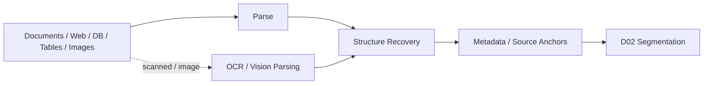

# Domain 01 - Document Ingestion & Structure

## Core Question
如何把 PDF、Web、DB、表格、圖片等來源轉成保留結構、版面、metadata 與 source anchors 的可處理 corpus？

## Includes
- PDF / HTML / Office / database ingestion
- OCR / vision parsing
- layout / heading / section / table structure recovery
- metadata normalization
- page / span / URI / hash anchoring
- multimodal document structure

## Excludes
- chunk boundary selection → D02
- entity / relation / event extraction → D03
- index representation → D04

## Level-2 Topics
- Document Parsing
- OCR / Vision Parsing
- Layout Understanding
- Structure Recovery
- Table / Figure Structure
- Metadata / Source Anchoring
- Multimodal Document Ingestion

## Boundary
D01 的輸出是 **structured source units**；它不決定最終 retrieval granularity，也不把文件直接轉成 knowledge graph。

## Navigation
- [[02 - 研究領域專題 (Research Domains)/Domain 02 - Segmentation & Contextualization|D02 Segmentation & Contextualization]]
- [[00 - 導覽與心智圖 (Navigation & MOC)/RAG Adjacent Interfaces|RAG Adjacent Interfaces]]
