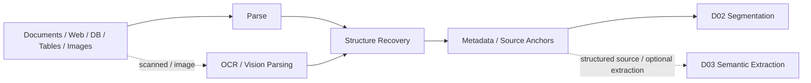

# Domain 01 - Document Parsing & Structure Recovery

> [!IMPORTANT]
> 本頁分類是本 repo 的 operational taxonomy。D01 研究來源內容的解析與結構還原；一般連接器與匯入管線是工程介面。Domain 邊界不表示所有系統必須依相同順序執行。

## Core Question
如何將 PDF、掃描文件、網頁或圖片式文件轉換為可處理的 source units，同時保留文字、版面、閱讀順序、階層、表格、公式與圖文關係？

```mermaid
flowchart LR
    SRC["Documents / Web / DB / Tables / Images"] --> P["Parse"]
    SRC -. "scanned / image" .-> OCR["OCR / Vision Parsing"]
    P --> S["Structure Recovery"]
    OCR --> S
    S --> M["Metadata / Source Anchors"]
    M --> D02["D02 Segmentation"]
    M -. "structured source / optional extraction" .-> D03["D03 Semantic Extraction"]
```

## Includes

- text / OCR extraction and vision parsing
- layout analysis, reading-order recovery and document hierarchy parsing
- table detection, structure recognition and functional-role recognition
- formula recognition and structured transcription
- figure / caption association and multimodal document structure recovery
- end-to-end document-to-structured-text conversion

## Excludes

- Office / Web / DB connectors, upload plumbing and generic data ingestion → engineering interface
- URI / hash / page / span anchors → output contract, rather than an independent research track
- chunk boundary selection → D02
- entity / relation / event extraction → D03
- index representation → D04
- general evaluation protocol / failure attribution → D13

## Level-2 Topics

- Text Recognition / OCR
- Layout & Reading-order Recovery
- Document Hierarchy Recovery
- Table Detection, Structure Recognition & Functional Analysis
- Formula Recognition & Structured Transcription
- Figure / Caption Association
- End-to-end Structured Document Parsing

這些是本 repo 對 parsing 問題的操作性細分，不表示每一項都是獨立的 RAG 社群分類。表格／公式解析目前已有 scope，但專門方法文獻仍需補強；下列官方候選未計入已驗證的 primary-note coverage。

### Table and Formula Structure

表格區域的位置、儲存格／跨列跨欄結構，以及 column / row header 的功能角色，應分開描述。
[PubTables-1M (2022/06), 官方摘要](https://openaccess.thecvf.com/content/CVPR2022/html/Smock_PubTables-1M_Towards_Comprehensive_Table_Extraction_From_Unstructured_Documents_CVPR_2022_paper.html) 明確區分 table detection、structure recognition、functional analysis，並處理標註 oversegmentation。**本 repo 分類判斷**：還原表格既有結構屬 D01；把表格中的敘述抽成 semantic records 屬 D03；建立可搜尋表示屬 D04。

[Nougat (ICLR 2024), 官方摘要](https://proceedings.iclr.cc/paper_files/paper/2024/hash/a39a9aceda771cded859ae7560530e09-Abstract-Conference.html) 研究 scientific document images 到 markup 的轉換，指出 PDF 中數學表達式的語義資訊問題。其預印本為 [arXiv:2308.13418 (2023/08)](https://arxiv.org/abs/2308.13418)，正式發表為 ICLR 2024。**候選狀態：兩篇均僅核對官方摘要與 publication record，全文待驗證；不據此填入 parser 分數或 downstream RAG 改善數據。**

### Parsing Quality and Downstream Diagnosis

既有 [[03 - 論文庫 (Literature Notes)/06 - Benchmarks & Evaluation/(CVPR 2025-06) OmniDocBench - Benchmarking Diverse PDF Document Parsing with Comprehensive Annotations|OmniDocBench]] 與 [[03 - 論文庫 (Literature Notes)/06 - Benchmarks & Evaluation/(ACL 2025-07) READoc - A Unified Benchmark for Realistic Document Structured Extraction|READoc]] 支援 parser-level 評估；不能由 parser 分數直接推定相同幅度的 retrieval／QA 改善。

**本 repo 評測建議**：同時報 source-structure quality、evidence recall 與 downstream task quality；固定 segmentation、retriever、generator 後，以 gold parsing 置換定位解析錯誤的影響。解析方法的介入屬 D01，controlled-intervention protocol 屬 D13；這項評測組合是專案設計，不宣稱由上述兩篇完整提出。

## Boundary

D01 的輸出是 **structured source units**；D02 決定何種來源內容構成 retrieval unit，D03 抽取 semantic units，D04 建立 representation / index。已具結構的來源可以直接交給 D03；圖中 D01→D02 是常見依賴關係，不是每個來源都必須先做 OCR 或一般 chunking。

## Representative Notes

文獻數量以 paper frontmatter 與 [[02 - 研究領域專題 (Research Domains)/README|Research Domains coverage snapshot]] 為準；官方候選來源不計入已驗證筆記。

- [[03 - 論文庫 (Literature Notes)/06 - Benchmarks & Evaluation/(KDD 2022-08) DocLayNet - A Large Human-Annotated Dataset for Document-Layout Analysis|DocLayNet]]
- [[03 - 論文庫 (Literature Notes)/06 - Benchmarks & Evaluation/(CVPR 2025-06) OmniDocBench - Benchmarking Diverse PDF Document Parsing with Comprehensive Annotations|OmniDocBench]]
- [[03 - 論文庫 (Literature Notes)/03 - RAG & Retrieval/(EMNLP 2024-11) PDF-to-Tree - Parsing PDF Text Blocks into a Tree|PDF-to-Tree]]
- [[03 - 論文庫 (Literature Notes)/03 - RAG & Retrieval/(EMNLP 2025-11) Intelligent Document Parsing - Towards End-to-end Document Parsing via Decoupled Content Parsing and Layout Grounding|Intelligent Document Parsing]]
- [[03 - 論文庫 (Literature Notes)/06 - Benchmarks & Evaluation/(ACL 2025-07) READoc - A Unified Benchmark for Realistic Document Structured Extraction|READoc]]

## Survey Alignment and Coverage Gap

[[03 - 論文庫 (Literature Notes)/03 - RAG & Retrieval/(ACM CSUR 2026-09) A Survey on Retrieval-Augmented Text Generation for Large Language Models|Huang & Huang — RAG Survey]] 的 pre-retrieval / indexing / data-modification 視角可用於大類對照，但不足以單獨支撐本頁對 OCR、表格功能角色與公式轉寫的細分。這些機制仍需各自的 primary papers；Domain-level survey coverage 統一維護於 [[00 - 導覽與心智圖 (Navigation & MOC)/Survey Papers Index|Survey Papers Index]]。

## Navigation
- [[02 - 研究領域專題 (Research Domains)/Domain 02 - Segmentation & Contextualization|D02 Segmentation & Contextualization]]
- [[00 - 導覽與心智圖 (Navigation & MOC)/RAG Adjacent Interfaces|RAG Adjacent Interfaces]]

## Canonical Classification — 2026-10-02

> [!IMPORTANT]
> **Canonical name: D01 Document Parsing & Structure Recovery.**
> 現行 Includes / Excludes / Level-2 與本節使用同一規則；Phase 1 歷史決策另見 audit。檔名維持不變。

**Core question**：如何將 PDF、掃描文件、圖片式文件等原始或視覺結構化來源，轉換為可機器處理的 source units，同時保留文字、版面、閱讀順序、階層及表格／圖像等結構？

**Canonical scope**
- text / OCR extraction
- layout analysis
- reading-order recovery
- document hierarchy parsing
- table / formula / figure parsing
- end-to-end structured document extraction
- multimodal structure recovery

**Boundary**
- source structure → D01
- retrieval-unit formation / chunk boundary → D02
- semantic entity/relation/event extraction → D03
- representation/index organization → D04
- source URI/hash/page/span anchors are **output/engineering requirements**, not an equally mature research track
- Office/Web/DB connectors and generic ingestion plumbing are implementation concerns, not the scientific identity of D01

**Paper decisions**
- DocLayNet: D01 primary; does not establish superiority of a chunking policy.
- OmniDocBench / READoc: D01 primary with D13 evaluation interface.
- PDF-to-Tree / Intelligent Document Parsing: D01 parsing / structure-recovery anchors.
- MultiDocFusion: D02 primary / D01 secondary.
- VDocRAG: not D01 primary; representation/retrieval problem.

## Audit Trail

- [[00 - 導覽與心智圖 (Navigation & MOC)/Phase 1 Taxonomy Closure Audit - 2026-09-27|Phase 1 Taxonomy Closure Audit]]

## Candidate Source Records

以下只完成官方 metadata / abstract 核對，全文待驗證，不計入已驗證 primary coverage。

- [PubTables-1M, 2022/06] Brandon Smock et al. "PubTables-1M: Towards Comprehensive Table Extraction From Unstructured Documents." CVPR 2022. [官方記錄](https://openaccess.thecvf.com/content/CVPR2022/html/Smock_PubTables-1M_Towards_Comprehensive_Table_Extraction_From_Unstructured_Documents_CVPR_2022_paper.html)
- [Nougat, 2024] Lukas Blecher et al. "Nougat: Neural Optical Understanding for Academic Documents." ICLR 2024; preprint 2023/08. [正式記錄](https://proceedings.iclr.cc/paper_files/paper/2024/hash/a39a9aceda771cded859ae7560530e09-Abstract-Conference.html) / [arXiv:2308.13418](https://arxiv.org/abs/2308.13418)
