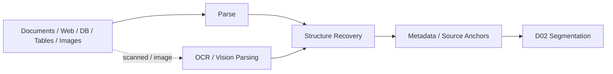

# Domain 01 - Document Parsing & Structure Recovery

## Core Question
如何把 PDF、Web、DB、表格、圖片等來源轉成保留結構、版面、metadata 與 source anchors 的可處理 corpus？

```mermaid
flowchart LR
    SRC["Documents / Web / DB / Tables / Images"] --> P["Parse"]
    SRC -. "scanned / image" .-> OCR["OCR / Vision Parsing"]
    P --> S["Structure Recovery"]
    OCR --> S
    S --> M["Metadata / Source Anchors"]
    M --> D02["D02 Segmentation"]
```

## Includes
- PDF / HTML / Office / database ingestion
- OCR / vision parsing
- layout / heading / section / table structure recovery
- metadata normalization
- page / span / URI / hash anchoring
- multimodal document structure

## Excludes
- chunk boundary selection → D02
- entity / relation / event extraction → D03
- index representation → D04

## Level-2 Topics
- Document Parsing
- OCR / Vision Parsing
- Layout Understanding
- Structure Recovery
- Table / Figure Structure
- Metadata / Source Anchoring
- Multimodal Document Ingestion

## Boundary
D01 的輸出是 **structured source units**；它不決定最終 retrieval granularity，也不把文件直接轉成 knowledge graph。

## Representative Notes

**Current primary-note coverage: 2**

- [[03 - 論文庫 (Literature Notes)/06 - Benchmarks & Evaluation/(KDD 2022-08) DocLayNet - A Large Human-Annotated Dataset for Document-Layout Analysis|DocLayNet]]
- [[03 - 論文庫 (Literature Notes)/06 - Benchmarks & Evaluation/(CVPR 2025-06) OmniDocBench - Benchmarking Diverse PDF Document Parsing with Comprehensive Annotations|OmniDocBench]]

## Navigation
- [[02 - 研究領域專題 (Research Domains)/Domain 02 - Segmentation & Contextualization|D02 Segmentation & Contextualization]]
- [[00 - 導覽與心智圖 (Navigation & MOC)/RAG Adjacent Interfaces|RAG Adjacent Interfaces]]

## Phase 1 Closure — 2026-09-27

> [!IMPORTANT]
> **Canonical name: D01 Document Parsing & Structure Recovery.**
> 目前檔名暫時保留，統一路徑 rename 延後到 Phase 7，以避免現階段破壞 Obsidian links。

**Core question**：如何將 PDF、掃描文件、圖片式文件等原始或視覺結構化來源，轉換為可機器處理的 source units，同時保留文字、版面、閱讀順序、階層及表格／圖像等結構？

**Canonical scope**
- text / OCR extraction
- layout analysis
- reading-order recovery
- document hierarchy parsing
- table / formula / figure parsing
- end-to-end structured document extraction
- multimodal structure recovery

**Boundary**
- source structure → D01
- retrieval-unit formation / chunk boundary → D02
- semantic entity/relation/event extraction → D03
- representation/index organization → D04
- source URI/hash/page/span anchors are **output/engineering requirements**, not an equally mature research track
- Office/Web/DB connectors and generic ingestion plumbing are implementation concerns, not the scientific identity of D01

**Paper decisions**
- DocLayNet: KEEP; do not claim it proves fixed-token chunking is inferior.
- OmniDocBench: KEEP; D13 may be secondary.
- PDF-to-Tree (Findings EMNLP 2024): ADD as core hierarchy-parsing anchor.
- Intelligent Document Parsing (Findings EMNLP 2025): ADD.
- READoc (Findings ACL 2025): ADD.
- MultiDocFusion: D02 primary / D01 secondary.
- VDocRAG: not D01 primary; representation/retrieval problem.
