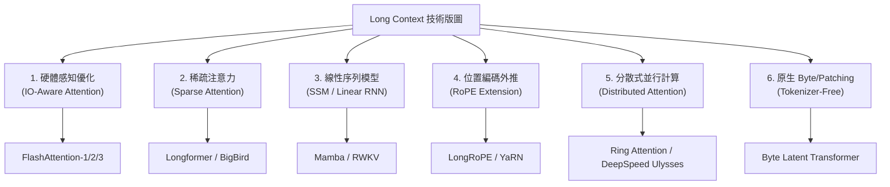

# Domain 01: Long Context 與序列架構 (Dense Attention, SSM, Ring Attention)

> [!ABSTRACT] 核心問題意識 (Core Problem Statement)
> **如何讓神經網絡模型本身具備直接吞吐並計算數十萬至數百萬 Token 的序列建模能力，同時克服時間複雜度 $O(L^2)$ 與顯存空間爆炸？**

---

### 一、核心問題意識
長文本序列建模的本質矛盾在於：
1. **表達力與計算複雜度的衝突**：全注意力（Dense Attention）允許序列中任意兩個 Token 直接進行內積互動，具備最強大的自由度與檢索精度，但其計算與顯存複雜度隨序列長度 $L$ 呈二次方增長 $O(L^2)$。
2. **硬體記憶體階層瓶頸**：在 GPU 運算中，HBM（高頻寬顯存）與晶上 SRAM 之間的傳輸頻寬（Memory Bandwidth）遠落後於 Tensor Core 的算力。超長序列計算實質上是受限於記憶體存取（Memory-bound）。
3. **有效注意力 vs. 名義窗口**：即使模型在技術上支援 1M 上下文，由於位置編碼衰減或注意力擴散，模型往往容易陷入 [[03 - 論文庫 (Literature Notes)/01 - Long Context & Sequence/(NeurIPS 2017-12) Attention Is All You Need|Attention]] 稀釋與 [[03 - 論文庫 (Literature Notes)/06 - Benchmarks & Evaluation/(TACL 2024-01) Lost in the Middle - How Language Models Use Long Contexts|Lost in the Middle]] 的窘境。

---

### 二、六條並行的技術演進路線

1. **硬體感知的精確注意力 (IO-Aware Exact Attention)**：
   - 代表作：[[03 - 論文庫 (Literature Notes)/01 - Long Context & Sequence/(NeurIPS 2022-12) FlashAttention - Fast and Memory-Efficient Exact Attention with IO-Awareness|FlashAttention (Dao et al., 2022)]]、[[03 - 論文庫 (Literature Notes)/01 - Long Context & Sequence/(ICLR 2024-05) FlashAttention-2 - Faster Attention with Better Parallelism and Work Partitioning|FlashAttention-2 (Dao, 2023/2024)]]。
   - 核心思想：利用 Tiling 在 SRAM 中完成分塊 Online Softmax，完全不將 $N \times N$ 注意力矩陣寫回 HBM。在不改變任何數學輸出定義的前提下大幅降低記憶體並利用 Work Partitioning 逼近硬體理論算力極限（73% MFU）。
2. **稀疏注意力與局部雜湊 (Sparse & Hashed Attention)**：
   - 代表作：[[03 - 論文庫 (Literature Notes)/01 - Long Context & Sequence/(ACL 2020-07) Longformer - The Long-Document Transformer|Longformer (Beltagy et al., 2020)]]、[[03 - 論文庫 (Literature Notes)/01 - Long Context & Sequence/(NeurIPS 2020-12) Big Bird - Transformers for Longer Sequences|BigBird (Zaheer et al., 2020)]]、[[03 - 論文庫 (Literature Notes)/01 - Long Context & Sequence/(ICLR 2020-04) Reformer - The Efficient Transformer|Reformer (Kitaev et al., 2020)]]。
   - 核心思想：將全注意力矩陣限制在局部滑動窗口（Local Window）、擴張窗口（Dilated）、少數全域節點（Global Tokens）或基於角度的局部敏感雜湊（Angular LSH），將複雜度壓低至 $O(L)$ 或 $O(L \log L)$。搭配可逆殘差網路（RevNet）更能消除深層激活值顯存。
3. **分段循環與串流匯聚 (Recurrence & Attention Sinks)**：
   - 代表作：[[03 - 論文庫 (Literature Notes)/01 - Long Context & Sequence/(ACL 2019-07) Transformer-XL - Attentive Language Models Beyond a Fixed-Length Context|Transformer-XL (Dai et al., 2019)]]、[[03 - 論文庫 (Literature Notes)/01 - Long Context & Sequence/(ICLR 2024-05) Efficient Streaming Language Models with Attention Sinks|StreamingLLM (Xiao et al., 2023/2024)]]。
   - 核心思想：以歷史隱藏狀態快取（Stop-gradient Cache）打破固定長度截斷，或透過保留最初 4 個匯聚 Token（Attention Sinks）錨定 Softmax 分母，讓自回歸解碼在常數顯存下實現跨百萬 Token 的穩定串流。
4. **替代序列架構與線性注意力 (Linear Attention & SSM)**：
   - 代表作：[[03 - 論文庫 (Literature Notes)/01 - Long Context & Sequence/(ICLR 2021-05) Rethinking Attention with Performers|Performer (Choromanski et al., 2020/2021)]]、[[03 - 論文庫 (Literature Notes)/01 - Long Context & Sequence/(arXiv 2023-12) Mamba - Linear-Time Sequence Modeling with Selective State Spaces|Mamba (Gu & Dao, 2023)]]、RWKV。
   - 核心思想：利用正交隨機特徵（FAVOR+）無偏估計正值核矩陣並透過矩陣結合律化簡運算，或採用具備時變選擇特性的狀態空間模型（Selective SSM），推論時顯存恆定 $O(1)$，長度外推呈嚴格線性 $O(L)$。
5. **位置編碼外推 (Positional Encoding Extension)**：
   - 代表作：[[03 - 論文庫 (Literature Notes)/01 - Long Context & Sequence/(ICML 2024-07) LongRoPE - Extending LLM Context Window Beyond 2 Million Tokens|LongRoPE (Ding et al., 2024)]]、YaRN、NTK-aware Scaling。
   - 核心思想：透過演化演算法或頻率維度非均勻縮放，將預訓練的 RoPE 旋轉角度平滑插值到 2M+ 長度，使模型無需從頭預訓練即可辨識遠距離座標。
6. **分散式超長上下文 (Distributed Context / Ring Attention)**：
   - 代表作：[[03 - 論文庫 (Literature Notes)/01 - Long Context & Sequence/(ICLR 2024-05) RingAttention with Blockwise Transformers for Near-Infinite Context|RingAttention (Liu et al., 2023)]]、DeepSpeed Ulysses。
   - 核心思想：將單張 GPU 無法承受的超長 KV 序列打散到多卡或跨節點叢集，藉由環狀通訊管線將通訊延遲隱藏在計算後台，解鎖 10M 級原生上下文。
7. **無分詞自適應架構 (Byte-level Tokenizer-Free)**：
   - 代表作：[[03 - 論文庫 (Literature Notes)/02 - Compression & KV Cache/(arXiv 2024-12) Byte Latent Transformer - Patches Scale Better Than Tokens|Byte Latent Transformer (Pagnoni et al., 2024)]]。
   - 核心思想：揚棄剛性 Tokenizer，依據資訊熵自適應聚合 Byte Patches，減少無效序列長度並動態分配算力。

---

### 三、關鍵技術比較表

| 技術路線 | 代表模型/演算法 | 計算複雜度 | 顯存複雜度 | 精度特徵 | 2026 現狀與主要痛點 |
| :--- | :--- | :--- | :--- | :--- | :--- |
| **Dense Exact** | [[03 - 論文庫 (Literature Notes)/01 - Long Context & Sequence/(NeurIPS 2017-12) Attention Is All You Need\|Transformer]] | $O(L^2)$ | $O(L^2)$ | 完全精確 | 無法單獨承受超百萬長度 |
| **IO-Aware Exact** | [[03 - 論文庫 (Literature Notes)/01 - Long Context & Sequence/(NeurIPS 2022-12) FlashAttention - Fast and Memory-Efficient Exact Attention with IO-Awareness\|FlashAttention-1/2]] | $O(L^2)$ (高常數加速) | $O(L)$ | 完全精確 | 運算量本質仍為平方，極限長度仍受算力制約 |
| **Sparse / LSH** | [[03 - 論文庫 (Literature Notes)/01 - Long Context & Sequence/(ACL 2020-07) Longformer - The Long-Document Transformer\|Longformer]], [[03 - 論文庫 (Literature Notes)/01 - Long Context & Sequence/(ICLR 2020-04) Reformer - The Efficient Transformer\|Reformer]] | $O(L \log L)$ ~ $O(L)$ | $O(L)$ | 局部精確，遠程稀疏/雜湊 | 遠距多跳依賴傳播層數多，GPU 動態雜湊存取效率低 |
| **Segment Recurrence** | [[03 - 論文庫 (Literature Notes)/01 - Long Context & Sequence/(ACL 2019-07) Transformer-XL - Attentive Language Models Beyond a Fixed-Length Context\|Transformer-XL]] | $O(L \times M)$ | $O(N \times M)$ | 歷史快取循環 | 單向因果限制，無法反向傳播長程梯度 |
| **Streaming Sinks** | [[03 - 論文庫 (Literature Notes)/01 - Long Context & Sequence/(ICLR 2024-05) Efficient Streaming Language Models with Attention Sinks\|StreamingLLM]] | $O(W \times L)$ | $O(1)$ 常數快取 | 匯聚錨定，近期精確 | 拋棄中間歷史，無法支援遠程事實檢索與 NIAH |
| **Linear Kernel** | [[03 - 論文庫 (Literature Notes)/01 - Long Context & Sequence/(ICLR 2021-05) Rethinking Attention with Performers\|Performer (FAVOR+)]] | $O(L \cdot m \cdot d)$ | $O(L)$ | 隨機特徵無偏近似 | 依賴特徵數 $m$，短序列 GPU 吞吐不及高度特化 GEMM |
| **Linear SSM** | [[03 - 論文庫 (Literature Notes)/01 - Long Context & Sequence/(arXiv 2023-12) Mamba - Linear-Time Sequence Modeling with Selective State Spaces\|Mamba]] | $O(L)$ | $O(1)$ (推論) | 資訊狀態壓縮 | 精確 Copy/Recall（如 NIAH）不如 Attention |
| **Positional Ext**| [[03 - 論文庫 (Literature Notes)/01 - Long Context & Sequence/(ICML 2024-07) LongRoPE - Extending LLM Context Window Beyond 2 Million Tokens\|LongRoPE]] | 依基座模型 | 依基座模型 | 坐標外推 | 僅保證位置辨識，不保證長文複雜多跳推理能力 |
| **Distributed** | [[03 - 論文庫 (Literature Notes)/01 - Long Context & Sequence/(ICLR 2024-05) RingAttention with Blockwise Transformers for Near-Infinite Context\|RingAttention]] | $O(L^2 / N)$ | $O(L / N)$ | 完全精確 | 極度依賴跨節點高速互聯頻寬（InfiniBand） |

---

### 四、2026 前沿研究洞察
1. **長上下文不等於長推理（Context Window $
eq$ Effective Reasoning）**：
   - 根據 [[03 - 論文庫 (Literature Notes)/06 - Benchmarks & Evaluation/(arXiv 2024-04) RULER - What is the Real Context Size of Your Long-Context Language Models|RULER (NVIDIA 2024)]] 與 [[03 - 論文庫 (Literature Notes)/06 - Benchmarks & Evaluation/(TACL 2024-01) Lost in the Middle - How Language Models Use Long Contexts|Lost in the Middle]] 實證，名義 128k/1M 的模型在多跳因果聚合任務中，真實有效上下文往往在 32k~64k 便發生崩潰。
2. **混合架構（Hybrid Architecture）成為主流趨勢**：
   - 純 SSM 在精確事實檢索上略遜於 Attention，因此 2025-2026 年新一代模型多採用『每隔數層 SSM 插入一層 Attention』的混合方案（如 Jamba、Nemotron-H），兼顧全域 Recall 與線性推論吞吐。

---

## 相關導覽與文獻快速跳轉
- **回主目錄**：[[00 - 導覽與心智圖 (Navigation & MOC)/Home (主目錄與知識庫導覽)|主目錄與知識庫導覽]]
- **全景心智圖**：[[00 - 導覽與心智圖 (Navigation & MOC)/LLM 超長文件處理心智圖 (MOC)|超長文件處理研究方向心智圖]]
- **深度研究報告**：[[01 - 深度研究報告 (Deep Research Reports)/01 - LLM 超長文件閱讀與撰寫技術全景 (完整深度報告)|技術全景深度報告]]
- **權衡分析**：[[00 - 導覽與心智圖 (Navigation & MOC)/技術全景與 Pareto 權衡分析 (Trade-offs)|技術成熟度與 Pareto 權衡分析]]
