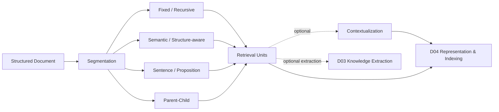

# Domain 02 - Segmentation & Contextualization

## Core Question
文件應被切成什麼 retrieval units，且切分後如何保留足夠上下文？



## Includes
- fixed / recursive chunking
- semantic chunking
- structure-aware segmentation
- sentence / passage / proposition retrieval units
- parent-child segmentation
- contextualized chunks
- retrieval granularity
- segmentation-induced information loss

## Excludes
- entity / relation / event / claim extraction → D03
- embedding / graph / index design → D04
- query-time retrieval algorithm → D05
- evidence sufficiency / retry / stopping → D06

## Level-2 Topics
- Chunking
- Semantic Segmentation
- Structure-aware Segmentation
- Parent-Child Retrieval Units
- Proposition / Fine-grained Retrieval Units
- Contextualized Chunks
- Retrieval Granularity
- Segmentation Failure Analysis

## Boundary
```text
Segmentation != Knowledge Extraction != Knowledge Representation
```
Raw-chunk RAG 可由 D02 直接進 D04；D03 是可選支線，不是所有 RAG 的必要步驟。

## Representative Notes

**Current primary-note coverage: 3**

- [[03 - 論文庫 (Literature Notes)/04 - Knowledge & Graph RAG/(EMNLP 2024-11) Dense X - Exploring the Limit of Proposition Retrieval for Open-Domain QA|Dense X]]
- [[03 - 論文庫 (Literature Notes)/03 - RAG & Retrieval/(EMNLP 2024-11) LumberChunker - Long-Context LLMs as Modular Chunkers for Long-Document RAG|LumberChunker]]
- [[03 - 論文庫 (Literature Notes)/03 - RAG & Retrieval/(arXiv 2024-09) Late Chunking - Contextual Chunk Embeddings for Retrieval|Late Chunking]]

## Navigation
- [[02 - 研究領域專題 (Research Domains)/Domain 01 - Document Ingestion & Structure|D01 Document Ingestion & Structure]]
- [[02 - 研究領域專題 (Research Domains)/Domain 03 - Knowledge Extraction & Information Preservation|D03 Knowledge Extraction & Information Preservation]]
- [[02 - 研究領域專題 (Research Domains)/Domain 04 - Knowledge Representation & Indexing|D04 Knowledge Representation & Indexing]]
