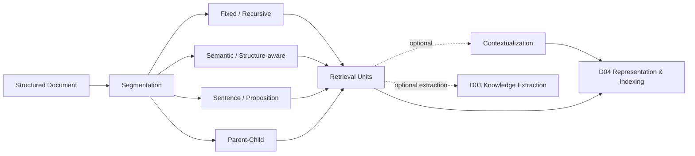

# Domain 02 - Segmentation & Retrieval Granularity

> [!IMPORTANT]
> 本頁是本 repo operational taxonomy 的 D02：決定哪些來源內容構成 retrieval units，以及可採用的邊界、粒度與階層關係。Contextualization 僅保留為 D02↔D03/D04 介面；semantic extraction 屬 D03，表示／編碼屬 D04，query-time 選擇與排序屬 D05。

## Core Question
文件應被切成什麼 retrieval units，且切分後如何保留足夠上下文？如何在 **retrieval granularity、語意完整性、檢索效率、上下文保留** 之間取得可測量的平衡？


```mermaid
flowchart LR
    DOC["Structured Document"] --> SEG["Segmentation"]
    SEG --> FIX["Fixed / Recursive"]
    SEG --> SEM["Semantic / Structure-aware"]
    SEG --> FINE["Sentence / Proposition"]
    SEG --> PC["Parent-Child"]
    FIX --> U["Retrieval Units"]
    SEM --> U
    FINE --> U
    PC --> U
    U -. "optional" .-> C["Contextualization"]
    C --> D04["D04 Representation & Indexing"]
    U --> D04
    U -. "optional extraction" .-> D03["D03 Knowledge Extraction"]
```

## Includes

- fixed / recursive chunking
- semantic chunking
- structure-aware segmentation
- sentence / passage / proposition retrieval units
- parent-child / multi-resolution retrieval-unit formation
- static or query-conditioned retrieval-unit boundary formation
- retrieval granularity and unit-interface design
- segmentation-induced information loss

## Excludes

- entity / relation / event / claim extraction → [[02 - 研究領域專題 (Research Domains)/Domain 03 - Knowledge Extraction & Information Preservation|D03]]
- embedding / graph / index design → [[02 - 研究領域專題 (Research Domains)/Domain 04 - Knowledge Representation & Indexing|D04]]
- contextualized unit encoding → D04; meaning-preserving semantic rewrite / extraction → D03
- query-time selection among existing granularity levels, retrieval and reranking → [[02 - 研究領域專題 (Research Domains)/Domain 05 - Query Understanding & Retrieval|D05]]
- evidence sufficiency / retry / stopping → [[02 - 研究領域專題 (Research Domains)/Domain 06 - Evidence Sufficiency & Adaptive Retrieval|D06]]
- final reader-context selection, expansion, packing and compression → D07

## Level-2 Topics

- Boundary Selection: fixed / overlapping / recursive / semantic / structure-aware
- Retrieval Granularity: document / section / passage / sentence / proposition
- Hierarchical Retrieval Units: parent-child / multi-resolution
- Static & Query-conditioned Unit Formation
- Indexed / Retrieved / Reader-context Unit Interfaces
- Segmentation Failure & Cost–Quality Trade-offs

## Boundary
```text
Segmentation != Knowledge Extraction != Knowledge Representation
```
Raw-chunk RAG 可由 D02 直接進 D04；D03 是可選支線，不是所有 RAG 的必要步驟。

### Indexed, Retrieved and Reader-context Units

下表是**本 repo 的操作性整理**，用於表明各階段消費的文字物件不必相同；不是另立三個 Domain，也不是宣稱某篇論文採用這份統一字典。

| Object | Meaning | Boundary |
|---|---|---|
| Indexed unit | 供 representation / index 使用的內容單元 | 邊界／粒度形成 D02；實際編碼／index organization D04 |
| Retrieved evidence unit | 檢索介面回傳的 evidence，可與 indexed unit 相同，也可回傳對應 passage / parent | 可用單元間關係 D02；query-time 選擇與召回 D05 |
| Reader-context unit | 實際交給 generator 的文字／物件，可由召回結果擴張、裁剪或組裝 | post-retrieval context construction D07 |

既有 [[03 - 論文庫 (Literature Notes)/04 - Knowledge & Graph RAG/(EMNLP 2024-11) Dense X - Exploring the Limit of Proposition Retrieval for Open-Domain QA|Dense X]] 探討 retrieval granularity；[[03 - 論文庫 (Literature Notes)/03 - RAG & Retrieval/(arXiv 2024-06) LongRAG - Enhancing Retrieval-Augmented Generation with Long-context LLMs|LongRAG]] 探討 long retrieval units 與 long-context reader。這些是粒度／reader 介面的一手研究例子，不能據此把 retrieval unit 和 generator context 強制視為同一物件。

### Query-adaptive Granularity: Formation versus Selection

**本 repo 分類規則**：若方法依 query 重新決定哪些 source spans 構成一個可檢索單元，研究介入是 D02；若預先已有多層 units，而 query-time policy 只選擇搜尋哪一層或召回哪些 units，介入是 D05。改變單元的 encoding / compressed representation 屬 D04；選擇是否繼續 retrieve 或停止屬 D06。單一 granularity selector 不因名為 planner 或使用 RL 就自動屬 D12。

[SmartChunk Retrieval (ICLR 2026), 官方摘要](https://proceedings.iclr.cc/paper_files/paper/2026/hash/5c1ff00b27ba052039bb41531236baac-Abstract-Conference.html) 描述 query-dependent chunk abstraction planner、compressed chunk embeddings 與 on-the-fly granularity adaptation。**候選狀態：僅核對官方摘要及正式 publication record，全文待驗證；不預先指定 primary domain，不計入 primary coverage。** 要先核對其實際改動是 unit formation、representation 還是 query-time level selection。

## Representative Notes

文獻數量以 paper frontmatter 與 [[02 - 研究領域專題 (Research Domains)/README|Research Domains coverage snapshot]] 為準。

- [[03 - 論文庫 (Literature Notes)/04 - Knowledge & Graph RAG/(EMNLP 2024-11) Dense X - Exploring the Limit of Proposition Retrieval for Open-Domain QA|Dense X]] (自包含命題檢索粒度)
- [[03 - 論文庫 (Literature Notes)/03 - RAG & Retrieval/(EMNLP 2024-11) LumberChunker - Long-Context LLMs as Modular Chunkers for Long-Document RAG|LumberChunker]] (長上下文 LLM 語意分塊)
- [[03 - 論文庫 (Literature Notes)/03 - RAG & Retrieval/(arXiv 2024-06) LongRAG - Enhancing Retrieval-Augmented Generation with Long-context LLMs|LongRAG]] (粗粒度檢索與 long-context reader 介面)
- [[03 - 論文庫 (Literature Notes)/03 - RAG & Retrieval/(ACL 2026-07) HiChunk - Evaluating and Enhancing Retrieval Augmented Generation with Hierarchical Chunking|HiChunk]] (階層式分塊與 HiCBench 評測)
- [[03 - 論文庫 (Literature Notes)/03 - RAG & Retrieval/(EMNLP 2025-11) MultiDocFusion - Hierarchical and Multimodal Chunking Pipeline for Enhanced RAG on Long Industrial Documents|MultiDocFusion]] (工業長篇文檔多模態階層分塊)

## Segmentation Strategies

| Family | Unit | Main trade-off |
|---|---|---|
| Fixed / token window | fixed token span | simple and cheap, but may cut semantic boundaries |
| Recursive | paragraph → sentence → token fallback | preserves some document hierarchy |
| Semantic | topic / semantic shift | aims at coherent boundaries; gains and preprocessing cost require controlled comparison |
| Structure-aware | heading / section / table / list | uses document structure recovered by D01 |
| Proposition-level | atomic/self-contained statements | fine retrieval granularity but requires transformation/extraction |
| Parent-child | small retrieval unit + larger parent context | retrieval precision vs generation context |

## Contextualization Patterns & Exemplar Works

「Contextualization」不是單一研究問題：本 repo 將 meaning-preserving semantic rewrite / extraction 歸 D03，broader-context encoding 歸 D04；只有 unit boundary / granularity 的改動屬 D02。以下例子保留介面，不另立重複 Domain。

### 1. Contextual Chunk Representation：Late Chunking（D04 primary / D02 interface）
- Representative work: [[03 - 論文庫 (Literature Notes)/03 - RAG & Retrieval/(arXiv 2024-09) Late Chunking - Contextual Chunk Embeddings for Retrieval|Late Chunking]]
- Late Chunking 的重點不是「重新做 IE」，而是解決傳統 chunking 破壞全域語意上下文的問題：
```text
whole-document encoding
        ↓
context-aware token representations
        ↓
chunk-level pooling
        ↓
contextualized chunk embeddings
```
- 因此它位於 D02 與 D04 的交界；但論文真正改動的是 **embedding representation**，故 Primary Domain = D04，D02 僅保留 contextualization interface。

### 2. Contextual Retrieval (Prepended Context)
- [Contextual Retrieval（Anthropic, 2024/09）, 官方工程說明](https://www.anthropic.com/engineering/contextual-retrieval)：為每個 chunk 產生 document-specific context，prepend 後再建立 embedding 與 BM25 index。這是產業工程技術，不是 peer-reviewed paper note。**本 repo 分類判斷**：若 chunk boundary 不變，其主要介入是 D04 contextualized representation；不能因逐 chunk 處理就改列 D02 主貢獻。

### 3. Proposition Retrieval：Dense X
- Representative work: [[03 - 論文庫 (Literature Notes)/04 - Knowledge & Graph RAG/(EMNLP 2024-11) Dense X - Exploring the Limit of Proposition Retrieval for Open-Domain QA|Dense X]]。
- 在本 taxonomy 中，Dense X 的 **Primary Domain = D02**，因為主要研究問題是 retrieval granularity。
- Proposition 的產生會碰到 D03，embedding/indexing 會碰到 D04，實際 ranking 會碰到 D05；因此它不是「Chunk → Proposition → Triple → Graph」的成熟度階梯。
- Proposition retrieval 的價值應以 benchmark 與 task 條件驗證，不應寫成已普遍取代 passage retrieval。

### 4. Semantic Chunking：LumberChunker
- Representative work: [[03 - 論文庫 (Literature Notes)/03 - RAG & Retrieval/(EMNLP 2024-11) LumberChunker - Long-Context LLMs as Modular Chunkers for Long-Document RAG|LumberChunker]]。
- 核心研究問題是：是否可用 long-context model 找出較符合語意轉折的 chunk boundaries，而不是固定 token window。其效益應在相同 retriever、相同 corpus 與相同 evaluation protocol 下比較。

### 5. Parent-Child / Section Context
- 以小 unit 檢索、用較大 parent context 提供生成內容，在檢索召回精度與生成上下文完整性之間取得平衡。

## Segmentation Failure Modes

- **Semantic fragmentation**：一個條件或推論被切到不同 units。
- **Dangling reference**：this system / the company / above requirement 失去 antecedent。
- **Qualifier separation**：數值與其 time / condition / modality 被切開。
- **Over-large units**：retrieval precision 下降、context noise 增加。
- **Over-small units**：跨句關係、條件與 discourse context 遺失。

> [!NOTE]
> 上述 failure modes 是研究問題分類，不代表存在一個跨所有資料集的固定失敗比例。

## Evaluation & Trade-offs for D02

D02 至少應同時觀察：
- retrieval Recall@k / Precision@k / nDCG
- downstream QA / task accuracy
- average unit length / number of units
- index size and preprocessing cost
- evidence boundary preservation
- cross-boundary failure rate
- parent-context expansion cost

只比較最終 answer accuracy 無法知道改善究竟來自 segmentation、retrieval 還是 generator。

[Is Semantic Chunking Worth the Computational Cost? (2024/10), 官方摘要](https://arxiv.org/abs/2410.13070) 比較 document retrieval、evidence retrieval 和 retrieval-based answer generation，報告其設定下沒有一致的效益足以抵銷額外計算。**候選狀態：arXiv preprint，僅基於官方摘要整理，全文待驗證；不外推為所有 semantic chunking 必然無效，也不計入已驗證 primary coverage。**

上述成本與品質維度是本 repo 的比較規則；完整 fixed-budget ablation protocol 屬 D13，而不是新的 D02 方法。

## Structural Connections

```text
D01 Parsing / Structure
        ↓
D02 Retrieval-unit Formation
        ├──── raw retrieval units ───→ D04
        └──── semantic units ────────→ D03 (optional extraction)
                                         ↓
                                        D04
```

**Extraction is optional.** 傳統 chunk-based RAG 可直接由 D02 進 D04；D03 處理實際需要的 semantic extraction。這是常見資料依賴，不是固定執行時序：例如 Late Chunking 先做 whole-document encoding 再 pooling；structured sources 也不必先經一般 chunking。

## Navigation
- [[02 - 研究領域專題 (Research Domains)/Domain 01 - Document Ingestion & Structure|D01 Document Ingestion & Structure]]
- [[02 - 研究領域專題 (Research Domains)/Domain 03 - Knowledge Extraction & Information Preservation|D03 Knowledge Extraction & Information Preservation]]
- [[02 - 研究領域專題 (Research Domains)/Domain 04 - Knowledge Representation & Indexing|D04 Knowledge Representation & Indexing]]
- [[00 - 導覽與心智圖 (Navigation & MOC)/RAG Research Taxonomy & Domain Map|RAG Research Taxonomy & Domain Map]]
- [[00 - 導覽與心智圖 (Navigation & MOC)/RAG Paradigm Tags|RAG Paradigm Tags]]

## Canonical Classification — 2026-10-02

> [!IMPORTANT]
> **Canonical name: D02 Segmentation & Retrieval Granularity.**
> `Contextualization` is retained as a D02↔D03/D04 interface: semantic rewrite/extraction belongs to D03, broader-context encoding belongs to D04. It is not the identity of D02.

**Core question**：來源內容應如何被切分或轉換成 retrieval units，以及這些單元應採取多細或多粗的粒度，才能平衡語意完整性、檢索品質與成本？

**Canonical Level-2**
- Boundary Selection: fixed / overlapping / recursive / semantic / structure-aware
- Retrieval Granularity: document / section / passage / sentence / proposition
- Hierarchical Retrieval Units: parent-child / multi-resolution
- Static & Query-conditioned Unit Formation
- Indexed / Retrieved / Reader-context Unit Interfaces
- Segmentation Failure & Cost–Quality Trade-offs

**Hard boundary**
- D02 = which source content constitutes one retrievable unit
- D04 = how that unit is represented/indexed
- D05 = given a query, which units are retrieved/ranked
- D07 = which retrieved content is expanded/selected/packed for the reader
- query-conditioned unit formation → D02; selection among already formed granularity levels → D05

**Paper decisions**
- Dense X: D02 primary / D03 secondary.
- LumberChunker: D02 primary; retrieval is an evaluated downstream use, not automatically D05 secondary.
- LongRAG: supporting coarse-granularity / long-context interface; A01 adjacent.
- MultiDocFusion (EMNLP 2025): D02 primary / D01 secondary.
- HiChunk (ACL 2026): D02 primary / D13 secondary.
- Late Chunking and Situated Embeddings: D04 primary, D02 interface.

## Audit Trail

- [[00 - 導覽與心智圖 (Navigation & MOC)/Phase 1 Taxonomy Closure Audit - 2026-09-27|Phase 1 Taxonomy Closure Audit]]

## Candidate Source Records

以下只完成官方 metadata / abstract 核對，全文待驗證，不計入已驗證 primary coverage。

- [SmartChunk Retrieval, 2026] Xuechen Zhang et al. "SmartChunk Retrieval: Query-Aware Chunk Compression with Planning for Efficient Document RAG." ICLR 2026. [正式記錄](https://proceedings.iclr.cc/paper_files/paper/2026/hash/5c1ff00b27ba052039bb41531236baac-Abstract-Conference.html)
- [Semantic Chunking Cost, 2024/10] Renyi Qu et al. "Is Semantic Chunking Worth the Computational Cost?" arXiv preprint. [arXiv:2410.13070](https://arxiv.org/abs/2410.13070)
