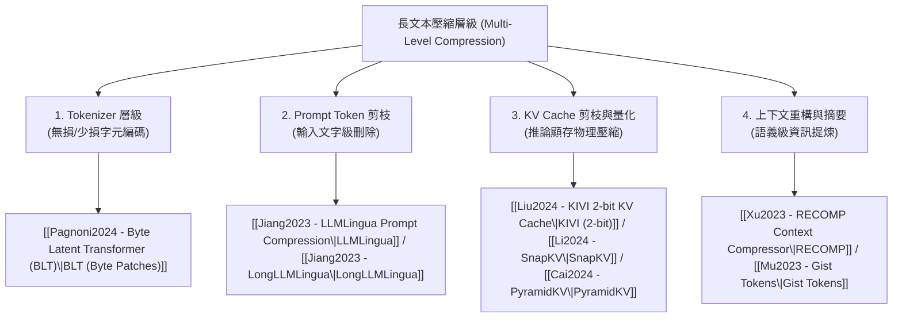

# Domain 02: 多層次壓縮技術 (Token Pruning, KV Cache Compression, Context Distillation)

> [!ABSTRACT] 核心問題意識 (Core Problem Statement)
> **在不改變基座模型結構的前提下，如何透過縮減輸入 Token、量化/剪除推論中間快取（KV Cache），或摘要重構上下文，將巨量長文壓縮進低延遲與低顯存空間？**

---

### 一、核心問題意識：四種截然不同的壓縮層級
業界常將『壓縮』混為一談，但實質上長文本壓縮在工程與演算法上跨越四個完全不同的層級：

---

### 二、關鍵壓縮層次深入解析

#### 1. Prompt Token 剪枝 (Token Pruning)
- **代表工作**：[[Jiang2023 - LLMLingua Prompt Compression|LLMLingua (EMNLP 2023)]]、[[Jiang2023 - LongLLMLingua|LongLLMLingua (ACL 2024)]]。
- **核心機制**：利用小模型計算條件資訊熵，衡量各 Token 的資訊冗餘度。
- **Query-Aware 的關鍵價值**：單純按文字困惑度剪枝會抹除稀有但關鍵的專有名詞。LongLLMLingua 引入 $P(Doc|Query)$，根據問題對文檔動態重配壓縮率，並將核心段落重排置於 Prompt 兩端以對抗 [[Liu2023 - Lost in the Middle|Lost in the Middle]]。

#### 2. KV Cache 動態剪枝與金字塔結構 (KV Pruning)
- **代表工作**：[[Li2024 - SnapKV|SnapKV (2024)]]、[[Cai2024 - PyramidKV|PyramidKV (EMNLP 2024)]]。
- **核心機制**：
  - **觀察窗口（Observation Window）**：LLM 在 Prefill 結尾會自發聚焦全局關鍵 Token。SnapKV 捕捉該注意力特徵，在每層每頭挑選保留最具影響力的核心 KV 簇，丟棄其餘 80%+ 歷史快取。
  - **金字塔漏斗（Pyramidal Funneling）**：PyramidKV 證明淺層 Attention 需要大容量保留細節，深層 Attention 僅需少量抽象快取，依此建立非對稱快取分配。

#### 3. KV Cache 極限低位元量化 (KV Quantization)
- **代表工作**：[[Liu2024 - KIVI 2-bit KV Cache|KIVI (ICML 2024)]]。
- **核心機制**：發現 Key 向量在維度通道具備固定離群值（Channel-wise Outliers），而 Value 向量在 Token 序列維度分佈平滑。透過非對稱分群量化將顯存降為 2-bit，無需重新微調模型權重。

#### 4. 上下文重構與抽象壓縮 (Context Distillation & Soft Gist)
- **代表工作**：[[Xu2023 - RECOMP Context Compressor|RECOMP (ICLR 2024)]]、[[Mu2023 - Gist Tokens|Gist Tokens (NeurIPS 2023)]]。
- **核心機制**：訓練專門的摘要模型將多個段落融合成稠密的高質量資訊塊；或在隱空間訓練 Gist Token，強迫模型透過修改過的 Attention Mask 將整個 Prompt 壓縮為數個 Soft Tokens。

---

### 三、各壓縮策略的關鍵權衡 (Trade-Offs)

| 壓縮技術 | 作用階段 | 是否需已知 Query | 是否需額外訓練 | 顯存節省倍率 | 主要風險與限制 |
| :--- | :--- | :--- | :--- | :--- | :--- |
| **LLMLingua** | 前處理 | 否 (早期) / 是 (Long) | 否 (用預訓練小模型) | 3x ~ 20x (Prompt 長度) | 強制刪詞可能破壞條件句與精密數字代碼 |
| **KIVI (2-bit)** | 推論解碼 | 否 | 否 (Tuning-free) | ~4x (KV Cache 顯存) | 需客製化 CUDA 反量化算子，對短序列加速有限 |
| **SnapKV / PyramidKV**| Prefill 後 | 依問題而定 | 否 | 3x ~ 5x (KV Cache 顯存) | 一旦使用者切換話題，被丟棄的 KV 無法復原 |
| **RECOMP** | 檢索與生成之間 | 是 | 是 (需訓練壓縮器) | 2x ~ 8x (輸入長度) | 摘要生成過程可能引入二次事實幻覺 |
| **Gist Tokens** | Prefill | 否 | 是 (需微調基座模型) | 10x ~ 100x | 黑盒表徵不可解釋，多跳推理細節易丟失 |

---

## 相關導覽與文獻快速跳轉
- **回主目錄**：[[00 - 導覽與心智圖 (Navigation & MOC)/Home (主目錄與知識庫導覽)|主目錄與知識庫導覽]]
- **全景心智圖**：[[00 - 導覽與心智圖 (Navigation & MOC)/LLM 超長文件處理心智圖 (MOC)|超長文件處理研究方向心智圖]]
- **深度研究報告**：[[01 - 深度研究報告 (Deep Research Reports)/01 - LLM 超長文件閱讀與撰寫技術全景 (完整深度報告)|技術全景深度報告]]
- **權衡分析**：[[00 - 導覽與心智圖 (Navigation & MOC)/技術全景與 Pareto 權衡分析 (Trade-offs)|技術成熟度與 Pareto 權衡分析]]
