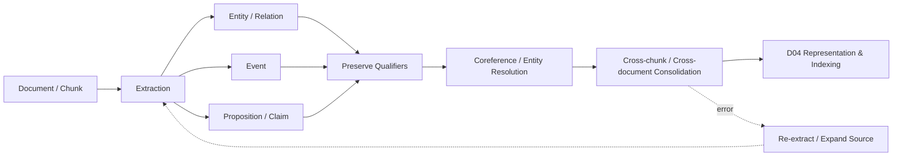

# Domain 03 - Knowledge Extraction & Information Preservation

## Core Question
從原始文字抽取哪些 semantic units，且如何在抽取、對齊與整合時避免遺失關鍵語義？

## Includes
- entity extraction / linking / resolution
- relation extraction / OpenIE
- event extraction
- proposition / atomic fact / claim extraction
- coreference resolution
- negation / modality / condition preservation
- temporal / quantitative qualifiers
- source / provenance preservation during extraction
- cross-chunk / cross-document consolidation
- extraction repair and error propagation

## Excludes
- retrieval-unit boundary → D02
- final vector / graph / index schema → D04
- query-time retrieval → D05
- evidence sufficiency controller → D06

## Level-2 Topics
- Entity Extraction
- Relation Extraction / OpenIE
- Event Extraction
- Proposition / Claim Extraction
- Coreference / Entity Resolution
- Qualifier Preservation
- Cross-chunk Consolidation
- Extraction Repair
- Extraction-to-RAG Error Propagation

## Boundary
抽取結果可以是 entity、relation、event、proposition 或 claim；之後要如何表示成 vector、qualified triple、graph 或 evidence object，屬於 D04。

本專案的 **F/R/D/A/P/C/T** ontology 與 Evidence-Governed pipeline 是 project hypothesis，放在 Ideas & Hypotheses，不當作既有文獻共識。

## Representative Notes

**Current primary-note coverage: 12**

- [[03 - 論文庫 (Literature Notes)/04 - Knowledge & Graph RAG/(ACL 2019-07) DocRED - A Large-Scale Document-Level Relation Extraction Dataset|DocRED]]
- [[03 - 論文庫 (Literature Notes)/04 - Knowledge & Graph RAG/(EMNLP 2020-11) OpenIE6 - Iterative Grid Labeling and Coordination Analysis for Open Information Extraction|OpenIE6]]
- [[03 - 論文庫 (Literature Notes)/04 - Knowledge & Graph RAG/(ACL 2022-05) Unified Structure Generation for Universal Information Extraction|UIE]]
- [[03 - 論文庫 (Literature Notes)/04 - Knowledge & Graph RAG/(EMNLP 2020-11) MAVEN - A Massive General Domain Event Detection Dataset|MAVEN]]

## Navigation
- [[02 - 研究領域專題 (Research Domains)/Domain 02 - Segmentation & Contextualization|D02 Segmentation & Contextualization]]
- [[02 - 研究領域專題 (Research Domains)/Domain 04 - Knowledge Representation & Indexing|D04 Knowledge Representation & Indexing]]
- [[04 - 研究想法與待驗證提案 (Ideas & Hypotheses)/README|Ideas & Hypotheses]]
