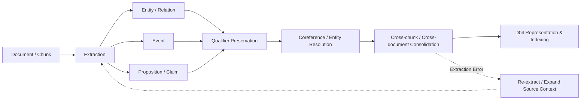

# Domain 03 - Knowledge Extraction & Information Preservation

> [!IMPORTANT]
> 本 Domain 只回答：**從文字抽出什麼 semantic knowledge units，以及抽取、對齊與整合時如何避免失真？**
> Chunk boundary 本身屬 D02；knowledge representation / index schema 屬 D04。

## Core Question

如何從 document / chunk 中建立可供下游 RAG 使用的 entity、relation、event、proposition、claim 等語意單元，同時保留否定、模態、條件、時間、數量、來源與跨段關係？



## Scope

### Includes
- NER / entity linking / entity resolution
- relation extraction / OpenIE
- event extraction
- proposition / atomic fact / claim extraction
- coreference resolution
- negation / modality / condition preservation
- temporal / quantitative qualifiers
- provenance-aware extraction
- cross-chunk / cross-document consolidation
- extraction quality, repair and error propagation

### Excludes
- chunking / retrieval-unit boundary → [[02 - 研究領域專題 (Research Domains)/Domain 02 - Segmentation & Contextualization|D02]]
- graph/vector/index schema → [[02 - 研究領域專題 (Research Domains)/Domain 04 - Knowledge Representation & Indexing|D04]]
- query-time retrieval → [[02 - 研究領域專題 (Research Domains)/Domain 05 - Query Understanding & Retrieval|D05]]
- generic evidence sufficiency controller → [[02 - 研究領域專題 (Research Domains)/Domain 06 - Evidence Sufficiency & Adaptive Retrieval|D06]]

## 1. Extraction Targets

| Target | Typical output | Main risk |
|---|---|---|
| Entity | typed entity spans / IDs | entity boundary / linking error |
| Relation | subject-relation-object | missing qualifiers and document context |
| Event | trigger + arguments + time/status | event linking / temporal normalization |
| Proposition | atomic/self-contained statement | decontextualization loss |
| Claim | verifiable assertion | claim boundary / decomposition ambiguity |
| Typed record | schema-specific structured fields | schema mismatch / forced classification |

Representative literature:
- [[03 - 論文庫 (Literature Notes)/04 - Knowledge & Graph RAG/(ACL 2019-07) DocRED - A Large-Scale Document-Level Relation Extraction Dataset|DocRED]]
- [[03 - 論文庫 (Literature Notes)/04 - Knowledge & Graph RAG/(EMNLP 2019-11) Entity, Relation, and Event Extraction with Contextualized Span Representations|DyGIE++]]
- [[03 - 論文庫 (Literature Notes)/04 - Knowledge & Graph RAG/(EMNLP 2020-11) MAVEN - A Massive General Domain Event Detection Dataset|MAVEN]]
- [[03 - 論文庫 (Literature Notes)/04 - Knowledge & Graph RAG/(EMNLP 2020-11) OpenIE6 - Iterative Grid Labeling and Coordination Analysis for Open Information Extraction|OpenIE6]]
- [[03 - 論文庫 (Literature Notes)/04 - Knowledge & Graph RAG/(ACL 2022-05) Unified Structure Generation for Universal Information Extraction|UIE]]
- [[03 - 論文庫 (Literature Notes)/04 - Knowledge & Graph RAG/(arXiv 2023-04) InstructUIE - Multi-task Instruction Tuning for Unified Information Extraction|InstructUIE]]

## 2. UIE 與 Schema-guided Extraction 的邊界

UIE 類工作可支援「依 schema 抽取」的通用機制，但不代表它定義了本專案的 F/R/D/A/P/C/T ontology。

```text
Published mechanism:
(Text, Schema) -> Structured Extraction

Project-specific hypothesis:
Text -> F / R / D / A / P / C / T
     -> type-specific operational rules
```

F/R/D/A/P/C/T、其 operational semantics 與 evidence-governance pipeline 仍屬研究提案，不得在 Survey Domain 中表述為既有共識。

## 3. Information Preservation

抽取正確不只代表 entity / relation label 正確；以下 qualifier 可能決定 statement 是否成立：
- Negation
- Modality
- Condition
- Temporal scope
- Quantity & unit
- Source scope
- Status

簡單 SPO triple 可能無法表達這些 qualifier；是否改用 qualified triple、event、proposition、claim 或 evidence object 屬 D04 的 representation choice。

## 4. Cross-chunk / Cross-document Consolidation

局部抽取後不能直接假定同名 entity、event 或 project status 已完成全局對齊。典型工作包括：
1. coreference resolution
2. entity linking / deduplication
3. event linking
4. temporal normalization
5. source/version reconciliation
6. contradiction candidate detection
7. unsupported merge prevention

例如「Titan 團隊於 2024 年裁撤」不能自動合併成「Titan 專案於 2024 年終止」，除非另外有可支持該 inference 的 evidence。

與 GraphRAG 的交界：Cross-chunk extraction / augmentation 屬 D03；最終 graph schema/index 與 graph retrieval 分別屬 D04 / D05。

Representative work:
- [[03 - 論文庫 (Literature Notes)/04 - Knowledge & Graph RAG/(arXiv 2026-05) Beyond Chunk-Local Extraction - Cross-Chunk Graph Augmentation for GraphRAG|CrossAug]]

## 5. Extraction Repair

Extraction failure 與 retrieval miss 不應混為一談。

```text
Source contains fact
      ↓
Extraction omitted / distorted fact
      ↓
Index never receives correct representation
      ↓
Retriever cannot recover it
```

因此 repair action 可能是：
- expand source window
- re-run extraction with alternate schema/prompt/model
- recover missing qualifier
- resolve entity/coreference
- compare against raw source span
- mark unresolved rather than hallucinate a merge

這類 failure 應與 D13 的 end-to-end failure attribution 一起評估。

## 6. Evaluation

### Extraction-level
- entity / relation / event Precision, Recall, F1
- proposition/claim extraction precision
- coreference / linking metrics
- qualifier preservation accuracy

### Consolidation-level
- entity merge precision
- event-link accuracy
- temporal normalization accuracy
- unsupported-edge / unsupported-merge rate

### RAG downstream
- evidence recall after extraction
- answer correctness / faithfulness
- error propagation under gold-vs-extracted knowledge

最後一組屬於 D13 的 evaluation protocol，而不是 D03 的方法本身。

## 7. Boundary with D02 and D04

```text
D02 Segmentation
      ↓ retrieval / source units
D03 Extraction & Preservation   [optional]
      ↓ semantic knowledge units
D04 Representation & Indexing
      ↓ searchable structures
D05 Retrieval
```

**Chunk、Proposition、Triple、Event、Graph 不構成單向成熟度鏈。**
它們可能分別是 retrieval unit、semantic unit、representation 或 index structure；分類時必須看 paper 的 primary contribution。

## Project Ideas

- [[04 - 研究想法與待驗證提案 (Ideas & Hypotheses)/Idea 01 - Information-Preserving Knowledge Extraction|Idea 01]]
- [[04 - 研究想法與待驗證提案 (Ideas & Hypotheses)/Idea 05 - Evidence-Governed RAG 系統架構構想 (Delta Pipeline Design)|Idea 05]]

## Navigation

- [[02 - 研究領域專題 (Research Domains)/Domain 02 - Segmentation & Contextualization|D02 Segmentation & Contextualization]]
- [[02 - 研究領域專題 (Research Domains)/Domain 04 - Knowledge Representation & Indexing|D04 Knowledge Representation & Indexing]]
