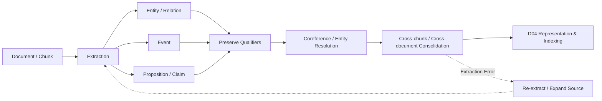

# Domain 03 - Knowledge Extraction & Consolidation

> [!IMPORTANT]
> 本 Domain 只回答：**從文字抽出什麼 semantic knowledge units，以及抽取、對齊與整合時如何避免失真？**
> Chunk boundary 本身屬 D02；knowledge representation / index schema 屬 D04。
> 本頁 Level-2 是本 repo 的操作性分類。一般抽取／對齊問題仍屬 survey 分析；未經文獻驗證的完整 ontology、controller 與治理架構放在 Ideas。

## Core Question
從原始文字抽取哪些 semantic units，且如何在抽取、對齊與整合時避免遺失關鍵語義？如何從 document / chunk 中建立可供下游 RAG 使用的 entity、relation、event、proposition、claim 等語意單元，同時保留否定、模態、條件、時間、數量、來源與跨段關係？


```mermaid
flowchart LR
    SRC["Document / Chunk"] --> IE["Extraction"]
    IE --> ER["Entity / Relation"]
    IE --> EV["Event"]
    IE --> PC["Proposition / Claim"]
    ER --> Q["Preserve Qualifiers"]
    EV --> Q
    PC --> Q
    Q --> RES["Coreference / Entity Resolution"]
    RES --> CONS["Cross-chunk / Cross-document Consolidation"]
    CONS --> D04["D04 Representation & Indexing"]
    CONS -. "Extraction Error" .-> REP["Re-extract / Expand Source"]
    REP -.-> IE
```

## Includes

- entity mention recognition / typing
- mention coreference and cross-document entity resolution
- entity linking to canonical identifiers
- relation extraction / OpenIE
- event trigger / type detection and argument / role extraction
- event coreference and inter-event temporal / causal / subevent relation extraction
- proposition / atomic fact / claim extraction
- negation / modality / condition preservation
- temporal / quantitative qualifiers
- source / provenance preservation during extraction
- cross-chunk / cross-document consolidation
- extraction repair and error propagation

## Excludes

- retrieval-unit boundary → [[02 - 研究領域專題 (Research Domains)/Domain 02 - Segmentation & Contextualization|D02]]
- final vector / graph / index schema → [[02 - 研究領域專題 (Research Domains)/Domain 04 - Knowledge Representation & Indexing|D04]]
- query-time retrieval → [[02 - 研究領域專題 (Research Domains)/Domain 05 - Query Understanding & Retrieval|D05]]
- evidence sufficiency controller → [[02 - 研究領域專題 (Research Domains)/Domain 06 - Evidence Sufficiency & Adaptive Retrieval|D06]]
- evidence validity / reliability and conflict arbitration → D08
- generated-output claim verification / citation → D09; evaluator design → D13
- source-of-truth changes and dependency propagation → D10

## Level-2 Topics

- Entity Mention Recognition & Typing
- Coreference / Cross-document Entity Resolution
- Entity Linking / Canonical Identity Alignment
- Relation Extraction / OpenIE
- Event Trigger / Type Detection
- Event Argument / Role Extraction
- Event Coreference & Inter-event Relations
- Proposition / Claim Extraction
- Semantic Fidelity / Qualifier Preservation
- Cross-chunk / Cross-document Consolidation
- Extraction Repair
- Extraction-to-RAG Error Propagation

## Boundary
抽取結果可以是 entity、relation、event、proposition 或 claim；之後要如何表示成 vector、qualified triple、graph 或 evidence object，屬於 D04。

本專案的 **F/R/D/A/P/C/T** ontology 與 Evidence-Governed pipeline 是 project hypothesis，放在 Ideas & Hypotheses，不當作既有文獻共識。

## Conceptual Boundaries

- **Retrieval Unit ≠ Semantic Unit**：chunk / passage 是檢索單元；entity / event / proposition / claim 是語意單元，兩者不可強行一對一。
- **Knowledge Type ≠ Authority / Usability**：一段內容被抽成 Fact / Requirement / Claim，不代表它自動具有足夠權威、時效或可用性；這些需由 D08 / evidence governance 另外判斷。
- **Extraction Correctness ≠ Evidence Sufficiency**：抽取得正確，仍可能沒有涵蓋回答問題所需的全部 evidence；那是 D06 的問題。
- **Structured ≠ More Faithful by default**：本 repo 把語義保真視為抽取品質維度，不能由 schema-valid output 推定限定條件與來源語境均已保留。[[03 - 論文庫 (Literature Notes)/04 - Knowledge & Graph RAG/(TACL 2021-06) Decontextualization - Making Sentences Stand-Alone|Decontextualization]] 的任務定義包含 meaning preservation；這不等於證明所有結構化表示或 entity-only 方法普遍更忠實。

## Entity and Event Task Boundaries

以下任務表是本 repo 的操作性整理；不同方法可以聯合求解，任務區分不表示必須使用分離模型。

| Entity task | Question / output | Existing evidence |
|---|---|---|
| Recognition / typing | 哪段文字是 entity mention、屬何種類型？ | [[03 - 論文庫 (Literature Notes)/04 - Knowledge & Graph RAG/(NAACL 2021-06) A Frustratingly Easy Approach for Entity and Relation Extraction\|PURE]] / [[03 - 論文庫 (Literature Notes)/04 - Knowledge & Graph RAG/(EMNLP 2019-11) Entity, Relation, and Event Extraction with Contextualized Span Representations\|DyGIE++]] |
| Coreference / resolution | 多個 mentions 是否指向同一 entity，哪些不能合併？ | [[03 - 論文庫 (Literature Notes)/04 - Knowledge & Graph RAG/(TACL 2020-01) SpanBERT - Improving Pre-training by Representing and Predicting Spans\|SpanBERT]]；cross-document resolution 仍需更專門的 coverage |
| Linking / identity alignment | mention 對應哪個 canonical KB identifier？ | [[03 - 論文庫 (Literature Notes)/04 - Knowledge & Graph RAG/(LREC 2018-05) T-REx - A Large Scale Alignment of Natural Language with Knowledge Base Triples\|T-REx]] 是 alignment 資料；專門 linking 方法仍需補強 |

[BLINK / Scalable Zero-shot Entity Linking (2020/11), 官方摘要](https://aclanthology.org/2020.emnlp-main.519/) 描述 mention context / entity descriptions 的 bi-encoder candidate retrieval 與 cross-encoder reranking。**候選狀態：僅核對官方摘要和正式 EMNLP 2020 record，全文待驗證，不計入已驗證 primary coverage。** 本 repo 分類時看輸出目標：canonical identity alignment 屬 D03；不能只因 linker 內部使用 dense retrieval 就視為 D05 query-evidence retrieval 方法。

| Event task | Question / output | Existing evidence |
|---|---|---|
| Trigger / type detection | 哪個 mention 觸發什麼類型的 event？ | [[03 - 論文庫 (Literature Notes)/04 - Knowledge & Graph RAG/(EMNLP 2020-11) MAVEN - A Massive General Domain Event Detection Dataset\|MAVEN]] |
| Argument / role extraction | 某 event 的 participant、角色與參數在哪些 source spans？ | [[03 - 論文庫 (Literature Notes)/04 - Knowledge & Graph RAG/(ACL 2020-07) A Joint Neural Model for Information Extraction with Global Features\|OneIE]] / DyGIE++；document-level argument coverage 尚需補強 |
| Coreference / inter-event relations | 哪些 event mentions 同指？有何 temporal、causal 或 subevent relation？ | [[03 - 論文庫 (Literature Notes)/04 - Knowledge & Graph RAG/(EMNLP 2022-12) MAVEN-ERE - A Unified Large-scale Dataset for Event Coreference, Temporal, Causal, and Subevent Relation Extraction\|MAVEN-ERE]] |

[Document-Level Event Argument Extraction by Conditional Generation (2021/06), 官方摘要](https://aclanthology.org/2021.naacl-main.69/) 以 event templates 做 document-level conditional generation，並提供 WikiEvents 的 event / coreference annotation。**候選狀態：僅核對官方摘要與 NAACL 2021 record，全文待驗證，不計入已驗證 primary coverage。** MAVEN 的 trigger detection 與 MAVEN-ERE 的 event relations 不能代替 argument-role extraction 的完整證據。

**與 D04／D08 的界線**：從來源抽出 event arguments 或明示的時間／因果關係屬 D03；如何把它們表示為 graph／index 屬 D04；判斷多份 evidence 對當前 query 的有效性、相容性與可靠度屬 D08。抽出 temporal relation 不等於已完成 conflict resolution。

## Representative Notes

文獻數量以 paper frontmatter 與 [[02 - 研究領域專題 (Research Domains)/README|Research Domains coverage snapshot]] 為準。下列既有筆記與 cross-domain anchors 分列；新官方候選不視為已驗證 primary anchors。

- [[03 - 論文庫 (Literature Notes)/04 - Knowledge & Graph RAG/(ACL 2019-07) DocRED - A Large-Scale Document-Level Relation Extraction Dataset|DocRED]] (篇章級關聯抽取基準)
- [[03 - 論文庫 (Literature Notes)/04 - Knowledge & Graph RAG/(EMNLP 2019-11) Entity, Relation, and Event Extraction with Contextualized Span Representations|DyGIE++]] (跨句圖傳播多任務抽取)
- [[03 - 論文庫 (Literature Notes)/04 - Knowledge & Graph RAG/(ACL 2020-07) A Joint Neural Model for Information Extraction with Global Features|OneIE]] (全局特徵導向圖解碼)
- [[03 - 論文庫 (Literature Notes)/04 - Knowledge & Graph RAG/(ACL 2020-07) SciREX - A Challenge Dataset for Document-Level Information Extraction|SciREX]] (長篇科學論文四元組抽取)
- [[03 - 論文庫 (Literature Notes)/04 - Knowledge & Graph RAG/(EMNLP 2020-11) MAVEN - A Massive General Domain Event Detection Dataset|MAVEN]] (大規模通用領域事件檢測)
- [[03 - 論文庫 (Literature Notes)/04 - Knowledge & Graph RAG/(EMNLP 2022-12) MAVEN-ERE - A Unified Large-scale Dataset for Event Coreference, Temporal, Causal, and Subevent Relation Extraction|MAVEN-ERE]] (統一事件時序、因果、子事件與共指抽取)
- [[03 - 論文庫 (Literature Notes)/04 - Knowledge & Graph RAG/(EMNLP 2020-11) OpenIE6 - Iterative Grid Labeling and Coordination Analysis for Open Information Extraction|OpenIE6]] (迭代網格標註與並列分析)
- [[03 - 論文庫 (Literature Notes)/04 - Knowledge & Graph RAG/(NAACL 2021-06) A Frustratingly Easy Approach for Entity and Relation Extraction|PURE]] (實體標記解耦流水線)
- [[03 - 論文庫 (Literature Notes)/04 - Knowledge & Graph RAG/(EMNLP 2021-11) REBEL - Relation Extraction By End-to-end Language generation|REBEL]] (端到端自回歸生成式關聯抽取)
- [[03 - 論文庫 (Literature Notes)/04 - Knowledge & Graph RAG/(ACL 2022-05) Unified Structure Generation for Universal Information Extraction|UIE]] (統一結構生成與 SSI/SEL)
- [[03 - 論文庫 (Literature Notes)/04 - Knowledge & Graph RAG/(NAACL 2022-07) GenIE - Generative Information Extraction|GenIE]] (前綴樹約束解碼封閉抽取)
- [[03 - 論文庫 (Literature Notes)/04 - Knowledge & Graph RAG/(arXiv 2023-04) InstructUIE - Multi-task Instruction Tuning for Unified Information Extraction|InstructUIE]] (多任務指令微調通用 IE)
- [[03 - 論文庫 (Literature Notes)/04 - Knowledge & Graph RAG/(ICLR 2024-05) GoLLIE - Annotation Guidelines Improve Zero-Shot Information Extraction|GoLLIE]] (代碼指引零樣本結構化抽取)
- [[03 - 論文庫 (Literature Notes)/04 - Knowledge & Graph RAG/(arXiv 2026-05) Beyond Chunk-Local Extraction - Cross-Chunk Graph Augmentation for GraphRAG|CrossAug]] (GraphRAG 跨塊圖結構增強)
- [[03 - 論文庫 (Literature Notes)/04 - Knowledge & Graph RAG/(NAACL 2018-06) FEVER - A Large-scale Dataset for Fact Extraction and VERification|FEVER]] (事實抽取與證據核驗基準)
- [[03 - 論文庫 (Literature Notes)/04 - Knowledge & Graph RAG/(LREC 2018-05) T-REx - A Large Scale Alignment of Natural Language with Knowledge Base Triples|T-REx]] (千萬級文字-圖譜三元組大規模對齊)
- [[03 - 論文庫 (Literature Notes)/04 - Knowledge & Graph RAG/(TACL 2020-01) SpanBERT - Improving Pre-training by Representing and Predicting Spans|SpanBERT]] (區間邊界目標與篇章指代消解骨幹)
- [[03 - 論文庫 (Literature Notes)/04 - Knowledge & Graph RAG/(TACL 2021-06) Decontextualization - Making Sentences Stand-Alone|Decontextualization]] (自包含命題去脈絡化改寫)

**Cross-domain Anchors (語意單元抽取重要交叉論文)**：
- [[03 - 論文庫 (Literature Notes)/04 - Knowledge & Graph RAG/(EMNLP 2024-11) Dense X - Exploring the Limit of Proposition Retrieval for Open-Domain QA|Dense X]] (D02 Primary / D03 Secondary: 自包含命題抽取與 Propositionizer)
- [[03 - 論文庫 (Literature Notes)/06 - Benchmarks & Evaluation/(EMNLP 2023-12) FActScore - Fine-grained Atomic Evaluation of Factual Precision in Long Form Text Generation|FActScore]] (D13 Primary / D03 Secondary: 長篇生成之原子事實分解與 Claim 核驗)
- [[03 - 論文庫 (Literature Notes)/04 - Knowledge & Graph RAG/(ICLR 2026-05) LinearRAG - Linear Graph Retrieval Augmented Generation on Large-scale Corpora|LinearRAG]] (D04 Primary / D03,D05 Secondary：relation-free index organization 的 extraction / retrieval 介面；使用 entity extraction 不代表主要貢獻是新的 NER 方法)

## Extraction Targets

| Target | Typical output | Main risk | Representative Anchors |
|---|---|---|---|
| Entity | typed entity spans / IDs | entity boundary / linking error | [[03 - 論文庫 (Literature Notes)/04 - Knowledge & Graph RAG/(NAACL 2021-06) A Frustratingly Easy Approach for Entity and Relation Extraction\|PURE]], [[03 - 論文庫 (Literature Notes)/04 - Knowledge & Graph RAG/(EMNLP 2019-11) Entity, Relation, and Event Extraction with Contextualized Span Representations\|DyGIE++]], [[03 - 論文庫 (Literature Notes)/04 - Knowledge & Graph RAG/(TACL 2020-01) SpanBERT - Improving Pre-training by Representing and Predicting Spans\|SpanBERT]] |
| Relation | subject-relation-object | missing qualifiers and document context | [[03 - 論文庫 (Literature Notes)/04 - Knowledge & Graph RAG/(ACL 2019-07) DocRED - A Large-Scale Document-Level Relation Extraction Dataset\|DocRED]], [[03 - 論文庫 (Literature Notes)/04 - Knowledge & Graph RAG/(EMNLP 2021-11) REBEL - Relation Extraction By End-to-end Language generation\|REBEL]], [[03 - 論文庫 (Literature Notes)/04 - Knowledge & Graph RAG/(EMNLP 2020-11) OpenIE6 - Iterative Grid Labeling and Coordination Analysis for Open Information Extraction\|OpenIE6]], [[03 - 論文庫 (Literature Notes)/04 - Knowledge & Graph RAG/(LREC 2018-05) T-REx - A Large Scale Alignment of Natural Language with Knowledge Base Triples\|T-REx]] |
| Event trigger / type | event mention + type | missed or incorrectly typed trigger | [[03 - 論文庫 (Literature Notes)/04 - Knowledge & Graph RAG/(EMNLP 2020-11) MAVEN - A Massive General Domain Event Detection Dataset\|MAVEN]] |
| Event argument / role | trigger-linked arguments / roles | missing cross-sentence argument or incorrect attachment | [[03 - 論文庫 (Literature Notes)/04 - Knowledge & Graph RAG/(ACL 2020-07) A Joint Neural Model for Information Extraction with Global Features\|OneIE]], DyGIE++; document-level candidate above |
| Event coreference / relation | event links + temporal / causal / subevent relations | false event merge or unsupported relation | [[03 - 論文庫 (Literature Notes)/04 - Knowledge & Graph RAG/(EMNLP 2022-12) MAVEN-ERE - A Unified Large-scale Dataset for Event Coreference, Temporal, Causal, and Subevent Relation Extraction\|MAVEN-ERE]] |
| Proposition | atomic/self-contained statement | decontextualization loss | [[03 - 論文庫 (Literature Notes)/04 - Knowledge & Graph RAG/(TACL 2021-06) Decontextualization - Making Sentences Stand-Alone\|Decontextualization]], [[03 - 論文庫 (Literature Notes)/04 - Knowledge & Graph RAG/(EMNLP 2024-11) Dense X - Exploring the Limit of Proposition Retrieval for Open-Domain QA\|Dense X]] (Propositionizer) |
| Claim | verifiable assertion | claim boundary / decomposition ambiguity | [[03 - 論文庫 (Literature Notes)/04 - Knowledge & Graph RAG/(NAACL 2018-06) FEVER - A Large-scale Dataset for Fact Extraction and VERification\|FEVER]], [[03 - 論文庫 (Literature Notes)/06 - Benchmarks & Evaluation/(EMNLP 2023-12) FActScore - Fine-grained Atomic Evaluation of Factual Precision in Long Form Text Generation\|FActScore]] (Atomic Fact Decomposition) |
| Typed record | schema-specific structured fields | schema mismatch / forced classification | [[03 - 論文庫 (Literature Notes)/04 - Knowledge & Graph RAG/(ICLR 2024-05) GoLLIE - Annotation Guidelines Improve Zero-Shot Information Extraction\|GoLLIE]], [[03 - 論文庫 (Literature Notes)/04 - Knowledge & Graph RAG/(ACL 2022-05) Unified Structure Generation for Universal Information Extraction\|UIE]], [[03 - 論文庫 (Literature Notes)/04 - Knowledge & Graph RAG/(NAACL 2022-07) GenIE - Generative Information Extraction\|GenIE]], [[03 - 論文庫 (Literature Notes)/04 - Knowledge & Graph RAG/(arXiv 2023-04) InstructUIE - Multi-task Instruction Tuning for Unified Information Extraction\|InstructUIE]] |

## UIE 與 Schema-guided Extraction 的邊界

UIE 類工作可支援「依 schema 抽取」的通用機制，但不代表它定義了本專案的 F/R/D/A/P/C/T ontology。

```text
Published mechanism:
(Text, Schema) -> Structured Extraction

Project-specific hypothesis:
Text -> F / R / D / A / P / C / T
     -> type-specific operational rules
```

F/R/D/A/P/C/T、其 operational semantics 與 evidence-governance pipeline 仍屬研究提案，不得在 Survey Domain 中表述為既有共識。

## Semantic Fidelity: Seven Operational Dimensions

下列七項是本 repo 的分析維度，用於檢查 extraction / consolidation 是否保留原意，不宣稱為文獻共同採用的封閉 ontology。既有 [[03 - 論文庫 (Literature Notes)/04 - Knowledge & Graph RAG/(TACL 2021-06) Decontextualization - Making Sentences Stand-Alone|Decontextualization]] 可支撐 meaning-preserving rewriting 的任務概念；不能單憑 UIE / OpenIE 的格式或抽取分數推定這七項均被保留。

抽取正確不只代表 entity / relation label 正確；以下 qualifier 可能決定 statement 是否成立：
- **Negation**：否定條件與排除範圍
- **Modality**：必然、可能、建議、強制等語氣
- **Condition**：前置條件與適用情境（如「若...則...」）
- **Temporal scope**：時間區間、有效期限與生效日
- **Quantity & unit**：數值、度量衡與範圍邊界
- **Source scope**：陳述之觀點來源與引述範疇
- **Status**：狀態（如草案、定案、廢止、進行中）

簡單 SPO triple 可能無法表達這些 qualifier；是否改用 qualified triple、event、proposition、claim 或 evidence object 屬 D04 的 representation choice。

一般 preservation 分析不必全部改標成 proposal；但七項聯合 benchmark、F/R/D/A/P/C/T ontology 與完整 type-specific controller 是尚待驗證的專案設計，見 [[04 - 研究想法與待驗證提案 (Ideas & Hypotheses)/Idea 01 - Information-Preserving Knowledge Extraction|Idea 01]]。對尚未取得直接 evidence 的維度，應標待驗證，而不是由 schema-valid 代替實驗。

## Cross-chunk / Cross-document Consolidation

局部抽取後不能直接假定同名 entity、event 或 project status 已完成全局對齊。典型工作包括：
1. **coreference resolution**（代名詞與指代消解）
2. **entity linking / deduplication**（實體鏈結與去重）
3. **event linking**（事件對齊）
4. **temporal normalization**（相對時間轉絕對時間）
5. **source/version identity alignment**（保留來源／版本標識，避免無依據地合併 records）
6. **incompatible-record marking**（標記不能安全合併的抽取 records；不直接仲裁哪個來源為真）
7. **unsupported merge prevention**（防止無證據合併）

例如「Titan 團隊於 2024 年裁撤」不能自動合併成「Titan 專案於 2024 年終止」，除非另外有可支持該 inference 的 evidence。

上例與七項整理是本 repo 的 consolidation 診斷例，不是對下列論文特定實驗的轉述。Canonical source 更新與版本同步屬 D10；對 query 的 evidence validity / conflict arbitration 屬 D08。D03 alignment 的目的是防止 semantic identity／關係被錯合併，不能把 reconciliation 一詞同時用作三個 Domain 的同一功能。

與 GraphRAG 的交界：Cross-chunk extraction / augmentation 屬 D03；最終 graph schema/index 與 graph retrieval 分別屬 D04 / D05。

- Representative work:
  - [[03 - 論文庫 (Literature Notes)/04 - Knowledge & Graph RAG/(arXiv 2026-05) Beyond Chunk-Local Extraction - Cross-Chunk Graph Augmentation for GraphRAG|CrossAug]] (GraphRAG 跨塊圖結構增強)
  - [[03 - 論文庫 (Literature Notes)/04 - Knowledge & Graph RAG/(EMNLP 2022-12) MAVEN-ERE - A Unified Large-scale Dataset for Event Coreference, Temporal, Causal, and Subevent Relation Extraction|MAVEN-ERE]] (篇章級跨事件時序、因果與共指鏈聚合)
  - [[03 - 論文庫 (Literature Notes)/04 - Knowledge & Graph RAG/(TACL 2020-01) SpanBERT - Improving Pre-training by Representing and Predicting Spans|SpanBERT]] (區間邊界目標與篇章跨塊指代消解骨幹)
  - [[03 - 論文庫 (Literature Notes)/04 - Knowledge & Graph RAG/(LREC 2018-05) T-REx - A Large Scale Alignment of Natural Language with Knowledge Base Triples|T-REx]] (大規模篇章實體對齊與三元組鏈結)

## Extraction Repair & Error Propagation

Extraction failure 與 retrieval miss 不應混為一談：

```text
Source contains fact
      ↓
Extraction omitted / distorted fact
      ↓
Index never receives correct representation
      ↓
Retriever cannot recover it
```

因此 repair action 可能是：
- expand source window
- re-run extraction with alternate schema/prompt/model
- recover missing qualifier
- resolve entity/coreference
- compare against raw source span
- mark unresolved rather than hallucinate a merge

這類 failure 應與 D13 的 end-to-end failure attribution 一起評估。

## Evaluation Levels for D03

### 1. Extraction-level
- mention recognition / typing and relation Precision, Recall, F1
- event trigger / type and argument / role metrics, reported separately
- event coreference / inter-event relation metrics
- proposition/claim extraction precision
- coreference / linking metrics
- qualifier preservation accuracy

### 2. Consolidation-level
- entity merge precision
- event-link accuracy
- temporal normalization accuracy
- unsupported-edge / unsupported-merge rate

### 3. RAG downstream
- evidence recall after extraction
- answer correctness / faithfulness
- error propagation under gold-vs-extracted knowledge

最後一組屬於 D13 的 evaluation protocol，而不是 D03 的方法本身。

以上是本 repo 的分層評測建議；尚無直接評測證據的 qualifier／merge 維度必須標待驗證，不能宣稱已由所有代表論文共同量測。

## Structural Boundary with D02 and D04

```text
D02 Segmentation
      ↓ retrieval / source units
D03 Extraction & Consolidation   [optional]
      ↓ semantic knowledge units
D04 Representation & Indexing
      ↓ searchable structures
D05 Retrieval
```

**Chunk、Proposition、Triple、Event、Graph 不構成單向成熟度鏈。**
它們可能分別是 retrieval unit、semantic unit、representation 或 index structure；分類時必須看 paper 的 primary contribution。

圖示是常見資料依賴，不是強制順序；structured sources 可直接進 D03，抽取與 indexing 也可聯合實作。分類仍看研究問題，而不是僅看在哪個時間點執行。

## Survey Alignment and Coverage Gap

[[03 - 論文庫 (Literature Notes)/03 - RAG & Retrieval/(ACM CSUR 2026-09) A Survey on Retrieval-Augmented Text Generation for Large Language Models|Huang & Huang — RAG Survey]] 的 data-modification 軸可提示 corpus preparation 的相關工作，但不足以單獨支撐本頁的 entity linking、document-level event arguments 或 qualifier fidelity 細分。這些需要對應 primary papers；Domain-level survey coverage 統一維護於 [[00 - 導覽與心智圖 (Navigation & MOC)/Survey Papers Index|Survey Papers Index]]。

**本 repo 對 enrichment 的分類**：從原文補足指代／限定語且保留原意，屬於 D03 semantic transformation；為查找建立 contextualized representation 屬 D04；從外部 corpus／KB 取新 evidence 屬 D05；有效性與來源衝突仲裁屬 D08。LLM 自行生成的補充不能僅因叫 enrichment 就視為原文已支持的事實。

## Project Ideas
- [[04 - 研究想法與待驗證提案 (Ideas & Hypotheses)/Idea 01 - Information-Preserving Knowledge Extraction|Idea 01 - Information-Preserving Knowledge Extraction]]
- [[04 - 研究想法與待驗證提案 (Ideas & Hypotheses)/Idea 05 - Evidence-Governed RAG 系統架構構想 (Delta Pipeline Design)|Idea 05 - Evidence-Governed RAG 系統架構構想]]

## Consolidation Failure Modes
跨 chunk / cross-document consolidation 不只是「多抽一些 relation」；至少要防四類錯誤：

- **False merge / over-coreference**：不同實體被錯合併。
- **Unsupported edge**：跨段關係沒有 raw-span evidence 支持。
- **Qualifier cascade**：前一階段丟失 condition / time / negation，後續 multi-hop 將錯誤放大。
- **Extraction budget explosion**：為修復跨段關係反覆擴張 source window / re-extract，造成離線成本快速增加。

這些 failure 應與 Idea 01 的 information-preservation ablation 一起量測，而不是只看最終 QA accuracy。

## Navigation
- [[02 - 研究領域專題 (Research Domains)/Domain 02 - Segmentation & Contextualization|D02 Segmentation & Contextualization]]
- [[02 - 研究領域專題 (Research Domains)/Domain 04 - Knowledge Representation & Indexing|D04 Knowledge Representation & Indexing]]
- [[04 - 研究想法與待驗證提案 (Ideas & Hypotheses)/README|Ideas & Hypotheses]]
- [[00 - 導覽與心智圖 (Navigation & MOC)/RAG Research Taxonomy & Domain Map|RAG Research Taxonomy & Domain Map]]

## Canonical Classification — 2026-10-02

> [!IMPORTANT]
> **Canonical name: D03 Knowledge Extraction & Consolidation.**
> `Information Preservation` remains an important quality objective / research lens, but current literature does not justify treating it as an equally mature named research track.

**Core question**：應從原始內容抽取哪些語意知識單元，以及如何完成必要的對齊、消歧與整合而不扭曲來源原意？

**Canonical scope**
- entity mention recognition / typing, coreference / resolution and canonical entity linking
- relation extraction / OpenIE
- event trigger / type, argument / role, coreference and inter-event relation extraction
- proposition / claim extraction
- cross-chunk / cross-document consolidation
- semantic fidelity: negation, modality, condition, temporal scope, quantity/unit, source scope, status

**Boundary**
- retrieval unit ≠ semantic unit
- D02 chunking ≠ D03 extraction
- D04 representation/index ≠ D03 extraction
- D08 evidence validity / reliability / conflict arbitration ≠ D03 semantic identity consolidation
- D10 source/version synchronization ≠ D03 record identity alignment
- F/R/D/A/P/C/T remains a project-specific Idea/Hypothesis, not literature consensus

**Paper decisions**
- Existing extraction/consolidation notes are listed above; counts come from canonical frontmatter, not duplicated prose totals.
- Dense X: D02 primary / D03 secondary; FActScore: D13 primary / D03 interface.
- LinearRAG: D04 primary / D03,D05 secondary; index organization is distinct from the entity extraction it uses.
- CrossAug: D03 primary / D04 secondary; downstream retrieval use is not automatically D05 secondary.
- Do not infer qualifier preservation merely from schema-valid output.
- BLINK / document-level event argument extraction: official-source candidates only; full-text verification and paper-level primary assignment remain pending.

## Audit Trail

- [[00 - 導覽與心智圖 (Navigation & MOC)/Phase 1 Taxonomy Closure Audit - 2026-09-27|Phase 1 Taxonomy Closure Audit]]

## Candidate Source Records

以下只完成官方 metadata / abstract 核對，全文待驗證，不計入已驗證 primary coverage。

- [BLINK, 2020/11] Ledell Wu et al. "Scalable Zero-shot Entity Linking with Dense Entity Retrieval." EMNLP 2020. [正式記錄](https://aclanthology.org/2020.emnlp-main.519/)
- [Document-level Event Arguments, 2021/06] Sha Li et al. "Document-Level Event Argument Extraction by Conditional Generation." NAACL 2021. [正式記錄](https://aclanthology.org/2021.naacl-main.69/)
