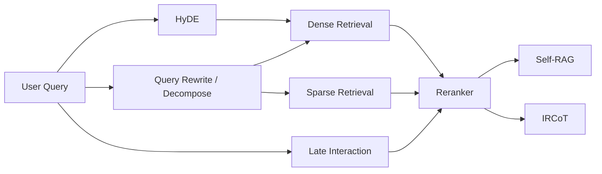

# Domain 03: 先進 RAG 與檢索機制 (Advanced RAG, ColBERT, HyDE, Self-RAG)

> [!ABSTRACT] 核心問題意識 (Core Problem Statement)
> **當外部資料庫或文檔集達到數百萬至數億 Token 時，如何精準、低延遲地檢索出與問題最高度相關、具備充分證據性的局部脈絡，並回傳給 LLM 進行可靠生成？**

---

### 一、核心問題意識：從 Naive RAG 到 Advanced/Agentic RAG
傳統 RAG（[[03 - 論文庫 (Literature Notes)/03 - RAG & Retrieval/(NeurIPS 2020-12) Retrieval-Augmented Generation for Knowledge-Intensive NLP Tasks|Lewis et al., 2020]]）採用簡單的『切塊 $\rightarrow$ 嵌入 $\rightarrow$ 向量相似度檢索 $\rightarrow$ 生成』流程，在真實長文件處理中面臨三大破綻：
1. **語意不對稱（Semantic Asymmetry）**：短 Query 與長 Passage 在向量空間分佈不一致。
2. **單向量表示的資訊瓶頸**：[[03 - 論文庫 (Literature Notes)/03 - RAG & Retrieval/(EMNLP 2020-11) Dense Passage Retrieval for Open-Domain Question Answering|DPR]] 以雙編碼器將 Query 與 Passage 各自映射為固定維度向量；向量維度取決於底層 encoder（例如 BERT-base DPR 為 768 維），並不存在「DPR 固定為 1536 維」的通則。單向量 dense retrieval 也可能弱化罕見字串、型號與精確詞彙訊號，因此實務上常與 sparse / late-interaction 方法比較。
3. **盲目檢索與噪音注入**：不論問題是否已知、檢索內容是否衝突，一律無差別餵入 LLM，造成上下文污染與嚴重幻覺。進一步之證據充分性與自適應控制請參閱 [[02 - 研究領域專題 (Research Domains)/Domain 14 - Evidence Sufficiency & Adaptive Retrieval|Domain 14]]。

---

### 二、先進檢索架構光譜

**圖中節點對照**：[[03 - 論文庫 (Literature Notes)/03 - RAG & Retrieval/(ACL 2023-07) Precise Zero-Shot Dense Retrieval without Relevance Labels|HyDE]] · [[03 - 論文庫 (Literature Notes)/03 - RAG & Retrieval/(SIGIR 2020-07) ColBERT - Efficient and Effective Passage Search via Contextualized Late Interaction over BERT|ColBERT]] · [[03 - 論文庫 (Literature Notes)/03 - RAG & Retrieval/(ICLR 2024-05) Self-RAG - Learning to Retrieve, Generate, and Critique through Self-Reflection|Self-RAG]] · [[03 - 論文庫 (Literature Notes)/03 - RAG & Retrieval/(ACL 2023-07) Interleaving Retrieval with Chain-of-Thought Reasoning for Knowledge-Intensive Multi-Step Questions|IRCoT]]

#### 1. 密集向量與稀疏檢索之爭 (Dense vs. Sparse)
- **Dense Retrieval ([[03 - 論文庫 (Literature Notes)/03 - RAG & Retrieval/(EMNLP 2020-11) Dense Passage Retrieval for Open-Domain Question Answering|DPR]])**：擅長近義詞、抽象意圖捕捉；但在產品型號、錯誤代碼、罕見人名上表現較脆弱。
- **Hybrid Search (BM25 + Dense + RRF)**：已成為工業界常見實踐。透過倒數排名融合（Reciprocal Rank Fusion, RRF）同時兼顧字面精確與語義泛化。

#### 2. 多向量延遲交互 (Contextualized Late Interaction)
- **代表作**：[[03 - 論文庫 (Literature Notes)/03 - RAG & Retrieval/(SIGIR 2020-07) ColBERT - Efficient and Effective Passage Search via Contextualized Late Interaction over BERT|ColBERT (SIGIR 2020)]]、ColBERTv2。
- **機制**：對 Query 與 Document 的每一個 token 分別保留嵌入向量，檢索階段計算 MaxSim 矩陣和。既保有細粒度 token 交互，又能在離線預先構建向量索引。

#### 3. 查詢轉換與假設文檔 (Query Transformation & HyDE)
- **代表作**：[[03 - 論文庫 (Literature Notes)/03 - RAG & Retrieval/(ACL 2023-07) Precise Zero-Shot Dense Retrieval without Relevance Labels|HyDE (Gao et al., 2022)]]。
- **機制**：令 LLM 根據問題先撰寫一篇包含假想答案的完整文章，利用該假想文檔的向量去檢索資料庫。其目的在於以生成的 hypothetical document 作為 dense encoder 的輸入，建立較接近文件語意空間的檢索表示；假想文件可能包含錯誤內容，也不保證與真實目標文件「完全同構」。

#### 4. 自適應反思與多跳檢索 (Adaptive RAG & Multi-Hop)
- **代表作**：[[03 - 論文庫 (Literature Notes)/03 - RAG & Retrieval/(ICLR 2024-05) Self-RAG - Learning to Retrieve, Generate, and Critique through Self-Reflection|Self-RAG (Asai et al., 2023)]]、[[03 - 論文庫 (Literature Notes)/03 - RAG & Retrieval/(ACL 2023-07) Interleaving Retrieval with Chain-of-Thought Reasoning for Knowledge-Intensive Multi-Step Questions|IRCoT (Trivedi et al., 2022)]]。
- **機制**：
  - **Self-RAG**：利用 `[Retrieve]`、`[IsREL]`、`[IsSUP]` 標記訓練模型自覺判斷何時檢索、驗證文檔是否相關、檢驗輸出是否獲得文檔充分支持。
  - **IRCoT**：將思維鏈（CoT）推理與檢索循環交替，將前一步的中間推論結果作為新的檢索線索，在原論文評估的多跳 QA 任務中改善檢索與回答表現；效果仍受中間推理品質與檢索誤差影響。

---

### 三、Anthropic Contextual Retrieval 實踐與邊界
2024 年 Anthropic 提出了 Contextual Retrieval 工程範式：
- **痛點**：將大文件切分為 200~300 token 的 Chunk 時，後續段落失去開頭的背景主題（如『該季度的營收增長了 5%』，在 Chunk 中丟失了『哪一年哪一家公司』）。
- **解法**：在離線切塊時，呼叫 LLM 為每一個 Chunk 前置補充 50~100 token 的文檔全域情境說明（Contextual Explanation），使每個 Chunk 在向量嵌入與 BM25 索引中均自帶完備上下文。
- **實驗條件與邊界**：Anthropic 官方部落格評測顯示，在結合 Contextual Embeddings + Contextual BM25 + Reranker 時，其內部特定測試集（程式碼與財報）上的檢索失敗率降低達 49%；此為特定工業測試設定下之報告數據，並非跨任務與跨語料之絕對保證，且前置補充上下文顯著增加離線索引成本與 prompt token 預算。

---

## Survey-level 研究依據

本 Domain 的 taxonomy 不只依靠單篇方法論文。建議先以 [[00 - 導覽與心智圖 (Navigation & MOC)/Survey Papers Index|Survey Papers Index]] 中的 **Gao et al., 2023/2024, _Retrieval-Augmented Generation for Large Language Models: A Survey_** 作為 RAG 全景入口，再回到 DPR、ColBERT、HyDE、Self-RAG、IRCoT 等 primary papers 核對具體機制與數字。Agentic RAG 則另參考 2025 的 agentic RAG survey；其出版狀態與驗證等級以 Survey Index 為準。

---

## 相關導覽與文獻快速跳轉
- **回主目錄**：[[00 - 導覽與心智圖 (Navigation & MOC)/Home (主目錄與知識庫導覽)|主目錄與知識庫導覽]]
- **專題連動**：
  - [[02 - 研究領域專題 (Research Domains)/Domain 14 - Evidence Sufficiency & Adaptive Retrieval|Domain 14: Evidence Sufficiency & Adaptive Retrieval]]
  - [[02 - 研究領域專題 (Research Domains)/Domain 17 - RAG Benchmarks & Evaluation Protocols|Domain 17: RAG Benchmarks & Evaluation Protocols]]
- **全景心智圖**：[[00 - 導覽與心智圖 (Navigation & MOC)/LLM 超長文件處理心智圖 (MOC)|超長文件處理研究方向心智圖]]
- **深度研究報告**：[[01 - 深度研究報告 (Deep Research Reports)/01 - LLM 超長文件閱讀與撰寫技術全景 (完整深度報告)|技術全景深度報告]]
- **權衡分析**：[[00 - 導覽與心智圖 (Navigation & MOC)/技術全景與 Pareto 權衡分析 (Trade-offs)|技術成熟度與 Pareto 權衡分析]]
