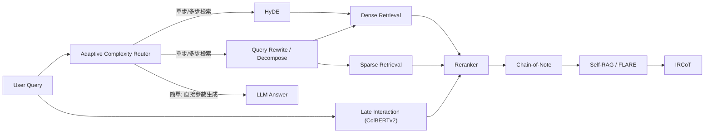

# Domain 03: 先進 RAG 與檢索機制 (Advanced RAG, ColBERT, HyDE, Self-RAG)

> [!ABSTRACT] 核心問題意識 (Core Problem Statement)
> **當外部資料庫或文檔集達到數百萬至數億 Token 時，如何精準、低延遲地檢索出與問題最高度相關、具備充分證據性的局部脈絡，並回傳給 LLM 進行可靠生成？**

---

### 一、核心問題意識：從 Naive RAG 到 Advanced/Agentic RAG
傳統 RAG（[[03 - 論文庫 (Literature Notes)/03 - RAG & Retrieval/(NeurIPS 2020-12) Retrieval-Augmented Generation for Knowledge-Intensive NLP Tasks|Lewis et al., 2020]]）與早期檢索預訓練（[[03 - 論文庫 (Literature Notes)/03 - RAG & Retrieval/(ICML 2020-07) REALM - Retrieval-Augmented Language Model Pre-Training|REALM (Guu et al., 2020)]]、[[03 - 論文庫 (Literature Notes)/03 - RAG & Retrieval/(ICML 2022-07) Improving Language Models by Retrieving from Trillions of Tokens|RETRO (Borgeaud et al., 2022)]]、[[03 - 論文庫 (Literature Notes)/03 - RAG & Retrieval/(JMLR 2023-01) Atlas - Few-shot Learning with Retrieval Augmented Language Models|Atlas (Izacard et al., 2022/2023)]]）奠定了外部記憶與生成結合的基礎。但在真實長文件處理中，傳統單向 Pipeline 面臨三大破綻：
1. **語意不對稱（Semantic Asymmetry）**：短 Query 與長 Passage 在向量空間分佈不一致。
2. **單向量表示的資訊瓶頸**：[[03 - 論文庫 (Literature Notes)/03 - RAG & Retrieval/(EMNLP 2020-11) Dense Passage Retrieval for Open-Domain Question Answering|DPR]] 以雙編碼器將 Query 與 Passage 各自映射為固定維度向量（如 BERT-base DPR 為 768 維），容易弱化罕見字串、型號與精確詞彙訊號；後續發展出以 [[03 - 論文庫 (Literature Notes)/03 - RAG & Retrieval/(NAACL 2022-07) ColBERTv2 - Effective and Efficient Retrieval via Lightweight Late Interaction|ColBERTv2]] 為代表的輕量化 Token 級延遲交互（Late Interaction）。
3. **盲目檢索與噪音注入**：不論問題是否已知、檢索內容是否衝突，一律無差別餵入 LLM，造成上下文污染與嚴重幻覺。[[03 - 論文庫 (Literature Notes)/03 - RAG & Retrieval/(EMNLP 2024-11) Chain-of-Note - Enhancing Robustness in Retrieval-Augmented Language Models|Chain-of-Note (Yu et al., 2024)]] 提出以循序批判筆記抵抗雜訊並主動拒答；自適應檢索控制請參閱 [[02 - 研究領域專題 (Research Domains)/Domain 14 - Evidence Sufficiency & Adaptive Retrieval|Domain 14]]。

---

### 二、先進檢索架構光譜

**圖中節點對照**：[[03 - 論文庫 (Literature Notes)/03 - RAG & Retrieval/(NAACL 2024-06) Adaptive-RAG - Learning to Adapt Retrieval-Augmented Large Language Models through Question Complexity|Adaptive-RAG]] · [[03 - 論文庫 (Literature Notes)/03 - RAG & Retrieval/(ACL 2023-07) Precise Zero-Shot Dense Retrieval without Relevance Labels|HyDE]] · [[03 - 論文庫 (Literature Notes)/03 - RAG & Retrieval/(NAACL 2022-07) ColBERTv2 - Effective and Efficient Retrieval via Lightweight Late Interaction|ColBERTv2]] · [[03 - 論文庫 (Literature Notes)/03 - RAG & Retrieval/(EMNLP 2024-11) Chain-of-Note - Enhancing Robustness in Retrieval-Augmented Language Models|Chain-of-Note]] · [[03 - 論文庫 (Literature Notes)/03 - RAG & Retrieval/(ICLR 2024-05) Self-RAG - Learning to Retrieve, Generate, and Critique through Self-Reflection|Self-RAG]] · [[03 - 論文庫 (Literature Notes)/03 - RAG & Retrieval/(EMNLP 2023-12) Active Retrieval Augmented Generation|FLARE]] · [[03 - 論文庫 (Literature Notes)/03 - RAG & Retrieval/(ACL 2023-07) Interleaving Retrieval with Chain-of-Thought Reasoning for Knowledge-Intensive Multi-Step Questions|IRCoT]]

#### 1. 密集向量與稀疏檢索之爭 (Dense vs. Sparse)
- **Dense Retrieval ([[03 - 論文庫 (Literature Notes)/03 - RAG & Retrieval/(EMNLP 2020-11) Dense Passage Retrieval for Open-Domain Question Answering|DPR]])**：擅長近義詞、抽象意圖捕捉；但在產品型號、錯誤代碼、罕見人名上表現較脆弱。
- **無監督對比學習 (Unsupervised Contrastive Learning)**：[[03 - 論文庫 (Literature Notes)/03 - RAG & Retrieval/(TMLR 2022-08) Unsupervised Dense Information Retrieval with Contrastive Learning|Contriever (Izacard et al., TMLR 2022)]] 藉由反轉去噪（Inverse Cloze Task）與獨立裁剪對比學習，無需標註資料即可訓練出強大的開放域稠密檢索器，在 BEIR 零樣本檢索上超越 BM25。
- **神經稀疏詞彙擴展 (Sparse Lexical & Expansion)**：[[03 - 論文庫 (Literature Notes)/03 - RAG & Retrieval/(SIGIR 2022-07) SPLADE v2 - Sparse Lexical and Expansion Model for Information Retrieval|SPLADE v2 (Formal et al., SIGIR 2022)]] 利用 BERT MLM 預測頭對全文詞彙表動態預測權重並搭配 FLOPS 正則化，實現精確倒排索引檢索，兼具稀疏詞彙的高效倒排結構與深層語意擴展能力。
- **Hybrid Search (BM25 / SPLADE + Dense + RRF)**：已成為工業界常見實踐。透過倒數排名融合（Reciprocal Rank Fusion, RRF）同時兼顧字面精確與語義泛化。

#### 2. 多向量延遲交互 (Contextualized Late Interaction)
- **代表作**：[[03 - 論文庫 (Literature Notes)/03 - RAG & Retrieval/(SIGIR 2020-07) ColBERT - Efficient and Effective Passage Search via Contextualized Late Interaction over BERT|ColBERT (SIGIR 2020)]]、[[03 - 論文庫 (Literature Notes)/03 - RAG & Retrieval/(NAACL 2022-07) ColBERTv2 - Effective and Efficient Retrieval via Lightweight Late Interaction|ColBERTv2 (NAACL 2022)]]。
- **機制**：對 Query 與 Document 的每一個 token 分別保留嵌入向量，檢索階段計算 MaxSim 矩陣和。ColBERTv2 透過質心聚類與殘差純量量化（Residual Quantization），在保留 Token 級高精度的同時將索引大小壓縮 6–10 倍（150GB 壓至 16GB）。

#### 3. 查詢轉換與假設文檔 (Query Transformation & HyDE)
- **代表作**：[[03 - 論文庫 (Literature Notes)/03 - RAG & Retrieval/(ACL 2023-07) Precise Zero-Shot Dense Retrieval without Relevance Labels|HyDE (Gao et al., 2022)]]。
- **機制**：令 LLM 根據問題先撰寫一篇包含假想答案的完整文章，利用該假想文檔的向量去檢索資料庫。其目的在於以生成的 hypothetical document 作為 dense encoder 的輸入，建立較接近文件語意空間的檢索表示；假想文件可能包含錯誤內容，也不保證與真實目標文件「完全同構」。

#### 4. 自適應反思、主動檢索與多跳推理 (Adaptive, Active & Multi-Hop RAG)
- **代表作**：
  - **複雜度自適應路由**：[[03 - 論文庫 (Literature Notes)/03 - RAG & Retrieval/(NAACL 2024-06) Adaptive-RAG - Learning to Adapt Retrieval-Augmented Large Language Models through Question Complexity|Adaptive-RAG (Jeong et al., 2024)]] 依據問題難度將請求動態路由至無檢索、單步或多步檢索，節省 40–60% 延遲。
  - **前瞻性主動檢索**：[[03 - 論文庫 (Literature Notes)/03 - RAG & Retrieval/(EMNLP 2023-12) Active Retrieval Augmented Generation|FLARE (Jiang et al., 2023)]] 前瞻預測下一句，在 Token 置信度低時主動將不確定詞彙轉化為檢索 Query，避免滯後檢索。
  - **自覺反思反饋**：[[03 - 論文庫 (Literature Notes)/03 - RAG & Retrieval/(ICLR 2024-05) Self-RAG - Learning to Retrieve, Generate, and Critique through Self-Reflection|Self-RAG (Asai et al., 2023)]] 利用 Reflection Tokens 自主決定何時檢索並檢驗生成內容是否被證據支持。
  - **多跳交錯推理**：[[03 - 論文庫 (Literature Notes)/03 - RAG & Retrieval/(ACL 2023-07) Interleaving Retrieval with Chain-of-Thought Reasoning for Knowledge-Intensive Multi-Step Questions|IRCoT (Trivedi et al., 2022)]] 將思維鏈（CoT）推理與檢索循環交替，以前一步推論成果作為下一步檢索線索。
  - **抗噪閱讀筆記**：[[03 - 論文庫 (Literature Notes)/03 - RAG & Retrieval/(EMNLP 2024-11) Chain-of-Note - Enhancing Robustness in Retrieval-Augmented Language Models|Chain-of-Note (Yu et al., 2024)]] 逐篇撰寫閱讀筆記，顯式排除無關干擾文檔，極限抗噪表現超越標準 RAG 近 20 個百分點。
  - **黑盒平行集成與 LM 監督**：[[03 - 論文庫 (Literature Notes)/03 - RAG & Retrieval/(NAACL 2024-06) REPLUG - Retrieval-Augmented Black-Box Language Models|REPLUG (Shi et al., 2024)]] 將商用黑盒 LLM 平行輸入多篇段落並進行機率加權邊際化（Ensemble Generation），並提出 REPLUG LSR 以 LM 困惑度回饋微調稠密檢索器。
  - **雙重指令微調範式**：[[03 - 論文庫 (Literature Notes)/03 - RAG & Retrieval/(ICLR 2024-05) RA-DIT - Retrieval-Augmented Dual Instruction Tuning|RA-DIT (Lin et al., 2024)]] 分別對 LLM 與檢索器實施雙重指令微調（RA-IT 提升背景利用與抗噪，LSR 微調 Query Encoder 對齊偏好），在保持向量索引不變下達成多項知識基準 SOTA。
  - **校正性主動檢索**：[[03 - 論文庫 (Literature Notes)/03 - RAG & Retrieval/(arXiv 2024-01) Corrective Retrieval Augmented Generation|Corrective RAG (CRAG, Yan et al., 2024)]] 設計輕量級檢索評估器評定置信度，動態觸發文檔精煉、丟棄並調用 Web 搜尋糾錯，或雙源融合，搭配「分解-重組（Decompose-then-Recompose）」算法最大化信噪比。
  - **重排序與生成統一模型**：[[03 - 論文庫 (Literature Notes)/03 - RAG & Retrieval/(NeurIPS 2024-12) RankRAG - Unifying Context Ranking with Retrieval-Augmented Generation in LLMs|RankRAG (Yu et al., NeurIPS 2024)]] 透過兩階段指令微調將 Context Ranking 與 Generation 統一至單一 LLM，8B 模型在 9 項知識基準上平均超越 GPT-4 與 Llama3-70B。
  - **長上下文融合檢索**：[[03 - 論文庫 (Literature Notes)/03 - RAG & Retrieval/(arXiv 2024-06) LongRAG - Enhancing Retrieval-Augmented Generation with Long-context LLMs|LongRAG (Jiang et al., 2024)]] 將檢索單元由短段落（100-300 字）擴充為整篇長文或大粗粒度區塊（4k 字），將檢索負擔大幅卸載給長上下文 LLM 的內部注意力。
  - **記憶啟發式知識發現與自適應線索生成**：[[03 - 論文庫 (Literature Notes)/05 - Memory & Agents/(arXiv 2024-09) MemoRAG - Moving towards Next-Gen RAG Via Memory-Inspired Knowledge Discovery|MemoRAG (Qian et al., 2024 / WWW 2025)]] 提出雙系統架構，由百萬長度記憶模型預先快取語料全局語意，面對模糊問題時主動生成精確線索（Clues）引導檢索器鎖定散落證據，在 UltraDomain 等跨文檔基準上將跨領域平均分提升至 36.2。

---

### 三、Anthropic Contextual Retrieval 實踐與邊界
2024 年 Anthropic 提出了 Contextual Retrieval 工程範式：
- **痛點**：將大文件切分為 200~300 token 的 Chunk 時，後續段落失去開頭的背景主題（如『該季度的營收增長了 5%』，在 Chunk 中丟失了『哪一年哪一家公司』）。
- **解法**：在離線切塊時，呼叫 LLM 為每一個 Chunk 前置補充 50~100 token 的文檔全域情境說明（Contextual Explanation），使每個 Chunk 在向量嵌入與 BM25 索引中均自帶完備上下文。
- **實驗條件與邊界**：Anthropic 官方部落格評測顯示，在結合 Contextual Embeddings + Contextual BM25 + Reranker 時，其內部特定測試集（程式碼與財報）上的檢索失敗率降低達 49%；此為特定工業測試設定下之報告數據，並非跨任務與跨語料之絕對保證，且前置補充上下文顯著增加離線索引成本與 prompt token 預算。

---

## Survey-level 研究依據

本 Domain 的 taxonomy 不只依靠單篇方法論文。建議先以 [[00 - 導覽與心智圖 (Navigation & MOC)/Survey Papers Index|Survey Papers Index]] 中的 **Gao et al., 2023/2024, _Retrieval-Augmented Generation for Large Language Models: A Survey_** 作為 RAG 全景入口，再回到 DPR、ColBERT、HyDE、Self-RAG、IRCoT 等 primary papers 核對具體機制與數字。Agentic RAG 則另參考 2025 的 agentic RAG survey；其出版狀態與驗證等級以 Survey Index 為準。

---

## 相關導覽與文獻快速跳轉
- **回主目錄**：[[00 - 導覽與心智圖 (Navigation & MOC)/Home (主目錄與知識庫導覽)|主目錄與知識庫導覽]]
- **專題連動**：
  - [[02 - 研究領域專題 (Research Domains)/Domain 14 - Evidence Sufficiency & Adaptive Retrieval|Domain 14: Evidence Sufficiency & Adaptive Retrieval]]
  - [[02 - 研究領域專題 (Research Domains)/Domain 17 - RAG Benchmarks & Evaluation Protocols|Domain 17: RAG Benchmarks & Evaluation Protocols]]
- **全景心智圖**：[[00 - 導覽與心智圖 (Navigation & MOC)/LLM 超長文件處理心智圖 (MOC)|超長文件處理研究方向心智圖]]
- **深度研究報告**：[[01 - 深度研究報告 (Deep Research Reports)/01 - LLM 超長文件閱讀與撰寫技術全景 (完整深度報告)|技術全景深度報告]]
- **權衡分析**：[[00 - 導覽與心智圖 (Navigation & MOC)/技術全景與 Pareto 權衡分析 (Trade-offs)|技術成熟度與 Pareto 權衡分析]]
