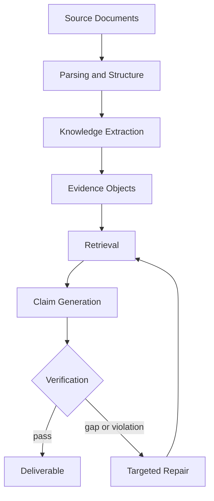

# Domain 04: Chunking 策略、結構化知識擷取與證據治理 (Proposition, Typed Knowledge & Evidence Governance)

> [!ABSTRACT] 核心問題意識 (Core Problem Statement)
> **文件切塊（Chunking）與知識擷取（Knowledge Extraction）絕非單純的字數切片或純粹的實體辨識，而是整個系統最關鍵的『知識語意表示（Knowledge Representation）』與『證據治理（Evidence Governance）』基石。**
> 
> 傳統 RAG 僅停留在 $Q \rightarrow \text{Retrieve} \rightarrow A$ 與被動的表面引用（Citation），無法處理企業級複雜交付文件、工程規格書與招標書中極其嚴苛的事實性、需求覆蓋率與推論可審計性。
> 本專題探討如何從非結構化長文本中解構出語意自足的命題、建立具有操作語意（Operational Semantics）的類型化企業知識單元，並構建出具備硬約束校驗與自動修復機制的端到端證據生命週期鏈。

---

## 一、傳統 Chunking 的本質缺陷與層次躍升

Chunking 會改變 retrieval unit 與可保留的局部語境，因此可能造成語意割裂、指代懸空與條件遺失；目前沒有足夠通用證據支持「超過 50% 的 RAG 失敗源於切塊」這種跨資料集比例，故不採用該數字。純固定字數切塊（如 512 tokens + 10% overlap）存在三大本質缺陷：
1. **語意割裂（Semantic Fragmentation）**：完整的邏輯推導、因果論證或條款規定被機械式攔腰截斷於兩個相鄰 Chunk 之間。
2. **代名詞與語境懸空（Pronoun & Context Ambiguity）**：Chunk 內充斥「該公司」、「此項規格」、「上述例外條件」等代名詞，脫離原始上下文後在向量空間中成為語意模糊的漂浮向量。
3. **條件、時態與否定態遺失（Condition & Modality Loss）**：主句落在 Chunk A（如「該設備最高流量可達 $50\text{ m}^3/\text{h}$」），但關鍵限制前提落在 Chunk B（如「前提是操作壓力維持於 3 bar 以上且僅限常溫純水」），導致檢索僅檢索出前半段，生成出完全錯誤的事實宣稱。

### 知識單元抽象層次階梯 (Knowledge Abstraction Hierarchy)

```text
原始文件 (Raw Document)
 │
 ├─ 結構化元素 (Structural Elements) ── Heading / Paragraph / Table / Row / Cell
 │
 ├─ 語義塊 (Semantic Chunk) ──────── 依 Markdown 標題層次、列表結構切分
 │
 ├─ 命題 (Proposition) ──────────── 最小、原子級、自包含的事實陳述 (Dense X)
 │
 ├─ 類型化知識 (Typed Knowledge) ─── F/R/D/A/P/C/T 等具操作約束之語意單元
 │
 ├─ 結構化三元組 (SPO Triple) ────── (主詞, 謂詞, 受詞) ── 易遺失先決條件與模態
 │
 └─ 證據對象 (Evidence Object) ───── 具備 Source Hash、Span、權威度、時效性之可審計單元
```

---

## 二、命題級切塊：Dense X (Proposition Retrieval)

- **核心代表作**：[[03 - 論文庫 (Literature Notes)/Chen2023 - Dense X Proposition Retrieval|Dense X (Chen et al., EMNLP 2024)]]。
- **核心定義**：將長文切分為一個個『Proposition（命題）』。每個命題必須滿足以下三項嚴格約束：
  1. **原子性（Atomic Fact）**：僅包含一個獨立的原生事實；
  2. **不可再分性（Minimal Context）**：無法在不破壞事實完整性的前提下再細分；
  3. **語意完全自包含（Fully Self-Contained）**：將所有代名詞替換為明確全稱實體，補齊所屬時間、空間、背景條件與主體。

### 解構範例
- **原始文本**：
  > 「愛因斯坦於 1879 年出生於德國烏爾姆，翌年隨家人遷居慕尼黑，在那裡他完成了早期的中學學業。」
- **Dense X 解構命題**：
  - *Proposition 1*：「愛因斯坦於 1879 年出生在德國烏爾姆。」
  - *Proposition 2*：「愛因斯坦於 1880 年隨同其家人遷居至德國慕尼黑。」
  - *Proposition 3*：「愛因斯坦在德國慕尼黑完成了早期的中學學業。」

---

## 三、三元組 (S, P, O) 的致命局限與跨塊抽取

### 1. 為什麼純三元組不是長文本知識擷取的理想表示？
傳統知識圖譜（KG）高度依賴 `(Subject, Predicate, Object)`。但在工程、法律、商業與醫療文件中，純三元組會造成**關鍵語意嚴重失真**：
- **案例**：
  > 「A 公司宣布將以 5 億美元收購 B 公司，但該交易仍需主管機關審查核准。」
- **若強行壓成三元組**：
  ```text
  (A公司, 收購, B公司)
  ```
  **語意已嚴重損毀！** 因為「宣布有意收購」$\neq$「已完成收購」。遺失的關鍵資訊包括：
  - 模態（Modality / Intention vs. Completed Reality）；
  - 時態與階段狀態（Temporal State）；
  - 前提條件（Condition：需主管機關核准）；
  - 不確定性（Uncertainty）；
  - 交易金額與合約細節。
- **結論**：未帶 qualifier 的簡單 SPO triple 可能遺失時間、條件、否定與模態；可比較的表示包含 qualified triples、events、propositions、evidence objects 與 hypergraphs。哪一種表示較合適取決於任務與 benchmark，不能預先宣稱只有超圖或事件圖可行。

### 2. 跨塊知識擷取 (Cross-Chunk Knowledge Extraction)
核心事實常跨越長文件的大篇幅章節：
- *第 2 章*：「專案代號 Titan 於 2021 年第三季啟動立項。」
- *第 11 章*：「由於市場轉向，Titan 代號團隊於 2024 年初遭全面裁撤。」
- **局部單塊提取之盲區**：兩段文字可支持「2021 年立項」與「2024 年團隊裁撤」，但**不能僅由此推論專案本身於 2024 年終止**；這正是 cross-chunk consolidation 必須區分「可直接合併的證據」與「需要額外證據的推論」的例子。
- **前沿解法**：兩階段抽取管線 —— 第一階段在各局部 Chunk 抽取實體與局部事實；第二階段啟動 Cross-Chunk 實體對齊、時序鏈重建與矛盾消解（Contradiction Resolution），整合成全局事件節點。

---

## 四、Survey-backed Knowledge Extraction 邊界

本 Domain 的「已知研究」應以 [[00 - 導覽與心智圖 (Navigation & MOC)/Survey Papers Index|Survey Papers Index]] 中的 **Generative Information Extraction survey** 與 **LLM-based Generative Information Extraction survey** 為入口，再連到 UIE、OpenIE、document-level RE、event extraction、proposition retrieval 等 primary works。

必須分開五件事：**Chunking**（怎麼切輸入）、**Extraction**（抽出什麼）、**Representation**（如何表示）、**Consolidation**（跨 chunk/document 如何對齊與修復）、**Retrieval Granularity**（檢索時以什麼單位排序）。Dense X 主要研究 proposition 作為 retrieval unit，不等同於一個完整的 universal knowledge-extraction taxonomy。

> [!IMPORTANT] F/R/D/A/P/C/T 的證據狀態
> 下列 F/R/D/A/P/C/T schema、操作語意、四層 evidence governance 與 D-K-E-C-V-O pipeline 是本專案的**研究假設 / engineering design**，不是目前已確認的通用 survey taxonomy。其系統架構完整版本見 [[04 - 研究想法與待驗證提案 (Ideas & Hypotheses)/Idea 05 - Evidence-Governed RAG 系統架構構想 (Delta Pipeline Design)|Idea 05]]；端到端 failure attribution 與 oracle 設計見 [[04 - 研究想法與待驗證提案 (Ideas & Hypotheses)/Idea 04 - End-to-End RAG Failure Attribution and Evidence Governance|Idea 04]]。此處只保留與 IE/RAG 文獻銜接所需的概要。

## 五、候選企業知識 Schema：F / R / D / A / P / C / T（Proposed）

在嚴肅工程文件、投標提案與系統架構中，知識絕不能只被當作平鋪直敘的「文字資料」，而必須被賦予精確的**企業語意類別（Typed Enterprise Knowledge）**：

| 代號 | 類型名稱 | 定義與語意範疇 | 下游處理規則與硬約束 |
| :---: | :--- | :--- | :--- |
| **F** | **Fact (客觀事實)** | 已發生的確定客觀數據、歷史事件、物理參數、組織現狀。 | 高權威證據；可直接作為系統能力與效能宣稱的有力支撐。 |
| **R** | **Requirement (需求條件)** | 客戶規格、招標規範、法規合規之約束條件。 | **必須被下游方案 100% 覆蓋**；絕不可被誤當成 Fact 或 Capability；需通過覆蓋率校驗。 |
| **D** | **Confirmed Design (確認設計)** | 專案團隊已定案的架構決策、確定選用的技術堆疊。 | 作為技術架構章節的核心骨幹；不應與需求條件混淆。 |
| **A** | **Assumption (假設條件)** | 缺乏直接證據但為推進設計暫時設定之前提。 | **必須顯式標註為假設**；絕不得偽裝成 Fact；若假設落空必須觸發風險提示。 |
| **P** | **Proposal (建議方案)** | 團隊提出的候選做法、改進方向、待選備選方案。 | 需對齊相關需求（R），並論證其可行性；非確定結論。 |
| **C** | **Capability (現有能力)** | 供應商或系統目前已具備的功能、產品指標與實績。 | 需提供歷史案例或客觀測試報告佐證；用以回應需求。 |
| **T** | **Terms (術語規範)** | 專案專用名詞、業務定義、縮寫表與標準概念。 | 建立全域名詞詞彙表；防止同一詞彙在不同段落產生歧義。 |

---

## 六、知識類型的操作語意（Proposed Operational Semantics）

> [!CAUTION] 研究與工程核心陷阱
> **若 F/R/D/A/P/C/T 僅被當作被動的 metadata 標籤（Tag），它就沒有任何學術創新與系統價值！**
> 
> 其核心價值在於：**定義 operational semantics —— 該資訊被允許代表什麼含義、被允許如何被下游操作：**
> \[
> \boxed{\text{type}(x) \Longrightarrow \text{allowed\_operations}(x)}
> \]

### 操作語意約束矩陣

1. **需求（Requirement）的操作約束**：
   - 只能作為約束條件（Constraint）輸入至生成模組；
   - 必須觸發**覆蓋率檢查（Coverage Validation）**：若輸出交付物中有任一項 $R_i$ 未被 address，系統狀態判定為 `FAIL`，直接阻斷流程並轉入 Repair Loop；
   - 嚴禁作為「本系統已實現某功能」的事實依據（不可自我證明）。
2. **假設（Assumption）的操作約束**：
   - 任何由 $A$ 推導出的章節或結論，在交付物中必須被強制附帶「風險提示與前提聲明」；
   - 在置信度評估中被賦予折減係數（Discounted Confidence）；
   - 當外部知識庫更新時，優先觸發對 $A$ 的重新檢視。
3. **事實（Fact）與能力（Capability）的對齊約束**：
   - 任何涉及「我們支援 $X$ 規格」的 Claim，其證據來源必須為 $C$ 或 $F$；
   - 若僅引用了 $P$（建議方案）或 $A$（假設）來背書能力宣稱，驗證模組直接判定為 `Invalid Evidence Type`。

---

## 七、四層證據階梯（Proposed Evidence Governance Model）

傳統 RAG 以為「有引用（Citation）就代表回答可信」，這是極為幼稚的假設。真實的證據治理存在四個嚴格遞進的審計層次：

\[
\boxed{\text{Citation} \neq \text{Entailment} \neq \text{Authority} \neq \text{Sufficiency}}
\]

```text
┌────────────────────────────────────────────────────────┐
│ 4. 充分性 (Sufficiency)                                │
│    所提供的證據集合是否足以完全支撐該 Claim？無未言明推論躍進？  │
├────────────────────────────────────────────────────────┤
│ 3. 權威性與合法性 (Authority & Usability)              │
│    來源是否為最新版本？是否來自權威部門？知識類型是否合法？      │
├────────────────────────────────────────────────────────┤
│ 2. 語意蘊涵 (Entailment)                               │
│    引用段落是否在邏輯上必然支持該 Claim？(NLI 檢驗)        │
├────────────────────────────────────────────────────────┤
│ 1. 表面引用 (Citation)                                 │
│    輸出文字是否有標註腳標或 URL？(最容易被模型幻覺偽造)       │
└────────────────────────────────────────────────────────┘
```

1. **Citation（表面引用）**：答案末尾帶有 `[Doc A, p.3]`。這僅代表模型輸出了一個指向標籤，完全不保證內容真實性。
2. **Entailment（語意蘊涵）**：利用 NLI（Natural Language Inference）模型檢驗：給定 Evidence 段落，Claim 是否在語意上被嚴格蘊涵（Entailed），而非中立（Neutral）或矛盾（Contradictory）。
3. **Authority（權威性與類型合法性）**：
   - 檢查該文件是否為最新版（透過 Source Manifest 的 Hash 與版本戳記）；
   - 檢查證據類型是否合規（例如不能拿客戶的「需求條款 R」來冒充我方的「技術能力 C」）。
4. **Sufficiency（證據充分性）**：
   - 單一證據往往不足以支撐複合命題。
   - 案例：Claim 宣稱「本系統可在 30 分鐘內備援切換且零資料遺失」。證據 A 證明「切換耗時 25 分鐘」，證據 B 證明「採用同步雙寫機制保證 RPO=0」。只有 $A \cup B$ 同時存在時，才具備 Sufficiency。

---

## 八、端到端證據生命週期與確定性修復鏈（Proposed）

將知識擷取與 RAG 提升為嚴密的受治理流水線：

\[
\boxed{D \longrightarrow K \longrightarrow E \longrightarrow C \longrightarrow V \longrightarrow O}
\]



> [!WARNING] Proposed architecture
> 上圖是本專案的可測試 reference architecture，不是 survey paper 已建立的標準 RAG pipeline。其 Evidence-Governed reference architecture 與 deterministic repair 假設見 [[04 - 研究想法與待驗證提案 (Ideas & Hypotheses)/Idea 05 - Evidence-Governed RAG 系統架構構想 (Delta Pipeline Design)|Idea 05]]；failure attribution、oracle 與 error-propagation ablation 見 [[04 - 研究想法與待驗證提案 (Ideas & Hypotheses)/Idea 04 - End-to-End RAG Failure Attribution and Evidence Governance|Idea 04]]。

### 確定性不變量 (Deterministic Invariants)
與傳統 Agent 依賴「LLM 自我評估：我覺得這段寫得挺好的」不同，證據治理系統引入嚴格的程式碼級確定性約束：
- **不變量 1：需求覆蓋率約束**：
  \[
  \text{Coverage}(R) = \frac{|\{r \in R \mid \exists c \in C, \text{Addresses}(c, r) \land \text{Valid}(c)\}|}{|R|} = 1.0
  \]
- **不變量 2：無漂浮主張約束（No Ungrounded Claim）**：
  \[
  \forall c \in C_{\text{deliverable}}, \quad \text{Sufficiency}(E(c), c) = \text{True}
  \]
- **不變量 3：類型語意相容性約束**：
  \[
  \forall c \in C_{\text{capability}}, \quad \text{type}(E(c)) \in \{F, C, D\} \quad (\text{嚴禁 } type(E(c)) \in \{R, A\})
  \]

---

## 九、相關專題與文獻導覽

- **文獻支撐**：
  - [[03 - 論文庫 (Literature Notes)/Chen2023 - Dense X Proposition Retrieval|Dense X 命題檢索 (Chen et al., EMNLP 2024)]]
  - [[03 - 論文庫 (Literature Notes)/Edge2024 - Microsoft GraphRAG|Microsoft GraphRAG (Edge et al., 2024)]]
  - [[03 - 論文庫 (Literature Notes)/Shao2024 - STORM Writing Wikipedia From Scratch|STORM 知識探究與長篇寫作 (Shao et al., 2024)]]
  - [[03 - 論文庫 (Literature Notes)/Asai2023 - Self-RAG|Self-RAG 反思與可控檢索 (Asai et al., ICLR 2024)]]
- **領域跳轉**：
  - [[02 - 研究領域專題 (Research Domains)/Domain 05 - Graph RAG 與結構化知識 (Microsoft GraphRAG, HippoRAG)|Domain 05: Graph RAG 與知識圖譜]]
  - [[02 - 研究領域專題 (Research Domains)/Domain 08 - 長篇生成與報告撰寫 (STORM, Evidence Store, Ledger)|Domain 08: 長篇生成與 Claim-Evidence Ledger]]
  - [[04 - 研究想法與待驗證提案 (Ideas & Hypotheses)/Idea 05 - Evidence-Governed RAG 系統架構構想 (Delta Pipeline Design)|Idea 05: Evidence-Governed RAG 系統架構]]
  - [[04 - 研究想法與待驗證提案 (Ideas & Hypotheses)/Idea 06 - 主流 RAG 框架生態與系統定位分析 (Framework Landscape & Positioning)|Idea 06: 框架生態與系統定位]]
  - [[00 - 導覽與心智圖 (Navigation & MOC)/技術全景與 Pareto 權衡分析 (Trade-offs)|技術全景與 Pareto 權衡分析]]
