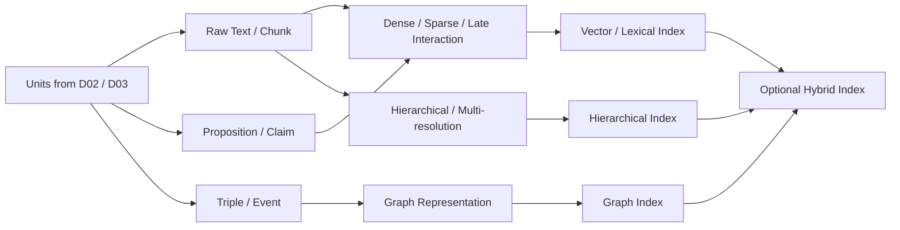

# Domain 04 - Knowledge Representation & Indexing

## Core Question
知識應以什麼形式表示、編碼與建立索引，才能支援後續 retrieval、multi-hop 與 synthesis？

## Includes
- chunk / proposition / claim / qualified triple / event / evidence-object representation
- dense / sparse / late-interaction encoding
- vector / lexical / graph / hierarchical index
- knowledge graph construction
- multi-resolution / hybrid indexing
- ANN infrastructure

## Excludes
- query rewrite / ranking → D05
- evidence sufficiency / stopping → D06
- index refresh / version update → D10

## Level-2 Topics
- Knowledge Representation
- Embedding & Representation Learning
- KG Construction
- Multi-resolution & Hierarchical Indexing
- Hybrid Indexing
- ANN / Vector Infrastructure

## Boundary
**Chunk、Proposition、Triple、Event、Graph 不是成熟度階梯。**  
它們可能分別是 retrieval unit、semantic unit、representation 或 index structure；GraphRAG / Hierarchical RAG 因此以 paradigm tag 表示，不另立 top-level Domain。

## Representative Notes

**Current primary-note coverage: 5**

- [[03 - 論文庫 (Literature Notes)/04 - Knowledge & Graph RAG/(arXiv 2024-04) From Local to Global - A Graph RAG Approach to Query-Focused Summarization|Microsoft GraphRAG]]
- [[03 - 論文庫 (Literature Notes)/04 - Knowledge & Graph RAG/(ICLR 2024-05) RAPTOR - Recursive Abstractive Processing for Tree-Organized Retrieval|RAPTOR]]
- [[03 - 論文庫 (Literature Notes)/04 - Knowledge & Graph RAG/(NeurIPS 2024-12) HippoRAG - Neurobiologically Inspired Long-Term Memory for Large Language Models|HippoRAG]]
- [[03 - 論文庫 (Literature Notes)/04 - Knowledge & Graph RAG/(arXiv 2024-10) LightRAG - Simple and Fast Retrieval-Augmented Generation|LightRAG]]

## Navigation
- [[02 - 研究領域專題 (Research Domains)/Domain 03 - Knowledge Extraction & Information Preservation|D03 Knowledge Extraction & Information Preservation]]
- [[02 - 研究領域專題 (Research Domains)/Domain 05 - Query Understanding & Retrieval|D05 Query Understanding & Retrieval]]
- [[00 - 導覽與心智圖 (Navigation & MOC)/RAG Paradigm Tags|RAG Paradigm Tags]]
