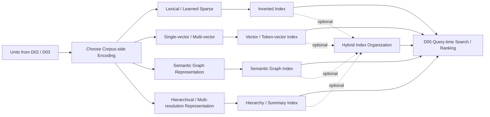

# Domain 04 - Representation & Indexing

## Core Question

D02/D03 產生的 retrieval units 或 semantic units，應如何被編碼並組織成 searchable representations / index structures？來源可以是原始文本、結構化資料或視覺文件，不必先經過 knowledge extraction。

```mermaid
flowchart LR
    U["Units from D02 / D03"] --> E["Choose Corpus-side Encoding"]
    E --> L["Lexical / Learned Sparse"]
    E --> V["Single-vector / Multi-vector"]
    E --> G["Semantic Graph Representation"]
    E --> H["Hierarchical / Multi-resolution Representation"]
    L --> LI["Inverted Index"]
    V --> VI["Vector / Token-vector Index"]
    G --> GI["Semantic Graph Index"]
    H --> HI["Hierarchy / Summary Index"]
    LI --> R["D05 Query-time Search / Ranking"]
    VI --> R
    GI --> R
    HI --> R
    LI -. "optional" .-> HY["Hybrid Index Organization"]
    VI -. "optional" .-> HY
    GI -. "optional" .-> HY
    HI -. "optional" .-> HY
    HY --> R
```

## Includes

- corpus-side representation of passages, propositions, claims, qualified triples, events, tables or visual evidence；unit 如何形成由 D02/D03 決定
- lexical / learned sparse / dense single-vector / multi-vector / contextualized / multimodal encoding
- semantic graph、hierarchical / multi-resolution 與 hybrid index organization
- representation learning、compression 或 index organization 如何影響 evidence 的可檢索性；query-time scoring 與 runtime trade-offs 分別連 D05/D14

## Excludes

- retrieval-unit boundaries、可獨立檢索的粒度設計 → D02
- semantic extraction、entity alignment 與 consolidation → D03
- query transformation、search、fusion、ranking / reranking → D05
- evidence sufficiency 與 stopping → D06
- source synchronization、index refresh / invalidation / version update → D10
- generic ANN/vector-DB implementation、serving、hardware scheduling 與 latency engineering → D14 engineering interface；使用 ANN 本身不足以構成 D04 research contribution

## Level-2 Topics

- Unit Representation & Encoding: lexical / learned sparse / single-vector / multi-vector / contextualized / multimodal
- Representation Learning & Compression
- Semantic Graph Representation & Index Organization
- Hierarchical / Multi-resolution Representation
- Hybrid Index Organization
- Representation–Index Compatibility: evidence recoverability 與 D05/D14 interfaces

## Unit × Encoding × Index：三個可組合的軸

**Chunk、Proposition、Triple、Event、Vector、Graph 不是同一層級，也不是成熟度階梯。** 原始 passage 或抽取後 proposition 都可以用 sparse、dense 或 multi-vector 表示；semantic graph 與 hierarchy 也可以保留文字 evidence 並結合向量索引。

| 分類軸 | 描述什麼 | 例子 | Domain 邊界 |
|---|---|---|---|
| Retrieval / semantic unit | 哪個資訊物件被獨立形成或抽取 | passage、proposition、entity、event、table row/cell | 形成 retrieval unit → D02；抽 semantic unit → D03 |
| Corpus-side encoding / representation | 物件如何表示與編碼 | lexical weights、learned sparse weights、single-vector、token vectors、semantic graph | 表示與 representation learning → D04 |
| Index organization | 如何組織 searchable representations | inverted index、vector/token-vector index、semantic graph、hierarchy、hybrid | evidence-oriented organization → D04；通用 search-engine runtime → D14 interface |

這是本 repo 的分析矩陣，不是宣稱所有 survey 使用同一套分類。各軸可以組合，不能只因 paper 使用 graph 或 vector 就判斷其 primary contribution。

### Encoding families 與可比機制

| Encoding family | 存下來的表示 | Query-time matching interface | 需要核對的代價／失效條件 | 已有 notes |
|---|---|---|---|---|
| Lexical / learned sparse | 詞彙權重；learned sparse 可包含模型預測的 expansion weights | lexical matching / sparse scoring → D05 | vocabulary/tokenization、term expansion、稀疏度與 inverted-index footprint | [[03 - 論文庫 (Literature Notes)/03 - RAG & Retrieval/(SIGIR 2022-07) SPLADE v2 - Sparse Lexical and Expansion Model for Information Retrieval\|SPLADE v2]] |
| Dense single-vector | 每個 retrieval unit 的 dense vector | 向量相似度、candidate search → D05 | unit-level information bottleneck、domain/language shift、index approximation | [[03 - 論文庫 (Literature Notes)/03 - RAG & Retrieval/(EMNLP 2020-11) Dense Passage Retrieval for Open-Domain Question Answering\|DPR]]、[[03 - 論文庫 (Literature Notes)/03 - RAG & Retrieval/(TMLR 2022-08) Unsupervised Dense Information Retrieval with Contrastive Learning\|Contriever]] |
| Multi-vector / late interaction | 每個 unit 的多個 vectors，常對應 tokens | token-level interaction / passage scoring → D05 | document length、vector count、compression、candidate pruning 與 scoring cost | [[03 - 論文庫 (Literature Notes)/03 - RAG & Retrieval/(SIGIR 2020-07) ColBERT - Efficient and Effective Passage Search via Contextualized Late Interaction over BERT\|ColBERT]]、[[03 - 論文庫 (Literature Notes)/03 - RAG & Retrieval/(NAACL 2022-07) ColBERTv2 - Effective and Efficient Retrieval via Lightweight Late Interaction\|ColBERTv2]] |
| Contextualized representation | 由更大 source context 計算 unit representation | 已形成 units 的 query-time retrieval → D05 | context scope、pooling、source length 與 independent encoding 的差異 | [[03 - 論文庫 (Literature Notes)/03 - RAG & Retrieval/(arXiv 2024-09) Late Chunking - Contextual Chunk Embeddings for Retrieval\|Late Chunking]]、[[03 - 論文庫 (Literature Notes)/03 - RAG & Retrieval/(ACL 2026-07) Situated Embedding Models for Context-Aware Dense Retrieval\|Situated Embedding Models]] |

表中的成本是比較時需檢查的變量，不是無條件效能排序。比較時須固定或揭露 **task/dataset、model scale/context length、hardware/cost、memory/latency/throughput、retrieval/answer quality、failure modes/maintenance complexity**；不同 corpus、compression、candidate budget 或硬體的結果標為「不可直接比較」。

## Semantic Graph ≠ ANN Neighbor Graph

- **Semantic graph** 的 nodes/edges 表示 entities、relations、events、claims、passage associations 或其他 evidence connections；表示與組織屬 D04，query-time traversal / relevance ranking 屬 D05。
- **ANN neighbor graph**（例如 HNSW 的搜尋結構）以向量近鄰連接加速 candidate search。[HNSW 原始預印本](https://arxiv.org/abs/1603.09320) 的官方摘要描述 proximity graphs；本次未核全文。它的 edge 不自動代表 semantic relation、證據支持或 reasoning hop；使用它不構成 graph_rag 的充分條件。
- **Hierarchy** 組織 parent–child units、summaries 或 multi-resolution evidence；建立 hierarchy 屬 D04，依 query 選擇 level / traversal policy 屬 D05。

因此「Vector RAG vs GraphRAG vs Hierarchical RAG」可作機制與 trade-offs 比較，但不能作互斥 Domain 或優劣階梯。

## D04 ↔ D14 Engineering Interface

| 研究問題 | 分類 |
|---|---|
| 如何編碼或壓縮 evidence，使 representation/index 仍保留可檢索資訊？ | D04；query-time retrieval quality 與 D05 交叉 |
| 如何設定 candidate search、matching / scoring 與 reranking？ | D05；search-engine efficiency 與 D14 交叉 |
| 如何實作 ANN、quantization、pruning、CPU/GPU kernels、serving 或 scheduling？ | D14 engineering interface；僅有 generic infrastructure 不自動成為 RAG-core paper |
| source 更新後哪些 representations / indexes 需重算或失效？ | D10；不是初始 index organization 的同義詞 |

ColBERTv2 的表示與壓縮、後續 PLAID search engine、使用者採用的索引實作版本應分開溯源；不能把特定 engine 的 latency 歸給所有 late-interaction models。PLAID 的正式版本及既有 ColBERTv2 note 中 engine claims 仍需專門核查。

## Representative Notes

以下是已有筆記的導航，不以手填數量代替全庫 metadata 統計；下方候選來源不計入 primary-note coverage。

- [[03 - 論文庫 (Literature Notes)/04 - Knowledge & Graph RAG/(arXiv 2024-04) From Local to Global - A Graph RAG Approach to Query-Focused Summarization|Microsoft GraphRAG]]
- [[03 - 論文庫 (Literature Notes)/04 - Knowledge & Graph RAG/(ICLR 2024-05) RAPTOR - Recursive Abstractive Processing for Tree-Organized Retrieval|RAPTOR]]
- [[03 - 論文庫 (Literature Notes)/04 - Knowledge & Graph RAG/(arXiv 2024-10) LightRAG - Simple and Fast Retrieval-Augmented Generation|LightRAG]]
- [[03 - 論文庫 (Literature Notes)/03 - RAG & Retrieval/(arXiv 2024-09) Late Chunking - Contextual Chunk Embeddings for Retrieval|Late Chunking]]
- [[03 - 論文庫 (Literature Notes)/04 - Knowledge & Graph RAG/(ICLR 2026-05) LinearRAG - Linear Graph Retrieval Augmented Generation on Large-scale Corpora|LinearRAG]]
- [[03 - 論文庫 (Literature Notes)/03 - RAG & Retrieval/(ACL 2026-07) Situated Embedding Models for Context-Aware Dense Retrieval|Situated Embedding Models]]
- [[03 - 論文庫 (Literature Notes)/03 - RAG & Retrieval/(CVPR 2025-06) VDocRAG - Retrieval-Augmented Generation over Visually-Rich Documents|VDocRAG]]

### Cross-domain Anchors

- [[03 - 論文庫 (Literature Notes)/04 - Knowledge & Graph RAG/(NeurIPS 2024-12) HippoRAG - Neurobiologically Inspired Long-Term Memory for Large Language Models|HippoRAG]] — D05 primary / D04 secondary；semantic graph index 支援 query-time associative retrieval，不能僅因名稱有 memory 就加 D11。

### Candidate Primary Sources — 官方摘要已核，全文待查驗

| 候選來源 | 可補的機制 | 本次驗證範圍 |
|---|---|---|
| [M3-Embedding: Multi-Linguality, Multi-Functionality, Multi-Granularity Text Embeddings Through Self-Knowledge Distillation](https://aclanthology.org/2024.findings-acl.137/) — Chen et al., Findings ACL 2024，DOI 10.18653/v1/2024.findings-acl.137 | 同一模型支持 dense、sparse、multi-vector，避免將 encoding families 當互斥分類 | 官方 metadata / abstract；全文、training 與實驗條件待查驗 |
| [PLAID: An Efficient Engine for Late Interaction Retrieval](https://arxiv.org/abs/2205.09707) — Santhanam et al., arXiv 2205.09707 (2022) | centroid interaction / pruning 的 retrieval engine；D05/D14 interface，非新的 representation family | 官方 arXiv metadata / abstract；正式出版版本、全文與 engine 數據待查驗 |

## Classification Decisions — 2026-10-02

- D04 以 corpus-side representation / evidence-oriented index organization 為核心；unit formation、extraction、query-time search、refresh 與 generic serving 分別由 D02/D03/D05/D10/D14 處理。
- LinearRAG：D04 primary / D03,D05 secondary。依全文方法章的 relation-free Tri-Graph index organization 與 two-stage search 貢獻判定；使用既有 NER 不足以將主要貢獻歸為 D03 extraction。原文核對與版本記錄見 [[03 - 論文庫 (Literature Notes)/04 - Knowledge & Graph RAG/(ICLR 2026-05) LinearRAG - Linear Graph Retrieval Augmented Generation on Large-scale Corpora|LinearRAG note]]。
- HippoRAG 留作 D05-primary cross-domain anchor；不將 query-time PPR mechanism 寫成 D04-primary contribution。
- new candidate sources 不改變既有 primary-note coverage；survey 與 generic infrastructure 不因與 indexing 相關就自動算 D04 method papers。

## Sources & Navigation

- [[03 - 論文庫 (Literature Notes)/03 - RAG & Retrieval/(ACM CSUR 2026-09) A Survey on Retrieval-Augmented Text Generation for Large Language Models|Huang et al. Survey]]：用於對照 broader representation/retrieval research axes；D01–D14 的界線是本 repo operational taxonomy，不代表該 survey 使用相同 Domain。
- [[03 - 論文庫 (Literature Notes)/04 - Knowledge & Graph RAG/(arXiv 2024-08) Graph Retrieval-Augmented Generation - A Survey|GraphRAG Survey]]：cross-lifecycle survey anchor，不是 D04-primary method paper。
- [[02 - 研究領域專題 (Research Domains)/Domain 02 - Segmentation & Contextualization|D02 Segmentation & Retrieval Granularity]]
- [[02 - 研究領域專題 (Research Domains)/Domain 03 - Knowledge Extraction & Information Preservation|D03 Knowledge Extraction & Consolidation]]
- [[02 - 研究領域專題 (Research Domains)/Domain 05 - Query Understanding & Retrieval|D05 Query Understanding & Retrieval]]
- [[02 - 研究領域專題 (Research Domains)/Domain 14 - RAG Systems, Robustness & Security|D14 RAG Systems, Security & Privacy]]
- [[00 - 導覽與心智圖 (Navigation & MOC)/RAG Paradigm Tags|RAG Paradigm Tags]]
