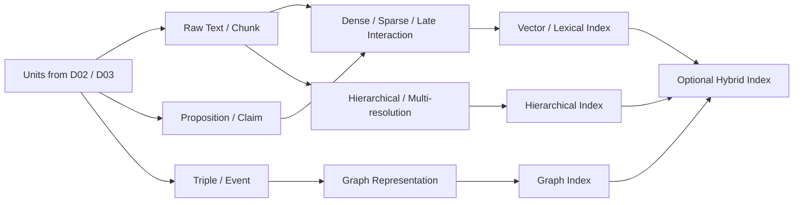

# Domain 04 - Representation & Indexing

> [!WARNING]
> **Phase 1 closure is authoritative.** 若本頁較早段落與底部「Phase 1 Closure — 2026-09-27」衝突，以 closure 為準；舊文字暫留作 Phase 2 forensic audit，將於 Phase 7 一次正規化。

## Core Question
知識應以什麼形式表示、編碼與建立索引，才能支援後續 retrieval、multi-hop 與 synthesis？

```mermaid
flowchart LR
    U["Units from D02 / D03"] --> TXT["Raw Text / Chunk"]
    U --> PROP["Proposition / Claim"]
    U --> STR["Triple / Event"]
    TXT --> ENC["Dense / Sparse / Late Interaction"]
    PROP --> ENC
    STR --> G["Graph Representation"]
    ENC --> V["Vector / Lexical Index"]
    G --> GI["Graph Index"]
    TXT --> H["Hierarchical / Multi-resolution"]
    H --> HI["Hierarchical Index"]
    V --> HY["Optional Hybrid Index"]
    GI --> HY
    HI --> HY
```

## Includes
- chunk / proposition / claim / qualified triple / event / evidence-object representation
- dense / sparse / late-interaction encoding
- vector / lexical / graph / hierarchical index
- knowledge graph construction
- multi-resolution / hybrid indexing
- ANN infrastructure

## Excludes
- query rewrite / ranking → D05
- evidence sufficiency / stopping → D06
- index refresh / version update → D10

## Level-2 Topics
- Knowledge Representation
- Embedding & Representation Learning
- KG Construction
- Multi-resolution & Hierarchical Indexing
- Hybrid Indexing
- ANN / Vector Infrastructure

## Boundary
**Chunk、Proposition、Triple、Event、Graph 不是成熟度階梯。**  
它們可能分別是 retrieval unit、semantic unit、representation 或 index structure；GraphRAG / Hierarchical RAG 因此以 paradigm tag 表示，不另立 top-level Domain。

## Representative Notes

**Current primary-note coverage: 4**

- [[03 - 論文庫 (Literature Notes)/04 - Knowledge & Graph RAG/(arXiv 2024-04) From Local to Global - A Graph RAG Approach to Query-Focused Summarization|Microsoft GraphRAG]]
- [[03 - 論文庫 (Literature Notes)/04 - Knowledge & Graph RAG/(ICLR 2024-05) RAPTOR - Recursive Abstractive Processing for Tree-Organized Retrieval|RAPTOR]]
- [[03 - 論文庫 (Literature Notes)/04 - Knowledge & Graph RAG/(NeurIPS 2024-12) HippoRAG - Neurobiologically Inspired Long-Term Memory for Large Language Models|HippoRAG]]
- [[03 - 論文庫 (Literature Notes)/04 - Knowledge & Graph RAG/(arXiv 2024-10) LightRAG - Simple and Fast Retrieval-Augmented Generation|LightRAG]]
- [[03 - 論文庫 (Literature Notes)/03 - RAG & Retrieval/(arXiv 2024-09) Late Chunking - Contextual Chunk Embeddings for Retrieval|Late Chunking]]

## Representation Families
舊版 GraphRAG / hierarchical 頁面中的核心概念保留為 **representation/index choices**，而不是額外 top-level Domain：

| Family | Main object | Typical strength | Main boundary |
|---|---|---|---|
| Raw text / chunk | passage text | local evidence fidelity | segmentation in D02 |
| Proposition / claim | self-contained semantic unit | fine-grained retrieval | extraction may touch D03 |
| Graph / KG | entity / relation / event graph | relational traversal / global structure | query-time graph search in D05 |
| Hierarchical / multi-resolution | tree / community / recursive summaries | local↔global resolution switching | retrieval policy in D05 |
| Hybrid | lexical + dense + graph + hierarchy | channel complementarity | fusion/reranking in D05 |

### Graph and hierarchical structure are not a single algorithm

- Microsoft GraphRAG-style systems separate **graph/community representation** from **local/global query modes**; the former belongs here, the latter belongs to D05.
- HippoRAG-style association mechanisms use graph structure as non-parametric memory/index; Personalized PageRank-like traversal is a retrieval mechanism at D05/D11 boundary.
- RAPTOR-style recursive summaries are a hierarchical representation; tree traversal / collapsed retrieval are D05 retrieval choices.

因此「Vector RAG vs GraphRAG vs Hierarchical RAG」不是三個互斥 Domain，而是可組合的 representation / retrieval paradigms。

> [!NOTE]
> [[03 - 論文庫 (Literature Notes)/04 - Knowledge & Graph RAG/(arXiv 2024-08) Graph Retrieval-Augmented Generation - A Survey|GraphRAG Survey]] is a cross-lifecycle survey anchor (D03/D04/D05/D09), not a D04-primary paper.

## Navigation
- [[02 - 研究領域專題 (Research Domains)/Domain 03 - Knowledge Extraction & Information Preservation|D03 Knowledge Extraction & Information Preservation]]
- [[02 - 研究領域專題 (Research Domains)/Domain 05 - Query Understanding & Retrieval|D05 Query Understanding & Retrieval]]
- [[00 - 導覽與心智圖 (Navigation & MOC)/RAG Paradigm Tags|RAG Paradigm Tags]]

## Phase 1 Closure — 2026-09-27

> [!IMPORTANT]
> **Canonical name: D04 Representation & Indexing.**
> `Knowledge` is removed from the canonical display name because chunk, visual, hierarchical, graph and hybrid representations need not originate from explicit knowledge extraction.

**Core question**：D02/D03 產生的 retrieval 或 semantic units，應如何被編碼並組織成 searchable representations / index structures？

**Canonical Level-2**
- Unit Representation: dense / sparse / contextualized / multimodal
- Graph Representation & Index Organization
- Hierarchical / Multi-resolution Representation
- Hybrid Index Organization

**Boundary**
- D02 = unit formation
- D03 = semantic extraction
- D04 = corpus-side representation and index organization
- D05 = query-time relevance/retrieval algorithm
- generic ANN/vector-DB infrastructure is engineering or D14 interface, not a D04 research topic by itself

**Paper decisions**
- Late Chunking: KEEP D04 / D02 secondary; remove D05 secondary.
- RAPTOR: KEEP D04 / D05 secondary.
- Microsoft GraphRAG: KEEP D04 / D05 secondary; D03/D09 need not be secondary.
- LightRAG: KEEP D04; update to Findings EMNLP 2025, DOI `10.18653/v1/2025.findings-emnlp.568`; D05+D10 secondary.
- HippoRAG (2024): MOVE to D05 primary / D04 secondary; remove D11.
- Situated Embedding Models (ACL 2026): ADD D04 / D02 secondary.
- VDocRAG (CVPR 2025): ADD D04 / D05 secondary.
- GFM-RAG (NeurIPS 2025): D05 primary / D04 secondary.
