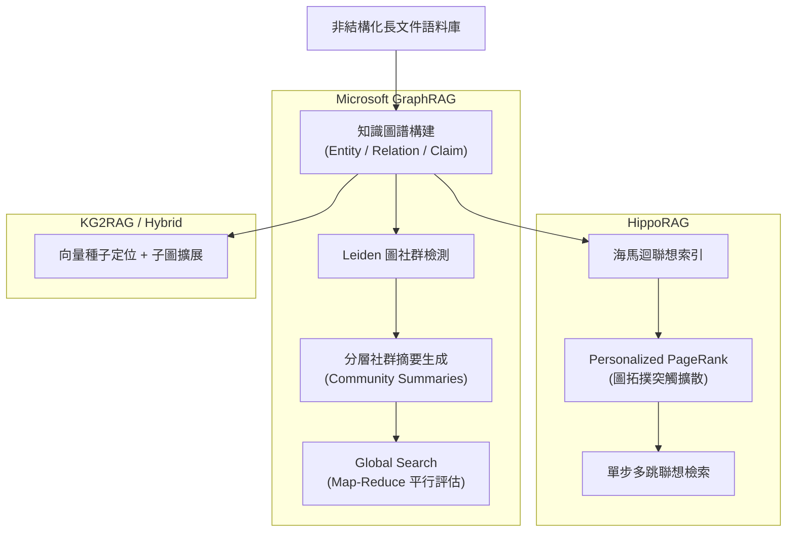

# Domain 05: Graph RAG 與結構化知識 (Microsoft GraphRAG, HippoRAG, Hybrid Search)

> [!ABSTRACT] 核心問題意識 (Core Problem Statement)
> **向量檢索擅長局部精確匹配，但在處理跨越全篇的全局問題（如主題演變、全局實體關聯）時徹底失效。如何引入圖結構彌合局部碎片與全局宏觀理解？**

---

### 一、核心問題意識：Vector RAG 的全局失明
如果向一個內含 100 萬字公司財報與內部通訊的向量資料庫提問：
> 「這家公司在過去三年中最常發生的供應鏈管理風險是什麼？各部門如何應對？」

標準 Vector RAG 的表現往往極為拙劣：
- 檢索器只能返回相似度最高的 Top-10 個局部段落。
- 這些段落可能全都在討論某一次具體的零件缺貨，模型無法得知這是不是『最常發生』的風險，也無法綜觀全域。
- **本質原因**：向量檢索是**點查詢（Point Query）**，而全局感知是**彙整查詢（Aggregation Query）**。

---

### 二、三大前沿 Graph RAG 架構剖析

#### 1. 微軟 GraphRAG：社群檢測與 Map-Reduce 全局摘要
- **代表作**：[[Edge2024 - Microsoft GraphRAG|GraphRAG (Edge et al., 2024)]]。
- **核心架構**：
  1. **Graph Extraction**：利用 LLM 多輪抽取實體（Entity）、關係（Relationship）與主張（Claim）。
  2. **Community Detection**：利用圖論演算法（Leiden）將密集互動的實體聚類為多層次社群（C0 宏觀到 C3 微觀）。
  3. **Summarization**：自底向上為每個社群撰寫結構化摘要報告。
  4. **Global Search**：將使用者查詢分派給所有社群摘要進行評分篩選（Map），最後整合輸出（Reduce）。

#### 2. HippoRAG：神經生物學啟發的高速聯想記憶
- **代表作**：[[Gutierrez2024 - HippoRAG|HippoRAG (Gutiérrez et al., NeurIPS 2024)]]。
- **核心架構**：
  - 模擬大腦新皮質（儲存原始文檔）與海馬迴（快速索引聯想網絡）的雙重記憶理論。
  - 將檢索問題中的實體作為激活信號，在圖結構上利用 **Personalized PageRank (PPR)** 進行機率擴散。
  - 無需多輪呼叫 LLM 即可在毫秒級精確點亮多跳關聯的遠程證據文檔。

#### 3. KG²RAG & PropRAG：保留原始語境的混合圖檢索
- 克服傳統知識圖譜『實體關係孤立化』的問題，將命題（Proposition）作為圖節點，或者以向量先定位種子節點，再沿著關係邊擴展檢索周邊保留完整原文語境的鄰居節點。

---

### 三、Graph RAG 與 Vector RAG 的全面對比

| 評估維度 | Standard Vector RAG | Microsoft GraphRAG | HippoRAG |
| :--- | :--- | :--- | :--- |
| **檢索原理** | 局部向量餘弦相似度 | 社群層次摘要檢索 | 圖拓撲機率擴散 (PPR) |
| **強項任務** | 具體事實問答 (Factoid QA) | 全局宏觀主題、趨勢歸納 | 多跳關聯推理 (Multi-hop QA) |
| **弱項任務** | 全局綜述、跨實體關係網絡 | 成本極其高昂、即時更新難 | 高度抽象或無實體問題 |
| **索引構建成本** | 低 ($O(N)$ 嵌入計算) | 極高 (大量 LLM 抽取與摘要呼叫) | 中等 (需抽取實體，後續圖運算快) |
| **推論延遲** | 毫秒級 (< 50ms) | 數秒至數十秒 (Map-Reduce) | 亞秒級 (< 200ms) |

---

### 四、實務選型指南 (Pragmatic Guidelines)
> [!TIP] 什麼時候真正需要 GraphRAG？
> 1. 如果你的業務場景是**客服問答、法規條文精準定位**：請使用 **Hybrid RAG (BM25 + Dense + Rerank)** 或 **[[Chen2023 - Dense X Proposition Retrieval|Proposition Retrieval]]**，GraphRAG 的高昂成本在此場景下是嚴重的資源浪費。
> 2. 如果你的業務場景是**情報分析、商業競爭對手全景掃描、整本長篇報告主題洞察**：**GraphRAG** 是目前唯一能有效產出全局宏觀圖景的成熟方案。

---

## 相關導覽與文獻快速跳轉
- **回主目錄**：[[00 - 導覽與心智圖 (Navigation & MOC)/Home (主目錄與知識庫導覽)|主目錄與知識庫導覽]]
- **全景心智圖**：[[00 - 導覽與心智圖 (Navigation & MOC)/LLM 超長文件處理心智圖 (MOC)|超長文件處理研究方向心智圖]]
- **深度研究報告**：[[01 - 深度研究報告 (Deep Research Reports)/01 - LLM 超長文件閱讀與撰寫技術全景 (完整深度報告)|技術全景深度報告]]
- **權衡分析**：[[00 - 導覽與心智圖 (Navigation & MOC)/技術全景與 Pareto 權衡分析 (Trade-offs)|技術成熟度與 Pareto 權衡分析]]
