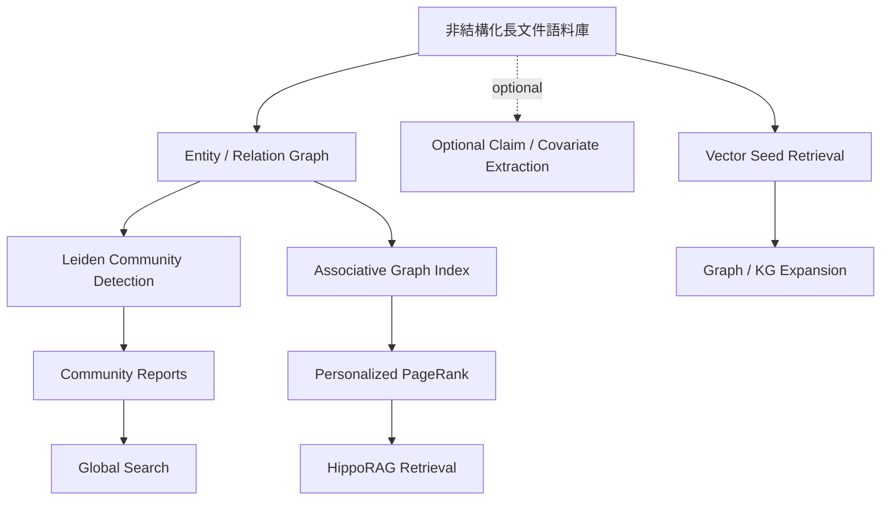

# Domain 05: Graph RAG 與結構化知識 (Microsoft GraphRAG, HippoRAG, Hybrid Search)

> [!ABSTRACT] 核心問題意識 (Core Problem Statement)
> **向量 Top-k 檢索在局部相關片段定位上具有優勢，但對需要跨文件聚合、關係遍歷或全域主題彙整的問題可能不足。圖結構、階層摘要與多輪檢索提供了不同的補強路徑；本 Domain 比較它們的適用條件與代價。**

---

### 一、核心問題意識：Vector RAG 的全局失明
如果向一個內含 100 萬字公司財報與內部通訊的向量資料庫提問：
> 「這家公司在過去三年中最常發生的供應鏈管理風險是什麼？各部門如何應對？」

標準 Vector RAG 的表現往往極為拙劣：
- 檢索器只能返回相似度最高的 Top-10 個局部段落。
- 這些段落可能全都在討論某一次具體的零件缺貨，模型無法得知這是不是『最常發生』的風險，也無法綜觀全域。
- **本質原因**：向量檢索是**點查詢（Point Query）**，而全局感知是**彙整查詢（Aggregation Query）**。

---

### 二、三大前沿 Graph RAG 架構剖析

> [!NOTE] 圖示範圍
> 這張圖刻意把不同 Graph-RAG family 分開。Microsoft GraphRAG 的核心索引流程是 entity/relationship graph、community detection 與 community reports；claim/covariate extraction 應視版本與設定而定，不應畫成所有版本都必經的核心步驟。

#### 1. 微軟 GraphRAG：社群檢測與多元搜尋模式
- **代表作**：[[03 - 論文庫 (Literature Notes)/04 - Knowledge & Graph RAG/(arXiv 2024-04) From Local to Global - A Graph RAG Approach to Query-Focused Summarization|GraphRAG (Edge et al., 2024)]]。
- **核心架構**：
  1. **Graph Extraction**：核心流程利用 LLM 抽取實體（Entity）與關係（Relationship）；GraphRAG 的 claim/covariate extraction 在官方實作中為可選功能（預設關閉），不應視為所有標準索引流程的必要步驟。
  2. **Community Detection**：利用圖論演算法（Leiden）將密集互動的實體聚類為多層次社群（C0 宏觀到 C3 微觀）。
  3. **Summarization**：自底向上為每個社群撰寫結構化摘要報告（Community Reports）。
  4. **四大搜尋模式（Search Modes）**：
     - **Global Search**：將全域問題分派給各社群摘要進行 Map-Reduce 評分與彙整，專注於宏觀主題感知；
     - **Local Search**：以實體為錨點檢索相鄰關係、實體屬性與原始關聯文本塊，專注於具體實體推理；
     - **DRIFT Search**：結合全局社群資訊與局部圖遍歷，由粗到細進行動態擴展；
     - **Basic Search**：以原始文字塊的向量檢索作為基線。

#### 2. HippoRAG：神經生物學啟發的高速聯想記憶
- **代表作**：[[03 - 論文庫 (Literature Notes)/04 - Knowledge & Graph RAG/(NeurIPS 2024-12) HippoRAG - Neurobiologically Inspired Long-Term Memory for Large Language Models|HippoRAG (Gutiérrez et al., NeurIPS 2024)]]。
- **核心架構**：
  - 模擬大腦新皮質（儲存原始文檔）與海馬迴（快速索引聯想網絡）的雙重記憶理論。
  - 將檢索問題中的實體作為激活信號，在圖結構上利用 **Personalized PageRank (PPR)** 進行機率擴散。
  - 核心設計以一次圖上的 Personalized PageRank 傳播取代多輪 retrieval-reasoning 迭代；速度與成本改善必須引用論文中的特定 baseline 與實驗設定，不能泛化成固定的毫秒級延遲。

#### 3. KG²RAG & PropRAG：保留原始語境的混合圖檢索
- 克服傳統知識圖譜『實體關係孤立化』的問題，將命題（Proposition）作為圖節點，或者以向量先定位種子節點，再沿著關係邊擴展檢索周邊保留完整原文語境的鄰居節點。
- **PropRAG**（EMNLP 2025）：提出上下文豐富的命題路徑（Proposition Paths）與免 LLM 在線束搜尋（LLM-free online beam search），以低推論成本實現精準多跳檢索。

---

### 三、Graph RAG 與 Vector RAG 的全面對比

| 評估維度 | Standard Vector RAG | Microsoft GraphRAG | HippoRAG |
| :--- | :--- | :--- | :--- |
| **檢索原理** | 局部向量餘弦相似度 | 社群層次摘要檢索 | 圖拓撲機率擴散 (PPR) |
| **強項任務** | 具體事實問答 (Factoid QA) | 全局宏觀主題、趨勢歸納 | 多跳關聯推理 (Multi-hop QA) |
| **弱項任務** | 全局綜述、跨實體關係網絡 | 成本極其高昂、即時更新難 | 高度抽象或無實體問題 |
| **索引構建成本** | 低 ($O(N)$ 嵌入計算) | 極高 (大量 LLM 抽取與摘要呼叫) | 中等 (需抽取實體，後續圖運算快) |
| **推論延遲** | 依 ANN、reranker、硬體與 corpus 而定 | 依 community report 數量、模型與 map-reduce 設定而定 | 依圖規模、PPR 與 passage reranking 設定而定 |

---

### 四、實務選型指南 (Pragmatic Guidelines)
> [!TIP] 什麼時候真正需要 GraphRAG？
> 1. 如果你的業務場景是**客服問答、法規條文精準定位**：請使用 **Hybrid RAG (BM25 + Dense + Rerank)** 或 **[[03 - 論文庫 (Literature Notes)/04 - Knowledge & Graph RAG/(EMNLP 2024-11) Dense X - Exploring the Limit of Proposition Retrieval for Open-Domain QA|Proposition Retrieval]]**，GraphRAG 的額外建圖與摘要成本未必能在此類局部查詢中帶來相稱收益，應以相同資料與成本預算實測。
> 2. 如果你的業務場景是**情報分析、商業競爭對手全景掃描、整本長篇報告主題洞察**：**Microsoft GraphRAG** 是針對 global sensemaking 的代表性方法之一；階層摘要、長上下文直接閱讀、多輪檢索與其他 graph-based RAG 也可作為比較 baseline，不能宣稱 GraphRAG 是唯一方案。

---

## Survey-level 研究依據

Graph RAG 已有專門 survey。此 Domain 應以 [[00 - 導覽與心智圖 (Navigation & MOC)/Survey Papers Index|Survey Papers Index]] 中的 **_Graph Retrieval-Augmented Generation: A Survey_ (2025)** 作為領域級 taxonomy 入口，再以 Microsoft GraphRAG、HippoRAG、KG²RAG、LightRAG、PropRAG 等 primary papers 核實個別機制。Survey 與 primary paper 的證據角色不可互換。

---

## 相關導覽與文獻快速跳轉
- **回主目錄**：[[00 - 導覽與心智圖 (Navigation & MOC)/Home (主目錄與知識庫導覽)|主目錄與知識庫導覽]]
- **專題連動**：
  - [[02 - 研究領域專題 (Research Domains)/Domain 13 - Information Preservation & Cross-chunk Consolidation|Domain 13: Information Preservation & Cross-chunk Consolidation]]
  - [[02 - 研究領域專題 (Research Domains)/Domain 17 - RAG Benchmarks & Evaluation Protocols|Domain 17: RAG Benchmarks & Evaluation Protocols]]
- **全景心智圖**：[[00 - 導覽與心智圖 (Navigation & MOC)/LLM 超長文件處理心智圖 (MOC)|超長文件處理研究方向心智圖]]
- **深度研究報告**：[[01 - 深度研究報告 (Deep Research Reports)/01 - LLM 超長文件閱讀與撰寫技術全景 (完整深度報告)|技術全景深度報告]]
- **權衡分析**：[[00 - 導覽與心智圖 (Navigation & MOC)/技術全景與 Pareto 權衡分析 (Trade-offs)|技術成熟度與 Pareto 權衡分析]]
