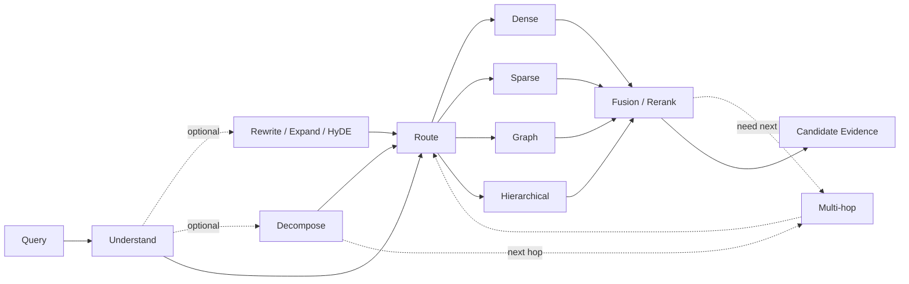

# Domain 05 - Query Understanding & Retrieval

## Core Question
如何理解 query，選擇 retrieval strategy，並找出、融合與排序最相關的候選 evidence？



## Includes
- query understanding / constraint extraction
- query rewrite / expansion / HyDE
- decomposition / sub-question planning
- sparse / dense / late-interaction retrieval
- graph / hierarchical retrieval
- fusion / reranking / filtering
- multi-hop / compositional retrieval
- query-adaptive retrieval granularity

## Excludes
- 是否已取得足夠 evidence → D06
- context packing / compression → D07
- general controller / tool orchestration → D12

## Level-2 Topics
- Query Understanding
- Query Transformation
- Query Decomposition
- Retrieval Routing
- Retrieval & Reranking
- Fusion
- Multi-hop Retrieval
- Retrieval Granularity

## Boundary
```text
Relevance ≠ Sufficiency
```
D05 判斷「哪些 evidence 比較相關」；D06 判斷「目前 evidence 是否已足夠完成任務」。

## Navigation
- [[02 - 研究領域專題 (Research Domains)/Domain 04 - Knowledge Representation & Indexing|D04 Knowledge Representation & Indexing]]
- [[02 - 研究領域專題 (Research Domains)/Domain 06 - Evidence Sufficiency & Adaptive Retrieval|D06 Evidence Sufficiency & Adaptive Retrieval]]
