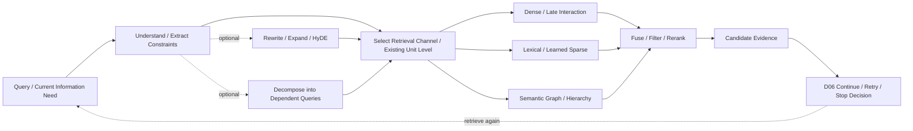

# Domain 05 - Query Understanding & Retrieval

## Core Question

Given a query and a searchable index，哪些 evidence 應被找到、融合與排序？如何讓 query formulation、relevance modeling 與 retriever–generator alignment 支援下游任務？


```mermaid
flowchart LR
    Q["Query / Current Information Need"] --> U["Understand / Extract Constraints"]
    U -. "optional" .-> RW["Rewrite / Expand / HyDE"]
    U -. "optional" .-> DC["Decompose into Dependent Queries"]
    U --> RT["Select Retrieval Channel / Existing Unit Level"]
    RW --> RT
    DC --> RT
    RT --> D["Dense / Late Interaction"]
    RT --> S["Lexical / Learned Sparse"]
    RT --> G["Semantic Graph / Hierarchy"]
    D --> F["Fuse / Filter / Rerank"]
    S --> F
    G --> F
    F --> EV["Candidate Evidence"]
    EV --> C["D06 Continue / Retry / Stop Decision"]
    C -. "retrieve again" .-> Q
```

本圖表示可選的 query-time 組合。D05 執行 query formulation 與 retrieval；是否需要繼續、重試或停止由 D06 處理，不要求每個系統都使用所有 channels。

## Includes

- query understanding / constraint extraction、rewrite / expansion / disambiguation / HyDE
- query decomposition、dependent sub-questions、multi-hop / generation-informed retrieval
- sparse / dense / late-interaction / graph / hierarchical retrieval
- fusion、candidate filtering、ranking / reranking
- query-adaptive selection of existing retrieval units、levels 或 channels
- retriever relevance learning、retriever–generator alignment；training signal 與 trained module 需明列

## Excludes

- retrieval units 的形成、切分或粒度設計 → D02；依 query 選擇既有 unit/level 仍屬 D05
- corpus-side representation 與 index organization → D04
- retrieval necessity、quality-triggered retry、evidence sufficiency 與 stopping → D06
- context packing / compression / ordering 與 model utilization → D07
- evidence conflict resolution → D08
- grounded output、citation 與 generation behavior → D09
- general tool/action orchestration → D12

## Level-2 Topics

- Query Understanding & Transformation: rewrite / expansion / HyDE / disambiguation
- Query Decomposition & Multi-hop Retrieval
- Retrieval & Relevance Modeling: lexical / learned sparse / dense / late interaction / graph
- Query-adaptive Channel & Unit-level Selection
- Fusion, Filtering & Reranking
- Retriever–Generator Alignment: training signal × trained module

## Boundary

```text
D02 forms retrieval units.
D04 encodes and organizes them.
D05 finds, fuses and ranks candidate evidence for a query.
D06 decides whether to retrieve, retry or stop, and whether evidence is sufficient.
D07 builds the usable context and studies its actual utilization.
```

**Post-retrieval 是時間位置，不是 Domain 判定規則。** 對已召回 candidates 作 relevance reranking 仍屬 D05；將已選 evidence 壓縮、排序放入 context 或研究模型實際讀取則屬 D07。判斷依研究問題，不因操作發生在 retrieval 之後就搬到 D07。

**Query-adaptive granularity 有兩個不同問題。** 設計／形成能被獨立檢索的 units 屬 D02；查詢時在已建好的 passage、proposition、parent-child levels 等之間選擇，屬 D05。若主要貢獻是判斷是否值得換策略或再檢索，則看 D06，而不是把所有 adaptive methods 都歸 D05。

## Query Transformation：可比機制軸

| Mechanism | 改變什麼 | 必須保留／核對什麼 | 已有 anchors 或候選 |
|---|---|---|---|
| Rewrite / disambiguate | 用更適合 retriever 的文字表達同一 information need | entities、constraints、negation、time/scope 是否被改寫掉 | [[03 - 論文庫 (Literature Notes)/03 - RAG & Retrieval/(EMNLP 2023-12) Query Rewriting in Retrieval-Augmented Large Language Models\|Query Rewriting in RAG]]、[[03 - 論文庫 (Literature Notes)/03 - RAG & Retrieval/(COLM 2024-10) RQ-RAG - Learning to Refine Queries for Retrieval Augmented Generation\|RQ-RAG]] |
| Expand with pseudo-document / terms | 在原 query 增添搜尋線索 | expansion 是否導致 topic drift；pseudo-document 不是 evidence | Query2doc 候選：官方摘要已核，全文待查 |
| HyDE | 生成 hypothetical document，利用其 representation 搜尋實際 documents | hypothetical content 只用於 retrieval，不當已驗證答案或 source | [[03 - 論文庫 (Literature Notes)/03 - RAG & Retrieval/(ACL 2023-07) Precise Zero-Shot Dense Retrieval without Relevance Labels\|HyDE]] |
| Decompose / dependent sub-queries | 將複合問題拆成需要串接的 information needs | sub-question dependencies、已解出的 intermediate entities、跨 hop supporting evidence | [[03 - 論文庫 (Literature Notes)/03 - RAG & Retrieval/(ACL 2023-07) Interleaving Retrieval with Chain-of-Thought Reasoning for Knowledge-Intensive Multi-Step Questions\|IRCoT]]、[[03 - 論文庫 (Literature Notes)/03 - RAG & Retrieval/(COLM 2024-10) RQ-RAG - Learning to Refine Queries for Retrieval Augmented Generation\|RQ-RAG]] |
| Generation-informed iterative retrieval | 用上一輪 draft/output 增補下一輪 retrieval query | intermediate hallucination 是否污染搜尋；保留 original query 與 constraints | Iter-RetGen 候選：官方摘要已核，全文待查 |

Decomposition 不必先一次列完所有 sub-questions；iterative retrieval 也不必都採逐句 interleaving。上述是機制對照，不能僅憑迭代次數推斷 evidence 已充分。候選來源及驗證範圍見下方。

## Retrieval Strategy Spectrum

| Strategy | Corpus-side interface | Query-time mechanism / research question | Canonical boundary |
|---|---|---|---|
| Dense single-vector | dense unit representations | similarity scoring / candidate search | D04 encoding + D05 retrieval |
| Lexical / learned sparse | lexical 或 learned expansion weights | sparse matching / ranking | D04 encoding + D05 retrieval；learned sparse 不等於只有 exact string match |
| Late interaction | multiple vectors per unit | token-level query-document interaction | D04 representation + D05 matching；engine efficiency 連 D14 |
| Hybrid retrieval | multiple searchable channels | score/rank fusion、candidate complementarity | D04 index organization + D05 fusion；需揭露 weights、score scales、candidate budget |
| Graph / hierarchy retrieval | semantic graph 或 multi-resolution index | traversal、propagation、level selection、ranking | D04 structure + D05 search |
| Query transformation / decomposition | searchable index 不必改變 | 改善 query 與 evidence 的匹配，或逐步取得 supporting information | D05；unit formation 仍是 D02 |
| Adaptive / active retrieval control | query/current state 與 evidence signals | 是否／何時 retrieve、retry、stop | D06 |
| Agent-controlled actions | RAG state 與可用 actions/tools | general multi-action controller | D12；執行 retrieval 不自動增加 D05 contribution |

**Candidate recall、reranked relevance、evidence-set sufficiency、generation utility 需分開評估。** Fusion 或 reranking 不保證來源相容或足以回答；high-ranking evidence 也不保證模型實際利用它。

## Retriever–Generator Alignment：Training Signal × Trained Module

現有 REALM、RA-DIT、REPLUG 與 RankRAG 已涵蓋多種學習界面；新增工作應指出它改進哪一個 objective 或模組，不能將所有 retrieval-aware training 都稱為 end-to-end joint training。

| Mechanism / objective | Training signal | Trained / frozen modules 要核對什麼 | 已有 anchors |
|---|---|---|---|
| Retriever relevance learning | relevance labels、positives/negatives、contrastive objectives | query/document encoders、negative sampling、對應的 corpus representations | [[03 - 論文庫 (Literature Notes)/03 - RAG & Retrieval/(EMNLP 2020-11) Dense Passage Retrieval for Open-Domain Question Answering\|DPR]]、[[03 - 論文庫 (Literature Notes)/03 - RAG & Retrieval/(TMLR 2022-08) Unsupervised Dense Information Retrieval with Contrastive Learning\|Contriever]] |
| Retrieval-integrated pretraining | language-model objective 與 latent retrieved evidence | retriever／reader 的更新、document encoding 與 index refresh | [[03 - 論文庫 (Literature Notes)/03 - RAG & Retrieval/(ICML 2020-07) REALM - Retrieval-Augmented Language Model Pre-Training\|REALM]]；RAG/RETRO/Atlas 見 CROSS anchors |
| Generator-feedback retriever alignment | LLM 對 answer/document 的 likelihood-derived signal | retriever 是否受訓、LLM 是否 frozen/black-box、feedback 是否依賴 token likelihood access | [[03 - 論文庫 (Literature Notes)/03 - RAG & Retrieval/(NAACL 2024-06) REPLUG - Retrieval-Augmented Black-Box Language Models\|REPLUG]] |
| Dual instruction tuning | retrieval-aware instruction data 與 LLM likelihood feedback | generator tuning 與 query-encoder alignment 是哪些階段；不能直接稱同步 end-to-end joint training | [[03 - 論文庫 (Literature Notes)/03 - RAG & Retrieval/(ICLR 2024-05) RA-DIT - Retrieval-Augmented Dual Instruction Tuning\|RA-DIT]] |
| Ranking–generation instruction alignment | ranking / answer-generation instruction data | 受訓 LLM 的 ranking 與 generation 能力，是否真的另訓 first-stage retriever | [[03 - 論文庫 (Literature Notes)/03 - RAG & Retrieval/(NeurIPS 2024-12) RankRAG - Unifying Context Ranking with Retrieval-Augmented Generation in LLMs\|RankRAG]] |

ARL2 候選使用 LLM relevance labeling 支援 retriever learning，提供與 likelihood feedback 不同的監督來源。[官方摘要](https://aclanthology.org/2024.acl-long.203/) 已核，全文待查。若工作主要訓 generator 如何利用 evidence、建立 context selector，或學 multi-action policy，其 primary 可分別在 D07/D09/D12；不能僅因 training input 有 retrieved documents 就強制 D05。

比較須揭露 **task/dataset、model/context、hardware/cost、memory/latency/throughput、retrieval與generation quality、failure modes/maintenance complexity**，另列 training data、supervision access、trained/frozen modules、index refresh 與 inference retrieval budget。不同條件的數字標為「不可直接比較」。

## Representative Notes

以下是已有筆記的導航，不保留重複手填 coverage counts；候選來源不計入 primary-note coverage。

- [[03 - 論文庫 (Literature Notes)/03 - RAG & Retrieval/(EMNLP 2020-11) Dense Passage Retrieval for Open-Domain Question Answering|DPR]]
- [[03 - 論文庫 (Literature Notes)/03 - RAG & Retrieval/(SIGIR 2020-07) ColBERT - Efficient and Effective Passage Search via Contextualized Late Interaction over BERT|ColBERT]]
- [[03 - 論文庫 (Literature Notes)/03 - RAG & Retrieval/(NAACL 2022-07) ColBERTv2 - Effective and Efficient Retrieval via Lightweight Late Interaction|ColBERTv2]]
- [[03 - 論文庫 (Literature Notes)/03 - RAG & Retrieval/(SIGIR 2022-07) SPLADE v2 - Sparse Lexical and Expansion Model for Information Retrieval|SPLADE v2]]
- [[03 - 論文庫 (Literature Notes)/03 - RAG & Retrieval/(TMLR 2022-08) Unsupervised Dense Information Retrieval with Contrastive Learning|Contriever]]
- [[03 - 論文庫 (Literature Notes)/03 - RAG & Retrieval/(ACL 2023-07) Precise Zero-Shot Dense Retrieval without Relevance Labels|HyDE]]
- [[03 - 論文庫 (Literature Notes)/03 - RAG & Retrieval/(ACL 2023-07) Interleaving Retrieval with Chain-of-Thought Reasoning for Knowledge-Intensive Multi-Step Questions|IRCoT]]
- [[03 - 論文庫 (Literature Notes)/03 - RAG & Retrieval/(EMNLP 2023-12) Query Rewriting in Retrieval-Augmented Large Language Models|Query Rewriting in RAG]]
- [[03 - 論文庫 (Literature Notes)/03 - RAG & Retrieval/(ICML 2020-07) REALM - Retrieval-Augmented Language Model Pre-Training|REALM]]
- [[03 - 論文庫 (Literature Notes)/03 - RAG & Retrieval/(ICLR 2024-05) RA-DIT - Retrieval-Augmented Dual Instruction Tuning|RA-DIT]]
- [[03 - 論文庫 (Literature Notes)/03 - RAG & Retrieval/(NAACL 2024-06) REPLUG - Retrieval-Augmented Black-Box Language Models|REPLUG]]
- [[03 - 論文庫 (Literature Notes)/03 - RAG & Retrieval/(NeurIPS 2024-12) RankRAG - Unifying Context Ranking with Retrieval-Augmented Generation in LLMs|RankRAG]]
- [[03 - 論文庫 (Literature Notes)/03 - RAG & Retrieval/(COLM 2024-10) RQ-RAG - Learning to Refine Queries for Retrieval Augmented Generation|RQ-RAG]]
- [[03 - 論文庫 (Literature Notes)/04 - Knowledge & Graph RAG/(NeurIPS 2024-12) HippoRAG - Neurobiologically Inspired Long-Term Memory for Large Language Models|HippoRAG]]
- [[03 - 論文庫 (Literature Notes)/04 - Knowledge & Graph RAG/(NeurIPS 2024-12) G-Retriever - Retrieval-Augmented Generation for Textual Graph Understanding and Question Answering|G-Retriever]]
- [[03 - 論文庫 (Literature Notes)/04 - Knowledge & Graph RAG/(NAACL 2025-05) Knowledge Graph-Guided Retrieval Augmented Generation|KG2RAG]]
- [[03 - 論文庫 (Literature Notes)/04 - Knowledge & Graph RAG/(EMNLP 2025-11) PropRAG - Guiding Retrieval with Beam Search over Proposition Paths|PropRAG]]
- [[03 - 論文庫 (Literature Notes)/04 - Knowledge & Graph RAG/(NeurIPS 2025-12) GFM-RAG - Graph Foundation Model for Retrieval Augmented Generation|GFM-RAG]]
- [[03 - 論文庫 (Literature Notes)/04 - Knowledge & Graph RAG/(arXiv 2025-07) DyG-RAG - Dynamic Graph Retrieval-Augmented Generation with Event-Centric Reasoning|DyG-RAG]] — event timeline retrieval；時間相近的 graph edge 代表檢索結構，不直接視作因果關係。
- [[03 - 論文庫 (Literature Notes)/04 - Knowledge & Graph RAG/(ACL 2025-07) HybGRAG - Hybrid Retrieval-Augmented Generation on Textual and Relational Knowledge Bases|HybGRAG]] — SKB 中結合 textual relevance 與 graph relation constraints；critic repair 作 D12 secondary。
- [[03 - 論文庫 (Literature Notes)/04 - Knowledge & Graph RAG/(Findings ACL 2025-07) GeAR - Graph-enhanced Agent for Retrieval-augmented Generation|GeAR]] — base retriever 上的 graph expansion 與跨步 retrieval；gist memory 是單次問答內的短期證據狀態。

### Evaluation Anchor

- [[03 - 論文庫 (Literature Notes)/06 - Benchmarks & Evaluation/(NeurIPS 2021-12) BEIR - A Heterogeneous Benchmark for Zero-shot Evaluation of Information Retrieval Models|BEIR]] — retrieval benchmark；artifact 身分與 method contribution 分開，不能因用於 D05 evaluation 就將其當 retriever method。

### Cross-lifecycle Anchors (CROSS)

- [[03 - 論文庫 (Literature Notes)/03 - RAG & Retrieval/(ICML 2022-07) Improving Language Models by Retrieving from Trillions of Tokens|RETRO]]
- [[03 - 論文庫 (Literature Notes)/03 - RAG & Retrieval/(JMLR 2023-01) Atlas - Few-shot Learning with Retrieval Augmented Language Models|Atlas]]
- [[03 - 論文庫 (Literature Notes)/03 - RAG & Retrieval/(NeurIPS 2020-12) Retrieval-Augmented Generation for Knowledge-Intensive NLP Tasks|RAG (Lewis et al., 2020)]]

### Cross-domain Anchors

- [[03 - 論文庫 (Literature Notes)/04 - Knowledge & Graph RAG/(ICLR 2026-05) LinearRAG - Linear Graph Retrieval Augmented Generation on Large-scale Corpora|LinearRAG]] — D04 primary / D03,D05 secondary；Tri-Graph index organization 與 query-time two-stage search 分開歸因。
- [[03 - 論文庫 (Literature Notes)/05 - Memory & Agents/(arXiv 2024-09) MemoRAG - Moving towards Next-Gen RAG Via Memory-Inspired Knowledge Discovery|MemoRAG]] — D11 primary / D05 secondary，A01 interface；shared memory 可供多個 queries 使用並支援 future reuse，cue-based query/retrieval 是 secondary contribution。版本與 evidence 見該 note。

### Candidate Primary Sources — 官方摘要已核，全文待查驗

| 候選來源 | 可補的機制 | 本次驗證範圍 |
|---|---|---|
| [Query2doc: Query Expansion with Large Language Models](https://aclanthology.org/2023.emnlp-main.585/) — Wang, Yang & Wei, EMNLP 2023，DOI 10.18653/v1/2023.emnlp-main.585 | pseudo-document expansion；與 rewrite / HyDE 對照 | 官方 metadata / abstract；全文與實驗條件待查驗 |
| [Enhancing Retrieval-Augmented Large Language Models with Iterative Retrieval-Generation Synergy](https://aclanthology.org/2023.findings-emnlp.620/) — Shao et al., Findings EMNLP 2023，DOI 10.18653/v1/2023.findings-emnlp.620 | Iter-RetGen 的 generation-informed iterative retrieval | 官方 metadata / abstract；全文、iteration/stopping 設定待查驗 |
| [ARL2: Aligning Retrievers with Black-box Large Language Models via Self-guided Adaptive Relevance Labeling](https://aclanthology.org/2024.acl-long.203/) — Zhang et al., ACL 2024，DOI 10.18653/v1/2024.acl-long.203 | LLM relevance labeling 與 retriever learning | 官方 metadata / abstract；全文、labeling與training protocol 待查驗 |

## Classification Decisions — 2026-10-02

- Reranking 的研究問題若是候選 evidence relevance，維持 D05；時間上 post-retrieval 不改變此判定。
- Query-adaptive selection of existing units/levels 屬 D05；unit formation / granularity design 屬 D02；whether/when to retrieve/retry/stop 屬 D06。
- REALM 與 RA-DIT 留作 D05 anchors；RA-DIT 不重複列入 CROSS。RAG 2020、RETRO、Atlas 留作 cross-lifecycle anchors。
- HippoRAG：D05 primary / D04 secondary。LinearRAG：D04 primary / D03,D05 secondary。MemoRAG：D11 primary / D05 secondary，A01 interface。
- 使用 retrieval 不自動構成 D05 secondary contribution；alignment / training 需依 objective、trained module 與主要研究問題判定。

## Sources & Navigation

- [[03 - 論文庫 (Literature Notes)/03 - RAG & Retrieval/(ACM CSUR 2026-09) A Survey on Retrieval-Augmented Text Generation for Large Language Models|Huang et al. Survey]]：對照 broad retrieval / retriever–generator integration research axes；本頁的 D04/D05/D06/D07 細界線為 repo operational taxonomy。
- [[02 - 研究領域專題 (Research Domains)/Domain 02 - Segmentation & Contextualization|D02 Segmentation & Retrieval Granularity]]
- [[02 - 研究領域專題 (Research Domains)/Domain 04 - Knowledge Representation & Indexing|D04 Representation & Indexing]]
- [[02 - 研究領域專題 (Research Domains)/Domain 06 - Evidence Sufficiency & Adaptive Retrieval|D06 Evidence Sufficiency & Retrieval Control]]
- [[02 - 研究領域專題 (Research Domains)/Domain 07 - Context Construction & Evidence Utilization|D07 Context Construction & Utilization]]
