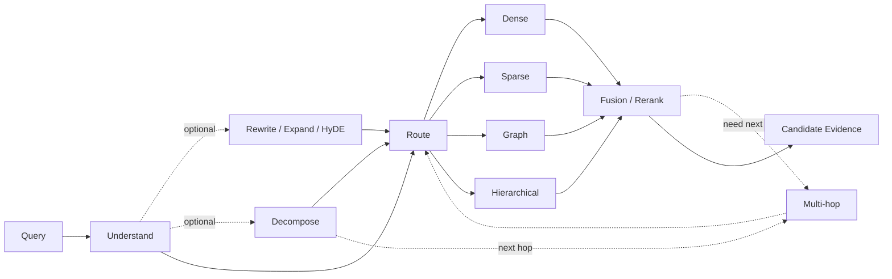

# Domain 05 - Query Understanding & Retrieval

> [!WARNING]
> **Phase 1 closure is authoritative.** 若本頁較早段落與底部「Phase 1 Closure — 2026-09-27」衝突，以 closure 為準；舊文字暫留作 Phase 2 forensic audit，將於 Phase 7 一次正規化。

## Core Question
如何理解 query，選擇 retrieval strategy，並找出、融合與排序最相關的候選 evidence？


```mermaid
flowchart LR
    Q["Query"] --> U["Understand"]
    U -. "optional" .-> RW["Rewrite / Expand / HyDE"]
    U -. "optional" .-> DC["Decompose"]
    U --> RT["Route"]
    RW --> RT
    DC --> RT
    RT --> D["Dense"]
    RT --> S["Sparse"]
    RT --> G["Graph"]
    RT --> H["Hierarchical"]
    D --> F["Fusion / Rerank"]
    S --> F
    G --> F
    H --> F
    DC -. "next hop" .-> MH["Multi-hop"]
    F -. "need next hop" .-> MH
    MH -.-> RT
    F --> EV["Candidate Evidence"]
```

## Includes
- query understanding / constraint extraction
- query rewrite / expansion / HyDE
- decomposition / sub-question planning
- sparse / dense / late-interaction retrieval
- graph / hierarchical retrieval
- fusion / reranking / filtering
- multi-hop / compositional retrieval
- query-adaptive retrieval granularity

## Excludes
- 是否已取得足夠 evidence → D06
- context packing / compression → D07
- general controller / tool orchestration → D12

## Level-2 Topics
- Query Understanding
- Query Transformation
- Query Decomposition
- Retrieval Routing
- Retrieval & Reranking
- Fusion
- Multi-hop Retrieval
- Retrieval Granularity
- Retriever / Joint Training

## Boundary
```text
Relevance ≠ Sufficiency
```
D05 判斷「哪些 evidence 比較相關」；D06 判斷「目前 evidence 是否已足夠完成任務」。

## Representative Notes

**Current primary-note coverage: 20**

- [[03 - 論文庫 (Literature Notes)/03 - RAG & Retrieval/(EMNLP 2020-11) Dense Passage Retrieval for Open-Domain Question Answering|DPR]]
- [[03 - 論文庫 (Literature Notes)/03 - RAG & Retrieval/(SIGIR 2020-07) ColBERT - Efficient and Effective Passage Search via Contextualized Late Interaction over BERT|ColBERT]]
- [[03 - 論文庫 (Literature Notes)/03 - RAG & Retrieval/(ACL 2023-07) Precise Zero-Shot Dense Retrieval without Relevance Labels|HyDE]]
- [[03 - 論文庫 (Literature Notes)/03 - RAG & Retrieval/(ACL 2023-07) Interleaving Retrieval with Chain-of-Thought Reasoning for Knowledge-Intensive Multi-Step Questions|IRCoT]]
- [[03 - 論文庫 (Literature Notes)/03 - RAG & Retrieval/(NeurIPS 2024-12) RankRAG - Unifying Context Ranking with Retrieval-Augmented Generation in LLMs|RankRAG]]
- [[03 - 論文庫 (Literature Notes)/03 - RAG & Retrieval/(ICML 2020-07) REALM - Retrieval-Augmented Language Model Pre-Training|REALM]]
- [[03 - 論文庫 (Literature Notes)/03 - RAG & Retrieval/(ICML 2022-07) Improving Language Models by Retrieving from Trillions of Tokens|RETRO]]
- [[03 - 論文庫 (Literature Notes)/03 - RAG & Retrieval/(JMLR 2023-01) Atlas - Few-shot Learning with Retrieval Augmented Language Models|Atlas]]
- [[03 - 論文庫 (Literature Notes)/03 - RAG & Retrieval/(ICLR 2024-05) RA-DIT - Retrieval-Augmented Dual Instruction Tuning|RA-DIT]]

## Retrieval Strategy Spectrum
舊版「Advanced RAG」頁面的有效內容保留為 retrieval strategy spectrum，但重新放回正確邊界：

| Strategy | Core idea | Canonical home |
|---|---|---|
| Dense retrieval | query / passage single-vector semantic matching | D05 |
| Sparse / lexical | exact / weighted lexical matching | D05 |
| Late interaction | token-level query-document interaction（例如 ColBERT） | D04 encoding + D05 search |
| Hybrid retrieval | dense + sparse + fusion / RRF | D04/D05 |
| Query transformation | rewrite / expansion / HyDE | D05 |
| Decomposition / multi-hop | sub-question → iterative retrieval | D05 |
| Adaptive / active retrieval | decide whether/when to retrieve again | D06（不是 D05 的 relevance 問題） |
| Agent-controlled retrieval | controller selects tools/actions | D12 |
| Retrieval-augmented training | retrieval is trained/used during pretraining, joint retriever-reader training, or dual instruction tuning | D05（with D04 representation/training interface） |

這個表的目的，是避免再把「Advanced RAG」當成一個模糊大 Domain。

## Navigation
- [[02 - 研究領域專題 (Research Domains)/Domain 04 - Knowledge Representation & Indexing|D04 Knowledge Representation & Indexing]]
- [[02 - 研究領域專題 (Research Domains)/Domain 06 - Evidence Sufficiency & Adaptive Retrieval|D06 Evidence Sufficiency & Adaptive Retrieval]]

## Phase 1 Closure — 2026-09-27

> [!IMPORTANT]
> **Canonical name remains D05 Query Understanding & Retrieval.**

**Core question**：Given a query and a searchable index, what evidence should be retrieved, fused and ranked?

**Canonical Level-2**
- Query Transformation: rewrite / expansion / HyDE / disambiguation
- Query Decomposition & Multi-hop Retrieval
- Retrieval & Relevance Modeling: dense / sparse / late-interaction / graph
- Fusion & Reranking
- Retriever–Generator Alignment

**Hard boundary**
- retrieval granularity → D02
- whether/when to retrieve, retry or stop → D06
- general tool/action routing → D12
- using retrieval does not automatically make D05 a secondary contribution

**Paper decisions**
- KEEP DPR, ColBERT/ColBERTv2, SPLADE, Contriever, HyDE, IRCoT, RankRAG, PropRAG, KG²RAG, G-Retriever.
- HippoRAG: MOVE here from D04; D04 secondary.
- GFM-RAG: ADD D05 / D04 secondary.
- Query Rewriting in RAG (EMNLP 2023): ADD.
- RQ-RAG (COLM 2024): ADD.
- RAG 2020, RETRO and Atlas: move to CROSS rather than inflate D05 primary coverage.
- Adaptive-RAG remains D06 primary.
