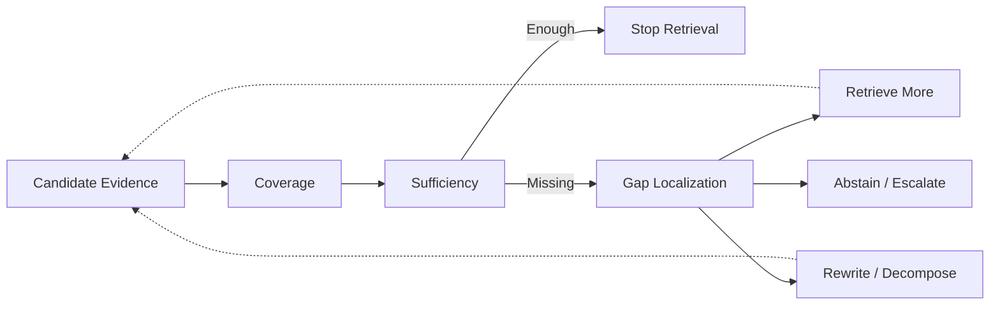

# Domain 06 - Evidence Sufficiency & Adaptive Retrieval

## Core Question
目前 evidence 是否足以回答問題；若不足，缺什麼、是否要再檢索，以及何時停止？



## Includes
- retrieval necessity
- evidence coverage / completeness
- evidence sufficiency
- gap localization
- adaptive / corrective / iterative retrieval
- stopping policy
- retrieval-time abstention / escalation

## Excludes
- relevance ranking → D05
- time / source / version conflict resolution → D08
- general multi-action agent controller → D12

## Level-2 Topics
- Retrieval Necessity
- Adaptive Retrieval
- Corrective Retrieval
- Evidence Coverage
- Evidence Sufficiency
- Gap Localization
- Stopping / Abstention

## Boundary
```text
Relevant evidence
    != complete evidence
    != sufficient evidence
```
Adaptive RAG 是 paradigm tag；只有當 paper 的主要研究問題是「何時 retrieve / retry / stop」時，Primary Domain 才是 D06。

## Navigation
- [[02 - 研究領域專題 (Research Domains)/Domain 05 - Query Understanding & Retrieval|D05 Query Understanding & Retrieval]]
- [[02 - 研究領域專題 (Research Domains)/Domain 07 - Context Construction & Evidence Utilization|D07 Context Construction & Evidence Utilization]]
- [[02 - 研究領域專題 (Research Domains)/Domain 12 - Agentic RAG & Orchestration|D12 Agentic RAG & Orchestration]]
