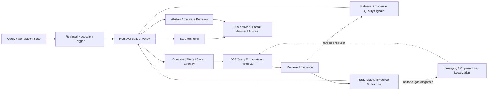

# Domain 06 - Evidence Sufficiency & Retrieval Control

## Core Question

是否需要 retrieval？目前 evidence 是否足以支持這個任務的回答？若不足或品質不佳，應繼續檢索、切換策略、停止、拒答還是升級處理？

下圖是 repo 的研究問題導航，各方法不必實作同一組 signals 或完整 controller；gap localization 的 project-specific 組合另列為研究假設。

```mermaid
flowchart LR
    Q["Query / Generation State"] --> N["Retrieval Necessity / Trigger"]
    N --> P["Retrieval-control Policy"]
    EV["Retrieved Evidence"] --> QA["Retrieval / Evidence Quality Signals"]
    EV --> SU["Task-relative Evidence Sufficiency"]
    QA --> P
    SU --> P
    P --> MORE["Continue / Retry / Switch Strategy"]
    P --> STOP["Stop Retrieval"]
    P --> ESC["Abstain / Escalate Decision"]
    MORE --> D05["D05 Query Formulation / Retrieval"]
    D05 --> EV
    STOP --> OUT["D09 Answer / Partial Answer / Abstain"]
    ESC --> OUT
    SU -. "optional gap diagnosis" .-> GAP["Emerging / Proposed Gap Localization"]
    GAP -. "targeted request" .-> D05
```

## Includes

- query-level retrieval necessity 與 generation-time retrieval triggering
- quality-triggered retrieval correction / retry / escalation
- task-relative evidence sufficiency / sufficient context
- evidence coverage 與 gap diagnosis；完整 requirement-slot controller 的組合仍需文獻或實驗驗證
- continuation、strategy switching、stopping 與 budget-aware retrieval policy
- evidence-conditioned selective answering / abstention 的 decision interface；最終 grounded output behavior 連 D09

## Excludes

- 哪些 candidates 更相關、如何 rewrite / search / fuse / rerank → D05
- model 是否實際利用已提供的 evidence、context packing → D07
- time / version / source / knowledge conflict resolution → D08
- final grounded answer、claim revision、citation、abstention output → D09
- general multi-action tool/agent controller → D12
- calibration metric、benchmark、prediction coverage 的評估協議 → D13；影響 retrieval policy 的 uncertainty/control 方法可在 D06

## Level-2 Topics

- Retrieval Necessity & Trigger Timing
- Quality-triggered Retrieval Correction
- Evidence Sufficiency / Sufficient Context
- Evidence Gap Diagnosis
- Retrieval Control: continue / retry / switch / escalation / stopping
- Selective Answering & Uncertainty-aware Decision Interfaces
- Budget-aware Control & Calibration Interfaces

## Two Research Tracks

1. **Retrieval Control**：何時 retrieve / retry / switch / stop。FLARE、Adaptive-RAG、Self-RAG 與 Corrective RAG 提供不同 control mechanisms，不必都有 explicit evidence-set sufficiency assessment。
2. **Evidence Sufficiency**：目前 evidence 是否包含支持所需回答的資訊。[[03 - 論文庫 (Literature Notes)/03 - RAG & Retrieval/(ICLR 2025-04) Sufficient Context - A New Lens on Retrieval Augmented Generation Systems|Sufficient Context]] 是已有 direct anchor；不能把 query complexity、retrieval relevance 或 token confidence 當成完整 sufficiency proof。

**Evidence sufficient 不要求蒐集 corpus 中全部相關文獻，也不保證 generator 一定答對。** 它是相對於任務所需資訊的判斷；scope、granularity 與是否允許 partial answer 必須明列。來源互相矛盾時，衝突可能使 evidence 不足以支持單一回答，但如何消解該衝突仍屬 D08。

Explicit requirement decomposition → missing-slot localization → targeted retrieval 的完整組合仍是 emerging line／project hypothesis。[[04 - 研究想法與待驗證提案 (Ideas & Hypotheses)/README|Ideas & Hypotheses]] 保存設計提案；不能以 adaptive-retrieval papers 的存在宣稱整個 controller 已有成熟共識。

## Trigger Timing × Signal × Decision

| Trigger timing | 方法檢查的 signal / object | 所控制的 decision | 已有 anchor／候選 | 不等於什麼 |
|---|---|---|---|---|
| Retrieval 前／query-level | question complexity 或 retrieval-necessity signal | no-retrieval / single-step / multi-step strategy choice | [[03 - 論文庫 (Literature Notes)/03 - RAG & Retrieval/(NAACL 2024-06) Adaptive-RAG - Learning to Adapt Retrieval-Augmented Large Language Models through Question Complexity\|Adaptive-RAG]] | complexity classifier 不直接證明已取得 evidence 足夠 |
| Generation 中 | predicted content、token confidence 或 current information-need signal | 何時觸發 retrieval / regenerate | [[03 - 論文庫 (Literature Notes)/03 - RAG & Retrieval/(EMNLP 2023-12) Active Retrieval Augmented Generation\|FLARE]]；DRAGIN 候選 | generation uncertainty 不直接等於 corpus evidence gap；query construction 另連 D05 |
| Retrieval 後 | retrieval/evidence quality assessment | 接受、修正、切換來源或再次 retrieval | [[03 - 論文庫 (Literature Notes)/03 - RAG & Retrieval/(arXiv 2024-01) Corrective Retrieval Augmented Generation\|Corrective RAG]] | quality assessment 不自動等於 evidence-set completeness |
| Retrieval／generation 決策過程 | reflection / support / relevance / utility 等 critique signals | retrieve、generate、選擇或修正 output 的界面 | [[03 - 論文庫 (Literature Notes)/03 - RAG & Retrieval/(ICLR 2024-05) Self-RAG - Learning to Retrieve, Generate, and Critique through Self-Reflection\|Self-RAG]] | critique signal 不自動成為 calibrated probability 或完整 gap-localization mechanism |
| Evidence set 已取得後 | 是否包含回答所需資訊、是否缺 supporting information | continue / stop / selective answer decision 的依據 | [[03 - 論文庫 (Literature Notes)/03 - RAG & Retrieval/(ICLR 2025-04) Sufficient Context - A New Lens on Retrieval Augmented Generation Systems\|Sufficient Context]]；[[03 - 論文庫 (Literature Notes)/03 - RAG & Retrieval/(arXiv 2026-05) SURE-RAG - Sufficiency and Uncertainty-Aware Evidence Verification for Selective Retrieval-Augmented Generation\|SURE-RAG]] emerging preprint | sufficient context 不保證模型利用；具體 controller／評估需回原文 |
| 每次續查或停止前 | remaining budget、已取得 evidence 與控制策略 | continue / stop / escalate | 本 repo 的 budget-aware analysis lens；完整 policy 組合待驗證 | budget exhausted 不等於 evidence sufficient，也不等於最終應回答 |

表格按 **method signal 與 decision** 分類，不宣稱前述方法都量測同一種 sufficiency。候選只基於官方摘要；已有 notes 的機制與版本仍以該 note 的原文核對狀態為準。

## Stop Retrieval ≠ Answer ≠ Abstain ≠ Statistical Coverage

| 概念 | 判斷／輸出是什麼 | 必須區分的條件 | Domain interface |
|---|---|---|---|
| Stop retrieval | 不再發起新的 retrieval calls | 可能因 evidence 足夠、budget 用盡、無可用來源或 policy limit；原因需記錄 | D06 |
| Answer / partial answer | 從目前 evidence 產生可支持的 claims | 停止續查後仍需判斷支持度、scope、citation 與是否只答可支持部分 | D06 decision + D09 grounded output |
| Abstain / escalate | 不回答全部或部分問題，或交由別的 action / reviewer 處理 | confidence、evidence insufficiency、risk、budget 對拒答的影響需分開；拒答率不是正確率 | D06 decision；D09 output；general action orchestration → D12 |
| Evidence coverage / sufficiency | 任務需要的資訊是否在目前 evidence 中 | relevance、冗餘、conflict、missing support 與 task granularity | D06；reconciliation → D08 |
| Statistical prediction coverage | 在給定 calibration/data assumptions 下，prediction set 含正確 label/answer 的機率 | 不等於所有輸出皆正確、每次 answer 都受證據支持，或完整蒐集所有 evidence | 方法的 policy/output interface → D06/D09；metric/protocol → D13 |

TRAQ 候選以 conformal prediction 產生 retrieval/answer sets；其 **§2, p3801** 的 guarantee 假設 calibration/test samples i.i.d. from the same distribution。這種 coverage 不等於 evidence-set completeness，也不能改寫成任意 corpus drift 或新 query distribution 下都不幻覺。[官方 paper](https://aclanthology.org/2024.naacl-long.210.pdf) 的摘要與該局部章節已核；完整方法、證明與實驗待查驗。

## Failure Modes & Evaluation Interface

- **False-sufficient**：背景文字很多，卻缺所需 supporting information，policy 提前停止。
- **Missed trigger**：generator 對 unsupported content 高 confidence，uncertainty signal 未觸發 retrieval。
- **Infinite / unproductive retrieval**：corpus 沒有所需答案，仍重複 query transformation / retrieval。
- **Over-abstention**：可回答的內容也被拒答，或只缺非必要資訊便攔截全題。
- **Cost-blind control**：quality gain 沒有連同 extra retrieval、LLM/token cost 與 latency 評估。
- **Miscalibration / distribution shift**：confidence或calibration assumptions 在新模型、corpus、query distribution 下不再適用。

比較時須揭露 **task/dataset、model/context、hardware/cost、memory/latency/throughput、correctness/groundedness/retrieval quality、failure modes/engineering complexity**。D13 應同時記錄 answerability、correctness、answer/abstention rate、risk–coverage 或 prediction-set coverage/size（按方法適用）、retrieval calls、tokens、latency 與 stopping reason。不同策略的 retrieval/token budget 或 answer coverage 不同時，數字標為「不可直接比較」。

## Representative Notes

以下是已有筆記的導航，候選不計入 primary-note coverage；不保留可能與全庫 metadata 不同步的手填 counts。

- [[03 - 論文庫 (Literature Notes)/03 - RAG & Retrieval/(EMNLP 2023-12) Active Retrieval Augmented Generation|FLARE / Active Retrieval]]
- [[03 - 論文庫 (Literature Notes)/03 - RAG & Retrieval/(ICLR 2024-05) Self-RAG - Learning to Retrieve, Generate, and Critique through Self-Reflection|Self-RAG — D06/D09 interface]]
- [[03 - 論文庫 (Literature Notes)/03 - RAG & Retrieval/(NAACL 2024-06) Adaptive-RAG - Learning to Adapt Retrieval-Augmented Large Language Models through Question Complexity|Adaptive-RAG]]
- [[03 - 論文庫 (Literature Notes)/03 - RAG & Retrieval/(arXiv 2024-01) Corrective Retrieval Augmented Generation|Corrective RAG]]
- [[03 - 論文庫 (Literature Notes)/03 - RAG & Retrieval/(ICLR 2025-04) Sufficient Context - A New Lens on Retrieval Augmented Generation Systems|Sufficient Context]]
- [[03 - 論文庫 (Literature Notes)/03 - RAG & Retrieval/(arXiv 2026-05) SURE-RAG - Sufficiency and Uncertainty-Aware Evidence Verification for Selective Retrieval-Augmented Generation|SURE-RAG — emerging preprint]]

### Evaluation Anchor

- [[03 - 論文庫 (Literature Notes)/06 - Benchmarks & Evaluation/(CMC 2026-08) Do LLMs Know When Evidence is Insufficient - An Evidence Sufficiency Benchmark|Evidence Sufficiency Benchmark]] — D13-primary benchmark interface；benchmark evidence 不等於已驗證的通用 sufficiency controller。

### Candidate Primary Sources — 官方摘要已核，全文待查驗

| 候選來源 | 可補的機制 | 本次驗證範圍 |
|---|---|---|
| [DRAGIN: Dynamic Retrieval Augmented Generation based on the Real-time Information Needs of Large Language Models](https://aclanthology.org/2024.acl-long.702/) — Su et al., ACL 2024，DOI 10.18653/v1/2024.acl-long.702 | generation-time retrieval timing 與 information-need-based query construction；D06/D05 interface | 官方 metadata / abstract；全文、trigger signals 與實驗條件待查驗 |
| [TRAQ: Trustworthy Retrieval Augmented Question Answering via Conformal Prediction](https://aclanthology.org/2024.naacl-long.210/) — Li et al., NAACL 2024，DOI 10.18653/v1/2024.naacl-long.210 | statistical retrieval/answer prediction coverage；D06/D09/D13 interface | 官方 metadata / abstract 與 §2 i.i.d. assumptions 局部已核；其餘全文、proof 與實驗待查驗 |

## Classification Decisions — 2026-10-02

- adaptive_rag、corrective_rag、reflective_rag 是 paradigms/method families；D06 依 retrieval necessity / control 或 evidence sufficiency 的主要研究問題判定。
- D05 執行 retrieval / relevance ranking；D06 決定是否 retrieve/retry/stop；D07 處理 context construction/utilization；D08 處理 conflict resolution；D09 處理 grounded output。
- Adaptive-RAG 的 complexity-based policy、FLARE 的 generation-time trigger、CRAG 的 quality correction 不被當成完整 evidence-set sufficiency 的證明。
- Sufficient Context 為已收錄 direct sufficiency anchor；SURE-RAG 標為 emerging preprint；benchmark 與新候選不增加 method coverage。
- Explicit requirement-slot decomposition → gap localization → targeted controller 的完整組合維持 project hypothesis／emerging line，不能用 operational taxonomy 代替文獻證據。

## Sources & Navigation

- [[03 - 論文庫 (Literature Notes)/03 - RAG & Retrieval/(ACM CSUR 2026-09) A Survey on Retrieval-Augmented Text Generation for Large Language Models|Huang et al. Survey]]：對照 broad retrieval-control / generation research axes；本頁 timing × signal × decision 是 repo 分析矩陣，不宣稱 survey 已採相同 D06 內部分類。
- [[02 - 研究領域專題 (Research Domains)/Domain 05 - Query Understanding & Retrieval|D05 Query Understanding & Retrieval]]
- [[02 - 研究領域專題 (Research Domains)/Domain 07 - Context Construction & Evidence Utilization|D07 Context Construction & Utilization]]
- [[02 - 研究領域專題 (Research Domains)/Domain 08 - Temporal Conflict & Provenance Resolution|D08 Evidence Reconciliation]]
- [[02 - 研究領域專題 (Research Domains)/Domain 09 - Grounded Generation Attribution & Long-form Synthesis|D09 Grounded Generation & Long-form Synthesis]]
- [[02 - 研究領域專題 (Research Domains)/Domain 12 - Agentic RAG & Orchestration|D12 RAG Orchestration & Action Control]]
- [[02 - 研究領域專題 (Research Domains)/Domain 13 - RAG Evaluation & Failure Attribution|D13 Evaluation & Failure Attribution]]
