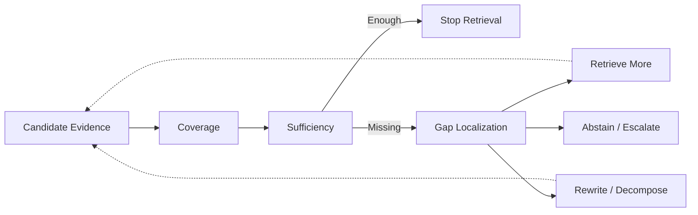

# Domain 06 - Evidence Sufficiency & Retrieval Control

## Core Question
目前 evidence 是否足以回答問題；若不足，缺什麼、是否要再檢索，以及何時停止？


```mermaid
flowchart LR
    EV["Candidate Evidence"] --> COV["Coverage"]
    COV --> SUFF["Sufficiency"]
    SUFF -->|Enough| STOP["Stop Retrieval"]
    SUFF -->|Missing| GAP["Gap Localization"]
    GAP --> RET["Retrieve More"]
    GAP --> RW["Rewrite / Decompose"]
    GAP --> AB["Abstain / Escalate"]
    RET -.-> EV
    RW -.-> EV
```

## Includes
- retrieval necessity
- evidence coverage / completeness
- evidence sufficiency
- gap localization
- adaptive / corrective / iterative retrieval
- stopping policy
- retrieval-time abstention / escalation

## Excludes
- relevance ranking → D05
- time / source / version conflict resolution → D08
- general multi-action agent controller → D12

## Two Research Tracks

D06 目前刻意保留在同一 Domain，但必須區分兩個不同問題：

1. **Retrieval Control**：何時 retrieve / retry / rewrite / stop。FLARE、Self-RAG、Adaptive-RAG、Corrective RAG 主要支撐這條線。
2. **Evidence Sufficiency**：目前 evidence set 是否完整到足以回答、缺哪一類證據、何時應 abstain。這條線的直接方法文獻比 Retrieval Control 薄，不能把前述 adaptive-retrieval papers 當成完整 sufficiency controller 的既有證明。

## Level-2 Topics
- Retrieval Necessity
- Adaptive Retrieval
- Corrective Retrieval
- Stopping Policy
- Evidence Coverage
- Evidence Sufficiency
- Gap Localization
- Abstention / Escalation

## Boundary
```text
Relevant evidence
    != complete evidence
    != sufficient evidence
```
Adaptive RAG 是 paradigm tag；只有當 paper 的主要研究問題是「何時 retrieve / retry / stop」時，Primary Domain 才是 D06。

## Representative Notes

**Current primary-note coverage: 4**

- [[03 - 論文庫 (Literature Notes)/03 - RAG & Retrieval/(EMNLP 2023-12) Active Retrieval Augmented Generation|FLARE / Active Retrieval]]
- [[03 - 論文庫 (Literature Notes)/03 - RAG & Retrieval/(ICLR 2024-05) Self-RAG - Learning to Retrieve, Generate, and Critique through Self-Reflection|Self-RAG]]
- [[03 - 論文庫 (Literature Notes)/03 - RAG & Retrieval/(NAACL 2024-06) Adaptive-RAG - Learning to Adapt Retrieval-Augmented Large Language Models through Question Complexity|Adaptive-RAG]]
- [[03 - 論文庫 (Literature Notes)/03 - RAG & Retrieval/(arXiv 2024-01) Corrective Retrieval Augmented Generation|CRAG / Corrective RAG]]

## Failure Modes
- **False-sufficient**：背景文字很多，但關鍵 evidence slot 仍缺失，controller 卻提前停止。
- **Infinite retrieval loop**：corpus 根本沒有答案時持續 rewrite / retrieve，直到耗盡 budget。
- **Hyper-conservative abstention**：非關鍵欄位稍有缺失就拒答，造成可回答問題被過度攔截。
- **Cost-blind adaptation**：adaptive controller accuracy 稍升，但額外 LLM/retrieval cost 大於收益。

因此 D06 必須同時報 correctness、abstention 與 retrieval/token/latency budget。

## Navigation
- [[02 - 研究領域專題 (Research Domains)/Domain 05 - Query Understanding & Retrieval|D05 Query Understanding & Retrieval]]
- [[02 - 研究領域專題 (Research Domains)/Domain 07 - Context Construction & Evidence Utilization|D07 Context Construction & Evidence Utilization]]
- [[02 - 研究領域專題 (Research Domains)/Domain 12 - Agentic RAG & Orchestration|D12 Agentic RAG & Orchestration]]

## Phase 1 Closure — 2026-09-27

> [!IMPORTANT]
> **Canonical name: D06 Evidence Sufficiency & Retrieval Control.**
> `adaptive_rag`, `corrective_rag`, and `reflective_rag` are paradigms/method families, not Domain names.

**Core question**：目前 evidence 是否已足以支持回答；若不足，系統應繼續檢索、切換策略、拒答，還是停止？

**Canonical Level-2**
- Retrieval Necessity
- Evidence Sufficiency / Sufficient Context
- Retrieval Control: retry / corrective / escalation / stopping
- Evidence Gap Diagnosis
- Selective Answering / evidence-conditioned abstention

**Hard boundary**
- D05 decides *what* to retrieve.
- D06 decides whether retrieval is needed, whether current evidence is enough, and whether to continue/stop.
- conflict detection may make evidence insufficient; conflict resolution belongs D08.
- explicit requirement-slot decomposition → gap localization → targeted retrieval remains a project hypothesis / emerging line.

**Paper decisions**
- FLARE: KEEP D06.
- Adaptive-RAG: KEEP D06; remove D05 secondary.
- Self-RAG: KEEP D06 / D09 secondary.
- CRAG: KEEP D06 / D07 secondary; remove D05/D12.
- Sufficient Context (ICLR 2025): ADD as canonical direct sufficiency anchor.
- Evidence Sufficiency Benchmark 2026: D13 primary / D06 secondary.
- SURE-RAG 2026: emerging preprint.
